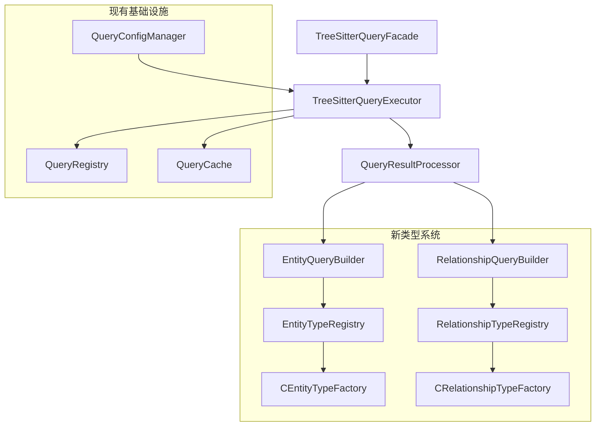

# TreeSitterQueryExecutor 集成新查询类型定义架构方案

## 1. 现有架构分析

### 1.1 当前文件结构和功能

#### 核心文件分析

| 文件名 | 功能 | 状态 | 集成策略 |
|--------|------|------|----------|
| `TreeSitterQueryExecutor.ts` | 主要查询执行引擎 | 需要重大修改 | 完全重构以支持新类型系统 |
| `TreeSitterQueryFacade.ts` | 简化查询接口 | 需要修改 | 更新方法签名以返回新类型 |
| `QueryRegistry.ts` | 查询注册和管理 | 可直接使用 | 无需修改 |
| `QueryLoader.ts` | 查询加载器 | 可直接使用 | 无需修改 |
| `QueryCache.ts` | 缓存管理 | 需要小幅修改 | 支持新类型的缓存键生成 |
| `QueryPerformanceMonitor.ts` | 性能监控 | 可直接使用 | 无需修改 |
| `QueryPatternExtractor.ts` | 查询模式提取 | 可直接使用 | 无需修改 |
| `query-config.ts` | 查询配置管理 | 可直接使用 | 已集成新类型系统 |

#### 新类型系统文件

| 文件名 | 功能 | 状态 | 集成策略 |
|--------|------|------|----------|
| `types/EntityTypes.ts` | 通用实体类型定义 | 新增 | 直接集成 |
| `types/RelationshipTypes.ts` | 通用关系类型定义 | 新增 | 直接集成 |
| `types/EntityQueryBuilder.ts` | 实体构建器 | 新增 | 直接集成 |
| `types/RelationshipQueryBuilder.ts` | 关系构建器 | 新增 | 直接集成 |
| `types/languages/c/CEntityTypes.ts` | C语言实体类型 | 新增 | 直接集成 |
| `types/languages/c/CRelationshipTypes.ts` | C语言关系类型 | 新增 | 直接集成 |

### 1.2 当前查询结果格式

```typescript
interface QueryResult {
  matches: QueryMatch[];
  executionTime: number;
  success: boolean;
  error?: string;
}

interface QueryMatch {
  node: Parser.SyntaxNode;
  captures: Record<string, Parser.SyntaxNode>;
  location: {
    startLine: number;
    endLine: number;
    startColumn: number;
    endColumn: number;
  };
}
```

### 1.3 新类型系统格式

```typescript
// 实体查询结果
interface EntityQueryResult {
  id: string;
  entityType: EntityType;
  name: string;
  priority: number;
  location: LocationInfo;
  content: string;
  filePath: string;
  language: string;
  properties: Record<string, any>;
}

// 关系查询结果
interface RelationshipQueryResult {
  id: string;
  type: RelationshipType;
  category: RelationshipCategory;
  fromNodeId: string;
  toNodeId: string;
  directed: boolean;
  strength?: number;
  weight?: number;
  location: RelationshipLocationInfo;
  language: string;
  properties: Record<string, any>;
}
```

## 2. 集成架构设计

### 2.1 整体架构图



### 2.2 核心组件重构

#### 2.2.1 TreeSitterQueryExecutor 重构

**主要变更：**
1. 替换 `QueryResult` 接口为新的 `EntityQueryResult[]` 和 `RelationshipQueryResult[]`
2. 集成 `EntityTypeRegistry` 和 `RelationshipTypeRegistry`
3. 添加 `QueryResultProcessor` 组件处理结果转换
4. 更新所有查询方法的返回类型

**新增方法：**
```typescript
// 实体查询
async executeEntityQuery(
  ast: Parser.SyntaxNode,
  entityType: EntityType,
  language: string
): Promise<EntityQueryResult[]>

// 关系查询
async executeRelationshipQuery(
  ast: Parser.SyntaxNode,
  relationshipType: RelationshipType,
  language: string
): Promise<RelationshipQueryResult[]>

// 混合查询
async executeMixedQuery(
  ast: Parser.SyntaxNode,
  queryTypes: string[],
  language: string
): Promise<{
  entities: EntityQueryResult[];
  relationships: RelationshipQueryResult[];
}>
```

#### 2.2.2 QueryResultProcessor 新组件

**职责：**
1. 将 Tree-sitter 查询匹配转换为实体和关系对象
2. 使用语言特定的工厂创建类型化对象
3. 处理实体间的关系识别
4. 生成唯一ID和位置信息

**核心方法：**
```typescript
class QueryResultProcessor {
  processEntityMatches(
    matches: QueryMatch[],
    entityType: EntityType,
    language: string,
    filePath: string
  ): EntityQueryResult[]
  
  processRelationshipMatches(
    matches: QueryMatch[],
    relationshipType: RelationshipType,
    language: string,
    filePath: string,
    entities: EntityQueryResult[]
  ): RelationshipQueryResult[]
  
  identifyRelationships(
    entities: EntityQueryResult[],
    ast: Parser.SyntaxNode,
    language: string
  ): RelationshipQueryResult[]
}
```

### 2.3 缓存系统更新

#### 2.3.1 QueryCache 增强

**新增缓存键生成方法：**
```typescript
// 实体查询缓存键
static forEntityQuery(
  ast: Parser.SyntaxNode,
  entityType: EntityType,
  language: string
): string

// 关系查询缓存键
static forRelationshipQuery(
  ast: Parser.SyntaxNode,
  relationshipType: RelationshipType,
  language: string
): string

// 混合查询缓存键
static forMixedQuery(
  ast: Parser.SyntaxNode,
  queryTypes: string[],
  language: string
): string
```

#### 2.3.2 缓存结构更新

**新的缓存类型：**
```typescript
// 实体结果缓存
private static entityCache = createCache<string, EntityQueryResult[]>('stats-decorated', 300);

// 关系结果缓存
private static relationshipCache = createCache<string, RelationshipQueryResult[]>('stats-decorated', 300);

// 混合结果缓存
private static mixedCache = createCache<string, MixedQueryResult>('stats-decorated', 200);
```

### 2.4 查询配置集成

#### 2.4.1 利用现有 QueryConfigManager

`query-config.ts` 已经集成了新的类型系统，可以直接使用：

```typescript
// 获取实体查询类型
const entityTypes = queryConfigManager.getEntityQueryTypes();

// 获取关系查询类型
const relationshipTypes = queryConfigManager.getRelationshipQueryTypes();

// 获取查询类型关联的实体类型
const entityTypesForQuery = queryConfigManager.getQueryTypeEntityTypes('functions');
```

#### 2.4.2 查询类型映射

建立查询类型到实体/关系类型的映射：

```typescript
const QUERY_TYPE_MAPPINGS: Record<string, {
  entityTypes: EntityType[];
  relationshipTypes: RelationshipType[];
}> = {
  functions: {
    entityTypes: [EntityType.FUNCTION],
    relationshipTypes: [RelationshipType.CALL, RelationshipType.RETURN_VALUE]
  },
  types: {
    entityTypes: [EntityType.TYPE_DEFINITION],
    relationshipTypes: [RelationshipType.TYPE_REFERENCE, RelationshipType.EXTENDS]
  },
  // ... 其他映射
};
```

## 3. 实施计划

### 3.1 第一阶段：核心组件重构

1. **创建 QueryResultProcessor 类**
   - 实现基本的匹配转换逻辑
   - 集成实体和关系构建器
   - 添加语言特定工厂支持

2. **更新 TreeSitterQueryExecutor**
   - 修改查询方法签名
   - 集成 QueryResultProcessor
   - 更新缓存键生成

3. **更新 TreeSitterQueryFacade**
   - 修改所有公共方法
   - 更新返回类型
   - 保持向后兼容的接口

### 3.2 第二阶段：缓存和性能优化

1. **增强 QueryCache**
   - 添加新的缓存类型
   - 实现新的缓存键生成方法
   - 更新统计信息收集

2. **性能监控集成**
   - 更新性能指标收集
   - 添加新类型的性能追踪
   - 优化缓存命中率统计

### 3.3 第三阶段：测试和文档

1. **单元测试更新**
   - 为新组件添加测试
   - 更新现有测试用例
   - 添加集成测试

2. **文档更新**
   - 更新API文档
   - 添加使用示例
   - 创建迁移指南

## 4. 关键技术决策

### 4.1 类型转换策略

**决策：** 完全替换现有查询结果格式，不提供向后兼容性。

**理由：**
- 简化代码维护
- 避免类型系统的复杂性
- 提供更清晰的API设计

### 4.2 缓存策略

**决策：** 为不同类型的查询结果使用独立的缓存空间。

**理由：**
- 提高缓存命中率
- 简化缓存失效逻辑
- 支持不同类型的缓存策略

### 4.3 性能优化

**决策：** 在查询执行时进行批量处理，减少重复的AST遍历。

**理由：**
- 提高查询性能
- 减少内存使用
- 简化关系识别逻辑

## 5. 风险评估和缓解

### 5.1 主要风险

1. **性能影响**
   - 风险：新类型系统可能影响查询性能
   - 缓解：实施性能基准测试，优化关键路径

2. **兼容性问题**
   - 风险：现有代码可能依赖旧的查询结果格式
   - 缓解：提供清晰的迁移路径和文档

3. **复杂性增加**
   - 风险：新架构可能增加系统复杂性
   - 缓解：保持模块化设计，提供清晰的接口

### 5.2 缓解措施

1. **渐进式实施**
   - 先实施核心功能
   - 逐步添加高级特性
   - 持续性能监控

2. **全面测试**
   - 单元测试覆盖所有新组件
   - 集成测试验证端到端功能
   - 性能测试确保无回归

3. **文档和培训**
   - 详细的API文档
   - 迁移指南
   - 最佳实践文档

## 6. 成功指标

### 6.1 功能指标

- [ ] 所有查询方法返回新的类型化结果
- [ ] 语言特定的实体和关系类型正确识别
- [ ] 查询缓存正常工作
- [ ] 性能监控数据准确

### 6.2 性能指标

- [ ] 查询执行时间不超过现有系统的110%
- [ ] 缓存命中率保持在80%以上
- [ ] 内存使用增长不超过20%

### 6.3 质量指标

- [ ] 代码覆盖率达到90%以上
- [ ] 所有静态分析检查通过
- [ ] 文档完整性达到100%