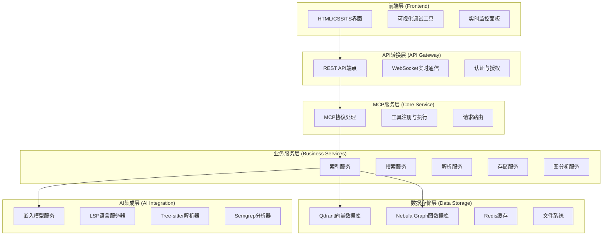
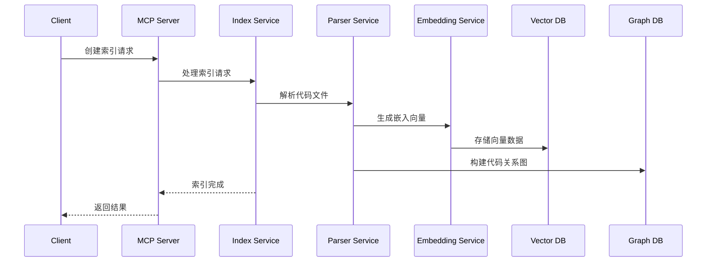
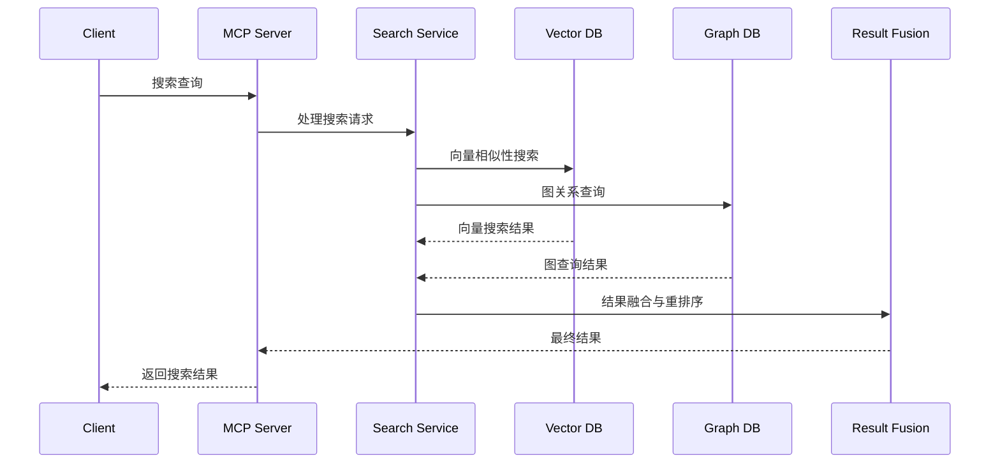

# 代码库索引与检索MCP服务

## 📖 项目概述

本项目是一个基于Model Context Protocol (MCP) 的智能代码库索引和检索服务，旨在为LLM提供高效的代码库分析和搜索能力。系统采用模块化架构设计，集成了多种先进技术栈，提供多维度代码分析和检索功能。

## 🎯 核心功能

### 1. 多技术栈集成
- **LSP集成**: 语言服务器协议支持，提供精确的代码理解
- **向量数据库**: Qdrant集成，支持语义相似性搜索
- **图数据库**: Nebula Graph集成，支持代码关系分析
- **Tree-sitter**: 多语言语法解析，支持智能代码片段提取
- **Semgrep**: 静态代码分析，安全漏洞检测

### 2. 智能检索能力
- 语义搜索（基于嵌入向量）
- 关键词搜索
- 混合搜索（语义+关键词+图关系）
- 代码结构分析
- 跨文件引用追踪

### 3. 多嵌入器支持
- OpenAI Embeddings
- Ollama本地模型
- Gemini API
- Mistral AI
- SiliconFlow
- 自定义嵌入器

## 🏗️ 系统架构

### 整体架构图



### 模块分层说明

1. **前端层**: 基于HTML+CSS+TypeScript的轻量级界面，提供可视化调试和监控功能
2. **API转换层**: 为前端提供RESTful API，处理HTTP请求与MCP协议的转换
3. **MCP服务层**: 核心MCP协议实现，工具注册和执行
4. **业务服务层**: 核心业务逻辑，包括索引、搜索、解析等功能
5. **数据存储层**: 多数据库支持，向量数据、图数据和缓存
6. **AI集成层**: 各种AI和分析工具集成

## 📁 项目结构

```
codebase-index-mcp/
├── 📁 src/                    # 主项目源代码
│   ├── 📁 api/               # API路由和控制器
│   ├── 📁 config/            # 配置管理
│   ├── 📁 core/              # 核心服务
│   ├── 📁 mcp/              # MCP协议处理
│   ├── 📁 services/         # 业务服务层
│   ├── 📁 types/            # TypeScript类型定义
│   └── main.ts              # 应用入口
├── 📁 frontend/             # 前端代码（独立package.json）
│   ├── 📁 src/             # 前端源代码
│   ├── 📁 public/          # 静态资源
│   ├── package.json        # 前端依赖配置
│   └── vite.config.ts     # Vite构建配置
├── 📁 ref/                 # 参考模块（来自其他项目）
│   ├── 📁 database/        # 数据库服务
│   ├── 📁 embedders/       # 嵌入器提供商
│   ├── 📁 mcp/            # MCP协议实现
│   ├── 📁 service/        # 各种服务实现
│   └── 📁 utils/          # 工具函数
├── 📁 data/               # 数据文件
│   └── 📁 mock/           # 模拟数据文件
├── 📁 docs/               # 项目文档
│   ├── 📁 plan/           # 实施计划
│   ├── 📁 architecture/   # 架构设计
│   └── 📁 binding-guide/  # 依赖注入绑定指南
├── 📁 config/             # 配置文件
└── package.json           # 主项目依赖配置
```

## 🚀 技术栈

### 后端技术
- **运行时**: Node.js 18+
- **语言**: TypeScript 5.9+
- **框架**: Express.js + InversifyJS (依赖注入)
- **协议**: Model Context Protocol (MCP)
- **数据库**: Qdrant (向量), Nebula Graph (图), Redis (缓存)
- **解析器**: Tree-sitter (多语言语法解析)

### 前端技术
- **框架**: 原生HTML + CSS + TypeScript
- **构建工具**: Vite
- **UI组件**: 自定义轻量级组件，无外部框架依赖
- **通信**: REST API + WebSocket

### AI与分析工具
- **嵌入模型**: OpenAI, Ollama, Gemini, Mistral, SiliconFlow
- **代码分析**: Semgrep, Tree-sitter
- **语言服务**: TypeScript Language Server, 其他LSP实现

## 🔄 开发计划

### 阶段一：基础框架搭建
- [ ] MCP服务器基础框架
- [ ] API转换层基础
- [ ] 前端基础结构
- [ ] 模拟数据准备
- [ ] 基本搜索功能（模拟数据）

### 阶段二：核心模块集成
- [x] 向量数据库集成 (Qdrant)
- [x] 图数据库集成 (Nebula Graph)
- [x] 嵌入器服务集成
- [x] Tree-sitter解析器集成

### 阶段三：高级功能开发
- [ ] LSP语言服务器集成
- [ ] Semgrep静态分析集成
- [ ] 实时索引更新
- [ ] 高级搜索算法

### 阶段四：优化与扩展
- [ ] 性能优化
- [ ] 监控和日志
- [ ] 容器化部署
- [ ] 文档完善

## 📊 数据流示例

### 索引构建流程


### 搜索查询流程


## 🛠️ 开发指南

### 环境要求
- Node.js 18.0+
- Docker (用于数据库服务)
- Git

### 快速开始
```bash
# 克隆项目
git clone <repository-url>
cd codebase-index-mcp

# 安装依赖
npm install

# 启动开发环境
npm run dev
```

### 配置说明
项目使用环境变量进行配置，请参考 `.env.example` 文件创建您的环境配置。

## 🤝 贡献指南

1. Fork 本项目
2. 创建特性分支 (`git checkout -b feature/AmazingFeature`)
3. 提交更改 (`git commit -m 'Add some AmazingFeature'`)
4. 推送到分支 (`git push origin feature/AmazingFeature`)
5. 打开Pull Request

## 📄 许可证

本项目采用 MIT 许可证 - 查看 [LICENSE](LICENSE) 文件了解详情。

## 🆘 支持

如果您遇到问题或有建议：
1. 查看 [文档](docs/)
2. 搜索 [Issues](../../issues)
3. 创建新的 Issue

---

*文档版本: 1.0*
*最后更新: 2025-09-27*