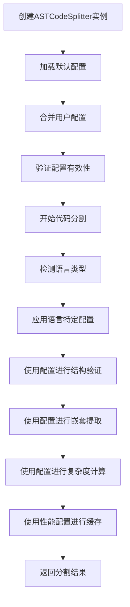

# ASTCodeSplitter 配置系统分析报告

## 概述

`ASTCodeSplitter.ts` 使用了一套多层次、模块化的配置系统，该系统设计灵活且功能强大，支持语言特定配置、性能优化和复杂度计算等多种需求。

## 配置系统架构

### 1. 核心配置接口

#### ASTSplitterConfig
主要配置接口，定义在 [`ASTSplitterConfig.ts`](src/utils/processing/ASTSplitterConfig.ts:73-128)，包含以下配置类别：

- **基础大小限制**：控制函数、类、命名空间等结构的大小
- **嵌套提取控制**：管理嵌套结构的提取策略
- **语义边界控制**：控制语义边界的识别和提取
- **降级策略**：定义当AST解析失败时的备用策略
- **性能配置**：缓存、并行处理等性能相关设置
- **提取配置**：控制提取的结构类型和内容
- **验证配置**：定义验证规则和严格模式
- **语言特定配置**：针对不同编程语言的特定设置
- **高级选项**：实验性功能、调试模式等

#### 配置工厂类
[`ASTSplitterConfigFactory`](src/utils/processing/ASTSplitterConfig.ts:133-394) 提供多种预设配置：

- **createDefault()**：默认配置，平衡功能和性能
- **createHighPerformance()**：高性能配置，优化处理速度
- **createHighQuality()**：高质量配置，启用所有提取功能
- **createForLanguage(language)**：针对特定语言的优化配置

### 2. 配置管理器

[`ConfigurationManager`](src/utils/processing/ConfigurationManager.ts:150-566) 提供配置的统一管理：

- **配置合并**：递归合并配置对象
- **配置验证**：基于模式验证配置有效性
- **语言特定配置**：为不同编程语言提供专门的配置
- **配置优化**：根据语言特性优化配置参数

### 3. 复杂度计算配置

[`ComplexityCalculator`](src/utils/processing/ComplexityCalculator.ts:86-360) 提供内容复杂度计算：

- **代码复杂度**：基于控制流、函数/类、括号等计算
- **Markdown复杂度**：基于标题、代码块、表格等计算
- **XML复杂度**：基于标签、属性、嵌套深度计算
- **通用复杂度**：适用于未知或混合内容类型

## ASTCodeSplitter 中的配置使用

### 1. 配置初始化

在构造函数中（第30-53行）：

```typescript
constructor(
  // ... 依赖注入
  config: Partial<ASTSplitterConfig> = {}
) {
  // 使用配置工厂创建默认配置并合并用户配置
  const defaultConfig = ASTSplitterConfigFactory.createDefault();
  this.config = ASTSplitterConfigFactory.merge(defaultConfig, config);
  
  // 验证配置
  const validation = ASTSplitterConfigFactory.validate(this.config);
  if (!validation.isValid) {
    this.logger.error('Invalid ASTSplitter configuration', validation.errors);
    throw new Error(`Invalid configuration: ${validation.errors.join(', ')}`);
  }
}
```

### 2. 语言特定配置应用

在 `split` 方法中（第84-98行）：

```typescript
// 使用ConfigurationManager获取语言特定配置
if (language) {
  const langSpecificConfig = ConfigurationManager.getLanguageSpecificConfig(language);
  if (langSpecificConfig) {
    // 应用语言特定配置到当前配置
    if (!this.config.languageSpecific) {
      this.config.languageSpecific = {};
    }
    // 合并语言特定配置
    this.config.languageSpecific[language as keyof typeof langSpecificConfig] = {
      ...this.config.languageSpecific[language as keyof typeof langSpecificConfig],
      ...langSpecificConfig[language as keyof typeof langSpecificConfig]
    };
  }
}
```

### 3. 配置在验证中的使用

在 `validateStructure` 方法中（第342-401行）：

```typescript
private validateStructure(type: string, content: string, location: { startLine: number; endLine: number }): boolean {
  // 使用配置中的大小限制进行验证
  switch (type) {
    case 'function':
      isValid = ValidationUtils.isValidFunction(content, location, {
        minLines: this.config.minFunctionLines,
        maxChars: this.config.maxFunctionSize,
        minChars: this.config.minChunkSize
      });
      break;
    // ... 其他类型验证
  }
  
  // 使用复杂度配置进行进一步验证
  if (isValid) {
    const chunkType = this.mapStringToChunkType(type);
    const structureComplexity = ComplexityCalculator.calculateComplexityByType(content, chunkType, this.config);
    
    // 设置复杂度阈值
    const minComplexity = 2;
    const maxComplexity = 500;
    
    const complexityValid = structureComplexity.score >= minComplexity && structureComplexity.score <= maxComplexity;
    return complexityValid;
  }
}
```

### 4. 配置在嵌套提取中的使用

在 `extractNestedStructures` 方法中（第253-337行）：

```typescript
private async extractNestedStructures(
  parentStructure: any,
  content: string,
  filePath: string,
  language: string,
  level: number
): Promise<CodeChunk[]> {
  // 检查嵌套级别限制
  if (!this.config.maxNestingLevel || level > this.config.maxNestingLevel) {
    return chunks;
  }
  
  // 根据配置决定是否保留完整实现
  const shouldPreserve = this.shouldPreserveNestedStructure(nested.type);
  
  // 计算复杂度并添加到元数据
  const nestedComplexity = ComplexityCalculator.calculateComplexityByType(
    c.content,
    c.metadata.type,
    this.config
  );
}
```

### 5. 性能配置的使用

在缓存和性能监控中（第64-76行，135-142行）：

```typescript
// 检查缓存
if (this.config.performance?.enableCaching) {
  const cacheKey = this.generateCacheKey(content, language, filePath);
  let cached: CodeChunk[] | undefined;
  try {
    cached = this.cacheService?.getFromCache<CodeChunk[]>(cacheKey);
  } catch (error) {
    this.logger.warn(`Cache get error for key ${cacheKey}:`, error);
  }
  if (cached) {
    this.logger.debug(`Using cached result for ${filePath}`);
    return cached;
  }
}

// 缓存结果
if (this.config.performance?.enableCaching && enhancedChunks.length > 0) {
  const cacheKey = this.generateCacheKey(content, language, filePath);
  try {
    this.cacheService?.setCache(cacheKey, enhancedChunks, 300000);
  } catch (error) {
    this.logger.warn(`Cache set error for key ${cacheKey}:`, error);
  }
}
```

## 配置系统特点

### 1. 多层次配置架构

- **默认配置**：提供合理的默认值
- **用户配置**：允许用户覆盖默认值
- **语言特定配置**：针对不同编程语言的优化
- **运行时配置**：支持动态配置更新

### 2. 配置验证机制

- **类型验证**：确保配置值类型正确
- **范围验证**：检查数值是否在合理范围内
- **依赖验证**：验证配置项之间的依赖关系
- **警告系统**：对可能的问题配置发出警告

### 3. 性能优化配置

- **缓存控制**：可配置的缓存大小和策略
- **并行处理**：支持多线程/多进程处理
- **内存限制**：防止内存溢出
- **超时控制**：避免长时间阻塞

### 4. 语言特定优化

每种编程语言都有专门的配置：

- **C++**：模板、预处理器、命名空间
- **Python**：装饰器、异步函数、推导式
- **JavaScript/TypeScript**：JSX、闭包、原型
- **Java**：注解、泛型、包
- **Go**：接口、协程、通道

## 配置使用流程



## 总结

`ASTCodeSplitter.ts` 使用了一套设计精良的配置系统，具有以下优势：

1. **灵活性**：支持多层次的配置覆盖和合并
2. **可扩展性**：易于添加新的配置项和验证规则
3. **性能优化**：提供多种性能调优选项
4. **语言适应性**：针对不同编程语言的专门优化
5. **健壮性**：完善的配置验证和错误处理

这套配置系统使得 `ASTCodeSplitter` 能够适应各种使用场景，从简单的代码分割到复杂的多语言项目处理，都能提供合适的配置支持。