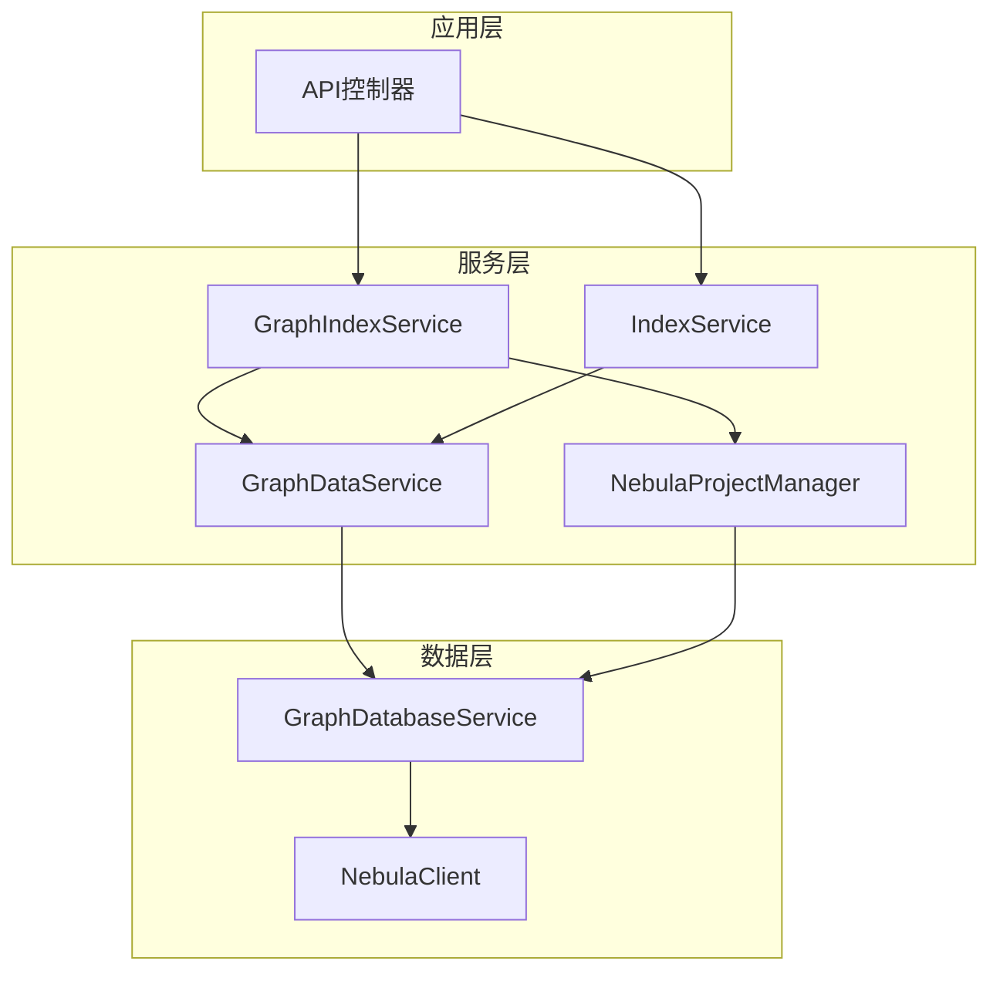

# GraphIndexService 和 IndexService 修改计划

## 📋 概述

本文档分析了现有的graph服务模块和nebula数据库模块，对比了`GraphIndexService.ts`和`IndexService.ts`的实现，识别了关键问题并提出了详细的修改方案。

## 🔍 现有架构分析

### 1. Nebula数据库模块架构

#### 核心组件
- **NebulaClient**: 底层客户端，负责连接管理和查询执行
- **NebulaProjectManager**: 项目管理器，处理项目特定的空间操作
- **NebulaSpaceManager**: 空间管理器，负责空间的创建、删除和管理
- **GraphDatabaseService**: 图数据库服务，提供统一的图数据库操作接口
- **NebulaDataBatchProcessor**: 批处理器，优化批量操作性能

#### 架构特点
- 分层设计：客户端层 → 管理层 → 服务层
- 依赖注入：使用inversify进行依赖管理
- 模块化：各组件职责明确，便于维护和扩展
- 错误处理：统一的错误处理机制
- 性能监控：内置性能监控和日志记录

### 2. Graph服务模块架构

#### 核心组件
- **GraphDataService**: 图数据服务，负责数据的CRUD操作
- **GraphAnalysisService**: 图分析服务，提供图分析功能
- **GraphSearchServiceNew**: 图搜索服务，提供搜索能力
- **GraphModule**: 依赖注入模块，统一管理graph相关服务

#### 架构特点
- 服务导向：以服务为核心的设计模式
- 接口抽象：通过接口定义服务契约
- 缓存支持：内置缓存机制提高性能
- 批处理优化：支持批量操作提高效率

## 📊 GraphIndexService vs IndexService 对比分析

### 1. 功能对比

| 功能 | GraphIndexService | IndexService |
|------|-------------------|--------------|
| 主要职责 | 图索引管理 | 向量索引管理 |
| 数据库支持 | Nebula Graph | Qdrant |
| 索引方式 | 图结构索引 | 向量索引 |
| 项目管理 | 基于ProjectStateManager | 内置项目管理 |
| 批处理 | 简单批处理 | 高级批处理服务 |
| 错误处理 | 基础错误处理 | 完善错误处理 |
| 性能监控 | 基础日志 | 详细性能监控 |

### 2. 实现差异

#### GraphIndexService特点
- 专注于图索引操作
- 依赖INebulaClient进行图操作
- 简单的批处理逻辑
- 基础的状态管理

#### IndexService特点
- 功能完整的索引服务
- 集成多种索引策略
- 高级批处理和并发控制
- 完善的事件系统和监控

## 🚨 识别的关键问题

### 1. 架构不一致问题

#### 问题描述
- GraphIndexService和IndexService使用不同的架构模式
- 依赖注入不统一，GraphIndexService直接依赖INebulaClient
- 缺乏统一的服务抽象层

#### 影响
- 代码维护困难
- 功能重复实现
- 测试复杂度高

### 2. 服务职责混乱

#### 问题描述
- GraphIndexService中的processGraphFiles方法直接调用IndexService的内部方法
- 空间管理逻辑分散在多个服务中
- 缺乏清晰的职责边界

#### 影响
- 代码耦合度高
- 修改风险大
- 扩展性差

### 3. 错误处理不统一

#### 问题描述
- GraphIndexService使用简化的错误处理
- 缺乏统一的错误分类和处理策略
- 错误信息不够详细

#### 影响
- 调试困难
- 用户体验差
- 系统稳定性低

### 4. 性能优化不足

#### 问题描述
- GraphIndexService缺乏高级批处理优化
- 没有充分利用现有的批处理服务
- 缺乏性能监控和优化

#### 影响
- 索引效率低
- 资源利用率低
- 扩展性差

## 🔧 修改方案设计

### 1. 架构统一化

#### 目标
建立统一的服务架构，确保GraphIndexService和IndexService使用相同的设计模式。

#### 方案
```typescript
// 统一的服务接口
interface IIndexService {
  startIndexing(projectPath: string, options?: IndexOptions): Promise<string>;
  stopIndexing(projectId: string): Promise<boolean>;
  getIndexStatus(projectId: string): IndexStatus | null;
}

// GraphIndexService实现统一接口
@injectable()
export class GraphIndexService implements IIndexService {
  // 使用统一的服务架构
  constructor(
    @inject(TYPES.GraphDataService) private graphDataService: GraphDataService,
    @inject(TYPES.NebulaProjectManager) private projectManager: NebulaProjectManager,
    // 其他依赖...
  ) {}
}
```

### 2. 服务职责重新划分

#### 目标
明确各服务的职责边界，避免功能重叠和混乱调用。

#### 方案


### 3. 错误处理统一化

#### 目标
建立统一的错误处理机制，提供一致的错误信息和处理策略。

#### 方案
```typescript
// 统一的错误类型
export enum GraphIndexErrorType {
  SPACE_CREATION_FAILED = 'SPACE_CREATION_FAILED',
  FILE_PROCESSING_FAILED = 'FILE_PROCESSING_FAILED',
  BATCH_PROCESSING_FAILED = 'BATCH_PROCESSING_FAILED',
  CONNECTION_FAILED = 'CONNECTION_FAILED'
}

// 统一的错误处理
export class GraphIndexError extends Error {
  constructor(
    public type: GraphIndexErrorType,
    message: string,
    public context?: any
  ) {
    super(message);
    this.name = 'GraphIndexError';
  }
}
```

### 4. 性能优化方案

#### 目标
提高图索引的性能和资源利用率。

#### 方案
```typescript
// 使用现有的批处理服务
@injectable()
export class GraphIndexService {
  constructor(
    @inject(TYPES.BatchProcessingService) private batchProcessor: BatchProcessingService,
    @inject(TYPES.GraphDataService) private graphDataService: GraphDataService,
    // 其他依赖...
  ) {}

  private async processGraphFiles(projectPath: string, files: string[]): Promise<void> {
    // 使用高级批处理服务
    await this.batchProcessor.processBatches(
      files,
      async (batch) => {
        return await this.graphDataService.storeParsedFiles(batch, {
          projectId: this.projectId
        });
      },
      {
        batchSize: 10,
        maxConcurrency: 3,
        context: { domain: 'graph', subType: 'indexing' }
      }
    );
  }
}
```

## 📝 详细修改计划

### 阶段一：架构重构（1-2周）

#### 1.1 重构GraphIndexService
- [ ] 实现IIndexService接口
- [ ] 修改依赖注入，使用GraphDataService而不是INebulaClient
- [ ] 统一错误处理机制
- [ ] 添加性能监控

#### 1.2 创建统一的服务抽象
- [ ] 定义IIndexService接口
- [ ] 创建IndexServiceBase基类
- [ ] 实现通用的索引逻辑

#### 1.3 更新依赖注入配置
- [ ] 修改DIContainer配置
- [ ] 更新GraphModule绑定
- [ ] 确保依赖关系正确

### 阶段二：功能优化（2-3周）

#### 2.1 优化批处理逻辑
- [ ] 集成BatchProcessingService
- [ ] 实现智能批处理策略
- [ ] 添加批处理监控

#### 2.2 改进空间管理
- [ ] 使用NebulaProjectManager进行空间管理
- [ ] 实现空间生命周期管理
- [ ] 添加空间状态监控

#### 2.3 增强错误处理
- [ ] 实现分类错误处理
- [ ] 添加错误恢复机制
- [ ] 改进错误日志记录

### 阶段三：性能优化（1-2周）

#### 3.1 性能监控集成
- [ ] 集成PerformanceMonitor
- [ ] 添加关键指标监控
- [ ] 实现性能报告

#### 3.2 缓存优化
- [ ] 集成GraphCacheService
- [ ] 实现智能缓存策略
- [ ] 添加缓存命中率监控

#### 3.3 并发优化
- [ ] 优化并发控制策略
- [ ] 实现资源池管理
- [ ] 添加并发监控

### 阶段四：测试和验证（1周）

#### 4.1 单元测试
- [ ] 更新GraphIndexService测试
- [ ] 添加新功能测试
- [ ] 确保测试覆盖率

#### 4.2 集成测试
- [ ] 端到端测试
- [ ] 性能测试
- [ ] 错误场景测试

#### 4.3 文档更新
- [ ] 更新API文档
- [ ] 更新架构文档
- [ ] 添加使用示例

## 🎯 预期收益

### 1. 代码质量提升
- 统一的架构模式
- 清晰的职责边界
- 一致的错误处理

### 2. 性能改进
- 更高效的批处理
- 更好的资源利用
- 更快的索引速度

### 3. 维护性增强
- 更容易的代码维护
- 更好的测试覆盖
- 更清晰的文档

### 4. 扩展性提升
- 更灵活的架构
- 更好的模块化
- 更容易的功能扩展

## 🔄 实施建议

### 1. 分阶段实施
建议按照上述阶段分步实施，每个阶段完成后进行充分测试和验证。

### 2. 向后兼容
在修改过程中保持向后兼容性，确保现有功能不受影响。

### 3. 监控和反馈
实施过程中持续监控系统性能，收集用户反馈，及时调整方案。

### 4. 文档同步
确保代码修改和文档更新同步进行，保持文档的准确性和完整性。

## 📊 风险评估

### 1. 技术风险
- **风险**: 架构重构可能引入新的bug
- **缓解**: 充分的测试和代码审查

### 2. 性能风险
- **风险**: 重构可能影响现有性能
- **缓解**: 性能基准测试和监控

### 3. 兼容性风险
- **风险**: 修改可能破坏现有功能
- **缓解**: 向后兼容设计和渐进式重构

## 📈 成功指标

### 1. 代码质量指标
- 代码覆盖率 > 90%
- 代码复杂度降低 > 20%
- 代码重复率 < 5%

### 2. 性能指标
- 索引速度提升 > 30%
- 内存使用优化 > 20%
- 错误率降低 > 50%

### 3. 维护性指标
- 新功能开发时间减少 > 40%
- Bug修复时间减少 > 30%
- 文档完整性 > 95%

---

*本文档将随着实施进展持续更新，确保方案的准确性和可行性。*