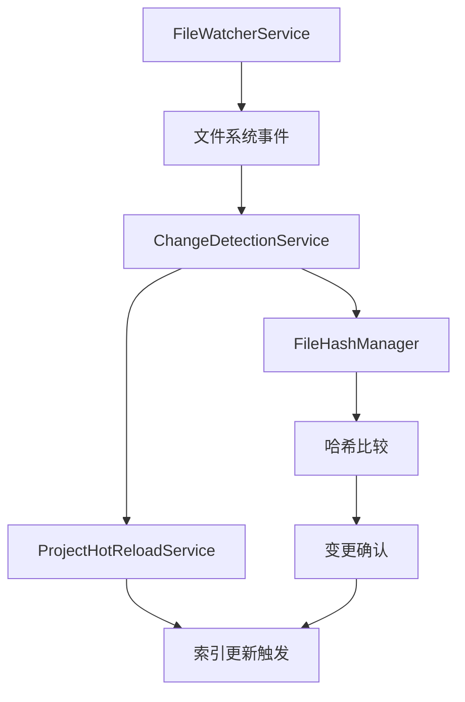
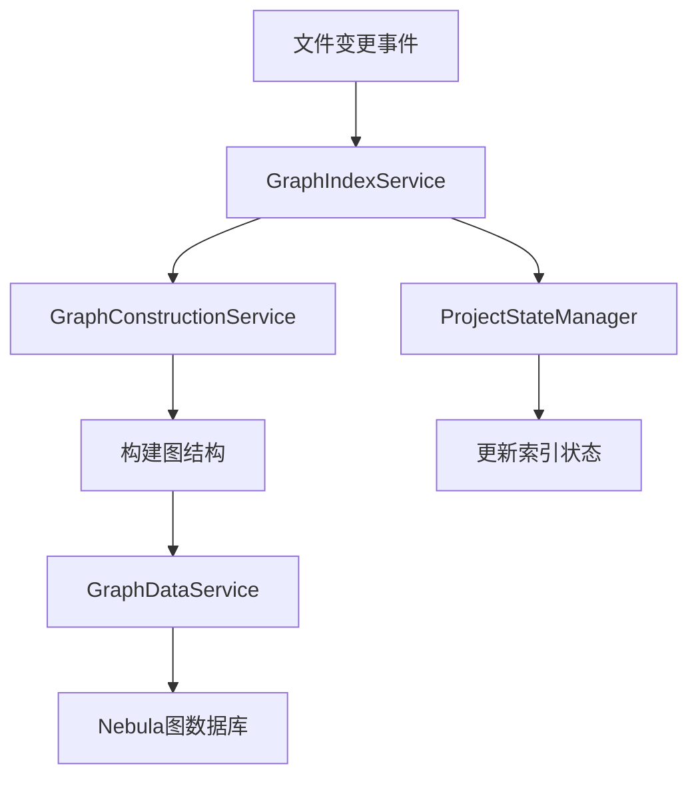
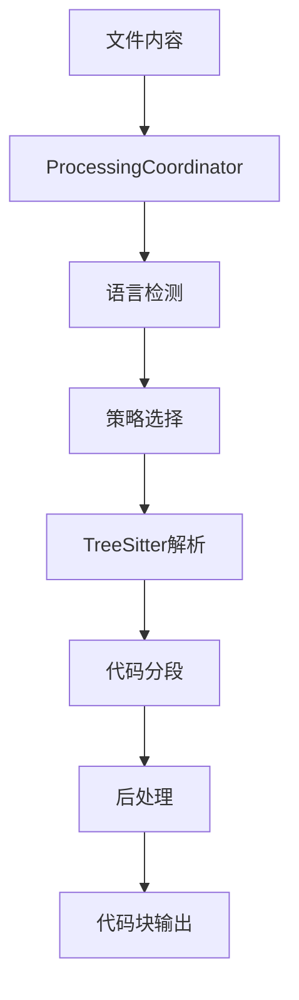
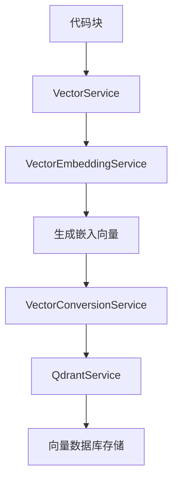
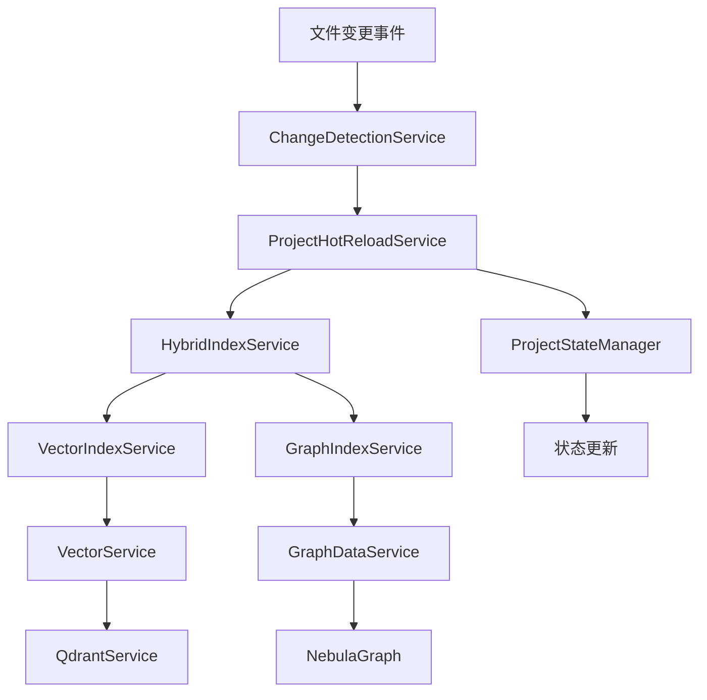
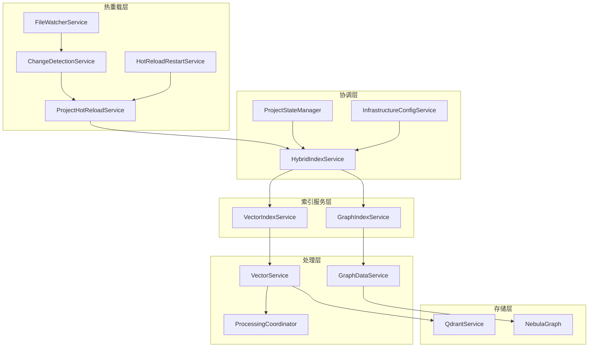
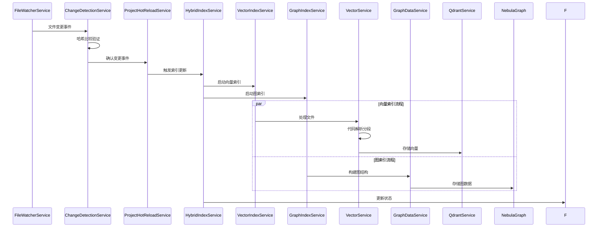

# 热重载模块与Graph模块、Parser模块交互分析报告

## 📋 概述

本报告深入分析了当前项目中热重载模块如何与graph模块和parser模块交互，以更新向量索引和图索引的完整流程。通过对核心组件的详细分析，识别了架构中的集成点、交互方式、潜在问题和改进机会。

## 🏗️ 核心模块架构分析

### 1. 热重载模块核心架构

#### 1.1 主要组件
- **ProjectHotReloadService**: 项目级热重载管理服务
- **ChangeDetectionService**: 文件变更检测服务
- **FileWatcherService**: 文件监听服务（基于chokidar）
- **HotReloadRestartService**: 热重载重启恢复服务

#### 1.2 文件变更检测机制


**关键特性**:
- 基于chokidar的高效文件监听
- 哈希比较避免误触发
- 防抖机制处理频繁变更
- 支持文件重命名检测
- 完整的错误恢复机制

### 2. Graph模块图索引更新流程

#### 2.1 核心组件
- **GraphIndexService**: 图索引服务实现
- **GraphDataService**: 图数据存储服务
- **GraphConstructionService**: 图结构构建服务
- **NebulaProjectManager**: Nebula图数据库项目管理

#### 2.2 图索引更新流程


**关键特性**:
- 支持NEBULA_ENABLED环境变量控制
- 项目级别的图空间隔离
- 批量图操作优化
- 完整的错误处理和状态管理

### 3. Parser模块代码解析和分段处理

#### 3.1 核心组件
- **ProcessingCoordinator**: 处理协调器
- **TreeSitterService**: 语法解析服务
- **StrategyFactory**: 分段策略工厂
- **ChunkPostProcessorCoordinator**: 后处理协调器

#### 3.2 代码解析流程


**关键特性**:
- 多语言支持（TypeScript, Python, Java, Go等）
- 智能分段策略选择
- 完整的降级机制
- 后处理优化

### 4. 向量索引创建和更新机制

#### 4.1 核心组件
- **VectorIndexService**: 向量索引服务
- **VectorService**: 向量处理服务
- **QdrantService**: Qdrant向量数据库服务
- **VectorEmbeddingService**: 向量嵌入服务

#### 4.2 向量索引流程


**关键特性**:
- 支持多种嵌入器（OpenAI, Ollama, Gemini等）
- 批量处理优化
- 项目级别的集合隔离
- 完整的缓存机制

## 🔗 集成点和交互方式分析

### 1. 热重载与Graph模块集成

#### 1.1 集成点
- **HybridIndexService**: 作为热重载和图索引的协调层
- **ProjectStateManager**: 状态管理和同步
- **InfrastructureConfigService**: 配置管理

#### 1.2 交互方式
```typescript
// 热重载触发图索引更新的关键路径
ProjectHotReloadService.handleFileChange() 
  → HybridIndexService.startIndexing()
  → GraphIndexService.startIndexing()
  → GraphDataService.storeParsedFiles()
```

**触发条件**:
- 文件创建、修改、删除
- 项目配置变更
- 手动触发重新索引

### 2. 热重载与Parser模块集成

#### 2.1 集成点
- **ProcessingCoordinator**: 直接处理文件变更
- **VectorService**: 通过parser处理代码块
- **ChangeDetectionService**: 文件变更检测

#### 2.2 交互方式
```typescript
// 热重载触发parser处理的关键路径
ChangeDetectionService.handleFileChanged()
  → VectorService.processFileForEmbedding()
  → ProcessingCoordinator.process()
  → 代码解析和分段
```

### 3. 热重载与向量索引集成

#### 3.1 集成点
- **VectorIndexService**: 向量索引服务
- **QdrantService**: 向量数据库操作
- **BatchProcessingService**: 批量处理优化

#### 3.2 交互方式
```typescript
// 热重载触发向量索引更新的关键路径
ProjectHotReloadService.handleFileChange()
  → HybridIndexService.startIndexing()
  → VectorIndexService.startIndexing()
  → VectorService.processFileForEmbedding()
  → QdrantService.upsertVectorsForProject()
```

## 🔄 索引更新触发条件和传播机制

### 1. 触发条件

#### 1.1 文件级触发
- 文件创建（onFileCreated）
- 文件修改（onFileModified）
- 文件删除（onFileDeleted）
- 文件重命名（onFileRenamed）

#### 1.2 项目级触发
- 项目配置变更
- 手动重新索引
- 批量操作

#### 1.3 系统级触发
- 应用重启恢复
- 错误恢复机制
- 定期同步检查

### 2. 传播机制



**传播特点**:
- 异步处理避免阻塞
- 批量操作优化性能
- 错误隔离保证稳定性
- 状态同步确保一致性

## ⚠️ 当前架构中的潜在问题和改进机会

### 1. 架构层面问题

#### 1.1 循环依赖风险
**问题**: 热重载服务与索引服务之间存在潜在的循环依赖
**影响**: 可能导致启动失败或内存泄漏
**建议**: 引入事件驱动架构，解耦直接依赖

#### 1.2 单例模式滥用
**问题**: 多个服务使用单例模式，可能导致状态污染
**影响**: 并发处理时可能出现状态不一致
**建议**: 使用依赖注入容器管理生命周期

#### 1.3 错误处理不一致
**问题**: 不同模块的错误处理策略不统一
**影响**: 错误传播和恢复机制不可靠
**建议**: 建立统一的错误处理框架

### 2. 性能层面问题

#### 2.1 缓存策略不协调
**问题**: 各模块独立缓存，可能导致数据不一致
**影响**: 重复计算和内存浪费
**建议**: 建立统一的缓存管理机制

#### 2.2 批量处理优化不足
**问题**: 文件变更时缺乏智能批量处理
**影响**: 频繁的小批量操作影响性能
**建议**: 实现智能批量聚合机制

#### 2.3 并发控制缺失
**问题**: 缺乏有效的并发控制机制
**影响**: 高并发场景下可能出现竞态条件
**建议**: 引入分布式锁和队列机制

### 3. 可维护性问题

#### 3.1 配置管理分散
**问题**: 配置分散在多个模块中
**影响**: 配置变更困难，容易出现不一致
**建议**: 建立统一的配置管理中心

#### 3.2 监控和日志不统一
**问题**: 各模块使用不同的监控和日志策略
**影响**: 问题诊断困难，运维复杂
**建议**: 建立统一的监控和日志框架

#### 3.3 测试覆盖不足
**问题**: 集成测试覆盖不完整
**影响**: 模块间交互问题难以发现
**建议**: 增加端到端测试和集成测试

## 🎯 优化建议

### 1. 架构优化

#### 1.1 引入事件驱动架构
```typescript
// 建议的事件驱动架构
interface IndexEvent {
  type: 'file_changed' | 'project_reindexed' | 'error_occurred';
  payload: any;
  timestamp: Date;
}

class EventBus {
  publish(event: IndexEvent): void;
  subscribe(eventType: string, handler: (event: IndexEvent) => void): void;
}
```

#### 1.2 实现统一的状态管理
```typescript
// 建议的统一状态管理
interface IndexState {
  projectId: string;
  vectorStatus: IndexStatus;
  graphStatus: IndexStatus;
  lastUpdated: Date;
}

class IndexStateManager {
  updateState(projectId: string, updates: Partial<IndexState>): void;
  getState(projectId: string): IndexState;
}
```

### 2. 性能优化

#### 2.1 智能批量处理
```typescript
// 建议的智能批量处理
class IntelligentBatchProcessor {
  private pendingChanges: Map<string, FileChangeEvent[]> = new Map();
  
  addChange(projectId: string, change: FileChangeEvent): void;
  processBatch(projectId: string): Promise<void>;
}
```

#### 2.2 缓存优化策略
```typescript
// 建议的缓存策略
class UnifiedCacheManager {
  get<T>(key: string): Promise<T | null>;
  set<T>(key: string, value: T, ttl?: number): Promise<void>;
  invalidate(pattern: string): Promise<void>;
}
```

### 3. 可靠性优化

#### 3.1 重试机制
```typescript
// 建议的重试机制
class RetryManager {
  async executeWithRetry<T>(
    operation: () => Promise<T>,
    maxRetries: number,
    backoffStrategy: BackoffStrategy
  ): Promise<T>;
}
```

#### 3.2 健康检查机制
```typescript
// 建议的健康检查
class HealthChecker {
  checkVectorIndex(): Promise<HealthStatus>;
  checkGraphIndex(): Promise<HealthStatus>;
  checkHotReload(): Promise<HealthStatus>;
}
```

## 📊 架构图和流程图

### 1. 整体架构图



### 2. 热重载触发索引更新流程图



## 📈 总结

### 1. 当前架构优势
- **模块化设计**: 各模块职责清晰，便于维护
- **异步处理**: 避免阻塞，提高响应性
- **错误恢复**: 完整的错误恢复机制
- **配置灵活**: 支持多种配置选项

### 2. 主要改进方向
- **解耦优化**: 引入事件驱动架构
- **性能提升**: 智能批量处理和缓存优化
- **可靠性增强**: 统一错误处理和重试机制
- **可维护性**: 统一配置和监控框架

### 3. 实施建议
1. **短期**: 修复循环依赖和错误处理问题
2. **中期**: 实现事件驱动架构和统一缓存
3. **长期**: 完善监控体系和自动化运维

通过这些优化，可以显著提升热重载与索引模块交互的性能、可靠性和可维护性，为用户提供更好的开发体验。