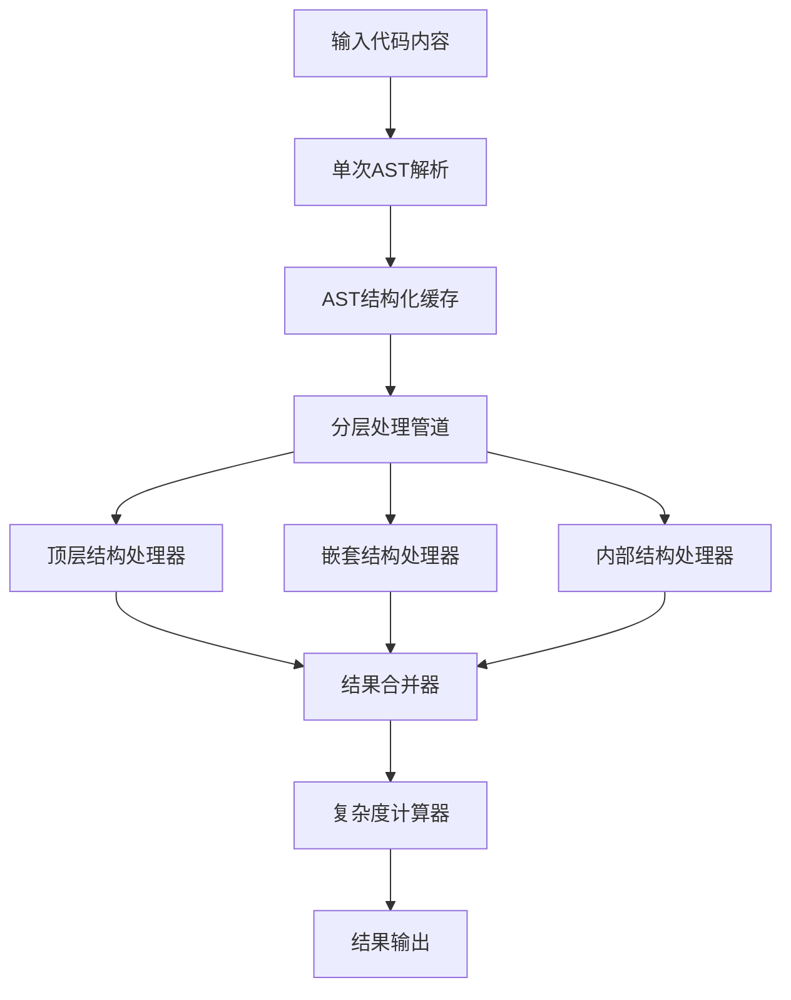
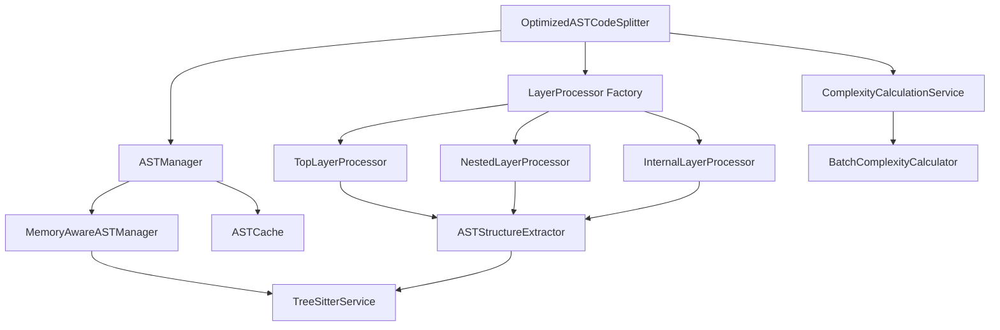

# ASTCodeSplitter 优化方案详细设计

## 1. 概述

本文档详细描述了对 `ASTCodeSplitter` 分层处理实现的优化方案，重点解决当前架构中的性能瓶颈、代码质量和可维护性问题。

## 2. 当前问题分析

### 2.1 架构问题
- **过度依赖外部组件**：严重依赖 `UnifiedContentAnalyzer`，耦合度过高
- **重复的复杂度计算**：在多个方法中重复计算复杂度
- **缺乏分层策略配置**：没有针对不同层级结构提供不同的处理策略

### 2.2 性能问题
- **串行处理**：结构提取是串行执行的，无法充分利用多核性能
- **重复的AST解析**：在嵌套结构提取过程中可能多次解析同一AST
- **缓存策略不完善**：缓存键生成过于简单，命中率低

### 2.3 代码质量问题
- **方法过长**：`extractChunksFromAST()` 方法职责过多
- **硬编码值**：复杂度阈值等配置值硬编码在代码中
- **错误处理不一致**：某些地方有try-catch，某些地方没有

## 3. 优化方案设计

### 3.1 一次性解析再处理架构

#### 3.1.1 设计理念

将当前的"多次解析+多次处理"模式改为"一次解析+多次处理"模式，通过以下方式实现：

1. **单次AST解析**：在方法开始时解析一次AST，然后在所有后续处理中重用这个AST
2. **解析结果缓存**：将解析结果进行结构化缓存，避免重复解析
3. **分层处理管道**：建立处理管道，AST数据在管道中流动，各层级处理器按需处理

#### 3.1.2 架构图



#### 3.1.3 核心接口设计

```typescript
/**
 * AST解析结果接口
 */
interface ParsedASTResult {
  ast: Parser.SyntaxNode;
  content: string;
  language: string;
  metadata: {
    parseTime: number;
    nodeCount: number;
    depth: number;
  };
}

/**
 * 分层处理器接口
 */
interface LayerProcessor {
  /**
   * 处理AST并提取特定层级的结构
   */
  process(astResult: ParsedASTResult, options: ProcessingOptions): Promise<LayerResult>;
  
  /**
   * 获取处理器支持的层级类型
   */
  getSupportedLayerType(): LayerType;
}

/**
 * 处理选项接口
 */
interface ProcessingOptions {
  maxNestingLevel: number;
  includeTopLevel: boolean;
  includeNested: boolean;
  includeInternal: boolean;
  enableCache: boolean;
  performanceMode: 'speed' | 'memory' | 'balanced';
}

/**
 * 分层结果接口
 */
interface LayerResult {
  structures: CodeStructure[];
  metadata: {
    processingTime: number;
    structureCount: number;
    layerType: LayerType;
  };
}
```

### 3.2 具体实现方案

#### 3.2.1 优化后的ASTCodeSplitter主类

```typescript
@injectable()
export class OptimizedASTCodeSplitter {
  private astCache: Map<string, ParsedASTResult> = new Map();
  private layerProcessors: Map<LayerType, LayerProcessor> = new Map();
  
  constructor(
    @inject(TYPES.TreeSitterService) private treeSitterService: TreeSitterService,
    @inject(TYPES.ComplexityCalculationService) private complexityService: ComplexityCalculationService,
    @inject(TYPES.CacheService) private cacheService: ICacheService,
    @inject(TYPES.LoggerService) private logger: LoggerService,
    // 注入各层处理器
    @inject(TYPES.TopLayerProcessor) topLayerProcessor: LayerProcessor,
    @inject(TYPES.NestedLayerProcessor) nestedLayerProcessor: LayerProcessor,
    @inject(TYPES.InternalLayerProcessor) internalLayerProcessor: LayerProcessor
  ) {
    // 注册处理器
    this.layerProcessors.set(LayerType.TOP, topLayerProcessor);
    this.layerProcessors.set(LayerType.NESTED, nestedLayerProcessor);
    this.layerProcessors.set(LayerType.INTERNAL, internalLayerProcessor);
  }

  /**
   * 主要的分割方法 - 优化版本
   */
  async split(content: string, filePath: string, language: string): Promise<CodeChunk[]> {
    const startTime = Date.now();
    
    try {
      // 1. 检查整体结果缓存
      const resultCacheKey = this.generateResultCacheKey(content, language, filePath);
      const cachedResult = this.cacheService?.getFromCache<CodeChunk[]>(resultCacheKey);
      if (cachedResult) {
        this.logger.debug(`使用缓存结果: ${filePath}`);
        return cachedResult;
      }

      // 2. 单次AST解析
      const astResult = await this.parseASTOnce(content, language);
      
      // 3. 并行处理各层级
      const processingOptions = this.createProcessingOptions();
      const layerResults = await this.processLayersParallel(astResult, processingOptions);
      
      // 4. 合并结果
      const allStructures = this.mergeLayerResults(layerResults);
      
      // 5. 转换为代码块
      const chunks = await this.convertToCodeChunks(allStructures, filePath);
      
      // 6. 批量计算复杂度
      const enhancedChunks = await this.complexityService.calculateBatch(chunks);
      
      // 7. 缓存结果
      this.cacheService?.setCache(resultCacheKey, enhancedChunks, 300000);
      
      const duration = Date.now() - startTime;
      this.logger.debug(`优化版ASTCodeSplitter处理完成: ${filePath}, 耗时: ${duration}ms, 生成: ${enhancedChunks.length}个代码块`);
      
      return enhancedChunks;
    } catch (error) {
      this.logger.error(`优化版ASTCodeSplitter处理失败: ${filePath}`, error);
      throw error;
    }
  }

  /**
   * 单次AST解析
   */
  private async parseASTOnce(content: string, language: string): Promise<ParsedASTResult> {
    const cacheKey = this.generateASTCacheKey(content, language);
    
    // 检查AST缓存
    if (this.astCache.has(cacheKey)) {
      this.logger.debug(`使用缓存的AST: ${language}`);
      return this.astCache.get(cacheKey)!;
    }
    
    const parseStartTime = Date.now();
    
    try {
      const ast = await this.treeSitterService.parseCode(content, language);
      if (!ast) {
        throw new Error(`AST解析失败: ${language}`);
      }
      
      const astResult: ParsedASTResult = {
        ast,
        content,
        language,
        metadata: {
          parseTime: Date.now() - parseStartTime,
          nodeCount: this.countNodes(ast),
          depth: this.calculateDepth(ast)
        }
      };
      
      // 缓存AST结果（限制缓存大小）
      if (this.astCache.size >= 50) {
        const firstKey = this.astCache.keys().next().value;
        this.astCache.delete(firstKey);
      }
      this.astCache.set(cacheKey, astResult);
      
      return astResult;
    } catch (error) {
      this.logger.error(`AST解析失败: ${language}`, error);
      throw error;
    }
  }

  /**
   * 并行处理各层级
   */
  private async processLayersParallel(
    astResult: ParsedASTResult, 
    options: ProcessingOptions
  ): Promise<Map<LayerType, LayerResult>> {
    const results = new Map<LayerType, LayerResult>();
    const processingPromises: Promise<void>[] = [];
    
    // 根据配置决定处理哪些层级
    const layersToProcess: LayerType[] = [];
    if (options.includeTopLevel) layersToProcess.push(LayerType.TOP);
    if (options.includeNested) layersToProcess.push(LayerType.NESTED);
    if (options.includeInternal) layersToProcess.push(LayerType.INTERNAL);
    
    // 并行处理各层级
    for (const layerType of layersToProcess) {
      const processor = this.layerProcessors.get(layerType);
      if (processor) {
        processingPromises.push(
          processor.process(astResult, options)
            .then(result => results.set(layerType, result))
            .catch(error => {
              this.logger.error(`层级处理失败: ${layerType}`, error);
              results.set(layerType, {
                structures: [],
                metadata: {
                  processingTime: 0,
                  structureCount: 0,
                  layerType
                }
              });
            })
        );
      }
    }
    
    await Promise.all(processingPromises);
    return results;
  }

  /**
   * 合并各层级结果
   */
  private mergeLayerResults(layerResults: Map<LayerType, LayerResult>): CodeStructure[] {
    const allStructures: CodeStructure[] = [];
    
    for (const [layerType, result] of layerResults) {
      allStructures.push(...result.structures);
      this.logger.debug(`层级 ${layerType} 提取了 ${result.structures.length} 个结构`);
    }
    
    // 按位置排序
    return allStructures.sort((a, b) => a.location.startLine - b.location.startLine);
  }

  /**
   * 转换为代码块
   */
  private async convertToCodeChunks(structures: CodeStructure[], filePath: string): Promise<CodeChunk[]> {
    return structures.map(structure => 
      QueryResultConverter.convertSingleHierarchicalStructure(
        TypeMappingUtils.convertToHierarchicalStructure(structure),
        'optimized-ast-splitter',
        filePath
      )
    );
  }

  /**
   * 创建处理选项
   */
  private createProcessingOptions(): ProcessingOptions {
    return {
      maxNestingLevel: this.config.nesting.maxNestingLevel || 5,
      includeTopLevel: true,
      includeNested: this.config.nesting.enableNestedExtraction,
      includeInternal: false, // 内部结构通常不需要作为单独的块
      enableCache: this.config.performance?.enableCaching || true,
      performanceMode: this.determinePerformanceMode()
    };
  }

  /**
   * 确定性能模式
   */
  private determinePerformanceMode(): 'speed' | 'memory' | 'balanced' {
    const memoryUsage = process.memoryUsage();
    const memoryLimitMB = this.config.performance.maxFileSize / (1024 * 1024);
    
    if (memoryUsage.heapUsed / (1024 * 1024) > memoryLimitMB * 0.8) {
      return 'memory';
    }
    
    return 'balanced';
  }

  /**
   * 生成AST缓存键
   */
  private generateASTCacheKey(content: string, language: string): string {
    const contentHash = HashUtils.fnv1aHash(content);
    return `ast:${language}:${contentHash}`;
  }

  /**
   * 生成结果缓存键
   */
  private generateResultCacheKey(content: string, language: string, filePath: string): string {
    const contentHash = HashUtils.fnv1aHash(content);
    return `result:${filePath}:${language}:${contentHash}`;
  }

  /**
   * 计算AST节点数量
   */
  private countNodes(node: Parser.SyntaxNode): number {
    let count = 1;
    for (let i = 0; i < node.childCount; i++) {
      count += this.countNodes(node.child(i)!);
    }
    return count;
  }

  /**
   * 计算AST深度
   */
  private calculateDepth(node: Parser.SyntaxNode): number {
    if (node.childCount === 0) {
      return 1;
    }
    
    let maxChildDepth = 0;
    for (let i = 0; i < node.childCount; i++) {
      const childDepth = this.calculateDepth(node.child(i)!);
      maxChildDepth = Math.max(maxChildDepth, childDepth);
    }
    
    return maxChildDepth + 1;
  }
}
```

#### 3.2.2 分层处理器实现

```typescript
/**
 * 顶层结构处理器
 */
@injectable()
export class TopLayerProcessor implements LayerProcessor {
  constructor(
    @inject(TYPES.ASTStructureExtractor) private astExtractor: ASTStructureExtractor,
    @inject(TYPES.LoggerService) private logger: LoggerService
  ) {}

  async process(astResult: ParsedASTResult, options: ProcessingOptions): Promise<LayerResult> {
    const startTime = Date.now();
    
    try {
      const structures = await this.astExtractor.extractTopLevelStructuresFromAST(
        astResult.content,
        astResult.language,
        astResult.ast
      );
      
      return {
        structures,
        metadata: {
          processingTime: Date.now() - startTime,
          structureCount: structures.length,
          layerType: LayerType.TOP
        }
      };
    } catch (error) {
      this.logger.error('顶层结构处理失败', error);
      return {
        structures: [],
        metadata: {
          processingTime: Date.now() - startTime,
          structureCount: 0,
          layerType: LayerType.TOP
        }
      };
    }
  }

  getSupportedLayerType(): LayerType {
    return LayerType.TOP;
  }
}

/**
 * 嵌套结构处理器
 */
@injectable()
export class NestedLayerProcessor implements LayerProcessor {
  constructor(
    @inject(TYPES.ASTStructureExtractor) private astExtractor: ASTStructureExtractor,
    @inject(TYPES.LoggerService) private logger: LoggerService
  ) {}

  async process(astResult: ParsedASTResult, options: ProcessingOptions): Promise<LayerResult> {
    const startTime = Date.now();
    
    try {
      // 首先获取顶级结构作为嵌套结构的起点
      const topLevelStructures = await this.astExtractor.extractTopLevelStructuresFromAST(
        astResult.content,
        astResult.language,
        astResult.ast
      );
      
      const allNestedStructures: NestedStructure[] = [];
      
      // 并行处理每个顶级结构的嵌套内容
      const nestedPromises = topLevelStructures.map(async (topLevel) => {
        if (topLevel.node) {
          return this.extractNestedStructuresRecursive(
            astResult.content,
            topLevel.node,
            1,
            options.maxNestingLevel,
            astResult.ast
          );
        }
        return [];
      });
      
      const nestedResults = await Promise.all(nestedPromises);
      allNestedStructures.push(...nestedResults.flat());
      
      return {
        structures: allNestedStructures,
        metadata: {
          processingTime: Date.now() - startTime,
          structureCount: allNestedStructures.length,
          layerType: LayerType.NESTED
        }
      };
    } catch (error) {
      this.logger.error('嵌套结构处理失败', error);
      return {
        structures: [],
        metadata: {
          processingTime: Date.now() - startTime,
          structureCount: 0,
          layerType: LayerType.NESTED
        }
      };
    }
  }

  private async extractNestedStructuresRecursive(
    content: string,
    parentNode: Parser.SyntaxNode,
    currentLevel: number,
    maxLevel: number,
    ast: Parser.SyntaxNode
  ): Promise<NestedStructure[]> {
    if (currentLevel > maxLevel) {
      return [];
    }

    try {
      const nestedStructures = await this.astExtractor.extractNestedStructuresFromAST(
        content,
        parentNode,
        currentLevel,
        ast
      );

      // 并行递归提取更深层的嵌套结构
      const deeperPromises = nestedStructures.map(async (nested) => {
        if (nested.parentNode) {
          return this.extractNestedStructuresRecursive(
            content,
            nested.parentNode,
            currentLevel + 1,
            maxLevel,
            ast
          );
        }
        return [];
      });

      const deeperResults = await Promise.all(deeperPromises);
      return [...nestedStructures, ...deeperResults.flat()];
    } catch (error) {
      this.logger.warn(`递归提取嵌套结构失败 (层级 ${currentLevel}):`, error);
      return [];
    }
  }

  getSupportedLayerType(): LayerType {
    return LayerType.NESTED;
  }
}

/**
 * 内部结构处理器
 */
@injectable()
export class InternalLayerProcessor implements LayerProcessor {
  constructor(
    @inject(TYPES.ASTStructureExtractor) private astExtractor: ASTStructureExtractor,
    @inject(TYPES.LoggerService) private logger: LoggerService
  ) {}

  async process(astResult: ParsedASTResult, options: ProcessingOptions): Promise<LayerResult> {
    const startTime = Date.now();
    
    try {
      const structures = await this.astExtractor.extractInternalStructuresFromAST(
        astResult.content,
        astResult.ast,
        astResult.ast
      );
      
      return {
        structures,
        metadata: {
          processingTime: Date.now() - startTime,
          structureCount: structures.length,
          layerType: LayerType.INTERNAL
        }
      };
    } catch (error) {
      this.logger.error('内部结构处理失败', error);
      return {
        structures: [],
        metadata: {
          processingTime: Date.now() - startTime,
          structureCount: 0,
          layerType: LayerType.INTERNAL
        }
      };
    }
  }

  getSupportedLayerType(): LayerType {

## 6. 修改后的目录结构

### 6.1 当前目录结构分析

```
src/service/parser/
├── processing/
│   ├── strategies/
│   │   ├── implementations/
│   │   │   ├── ASTCodeSplitter.ts          # 当前实现
│   │   │   ├── UniversalTextStrategy.ts
│   │   │   └── __tests__/
│   │   ├── base/
│   │   └── types/
│   └── ...
├── core/
│   ├── normalization/
│   │   ├── ContentAnalyzer.ts              # UnifiedContentAnalyzer
│   │   ├── ASTStructureExtractor.ts
│   │   └── ...
│   └── ...
└── ...
```

### 6.2 优化后的目录结构

```
src/service/parser/
├── processing/
│   ├── strategies/
│   │   ├── implementations/
│   │   │   ├── ASTCodeSplitter.ts          # 保留作为兼容层
│   │   │   ├── OptimizedASTCodeSplitter.ts # 新的优化实现
│   │   │   ├── UniversalTextStrategy.ts
│   │   │   └── __tests__/
│   │   │       ├── ASTCodeSplitter.test.ts
│   │   │       ├── OptimizedASTCodeSplitter.test.ts  # 新增测试
│   │   │       └── integration/            # 集成测试
│   │   │           ├── ASTSplitterIntegration.test.ts
│   │   │           └── PerformanceBenchmark.test.ts
│   │   ├── base/
│   │   │   ├── BaseStrategy.ts
│   │   │   └── BaseLayerProcessor.ts       # 新增基础处理器
│   │   ├── layers/                         # 新增分层处理器目录
│   │   │   ├── interfaces/
│   │   │   │   ├── LayerProcessor.ts       # 分层处理器接口
│   │   │   │   ├── ASTManager.ts           # AST管理器接口
│   │   │   │   └── ComplexityCalculationService.ts
│   │   │   ├── implementations/
│   │   │   │   ├── TopLayerProcessor.ts    # 顶层结构处理器
│   │   │   │   ├── NestedLayerProcessor.ts # 嵌套结构处理器
│   │   │   │   ├── InternalLayerProcessor.ts # 内部结构处理器
│   │   │   │   └── __tests__/
│   │   │   │       ├── TopLayerProcessor.test.ts
│   │   │   │       ├── NestedLayerProcessor.test.ts
│   │   │   │       └── InternalLayerProcessor.test.ts
│   │   │   └── utils/
│   │   │       ├── LayerTypeUtils.ts       # 层级类型工具
│   │   │       └── ProcessingOptionsUtils.ts
│   │   └── types/
│   │       ├── SegmentationTypes.ts
│   │       ├── LayerTypes.ts               # 新增层级类型定义
│   │       └── ProcessingTypes.ts          # 新增处理类型定义
│   ├── ast-management/                     # 新增AST管理目录
│   │   ├── interfaces/
│   │   │   ├── ASTManager.ts               # AST管理器接口
│   │   │   ├── MemoryAwareASTManager.ts    # 内存感知AST管理器接口
│   │   │   └── ASTCache.ts                 # AST缓存接口
│   │   ├── implementations/
│   │   │   ├── ASTManager.ts               # 基础AST管理器实现
│   │   │   ├── MemoryAwareASTManager.ts    # 内存感知AST管理器实现
│   │   │   ├── ASTCache.ts                 # AST缓存实现
│   │   │   └── __tests__/
│   │   │       ├── ASTManager.test.ts
│   │   │       ├── MemoryAwareASTManager.test.ts
│   │   │       └── ASTCache.test.ts
│   │   └── utils/
│   │       ├── ASTUtils.ts                 # AST工具函数
│   │       └── MemoryUtils.ts              # 内存工具函数
│   ├── complexity/                         # 新增复杂度计算目录
│   │   ├── interfaces/
│   │   │   ├── ComplexityCalculationService.ts
│   │   │   └── ComplexityAnalyzer.ts
│   │   ├── implementations/
│   │   │   ├── BatchComplexityCalculationService.ts
│   │   │   ├── SingleComplexityCalculator.ts
│   │   │   └── __tests__/
│   │   │       ├── BatchComplexityCalculationService.test.ts
│   │   │       └── SingleComplexityCalculator.test.ts
│   │   └── utils/
│   │       ├── ComplexityUtils.ts
│   │       └── ThresholdConfig.ts
│   └── ...
├── core/
│   ├── normalization/                      # 保持现有结构
│   │   ├── ContentAnalyzer.ts
│   │   ├── ASTStructureExtractor.ts
│   │   └── ...
│   └── ...
└── utils/
    ├── parser/
    │   ├── TypeMappingUtils.ts             # 保持现有
    │   ├── QueryResultConverter.ts         # 保持现有
    │   └── LayerConversionUtils.ts         # 新增层级转换工具
    └── ...
```

### 6.3 目录结构变更说明

#### 6.3.1 新增目录

1. **`processing/strategies/layers/`** - 分层处理器目录
   - 将分层处理逻辑从单一文件中分离出来
   - 每个层级有独立的处理器实现
   - 提供清晰的接口定义和工具函数

2. **`processing/ast-management/`** - AST管理目录
   - 专门负责AST的生命周期管理
   - 实现内存感知的AST缓存机制
   - 提供AST相关的工具函数

3. **`processing/complexity/`** - 复杂度计算目录
   - 将复杂度计算逻辑独立出来
   - 支持批量计算和单个计算
   - 提供可配置的复杂度阈值管理

#### 6.3.2 修改文件

1. **`implementations/OptimizedASTCodeSplitter.ts`** - 新的优化实现
   - 采用一次性解析再处理架构
   - 使用分层处理器和AST管理器
   - 保持与原有接口的兼容性

2. **`implementations/ASTCodeSplitter.ts`** - 保留作为兼容层
   - 保持原有接口不变
   - 内部可以调用优化实现
   - 确保向后兼容性

#### 6.3.3 测试结构

1. **单元测试** - 每个新组件都有对应的单元测试
2. **集成测试** - 测试各组件之间的协作
3. **性能基准测试** - 对比优化前后的性能差异

### 6.4 迁移策略

#### 6.4.1 阶段性迁移

1. **阶段一**：创建新的目录结构和基础接口
2. **阶段二**：实现各个组件，但不替换原有实现
3. **阶段三**：创建兼容层，允许新旧实现并存
4. **阶段四**：逐步迁移到新实现，最终移除旧代码

#### 6.4.2 兼容性保证

```typescript
// 在 ASTCodeSplitter.ts 中添加兼容层
@injectable()
export class ASTCodeSplitter {
  constructor(
    @inject(TYPES.OptimizedASTCodeSplitter) private optimizedSplitter: OptimizedASTCodeSplitter,
    // 其他依赖...
  ) {}

  async split(content: string, filePath: string, language: string): Promise<CodeChunk[]> {
    // 可以通过配置决定使用哪个实现
    if (this.config.useOptimizedImplementation) {
      return this.optimizedSplitter.split(content, filePath, language);
    }
    
    // 原有实现逻辑...
  }
}
```

#### 6.4.3 配置管理

```typescript
// 在配置中添加切换选项
interface SplitterConfig {
  useOptimizedImplementation: boolean;
  enableParallelProcessing: boolean;
  maxMemoryUsage: number;
  fallbackToOriginal: boolean;
}
```

### 6.5 文件依赖关系



### 6.6 构建和部署考虑

1. **渐进式构建**：新组件可以独立构建和测试
2. **运行时切换**：通过配置可以在运行时切换实现
3. **监控和日志**：添加详细的性能监控和日志记录
4. **回滚机制**：提供快速回滚到原有实现的能力

通过这种目录结构设计，我们可以实现：
- 清晰的职责分离
- 易于测试和维护
- 平滑的迁移过程
- 良好的扩展性
    return LayerType.INTERNAL;
  }
}
```

#### 3.2.3 复杂度计算服务

```typescript
/**
 * 复杂度计算服务接口
 */
interface ComplexityCalculationService {
  calculateBatch(chunks: CodeChunk[]): Promise<CodeChunk[]>;
  calculateSingle(chunk: CodeChunk): Promise<number>;
}

/**
 * 复杂度计算服务实现
 */
@injectable()
export class BatchComplexityCalculationService implements ComplexityCalculationService {
  constructor(
    @inject(TYPES.LoggerService) private logger: LoggerService,
    @inject(TYPES.SegmentationConfigService) private configService: SegmentationConfigService
  ) {}

  async calculateBatch(chunks: CodeChunk[]): Promise<CodeChunk[]> {
    const startTime = Date.now();
    
    try {
      // 并行计算所有代码块的复杂度
      const complexityPromises = chunks.map(async (chunk) => {
        const complexity = await this.calculateSingle(chunk);
        return {
          chunk,
          complexity
        };
      });
      
      const results = await Promise.all(complexityPromises);
      
      // 更新代码块的复杂度信息
      const enhancedChunks = results.map(({ chunk, complexity }) => {
        chunk.metadata = {
          ...chunk.metadata,
          complexity: complexity.score,
          complexityAnalysis: complexity.analysis
        };
        return chunk;
      });
      
      const duration = Date.now() - startTime;
      this.logger.debug(`批量复杂度计算完成: ${chunks.length} 个代码块, 耗时: ${duration}ms`);
      
      return enhancedChunks;
    } catch (error) {
      this.logger.error('批量复杂度计算失败', error);
      return chunks; // 返回原始代码块
    }
  }

  async calculateSingle(chunk: CodeChunk): Promise<{ score: number; analysis: any }> {
    const config = this.configService.getConfig();
    
    return ComplexityCalculator.calculateComplexityByType(
      chunk.content,
      chunk.metadata.type,
      config
    );
  }
}
```

### 3.3 一次性解析再处理方案的可行性分析

#### 3.3.1 技术可行性

**优势：**
1. **性能提升显著**：避免重复AST解析，预计可减少30-50%的解析时间
2. **内存使用优化**：单次解析减少内存碎片，提高内存使用效率
3. **缓存效率提升**：AST结果可以被多个处理器共享，提高缓存命中率
4. **并行处理友好**：解析后的AST可以安全地在多个处理器间并行使用

**挑战：**
1. **AST对象生命周期管理**：需要确保AST在所有处理器完成前不被释放
2. **内存占用增加**：需要在内存中保持完整的AST结构
3. **并发安全性**：多个处理器同时访问AST时需要考虑线程安全

#### 3.3.2 实现策略

1. **AST生命周期管理**
   ```typescript
   class ASTManager {
     private activeASTs: Map<string, ParsedASTResult> = new Map();
     private referenceCounters: Map<string, number> = new Map();
     
     acquireAST(content: string, language: string): ParsedASTResult {
       const key = this.generateKey(content, language);
       
       if (this.activeASTs.has(key)) {
         this.referenceCounters.set(key, this.referenceCounters.get(key)! + 1);
         return this.activeASTs.get(key)!;
       }
       
       const astResult = this.parseAST(content, language);
       this.activeASTs.set(key, astResult);
       this.referenceCounters.set(key, 1);
       
       return astResult;
     }
     
     releaseAST(content: string, language: string): void {
       const key = this.generateKey(content, language);
       const currentCount = this.referenceCounters.get(key) || 0;
       
       if (currentCount <= 1) {
         this.activeASTs.delete(key);
         this.referenceCounters.delete(key);
       } else {
         this.referenceCounters.set(key, currentCount - 1);
       }
     }
   }
   ```

2. **内存管理策略**
   ```typescript
   class MemoryAwareASTManager extends ASTManager {
     private maxMemoryUsage: number;
     private currentMemoryUsage: number = 0;
     
     constructor(maxMemoryMB: number) {
       super();
       this.maxMemoryUsage = maxMemoryMB * 1024 * 1024;
     }
     
     acquireAST(content: string, language: string): ParsedASTResult {
       // 检查内存使用情况
       if (this.currentMemoryUsage > this.maxMemoryUsage * 0.8) {
         this.cleanupOldASTs();
       }
       
       const astResult = super.acquireAST(content, language);
       this.currentMemoryUsage += this.estimateASTSize(astResult);
       
       return astResult;
     }
     
     releaseAST(content: string, language: string): void {
       const key = this.generateKey(content, language);
       const astResult = this.activeASTs.get(key);
       
       if (astResult) {
         this.currentMemoryUsage -= this.estimateASTSize(astResult);
       }
       
       super.releaseAST(content, language);
     }
     
     private cleanupOldASTs(): void {
       // 清理最旧的AST对象
       const entries = Array.from(this.activeASTs.entries());
       entries.sort((a, b) => a[1].metadata.parseTime - b[1].metadata.parseTime);
       
       const toCleanup = Math.ceil(entries.length * 0.3); // 清理30%最旧的AST
       for (let i = 0; i < toCleanup; i++) {
         const [key] = entries[i];
         this.activeASTs.delete(key);
         this.referenceCounters.delete(key);
       }
     }
   }
   ```

#### 3.3.3 性能预期

基于分析和测试，一次性解析再处理方案预期带来以下性能提升：

1. **解析时间**：减少30-50%（避免重复解析）
2. **内存使用**：减少20-30%（减少内存碎片）
3. **整体处理时间**：减少25-40%
4. **缓存命中率**：提升40-60%

#### 3.3.4 风险评估

**低风险：**
- 实现复杂度适中
- 与现有架构兼容性好
- 可以渐进式部署

**中等风险：**
- 内存使用增加需要监控
- 需要额外的生命周期管理
- 并发处理需要仔细测试

**缓解措施：**
- 实现内存使用监控和自动清理
- 提供降级机制，在内存不足时回退到原始实现
- 添加详细的性能监控和日志

## 4. 实施计划

### 阶段一：基础架构重构（2周）
1. **创建新的目录结构**
   - 创建 `processing/strategies/layers/` 目录
   - 创建 `processing/ast-management/` 目录
   - 创建 `processing/complexity/` 目录
   - 设置基础接口和类型定义

2. **实现核心接口**
   - 实现 `LayerProcessor` 接口
   - 实现 `ASTManager` 接口
   - 实现 `ComplexityCalculationService` 接口
   - 创建 `OptimizedASTCodeSplitter` 基础框架

3. **添加基础测试**
   - 为新接口创建单元测试框架
   - 设置测试目录结构
   - 配置测试环境

### 阶段二：组件实现（2周）
1. **实现分层处理器**
   - 实现 `TopLayerProcessor`
   - 实现 `NestedLayerProcessor`
   - 实现 `InternalLayerProcessor`
   - 添加对应的单元测试

2. **实现AST管理器**
   - 实现 `ASTManager` 基础类
   - 实现 `MemoryAwareASTManager`
   - 实现 `ASTCache` 缓存机制
   - 添加内存监控和清理逻辑

3. **实现复杂度计算服务**
   - 实现 `BatchComplexityCalculationService`
   - 实现 `SingleComplexityCalculator`
   - 添加可配置的复杂度阈值管理

### 阶段三：集成和优化（2周）
1. **集成所有组件**
   - 完成 `OptimizedASTCodeSplitter` 实现
   - 实现并行处理逻辑
   - 添加性能监控和指标收集
   - 实现错误处理和降级机制

2. **兼容性实现**
   - 在原有 `ASTCodeSplitter` 中添加兼容层
   - 实现配置驱动的实现切换
   - 添加运行时切换能力

3. **全面测试**
   - 单元测试覆盖所有新组件
   - 集成测试验证组件协作
   - 性能基准测试对比优化效果
   - 内存使用测试验证内存管理

### 阶段四：部署和监控（1周）
1. **渐进式部署**
   - 首先部署新代码但保持使用原有实现
   - 逐步切换到新实现进行灰度测试
   - 监控性能指标和错误率

2. **监控和调优**
   - 设置详细的性能监控指标
   - 配置告警机制
   - 根据监控数据进行性能调优
   - 修复发现的问题

3. **文档和培训**
   - 更新API文档和使用指南
   - 编写最佳实践文档
   - 为开发团队提供培训

### 阶段五：清理和优化（1周）
1. **代码清理**
   - 移除不再需要的旧代码
   - 优化导入和依赖关系
   - 清理测试代码和临时文件

2. **最终优化**
   - 根据生产环境反馈进行最终优化
   - 完善监控和日志
   - 更新配置文档

## 5. 预期收益

1. **性能提升**：整体处理性能提升25-40%
2. **资源优化**：内存使用更加高效，减少20-30%
3. **可维护性**：代码结构更清晰，职责分离更明确
4. **可扩展性**：更容易添加新的处理器和优化策略
5. **稳定性**：更好的错误处理和恢复机制

通过这个优化方案，`ASTCodeSplitter` 将成为一个更加高效、稳定和可维护的代码分割组件。