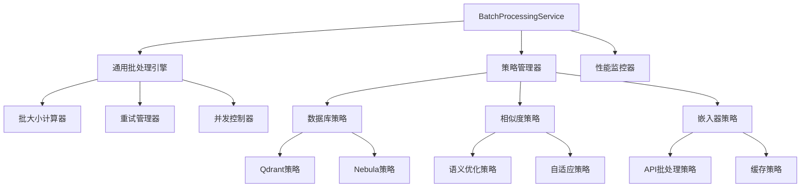

经过分析，`PerformanceOptimizerService` 的使用情况和批处理功能需求如下：

### 1. `PerformanceOptimizerService` 的实际使用情况

`PerformanceOptimizerService` 主要在以下核心服务中被使用：
- [`src/service/index/IndexService.ts`](src/service/index/IndexService.ts:221)：用于文件索引的批量处理和重试机制
- [`src/service/index/IndexingLogicService.ts`](src/service/index/IndexingLogicService.ts:63)：用于项目遍历和文件索引的性能优化
- [`src/database/graph/GraphDatabaseService.ts`](src/database/graph/GraphDatabaseService.ts:45)：用于图数据库读写查询的重试机制

该服务通过依赖注入在 [`src/core/registrars/BusinessServiceRegistrar.ts`](src/core/registrars/BusinessServiceRegistrar.ts:145) 中注册为单例。

### 2. 需要批处理功能的模块分析

系统中存在多个独立的批处理优化器实现，表明批处理功能在多个模块中都有需求：

1. **通用批处理优化器**:
   - [`src/service/optimization/BatchOptimizerService.ts`](src/service/optimization/BatchOptimizerService.ts:10) 实现了 `IBatchOptimizer` 接口，提供通用的批处理优化功能，被 Qdrant 和 Nebula 基础设施使用。

2. **数据库专用批处理器**:
   - [`src/database/qdrant/QdrantInfrastructure.ts`](src/database/qdrant/QdrantInfrastructure.ts:30) 使用 `BatchOptimizer` 处理向量数据批处理
   - [`src/database/nebula/NebulaInfrastructure.ts`](src/database/nebula/NebulaInfrastructure.ts:31) 使用 `BatchOptimizer` 处理图数据库批处理

3. **专用批处理优化器**:
   - [`src/service/optimization/VectorBatchOptimizer.ts`](src/service/optimization/VectorBatchOptimizer.ts:29) 专门用于向量操作的批处理优化
   - [`src/service/graph/utils/GraphBatchOptimizer.ts`](src/service/graph/utils/GraphBatchOptimizer.ts:36) 专门用于图数据库操作的批处理优化

### 3. 服务注入建议

当前系统存在功能重叠的问题：
- `PerformanceOptimizerService` 和 `BatchOptimizerService` 都提供了批处理、重试和性能监控功能
- 多个专用批处理器（`VectorBatchOptimizer`, `GraphBatchOptimizer`）与通用批处理器并存

**建议**：`PerformanceOptimizerService` 应该被保留并作为主要的性能优化服务，但需要：
1. **整合功能**：将 `BatchOptimizerService` 的配置管理和数据库特定优化功能合并到 `PerformanceOptimizerService` 中
2. **统一接口**：创建统一的批处理优化接口，让其他模块通过该接口使用批处理功能
3. **注入策略**：新模块应该注入 `PerformanceOptimizerService` 而不是创建新的批处理器，除非有特殊的批处理需求

这种架构可以避免功能重复，提高代码的可维护性。


---

## 完整的批处理服务整合分析与实施方案

基于对代码的全面分析，我发现系统中存在三个主要的批处理功能领域：

### 1. 当前批处理服务分析

#### A. 基础设施批处理服务
- **PerformanceOptimizerService**: 通用性能优化，包含重试、监控、内存管理
- **BatchOptimizerService**: 数据库特定的批处理优化，支持Qdrant和Nebula
- **VectorBatchOptimizer**: 向量操作专用批处理
- **GraphBatchOptimizer**: 图数据库操作专用批处理

#### B. 相似度计算批处理服务
- **BaseBatchCalculator**: 相似度批处理基类
- **SemanticOptimizedBatchCalculator**: 语义相似度优化，将O(n²)API调用优化为O(1)
- **AdaptiveBatchCalculator**: 自适应选择最优计算器
- **BatchCalculatorFactory**: 计算器工厂，智能选择最优策略

#### C. 嵌入器API批处理
- **BaseEmbedder**: 提供基础的批处理支持，包含并发控制和缓存
- **SiliconFlowEmbedder**: 具体的嵌入器实现，支持批量API调用

### 2. 功能重叠与特殊需求分析

#### 功能重叠
1. **批大小计算**: 所有服务都有自己的批大小计算逻辑
2. **重试机制**: 多个服务实现了相似的重试逻辑
3. **性能监控**: 重复的性能指标收集
4. **并发控制**: 重复的并发限制实现

#### 特殊需求
1. **语义相似度**: 需要将O(n²)的API调用优化为O(1)，这是关键优化点
2. **嵌入器API**: 需要考虑API限制、并发控制和缓存策略
3. **数据库操作**: 需要考虑不同数据库的特性（Qdrant vs Nebula）
4. **向量操作**: 需要考虑向量维度和内存使用

### 3. 统一批处理架构设计



### 4. 核心接口设计

```typescript
// 统一批处理服务接口
export interface IBatchProcessingService {
  // 通用批处理方法
  processBatches<T, R>(items: T[], processor: (batch: T[]) => Promise<R[]>, options?: BatchProcessingOptions): Promise<R[]>;
  
  // 特殊领域批处理方法
  processSimilarityBatch(contents: string[], strategy: ISimilarityStrategy, options?: SimilarityOptions): Promise<BatchSimilarityResult>;
  processEmbeddingBatch(inputs: EmbeddingInput[], embedder: Embedder, options?: EmbeddingOptions): Promise<EmbeddingResult[]>;
  processDatabaseBatch<T>(operations: T[], databaseType: DatabaseType, options?: DatabaseBatchOptions): Promise<BatchResult>;
  
  // 重试和监控
  executeWithRetry<T>(operation: () => Promise<T>, options?: RetryOptions): Promise<T>;
  executeWithMonitoring<T>(operation: () => Promise<T>, operationName: string): Promise<T>;
  
  // 配置和统计
  updateConfig(config: Partial<BatchProcessingConfig>): void;
  getPerformanceStats(context?: string): PerformanceStats;
}

// 批处理策略接口
export interface IBatchStrategy {
  calculateOptimalBatchSize(itemsCount: number, context?: BatchContext): number;
  shouldRetry(error: Error, attempt: number, context?: BatchContext): boolean;
  getRetryDelay(attempt: number, context?: BatchContext): number;
  adjustBatchSizeBasedOnPerformance(executionTime: number, batchSize: number, context?: BatchContext): number;
}

// 批处理上下文
export interface BatchContext {
  domain: 'database' | 'similarity' | 'embedding';
  subType?: string; // 'qdrant', 'nebula', 'semantic', 'api', etc.
  metadata?: Record<string, any>;
}
```

### 5. 实施方案

#### 阶段1: 创建统一批处理服务
1. **BatchProcessingService**: 整合所有批处理功能
2. **策略模式实现**: 为不同领域创建专门策略
3. **配置统一**: 统一管理所有批处理参数

#### 阶段2: 实现领域特定策略
1. **数据库策略**: 整合Qdrant和Nebula的特定需求
2. **相似度策略**: 保留语义优化的关键特性（O(n²)到O(1)）
3. **嵌入器策略**: 整合API限制和缓存策略

#### 阶段3: 迁移和整合
1. **依赖注入更新**: 替换所有现有批处理服务
2. **代码迁移**: 逐步迁移使用新服务
3. **测试验证**: 确保功能正确性和性能提升

### 6. 关键优化点保留

#### 语义相似度优化
- 保留`SemanticOptimizedBatchCalculator`的核心优化：将O(n²)API调用优化为O(1)
- 通过批量生成嵌入向量，然后本地计算相似度矩阵

#### 嵌入器API优化
- 保留`BaseEmbedder`的并发控制和缓存机制
- 整合API限制和重试策略

#### 数据库特定优化
- 保留不同数据库的特定配置和优化策略
- 统一接口但保持特定优化

### 7. 预期收益

1. **代码简化**: 从多个批处理服务减少到一个统一服务
2. **功能统一**: 所有批处理功能集中管理，避免重复
3. **性能提升**: 保留各领域的关键优化，同时提供更好的整体性能
4. **维护性**: 单一服务更容易维护和扩展
5. **配置简化**: 统一的配置系统，减少配置复杂度

这个方案既解决了功能重复问题，又保留了各领域的特殊优化需求，特别是语义相似度的关键优化。您觉得这个分析和方案如何？