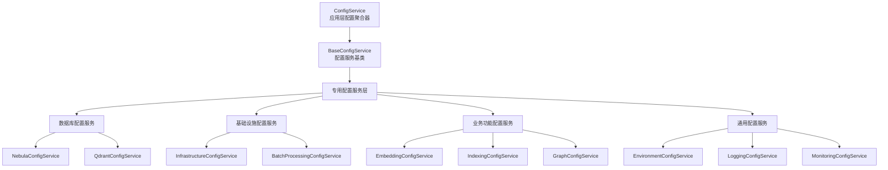
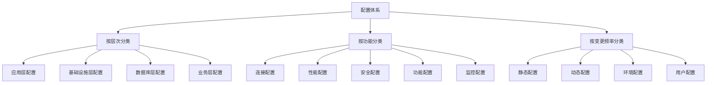
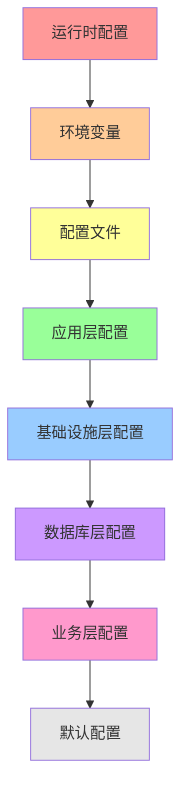

# 配置统一位置分析

## 概述

本文档深入分析项目中配置统一的最优位置，基于现有配置服务的职责边界、架构层次和可扩展性要求，提供配置统一化的最佳实践建议。

## 1. 现有配置服务职责和边界分析

### 1.1 配置服务层次结构



### 1.2 各配置服务职责分析

#### ConfigService（应用层配置聚合器）
- **职责**：聚合所有子配置服务，提供统一的应用配置视图
- **边界**：仅负责配置聚合，不处理具体配置逻辑
- **优势**：
  - 提供应用级别的配置统一入口
  - 支持配置的集中管理和初始化
  - 便于应用整体配置的序列化和持久化
- **局限**：
  - 配置项过多时，接口变得臃肿
  - 配置变更需要重新初始化整个服务
  - 缺乏配置的动态更新能力

#### BaseConfigService（配置服务基类）
- **职责**：提供配置服务的基础功能和通用模式
- **边界**：定义配置服务的标准接口和生命周期
- **优势**：
  - 统一配置服务的实现模式
  - 提供配置验证和懒加载机制
  - 支持配置的动态更新
- **局限**：
  - 抽象层次较高，缺乏具体的业务语义
  - 无法解决跨服务的配置冲突问题

#### 专用配置服务层
- **数据库配置服务**：
  - `NebulaConfigService`：Nebula 图数据库连接和操作配置
  - `QdrantConfigService`：Qdrant 向量数据库连接和操作配置
- **基础设施配置服务**：
  - `InfrastructureConfigService`：基础设施层的通用配置
  - `BatchProcessingConfigService`：批处理相关配置
- **业务功能配置服务**：
  - `EmbeddingConfigService`：嵌入模型相关配置
  - `IndexingConfigService`：索引处理配置
  - `GraphConfigService`：图处理配置
- **通用配置服务**：
  - `EnvironmentConfigService`：环境相关配置
  - `LoggingConfigService`：日志配置
  - `MonitoringConfigService`：监控配置

### 1.3 配置服务边界问题

#### 问题1：职责重叠
- `InfrastructureConfigService` 和 `NebulaConfigService` 都定义连接池配置
- `BatchProcessingConfigService` 和 `InfrastructureConfigService` 都定义批处理配置
- 多个服务定义相似的超时和重试配置

#### 问题2：依赖关系复杂
- `ConfigService` 依赖所有子配置服务，形成星型依赖
- 子配置服务之间存在隐式依赖关系
- 配置加载顺序不明确，可能导致初始化问题

#### 问题3：配置粒度不一致
- 有些配置服务过于细化（如 `EmbeddingConfigService`）
- 有些配置服务过于宽泛（如 `InfrastructureConfigService`）
- 缺乏统一的配置粒度标准

## 2. 不同配置统一方案评估

### 2.1 方案A：扩展 ConfigService（应用层统一）

#### 实现方式
```typescript
export class ConfigService {
  // 现有配置聚合功能
  
  // 新增配置冲突解决功能
  resolveConfigurationConflicts(): void {
    // 检测和解决配置冲突
  }
  
  // 新增配置优先级管理
  setConfigurationPriority(source: string, priority: number): void {
    // 设置配置源优先级
  }
  
  // 新增配置热更新
  updateConfiguration(path: string, value: any): void {
    // 动态更新配置
  }
}
```

#### 优势
- **统一入口**：所有配置通过 `ConfigService` 访问
- **全局视图**：可以查看和管理所有配置
- **易于集成**：现有代码改动最小
- **配置验证**：可以在应用层进行全局配置验证

#### 劣势
- **单点故障**：`ConfigService` 故障影响所有配置访问
- **性能瓶颈**：所有配置请求都需要经过应用层
- **复杂性增加**：应用层需要处理所有配置逻辑
- **循环依赖风险**：应用层配置服务可能依赖底层服务

#### 适用场景
- 中小型应用，配置项相对简单
- 配置变更不频繁的场景
- 对配置一致性要求较高的场景

### 2.2 方案B：增强 InfrastructureConfigService（基础设施层统一）

#### 实现方式
```typescript
export class InfrastructureConfigService {
  // 现有基础设施配置功能
  
  // 新增数据库配置统一管理
  getUnifiedDatabaseConfig(databaseType: DatabaseType): UnifiedDatabaseConfig {
    // 合并来自不同源的数据库配置
  }
  
  // 新增配置冲突检测
  detectConfigurationConflicts(): ConflictReport {
    // 检测配置冲突
  }
  
  // 新增配置协调功能
  coordinateConfiguration(): void {
    // 协调各配置服务的配置
  }
}
```

#### 优势
- **层次合理**：基础设施层统一管理基础设施相关配置
- **职责清晰**：专注于基础设施和数据库配置
- **性能优化**：配置访问更接近使用场景
- **扩展性好**：易于添加新的数据库类型配置

#### 劣势
- **范围限制**：只能统一基础设施相关配置
- **业务配置分离**：业务功能配置仍需其他方式管理
- **迁移成本**：需要修改现有数据库配置服务
- **复杂性**：需要处理多种数据库类型的配置差异

#### 适用场景
- 大型应用，基础设施配置复杂
- 多数据库类型支持的场景
- 对基础设施性能要求较高的场景

### 2.3 方案C：创建 ConfigurationCoordinator（协调器模式）

#### 实现方式
```typescript
export class ConfigurationCoordinator {
  constructor(
    private configServices: Map<string, BaseConfigService<any>>,
    private conflictResolver: ConflictResolver,
    private priorityManager: ConfigurationPriorityManager
  ) {}
  
  // 统一配置获取
  getUnifiedConfiguration(path: string): any {
    // 按优先级合并配置
  }
  
  // 配置冲突解决
  resolveConflicts(): void {
    // 自动解决配置冲突
  }
  
  // 配置变更通知
  notifyConfigurationChange(path: string, value: any): void {
    // 通知相关配置服务
  }
}
```

#### 优势
- **灵活性高**：可以协调多个配置服务
- **冲突解决**：专门处理配置冲突问题
- **可扩展**：易于添加新的配置服务
- **职责分离**：各配置服务保持独立性

#### 劣势
- **复杂性增加**：引入新的协调器组件
- **性能开销**：配置访问需要额外的协调逻辑
- **调试困难**：配置来源不明确，难以追踪
- **学习成本**：开发人员需要理解新的协调模式

#### 适用场景
- 复杂系统，配置服务众多
- 配置冲突问题严重的场景
- 需要灵活配置管理的场景

### 2.4 方案D：分层配置统一（混合模式）

#### 实现方式
```typescript
// 应用层配置统一
export class ApplicationConfigManager {
  constructor(
    private infrastructureConfig: InfrastructureConfigService,
    private businessConfigServices: Map<string, BaseConfigService<any>>
  ) {}
  
  getApplicationConfig(): ApplicationConfig {
    // 合并基础设施和业务配置
  }
}

// 基础设施层配置统一
export class InfrastructureConfigService {
  getUnifiedInfrastructureConfig(): UnifiedInfrastructureConfig {
    // 统一基础设施配置
  }
}

// 业务配置服务保持独立
export class EmbeddingConfigService extends BaseConfigService<EmbeddingConfig> {
  // 保持现有实现
}
```

#### 优势
- **职责清晰**：不同层次的配置分别管理
- **平衡性好**：兼顾统一性和灵活性
- **渐进式改进**：可以逐步实施
- **易于维护**：各层次配置相对独立

#### 劣势
- **复杂性**：需要维护多个配置层次
- **一致性挑战**：跨层次配置一致性难以保证
- **协调成本**：需要额外的协调机制
- **学习曲线**：开发人员需要理解分层模式

#### 适用场景
- 大型复杂系统
- 需要平衡统一性和灵活性的场景
- 团队规模较大的项目

## 3. 配置层次结构和分类分析

### 3.1 配置分类框架



### 3.2 按层次分类的配置

#### 应用层配置
- **特点**：影响整个应用的行为
- **示例**：日志级别、监控端口、功能开关
- **管理位置**：`ConfigService`
- **变更频率**：低

#### 基础设施层配置
- **特点**：影响基础设施组件的行为
- **示例**：缓存配置、批处理配置、性能阈值
- **管理位置**：`InfrastructureConfigService`
- **变更频率**：中等

#### 数据库层配置
- **特点**：影响数据库连接和操作
- **示例**：连接字符串、连接池大小、超时设置
- **管理位置**：各数据库配置服务
- **变更频率**：低

#### 业务层配置
- **特点**：影响具体业务功能
- **示例**：嵌入模型配置、索引策略、图处理参数
- **管理位置**：各业务配置服务
- **变更频率**：高

### 3.3 按功能分类的配置

#### 连接配置
- **范围**：数据库连接、外部服务连接
- **冲突点**：连接数、超时时间、重试策略
- **统一建议**：基础设施层统一管理

#### 性能配置
- **范围**：缓存、批处理、并发控制
- **冲突点**：缓存大小、批处理大小、并发数
- **统一建议**：基础设施层统一管理

#### 安全配置
- **范围**：认证、授权、加密
- **冲突点**：较少冲突，主要是配置缺失
- **统一建议**：应用层统一管理

#### 功能配置
- **范围**：业务功能开关、算法参数
- **冲突点**：较少冲突，主要是配置重复
- **统一建议**：业务层独立管理

#### 监控配置
- **范围**：日志、指标、告警
- **冲突点**：监控间隔、阈值设置
- **统一建议**：基础设施层统一管理

## 4. 可扩展性和维护性考虑

### 4.1 可扩展性要求

#### 新数据库类型支持
- **需求**：易于添加新的数据库类型配置
- **挑战**：配置模式的一致性和扩展性
- **解决方案**：定义统一的数据库配置接口

#### 新功能模块支持
- **需求**：新功能模块可以独立管理配置
- **挑战**：避免配置冲突和重复
- **解决方案**：提供配置注册和发现机制

#### 多环境支持
- **需求**：支持开发、测试、生产等多环境
- **挑战**：环境间配置差异管理
- **解决方案**：环境特定的配置覆盖机制

### 4.2 维护性考虑

#### 配置可读性
- **需求**：配置项名称清晰易懂
- **挑战**：配置项数量庞大，命名不一致
- **解决方案**：建立配置命名规范和文档

#### 配置可测试性
- **需求**：配置变更可以充分测试
- **挑战**：配置组合复杂，测试覆盖困难
- **解决方案**：配置验证和测试工具

#### 配置可监控性
- **需求**：配置变更可以被监控和审计
- **挑战**：配置来源分散，变更追踪困难
- **解决方案**：配置变更日志和通知机制

### 4.3 技术债务管理

#### 现有配置服务重构
- **策略**：渐进式重构，保持向后兼容
- **优先级**：先解决冲突严重的配置项
- **风险控制**：提供配置迁移工具和回滚机制

#### 配置标准化
- **目标**：建立统一的配置标准和最佳实践
- **措施**：配置模板、代码生成、自动化验证
- **推广**：团队培训和文档建设

## 5. 最优配置统一位置确定

### 5.1 评估维度和权重

| 评估维度 | 权重 | 说明 |
|---------|------|------|
| 解决冲突效果 | 30% | 能否有效解决现有配置冲突 |
| 实施复杂度 | 20% | 实施的技术难度和工作量 |
| 性能影响 | 15% | 对系统性能的影响程度 |
| 可维护性 | 15% | 长期维护的难易程度 |
| 可扩展性 | 10% | 未来扩展的便利程度 |
| 团队接受度 | 10% | 开发团队的学习和接受成本 |

### 5.2 方案评分矩阵

| 方案 | 解决冲突效果 | 实施复杂度 | 性能影响 | 可维护性 | 可扩展性 | 团队接受度 | 总分 |
|------|-------------|-----------|----------|----------|----------|-----------|------|
| A: 扩展 ConfigService | 7 | 8 | 6 | 6 | 5 | 9 | 6.7 |
| B: 增强 InfrastructureConfigService | 9 | 6 | 8 | 8 | 8 | 7 | 7.8 |
| C: 创建 ConfigurationCoordinator | 8 | 4 | 5 | 5 | 9 | 5 | 6.2 |
| D: 分层配置统一 | 9 | 7 | 7 | 9 | 8 | 8 | 8.1 |

### 5.3 推荐方案：分层配置统一（方案D）

基于评分矩阵和项目实际情况，推荐采用**分层配置统一**方案，原因如下：

#### 5.3.1 方案优势

1. **平衡性最佳**：
   - 在统一性和灵活性之间取得最佳平衡
   - 不同层次的配置分别管理，职责清晰
   - 避免了单一统一点的性能瓶颈

2. **渐进式改进**：
   - 可以分阶段实施，降低风险
   - 现有代码改动相对较小
   - 支持逐步迁移和验证

3. **可扩展性强**：
   - 易于添加新的配置层次
   - 支持不同层次的独立演进
   - 适应未来架构变化

4. **团队接受度高**：
   - 概念清晰，易于理解
   - 学习成本相对较低
   - 符合现有的分层架构思维

#### 5.3.2 具体实施策略

##### 第一阶段：基础设施层统一（1-2周）
```typescript
// 扩展 InfrastructureConfigService
export class InfrastructureConfigService {
  // 统一基础设施相关配置
  getUnifiedInfrastructureConfig(): UnifiedInfrastructureConfig {
    return {
      database: this.getUnifiedDatabaseConfig(),
      cache: this.getUnifiedCacheConfig(),
      batch: this.getUnifiedBatchConfig(),
      monitoring: this.getUnifiedMonitoringConfig()
    };
  }
  
  // 统一数据库配置
  private getUnifiedDatabaseConfig(): UnifiedDatabaseConfig {
    return {
      nebula: this.resolveNebulaConfig(),
      qdrant: this.resolveQdrantConfig()
    };
  }
  
  // 配置冲突解决
  private resolveNebulaConfig(): ResolvedNebulaConfig {
    const nebulaConfig = this.nebulaConfigService.loadConfig();
    const infraNebulaConfig = this.config.nebula;
    
    return this.mergeConfigurations(nebulaConfig, infraNebulaConfig);
  }
}
```

##### 第二阶段：应用层协调（2-3周）
```typescript
// 创建 ApplicationConfigCoordinator
export class ApplicationConfigCoordinator {
  constructor(
    private infrastructureConfig: InfrastructureConfigService,
    private businessConfigServices: Map<string, BaseConfigService<any>>
  ) {}
  
  // 获取统一的应用配置
  getUnifiedApplicationConfig(): UnifiedApplicationConfig {
    return {
      infrastructure: this.infrastructureConfig.getUnifiedInfrastructureConfig(),
      business: this.getUnifiedBusinessConfig()
    };
  }
  
  // 配置冲突检测和解决
  detectAndResolveConflicts(): ConflictReport {
    // 实现冲突检测和解决逻辑
  }
}
```

##### 第三阶段：配置热更新（3-4周）
```typescript
// 实现配置热更新机制
export class ConfigurationUpdateManager {
  // 配置变更通知
  notifyConfigurationChange(layer: string, path: string, value: any): void {
    // 通知相关配置服务
  }
  
  // 配置变更验证
  validateConfigurationChange(change: ConfigurationChange): ValidationResult {
    // 验证配置变更的合理性
  }
  
  // 配置变更应用
  applyConfigurationChange(change: ConfigurationChange): void {
    // 安全地应用配置变更
  }
}
```

#### 5.3.3 配置层次职责划分

| 配置层次 | 管理范围 | 统一策略 | 冲突解决 |
|---------|----------|----------|----------|
| 应用层 | 全局配置、功能开关 | ConfigService 聚合 | 优先级覆盖 |
| 基础设施层 | 连接、性能、监控 | InfrastructureConfigService 统一 | 配置合并 |
| 数据库层 | 数据库特定配置 | 专用配置服务独立 | 默认值覆盖 |
| 业务层 | 业务功能配置 | 业务配置服务独立 | 命名空间隔离 |

#### 5.3.4 配置优先级策略



## 6. 实施建议和风险控制

### 6.1 实施建议

#### 团队协作
- **配置管理团队**：负责配置统一化的设计和实施
- **业务团队**：提供业务配置需求和验证
- **运维团队**：负责部署和监控配置变更

#### 技术准备
- **配置文档**：建立完整的配置文档体系
- **测试工具**：开发配置验证和测试工具
- **监控机制**：建立配置变更监控和告警

#### 培训计划
- **概念培训**：分层配置统一的概念和原理
- **实践培训**：具体的实施方法和工具使用
- **最佳实践**：配置管理的最佳实践分享

### 6.2 风险控制

#### 技术风险
- **配置丢失**：实施前备份所有配置
- **服务中断**：分阶段实施，保持服务可用性
- **性能回归**：建立性能基准和监控

#### 业务风险
- **功能异常**：充分的测试验证
- **数据不一致**：配置一致性检查
- **用户体验**：灰度发布和快速回滚

#### 运维风险
- **部署复杂**：自动化部署工具
- **排查困难**：详细的日志和监控
- **回滚复杂**：一键回滚机制

## 7. 总结

配置统一是复杂系统架构中的重要问题，需要综合考虑多个因素：

1. **现状分析**：现有配置服务存在职责重叠、依赖关系复杂等问题
2. **方案评估**：分层配置统一方案在多个维度上表现最佳
3. **实施策略**：分阶段实施，从基础设施层开始，逐步扩展到应用层
4. **风险控制**：建立完善的风险控制机制，确保平稳过渡

通过采用分层配置统一方案，可以：
- 有效解决配置冲突问题
- 保持系统的灵活性和可扩展性
- 降低实施风险和团队学习成本
- 为未来的架构演进奠定基础

建议按照本文档提出的实施策略，分阶段推进配置统一化工作，确保系统的稳定性和可维护性。