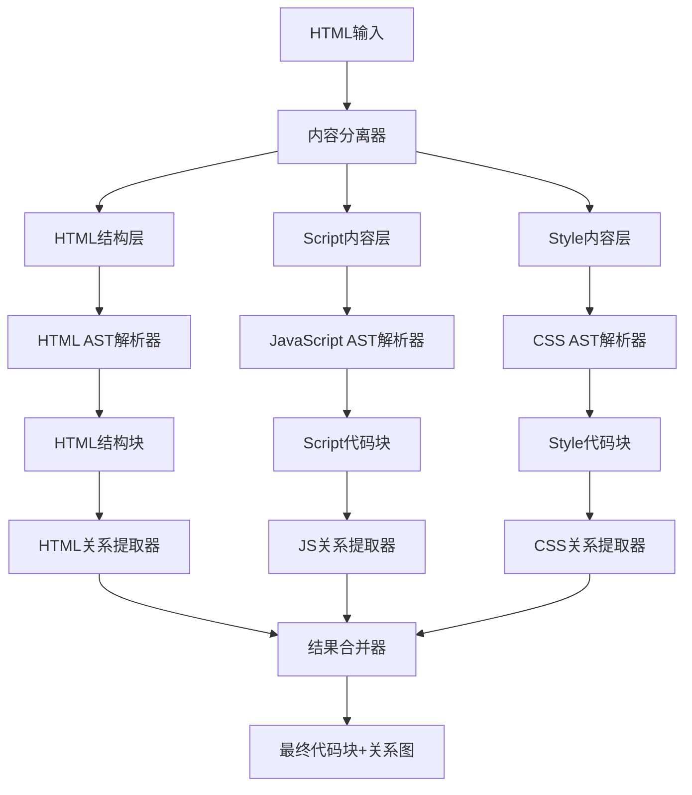

# HTML处理架构分析与优化方案

## 概述

本文档全面分析了当前HTML处理架构，包括LayeredHTMLStrategy、HTML查询规则、适配器实现，并提出了基于分层+AST混合处理的最终架构设计方案，同时设计了HTML关系提取机制以支持图索引。

## 1. 当前HTML处理架构分析

### 1.1 LayeredHTMLStrategy核心功能

LayeredHTMLStrategy采用三层处理架构：
- **结构层（Structure Layer）**：处理HTML的整体结构
- **脚本层（Script Layer）**：处理JavaScript代码块
- **样式层（Style Layer）**：处理CSS样式块

### 1.2 HTML查询规则分析

#### 1.2.1 查询规则结构
HTML查询规则分为两个主要文件：

**elements.ts** - 元素定义查询：
```typescript
; 文档结构
(document) @definition.document

; 带内容的元素（排除script和style）
(element
  (start_tag
    (tag_name) @name.definition.tag)
  (#not-eq? @name.definition.tag "script")
  (#not-eq? @name.definition.tag "style")) @definition.element

; Script元素
(script_element
  (start_tag
    (tag_name) @name.definition.script)
  (raw_text) @definition.script.content) @definition.script

; Style元素
(style_element
  (start_tag
    (tag_name) @name.definition.style)
  (raw_text) @definition.style.content) @definition.style
```

**attributes-content.ts** - 属性和内容查询：
```typescript
; 属性
(attribute
  (attribute_name) @name.definition.attribute) @definition.attribute

; 属性值
(attribute
  (attribute_name)
  (quoted_attribute_value
    (attribute_value) @definition.attribute_value))

; 文本内容
(text) @definition.text

; 原始文本（script/style标签内）
(raw_text) @definition.raw_text
```

#### 1.2.2 查询规则特点
1. **全面覆盖**：涵盖HTML文档结构、元素、属性、内容
2. **分类明确**：区分不同类型的HTML元素（表单、表格、列表、语义元素等）
3. **特殊处理**：对script和style元素有专门的查询规则
4. **内容提取**：支持提取元素内的文本和原始内容

### 1.3 HtmlLanguageAdapter分析

#### 1.3.1 核心功能
HtmlLanguageAdapter提供以下关键功能：
- **标准化查询结果**：将AST查询结果转换为标准化格式
- **Script/Style提取**：`extractScripts()`和`extractStyles()`方法
- **语言类型检测**：`detectScriptLanguage()`和`detectStyleType()`方法
- **HTML特定处理**：元素、属性、依赖关系提取

#### 1.3.2 适配器优化建议

**当前问题**：
1. 正则表达式性能可能在大文件中较差
2. 与LayeredHTMLStrategy强耦合
3. 缺乏关系提取功能

**优化方案**：
```typescript
interface IHtmlLanguageAdapter {
  // 现有功能
  normalize(queryResults: any[], queryType: string, language: string): Promise<StandardizedQueryResult[]>;
  extractScripts(content: string): ScriptBlock[];
  extractStyles(content: string): StyleBlock[];
  
  // 新增关系提取功能
  extractElementRelationships(ast: Parser.SyntaxNode): HtmlRelationship[];
  extractDependencyRelationships(ast: Parser.SyntaxNode): DependencyRelationship[];
  extractStructuralRelationships(ast: Parser.SyntaxNode): StructuralRelationship[];
  
  // 性能优化
  extractWithCache(content: string, extractionType: ExtractionType): Promise<any>;
}
```

## 2. HTML关系提取机制设计

### 2.1 关系类型定义

HTML文档中的关系可以分为以下几类：

#### 2.1.1 结构关系（Structural Relationships）
- **父子关系**：元素包含关系
- **兄弟关系**：同级元素关系
- **祖先关系**：深层嵌套关系

#### 2.1.2 依赖关系（Dependency Relationships）
- **资源依赖**：src、href属性引用的外部资源
- **脚本依赖**：JavaScript文件之间的依赖
- **样式依赖**：CSS文件之间的依赖

#### 2.1.3 引用关系（Reference Relationships）
- **ID引用**：通过id属性建立的引用
- **类引用**：通过class属性建立的引用
- **名称引用**：通过name属性建立的引用

#### 2.1.4 语义关系（Semantic Relationships）
- **表单关系**：表单元素之间的关系
- **表格关系**：表格元素之间的关系
- **导航关系**：导航元素之间的关系

### 2.2 关系提取实现

关系提取器不直接参与tree-sitter解析，故应当效仿src\service\parser\core\normalization\adapters\c-utils，通过独立的工具类实现。但关系模式不需要与编程语言一致

#### 2.2.1 结构关系提取
```typescript
class StructuralRelationshipExtractor {
  extractRelationships(ast: Parser.SyntaxNode): StructuralRelationship[] {
    const relationships: StructuralRelationship[] = [];
    
    // 提取父子关系
    this.extractParentChildRelationships(ast, relationships);
    
    // 提取兄弟关系
    this.extractSiblingRelationships(ast, relationships);
    
    return relationships;
  }
  
  private extractParentChildRelationships(
    node: Parser.SyntaxNode, 
    relationships: StructuralRelationship[]
  ): void {
    if (node.type === 'element' && node.children) {
      for (const child of node.children) {
        if (child.type === 'element') {
          relationships.push({
            type: 'parent-child',
            source: this.getElementId(node),
            target: this.getElementId(child),
            metadata: {
              sourceTag: this.getTagName(node),
              targetTag: this.getTagName(child)
            }
          });
          
          // 递归处理子元素
          this.extractParentChildRelationships(child, relationships);
        }
      }
    }
  }
}
```

#### 2.2.2 依赖关系提取
```typescript
class DependencyRelationshipExtractor {
  extractRelationships(ast: Parser.SyntaxNode): DependencyRelationship[] {
    const relationships: DependencyRelationship[] = [];
    
    // 提取资源依赖
    this.extractResourceDependencies(ast, relationships);
    
    // 提取脚本依赖
    this.extractScriptDependencies(ast, relationships);
    
    return relationships;
  }
  
  private extractResourceDependencies(
    node: Parser.SyntaxNode, 
    relationships: DependencyRelationship[]
  ): void {
    if (node.type === 'attribute') {
      const attrName = this.getAttributeName(node);
      const attrValue = this.getAttributeValue(node);
      
      if (['src', 'href', 'data-src'].includes(attrName) && attrValue) {
        relationships.push({
          type: 'resource-dependency',
          source: this.getElementId(node.parent),
          target: attrValue,
          metadata: {
            attribute: attrName,
            resourceType: this.getResourceType(attrValue)
          }
        });
      }
    }
    
    // 递归处理子节点
    if (node.children) {
      for (const child of node.children) {
        this.extractResourceDependencies(child, relationships);
      }
    }
  }
}
```

#### 2.2.3 引用关系提取
```typescript
class ReferenceRelationshipExtractor {
  extractRelationships(ast: Parser.SyntaxNode): ReferenceRelationship[] {
    const relationships: ReferenceRelationship[] = [];
    
    // 提取ID引用
    this.extractIdReferences(ast, relationships);
    
    // 提取类引用
    this.extractClassReferences(ast, relationships);
    
    return relationships;
  }
  
  private extractIdReferences(
    node: Parser.SyntaxNode, 
    relationships: ReferenceRelationship[]
  ): void {
    // 查找id属性
    const idAttr = this.findAttribute(node, 'id');
    if (idAttr) {
      const elementId = this.getElementId(node);
      const idValue = this.getAttributeValue(idAttr);
      
      // 查找对该ID的引用
      this.findIdReferences(ast, idValue, elementId, relationships);
    }
    
    // 递归处理子节点
    if (node.children) {
      for (const child of node.children) {
        this.extractIdReferences(child, relationships);
      }
    }
  }
  
  private findIdReferences(
    ast: Parser.SyntaxNode, 
    idValue: string, 
    targetId: string,
    relationships: ReferenceRelationship[]
  ): void {
    // 查找for属性引用
    if (ast.type === 'attribute' && this.getAttributeName(ast) === 'for') {
      const forValue = this.getAttributeValue(ast);
      if (forValue === idValue) {
        relationships.push({
          type: 'id-reference',
          source: this.getElementId(ast.parent),
          target: targetId,
          metadata: {
            referenceType: 'for-attribute',
            referencedId: idValue
          }
        });
      }
    }
    
    // 递归查找
    if (ast.children) {
      for (const child of ast.children) {
        this.findIdReferences(child, idValue, targetId, relationships);
      }
    }
  }
}
```

### 2.3 关系提取器集成

```typescript
class HtmlRelationshipExtractor {
  private structuralExtractor: StructuralRelationshipExtractor;
  private dependencyExtractor: DependencyRelationshipExtractor;
  private referenceExtractor: ReferenceRelationshipExtractor;
  
  constructor() {
    this.structuralExtractor = new StructuralRelationshipExtractor();
    this.dependencyExtractor = new DependencyRelationshipExtractor();
    this.referenceExtractor = new ReferenceRelationshipExtractor();
  }
  
  extractAllRelationships(ast: Parser.SyntaxNode): HtmlRelationship[] {
    const relationships: HtmlRelationship[] = [];
    
    // 并行提取各类关系
    const [structural, dependency, reference] = await Promise.all([
      this.structuralExtractor.extractRelationships(ast),
      this.dependencyExtractor.extractRelationships(ast),
      this.referenceExtractor.extractRelationships(ast)
    ]);
    
    relationships.push(...structural, ...dependency, ...reference);
    
    return relationships;
  }
}
```

## 3. 最终期望架构设计

### 3.1 分层+AST混合处理架构

基于前面的分析，最终架构应该结合LayeredHTMLStrategy的内容分离能力和ASTCodeSplitter的精确解析优势：



### 3.2 核心组件设计

#### 3.2.1 混合HTML处理器
```typescript
class HybridHTMLProcessor {
  private contentSeparator: ContentSeparator;
  private astParserFactory: ASTParserFactory;
  private relationshipExtractor: HtmlRelationshipExtractor;
  
  async process(content: string): Promise<ProcessingResult> {
    // 1. 内容分离
    const separated = await this.contentSeparator.separate(content);
    
    // 2. 并行AST解析
    const [htmlResult, scriptResults, styleResults] = await Promise.all([
      this.parseHTMLStructure(separated.html),
      this.parseScriptContent(separated.scripts),
      this.parseStyleContent(separated.styles)
    ]);
    
    // 3. 关系提取
    const relationships = await this.extractRelationships(
      htmlResult.ast,
      scriptResults,
      styleResults
    );
    
    // 4. 结果合并
    const chunks = this.mergeResults(
      htmlResult.chunks,
      scriptResults.flatMap(r => r.chunks),
      styleResults.flatMap(r => r.chunks)
    );
    
    return {
      chunks,
      relationships,
      success: true,
      strategy: 'hybrid-html-ast'
    };
  }
}
```

#### 3.2.2 增强的HTML适配器
```typescript
class HtmlLanguageAdapter implements IHtmlLanguageAdapter {
  private relationshipExtractor: HtmlRelationshipExtractor;
  private cache: Map<string, any>;
  
  async normalizeWithRelationships(
    queryResults: any[], 
    queryType: string, 
    language: string,
    ast: Parser.SyntaxNode
  ): Promise<StandardizedQueryResultWithRelationships[]> {
    const results = await this.normalize(queryResults, queryType, language);
    
    // 提取关系
    const relationships = await this.relationshipExtractor.extractAllRelationships(ast);
    
    // 将关系附加到相关结果
    return results.map(result => ({
      ...result,
      relationships: relationships.filter(rel => 
        this.isRelationshipRelevant(rel, result)
      )
    }));
  }
  
  private isRelationshipRelevant(
    relationship: HtmlRelationship, 
    result: StandardizedQueryResult
  ): boolean {
    // 判断关系是否与当前结果相关
    return relationship.source === result.nodeId || 
           relationship.target === result.nodeId;
  }
}
```

### 3.3 图索引集成

#### 3.3.1 HTML图节点生成
```typescript
class HtmlGraphNodeGenerator {
  generateNodes(
    chunks: CodeChunk[], 
    relationships: HtmlRelationship[]
  ): CodeGraphNode[] {
    const nodes: CodeGraphNode[] = [];
    
    // 为每个代码块生成节点
    for (const chunk of chunks) {
      const node = this.createNodeFromChunk(chunk);
      nodes.push(node);
    }
    
    // 为关系中的外部资源生成节点
    const externalNodes = this.createExternalResourceNodes(relationships);
    nodes.push(...externalNodes);
    
    return nodes;
  }
  
  private createNodeFromChunk(chunk: CodeChunk): CodeGraphNode {
    return {
      id: chunk.metadata.nodeId || this.generateNodeId(chunk),
      type: this.mapChunkTypeToNodeType(chunk.metadata.type),
      properties: {
        name: chunk.metadata.name || 'unnamed',
        content: chunk.content,
        language: chunk.metadata.language,
        filePath: chunk.metadata.filePath,
        startLine: chunk.startLine,
        endLine: chunk.endLine,
        complexity: chunk.metadata.complexity,
        // HTML特定属性
        tagName: chunk.metadata.tagName,
        elementType: chunk.metadata.elementType,
        attributes: chunk.metadata.attributes
      }
    };
  }
}
```

#### 3.3.2 HTML图关系生成
```typescript
class HtmlGraphRelationshipGenerator {
  generateRelationships(
    relationships: HtmlRelationship[],
    nodes: CodeGraphNode[]
  ): CodeGraphRelationship[] {
    const graphRelationships: CodeGraphRelationship[] = [];
    
    for (const rel of relationships) {
      const sourceNode = this.findNodeById(nodes, rel.source);
      const targetNode = this.findNodeById(nodes, rel.target);
      
      if (sourceNode && targetNode) {
        graphRelationships.push({
          id: this.generateRelationshipId(rel),
          type: this.mapRelationshipType(rel.type),
          sourceId: sourceNode.id,
          targetId: targetNode.id,
          properties: {
            relationshipType: rel.type,
            metadata: rel.metadata
          }
        });
      }
    }
    
    return graphRelationships;
  }
  
  private mapRelationshipType(htmlRelType: string): string {
    const mapping = {
      'parent-child': 'contains',
      'resource-dependency': 'depends_on',
      'id-reference': 'references',
      'class-reference': 'references',
      'script-dependency': 'imports',
      'style-dependency': 'imports'
    };
    
    return mapping[htmlRelType] || 'related_to';
  }
}
```

## 4. 实施建议

### 4.1 分阶段实施

#### 阶段1：关系提取器实现（2-3周）
1. 实现结构关系提取器
2. 实现依赖关系提取器
3. 实现引用关系提取器
4. 集成到HtmlLanguageAdapter

#### 阶段2：混合处理器开发（3-4周）
1. 开发内容分离器
2. 实现AST解析器工厂
3. 开发混合HTML处理器
4. 集成关系提取功能

#### 阶段3：图索引集成（2-3周）
1. 实现HTML图节点生成器
2. 实现HTML图关系生成器
3. 集成到图索引流程
4. 测试和优化

### 4.2 关键技术决策

1. **性能优化**：使用并行处理和缓存机制
2. **错误处理**：实现渐进式降级策略
3. **扩展性**：设计插件化的关系提取器
4. **兼容性**：保持与现有系统的兼容

### 4.3 预期收益

1. **精确性提升**：AST解析提供更精确的结构分析
2. **关系完整性**：全面的HTML关系提取支持图索引
3. **性能优化**：并行处理和缓存提高处理速度
4. **扩展性增强**：模块化设计支持未来扩展

## 5. 结论

通过分层+AST混合处理架构，结合全面的关系提取机制，我们可以：

1. **保持HTML特殊性**：继续支持内容分离和语言检测
2. **提升解析精度**：利用AST解析的精确性
3. **支持图索引**：提供完整的关系提取功能
4. **统一处理架构**：建立一致的处理流程

这种架构既解决了LayeredHTMLStrategy的复杂性问题，又满足了图索引对关系信息的需求，是HTML处理策略的最佳演进方向。