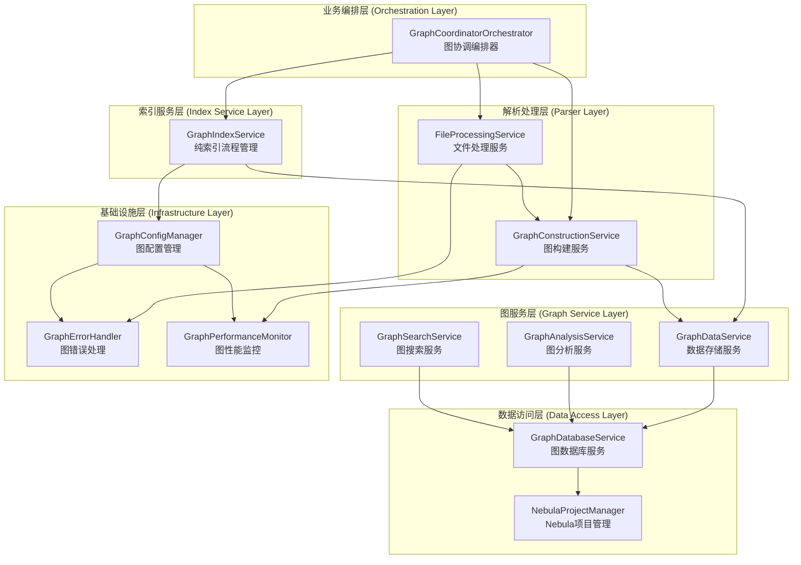

## 🏗️ 图服务架构重构方案设计

基于前面的分析，我提出一个**分层解耦的图服务架构重构方案**，彻底解决功能重复和职责不清问题。

### 📋 重构设计原则

1. **单一职责原则**: 每个服务只负责一个明确的职责
2. **依赖倒置原则**: 高层模块不依赖低层模块，都依赖抽象
3. **开闭原则**: 对扩展开放，对修改关闭
4. **接口隔离原则**: 客户端不应依赖它不需要的接口

### 🎯 新架构设计



### 🔧 具体重构方案

#### 1. **创建图协调编排器 (GraphCoordinatorOrchestrator)**

```typescript
interface IGraphCoordinatorOrchestrator {
  orchestrateGraphIndexing(projectPath: string, options?: GraphIndexOptions): Promise<string>;
  orchestrateGraphAnalysis(projectId: string, options?: AnalysisOptions): Promise<AnalysisResult>;
  orchestrateGraphSearch(query: GraphSearchQuery): Promise<SearchResult>;
}

@injectable()
export class GraphCoordinatorOrchestrator implements IGraphCoordinatorOrchestrator {
  constructor(
    @inject(TYPES.GraphIndexService) private graphIndexService: IGraphIndexService,
    @inject(TYPES.FileProcessingService) private fileProcessingService: IFileProcessingService,
    @inject(TYPES.GraphConstructionService) private graphConstructionService: IGraphConstructionService,
    @inject(TYPES.GraphConfigManager) private configManager: IGraphConfigManager
  ) {}
  
  async orchestrateGraphIndexing(projectPath: string, options?: GraphIndexOptions): Promise<string> {
    // 1. 检查配置
    await this.configManager.validateGraphConfiguration();
    
    // 2. 处理文件
    const processedFiles = await this.fileProcessingService.processProjectFiles(projectPath, options);
    
    // 3. 构建图结构
    const graphData = await this.graphConstructionService.buildGraphStructure(processedFiles);
    
    // 4. 执行索引
    return await this.graphIndexService.startIndexing(projectPath, { ...options, graphData });
  }
}
```

#### 2. **重构GraphIndexService - 纯索引管理**

```typescript
@injectable()
export class GraphIndexService implements IIndexService {
  constructor(
    @inject(TYPES.GraphDataService) private graphDataService: IGraphDataService,
    @inject(TYPES.GraphConfigManager) private configManager: IGraphConfigManager,
    @inject(TYPES.ProjectStateManager) private projectStateManager: ProjectStateManager
  ) {}
  
  async startIndexing(projectPath: string, options?: IndexOptions): Promise<string> {
    // 移除文件处理逻辑，只负责索引流程管理
    const projectId = await this.projectIdManager.generateProjectId(projectPath);
    
    // 委托数据存储给GraphDataService
    if (options?.graphData) {
      await this.graphDataService.storeGraphData(options.graphData, { projectId });
    }
    
    await this.projectStateManager.startGraphIndexing(projectId, options?.totalFiles || 0);
    return projectId;
  }
  
  // 移除processGraphFiles方法 - 转移到GraphConstructionService
}
```

#### 3. **创建图构建服务 (GraphConstructionService)**

```typescript
interface IGraphConstructionService {
  buildGraphStructure(processedFiles: ProcessedFile[]): Promise<GraphData>;
  convertToGraphNodes(files: ProcessedFile[]): CodeGraphNode[];
  convertToGraphRelationships(files: ProcessedFile[]): CodeGraphRelationship[];
}

@injectable()
export class GraphConstructionService implements IGraphConstructionService {
  constructor(
    @inject(TYPES.GraphConfigManager) private configManager: IGraphConfigManager,
    @inject(TYPES.GraphPerformanceMonitor) private performanceMonitor: IPerformanceMonitor
  ) {}
  
  async buildGraphStructure(processedFiles: ProcessedFile[]): Promise<GraphData> {
    const operationId = this.performanceMonitor.startOperation('buildGraphStructure');
    
    try {
      const nodes = this.convertToGraphNodes(processedFiles);
      const relationships = this.convertToGraphRelationships(processedFiles);
      
      return { nodes, relationships, metadata: this.buildMetadata(processedFiles) };
    } finally {
      this.performanceMonitor.endOperation(operationId);
    }
  }
}
```

#### 4. **创建图配置管理器 (GraphConfigManager)**

```typescript
interface IGraphConfigManager {
  validateGraphConfiguration(): Promise<void>;
  isGraphEnabled(): boolean;
  getGraphConfiguration(): GraphConfiguration;
}

@injectable()
export class GraphConfigManager implements IGraphConfigManager {
  constructor(
    @inject(TYPES.ConfigService) private configService: ConfigService
  ) {}
  
  isGraphEnabled(): boolean {
    // 统一的环境变量检查逻辑
    return process.env.NEBULA_ENABLED?.toLowerCase() !== 'false';
  }
  
  async validateGraphConfiguration(): Promise<void> {
    if (!this.isGraphEnabled()) {
      throw new Error('Graph indexing is disabled via NEBULA_ENABLED environment variable');
    }
    
    // 其他配置验证逻辑
  }
}
```

#### 5. **统一基础设施组件**

```typescript
// 统一的错误处理
@injectable()
export class GraphErrorHandler {
  handleGraphError(error: Error, context: GraphOperationContext): void {
    // 统一的图相关错误处理逻辑
  }
}

// 统一的性能监控
@injectable()
export class GraphPerformanceMonitor implements IPerformanceMonitor {
  // 统一的图性能监控实现
}
```

### 📊 重构前后对比

| 方面 | 重构前 | 重构后 | 改进效果 |
|------|--------|--------|----------|
| **职责划分** | 混乱，一个服务多重职责 | 清晰，单一职责 | ✅ 符合SOLID原则 |
| **代码重复** | 严重，环境变量、错误处理重复 | 消除，统一基础设施 | ✅ DRY原则 |
| **依赖关系** | 紧耦合，循环依赖 | 松耦合，依赖抽象 | ✅ 可测试性提升 |
| **扩展性** | 困难，修改影响面大 | 容易，开闭原则 | ✅ 易于扩展 |
| **维护性** | 困难，职责不清 | 容易，职责明确 | ✅ 维护成本降低 |

### 🚀 实施计划

#### 阶段1: 基础设施统一化 (1-2周)
1. 创建GraphConfigManager，统一配置管理
2. 创建GraphErrorHandler，统一错误处理
3. 优化GraphPerformanceMonitor，统一性能监控

#### 阶段2: 服务重构 (2-3周)
1. 创建GraphConstructionService，承担图构建职责
2. 重构GraphIndexService，移除多余职责
3. 创建GraphCoordinatorOrchestrator，统一编排

#### 阶段3: 依赖解耦 (1-2周)
1. 引入抽象接口，实现依赖倒置
2. 重构依赖注入配置
3. 更新单元测试和集成测试

#### 阶段4: 验证和优化 (1周)
1. 性能测试和优化
2. 功能验证测试
3. 文档更新

### 🎯 预期收益

1. **代码质量提升**: 消除重复代码，提高可读性
2. **维护成本降低**: 职责清晰，修改影响范围可控
3. **扩展能力增强**: 新功能添加更容易
4. **测试覆盖率提升**: 单元测试更容易编写
5. **系统稳定性提升**: 错误处理和配置管理统一

这个重构方案彻底解决了图索引模块与图服务之间的功能重合问题，建立了清晰的架构边界，为系统的长期发展奠定了坚实基础。