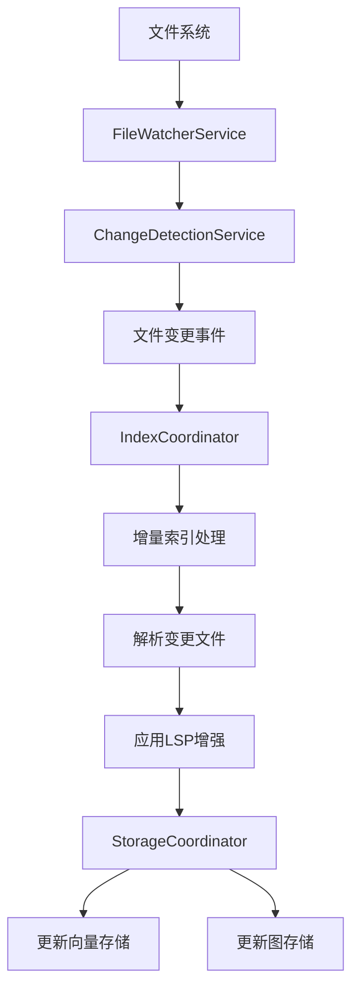

# 代码库索引热更新机制

## 概述

代码库索引热更新机制是本项目的核心功能之一，它允许在不重启服务的情况下实时更新代码索引。该机制通过文件系统监控、变更检测和增量索引处理来实现高效的实时索引更新。

## 架构设计

### 核心组件

1. **ChangeDetectionService** - 变更检测服务
   - 监控文件系统变化
   - 检测文件创建、修改和删除事件
   - 使用哈希比较确保只处理实际内容变化的文件

2. **FileWatcherService** - 文件监控服务
   - 基于chokidar实现文件系统监控
   - 提供文件变更事件回调机制
   - 支持多种文件系统事件处理

3. **IndexCoordinator** - 索引协调器
   - 处理增量索引更新
   - 协调解析、存储等索引流程
   - 提供索引状态管理

4. **StorageCoordinator** - 存储协调器
   - 管理向量和图数据库存储
   - 处理增量数据存储和删除
   - 确保跨数据库一致性

### 工作流程



## 详细实现

### 1. 文件监控与变更检测

文件监控通过`FileWatcherService`实现，使用chokidar库监控文件系统变化：

```typescript
// 启动文件监控
await fileWatcherService.startWatching({
  watchPaths: [projectPath],
  ignored: ['**/node_modules/**', '**/.git/**', '**/dist/**'],
  ignoreInitial: true,
  awaitWriteFinish: true
});
```

`ChangeDetectionService`处理文件变更事件，通过哈希比较确保只处理实际内容变化的文件：

```typescript
private async handleFileChanged(fileInfo: FileInfo): Promise<void> {
  const previousHash = this.fileHashes.get(fileInfo.relativePath);
  
  // 只有当文件内容实际发生变化时才处理
  if (previousHash !== fileInfo.hash) {
    // 处理文件变更
    this.processFileChange(fileInfo);
  }
}
```

### 2. 增量索引处理

`IndexCoordinator`负责处理增量索引更新：

```typescript
async processIncrementalChanges(
  projectPath: string,
  changes: FileChangeEvent[],
  options: IndexOptions = {}
): Promise<void> {
  // 分类处理不同类型的变更
  const createdFiles = changes.filter(c => c.type === 'created');
  const modifiedFiles = changes.filter(c => c.type === 'modified');
  const deletedFiles = changes.filter(c => c.type === 'deleted');
  
  // 先处理删除操作
  if (deletedFiles.length > 0) {
    await this.storageCoordinator.deleteFiles(deletedFiles);
  }
  
  // 处理创建和修改的文件
  const filesToProcess = [...createdFiles, ...modifiedFiles];
  if (filesToProcess.length > 0) {
    await this.processFiles(filesToProcess, options);
  }
}
```

### 3. 存储更新

`StorageCoordinator`负责将变更同步到向量和图数据库：

```typescript
async store(files: ParsedFile[], projectId?: string): Promise<StorageResult> {
  // 开始事务确保跨数据库一致性
  await this.transactionCoordinator.beginTransaction();
  
  try {
    // 存储到向量数据库
    const vectorResult = await this.vectorStorage.storeChunks(allChunks, options);
    
    // 存储到图数据库
    const graphResult = await this.graphStorage.storeChunks(allChunks, options);
    
    // 提交事务
    await this.transactionCoordinator.commitTransaction();
    
    return { success: true, chunksStored: allChunks.length, errors: [] };
  } catch (error) {
    // 回滚事务
    await this.transactionCoordinator.rollbackTransaction();
    throw error;
  }
}
```

## 性能优化

### 1. 防抖处理

为避免频繁的文件写入操作触发多次索引更新，系统实现了防抖机制：

```typescript
const timeoutId = setTimeout(async () => {
  // 处理文件变更
  await this.processFileChange(fileInfo);
}, this.options.debounceInterval);
```

### 2. 哈希比较

通过内容哈希比较，避免处理未实际变化的文件：

```typescript
const currentHash = await this.calculateFileHash(filePath);
if (previousHash !== currentHash) {
  // 只有哈希值不同时才处理
  await this.handleFileChange(filePath);
}
```

### 3. 批量处理

对于大量文件变更，系统支持批量处理以提高效率：

```typescript
const batchOptions: BatchOptions = {
  batchSize: this.configService.get('indexing')?.batchSize ?? 50,
  maxConcurrency: this.configService.get('indexing')?.maxConcurrency ?? 3
};

const parseResults = await this.batchProcessor.processInBatches(
  filePaths,
  async (batch: string[]) => {
    return await this.parserService.parseFiles(batch);
  },
  batchOptions
);
```

## 错误处理与恢复

### 1. 事务机制

通过事务确保跨数据库操作的一致性：

```typescript
await this.transactionCoordinator.beginTransaction();
try {
  // 执行存储操作
  await this.storageCoordinator.store(parsedFiles, projectId.hash);
  // 提交事务
  await this.transactionCoordinator.commitTransaction();
} catch (error) {
  // 回滚事务
  await this.transactionCoordinator.rollbackTransaction();
  throw error;
}
```

### 2. 重试机制

对于临时性错误，系统实现了重试机制：

```typescript
const pipelineResult = await this.asyncPipeline.execute({
  projectPath,
  options,
}, {
  retryAttempts: 3,
  retryDelay: 1000
});
```

## 配置选项

### 监控配置

```typescript
export interface ChangeDetectionOptions {
  debounceInterval?: number;        // 防抖间隔(ms)
  maxConcurrentOperations?: number; // 最大并发操作数
  enableHashComparison?: boolean;   // 是否启用哈希比较
  trackFileHistory?: boolean;       // 是否跟踪文件历史
  maxFileSizeBytes?: number;        // 最大文件大小限制
}
```

### 索引配置

```typescript
export interface IndexOptions {
  recursive?: boolean;              // 是否递归处理
  includePatterns?: string[];       // 包含文件模式
  excludePatterns?: string[];       // 排除文件模式
  maxFileSize?: number;             // 最大文件大小
  chunkSize?: number;               // 分块大小
  enableLSP?: boolean;              // 是否启用LSP增强
}
```

## 监控与状态

系统提供实时监控和状态查询功能：

```typescript
// 获取系统状态
const status = await indexCoordinator.getStatus();

// 获取索引处理统计
const stats = await indexCoordinator.getSnippetProcessingStatus(projectId);
```

## 使用示例

### 启动索引监控

```typescript
// 初始化变更检测服务
await changeDetectionService.initialize([projectPath]);

// 设置回调处理增量变更
changeDetectionService.setCallbacks({
  onFileCreated: (event) => handleFileCreated(event),
  onFileModified: (event) => handleFileModified(event),
  onFileDeleted: (event) => handleFileDeleted(event)
});
```

### 手动触发增量更新

```typescript
// 处理文件变更
const changes: FileChangeEvent[] = [
  { type: 'modified', path: '/path/to/file.ts', relativePath: 'file.ts' }
];

await indexCoordinator.processIncrementalChanges(projectPath, changes);
```

## 总结

代码库索引热更新机制通过文件监控、变更检测和增量处理实现了高效的实时索引更新。该机制具有以下特点：

1. **实时性** - 通过文件系统监控实现实时变更检测
2. **准确性** - 通过哈希比较确保只处理实际变化的文件
3. **一致性** - 通过事务机制确保跨数据库操作一致性
4. **可靠性** - 通过重试机制和错误处理确保系统稳定性
5. **可配置性** - 提供丰富的配置选项以适应不同场景

该机制为代码库索引服务提供了强大的实时更新能力，确保索引数据与源代码保持同步。