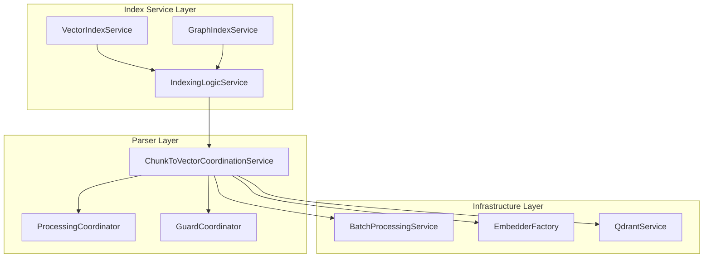
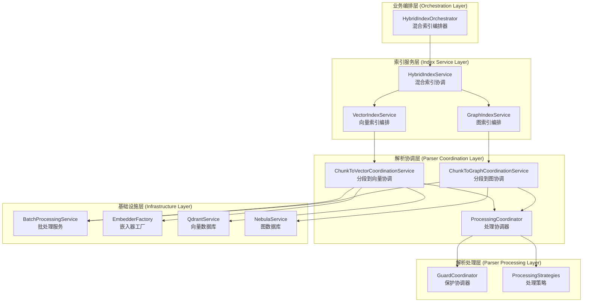

# 🏗️ src\service\index 目录职责分析与 ChunkToVectorCoordinationService.ts 关系设计

## 📋 分析概述

本文档分析 `src\service\index` 目录应当承担的职责，以及它与 `src\service\parser\ChunkToVectorCoordinationService.ts` 之间的关系设计，基于已有的图服务架构重构方案。

## 🎯 src\service\index 目录职责分析

### 1. **核心职责定义**

`src\service\index` 目录应当承担**索引编排和协调**的核心职责，具体包括：

#### 1.1 索引流程编排
- **统一索引入口**: 通过 `IIndexService` 接口提供统一的索引操作入口
- **索引生命周期管理**: 管理索引的启动、停止、状态查询和重新索引
- **多类型索引协调**: 协调向量索引和图索引的执行顺序和依赖关系

#### 1.2 索引服务抽象
- **接口标准化**: 通过 `IIndexService` 接口标准化不同类型索引服务的操作
- **服务类型管理**: 区分和管理向量索引、图索引和混合索引服务
- **配置统一化**: 统一管理不同索引服务的配置参数

#### 1.3 索引状态管理
- **状态跟踪**: 跟踪索引操作的进度、状态和错误信息
- **并发控制**: 管理多个索引操作的并发执行
- **资源管理**: 管理索引操作过程中的资源分配和释放

### 2. **当前架构分析**

#### 2.1 现有服务结构
```
src/service/index/
├── IIndexService.ts          # 统一索引接口定义
├── IndexService.ts           # VectorIndexService的别名（向后兼容）
├── VectorIndexService.ts     # 向量索引服务实现
├── GraphIndexService.ts      # 图索引服务实现
├── HybridIndexService.ts     # 混合索引服务实现
├── IndexingLogicService.ts   # 索引逻辑服务
├── StorageCoordinatorService.ts # 存储协调服务
└── shared/                   # 共享服务组件
```

#### 2.2 职责分布分析

| 服务 | 当前职责 | 建议职责 | 问题分析 |
|------|----------|----------|----------|
| **VectorIndexService** | 向量索引全流程管理 | 向量索引编排和状态管理 | 包含过多底层实现细节 |
| **GraphIndexService** | 图索引全流程管理 | 图索引编排和状态管理 | 包含过多底层实现细节 |
| **HybridIndexService** | 混合索引协调 | 混合索引编排和协调 | 职责相对清晰 |
| **IndexingLogicService** | 文件处理和存储逻辑 | 应拆分为更专业的服务 | 职责过于庞杂 |
| **StorageCoordinatorService** | 存储操作协调 | 存储层协调 | 职责相对清晰 |

## 🔗 ChunkToVectorCoordinationService.ts 关系分析

### 1. **当前职责分析**

`ChunkToVectorCoordinationService.ts` 当前承担的职责：

#### 1.1 代码分段协调
- **文件处理**: 读取文件内容并委托给 `ProcessingCoordinator` 进行智能处理
- **分段策略**: 完全委托给 `ProcessingCoordinator` 和 `GuardCoordinator` 进行策略管理
- **降级处理**: 通过 `GuardCoordinator` 提供多级降级处理机制

#### 1.2 向量转换协调
- **嵌入操作**: 协调代码块到向量嵌入的转换过程
- **批处理优化**: 使用 `BatchProcessingService` 优化嵌入操作
- **向量点生成**: 将处理后的代码块转换为向量点格式

### 2. **与 Index Service 的关系分析**

#### 2.1 当前依赖关系


#### 2.2 关系问题分析

1. **职责重叠**: `IndexingLogicService` 和 `ChunkToVectorCoordinationService` 在文件处理上有职责重叠
2. **依赖混乱**: `IndexingLogicService` 直接依赖 `ChunkToVectorCoordinationService`，违反了分层架构原则
3. **抽象缺失**: 缺乏清晰的抽象层来定义索引服务和解析服务之间的接口

## 🎯 重构设计方案

### 1. **架构重构原则**

基于 SOLID 原则和已有的图服务架构重构方案，提出以下设计原则：

1. **单一职责原则**: 每个服务只负责一个明确的职责
2. **依赖倒置原则**: 高层模块不依赖低层模块，都依赖抽象
3. **开闭原则**: 对扩展开放，对修改关闭
4. **接口隔离原则**: 客户端不应依赖它不需要的接口

### 2. **新架构设计**



### 3. **具体重构方案**

#### 3.1 创建混合索引编排器 (HybridIndexOrchestrator)

```typescript
interface IHybridIndexOrchestrator {
  orchestrateHybridIndexing(projectPath: string, options?: HybridIndexOptions): Promise<string>;
  orchestrateVectorIndexing(projectPath: string, options?: VectorIndexOptions): Promise<string>;
  orchestrateGraphIndexing(projectPath: string, options?: GraphIndexOptions): Promise<string>;
}

@injectable()
export class HybridIndexOrchestrator implements IHybridIndexOrchestrator {
  constructor(
    @inject(TYPES.HybridIndexService) private hybridIndexService: HybridIndexService,
    @inject(TYPES.VectorIndexService) private vectorIndexService: VectorIndexService,
    @inject(TYPES.GraphIndexService) private graphIndexService: GraphIndexService
  ) {}
  
  async orchestrateHybridIndexing(projectPath: string, options?: HybridIndexOptions): Promise<string> {
    // 1. 检查配置和环境
    // 2. 决定索引策略
    // 3. 协调向量索引和图索引的执行
    // 4. 监控整体进度和状态
  }
}
```

#### 3.2 重构 VectorIndexService - 纯编排职责

```typescript
@injectable()
export class VectorIndexService implements IIndexService {
  constructor(
    @inject(TYPES.ChunkToVectorCoordinationService) private coordinationService: ChunkToVectorCoordinationService,
    @inject(TYPES.ProjectStateManager) private projectStateManager: ProjectStateManager,
    @inject(TYPES.QdrantService) private qdrantService: QdrantService
  ) {}
  
  async startIndexing(projectPath: string, options?: IndexOptions): Promise<string> {
    // 1. 项目状态管理
    // 2. 委托文件处理给 ChunkToVectorCoordinationService
    // 3. 委托向量存储给 QdrantService
    // 4. 状态跟踪和错误处理
  }
  
  // 移除所有文件处理逻辑，专注于编排
}
```

#### 3.3 增强 ChunkToVectorCoordinationService - 明确职责边界

```typescript
interface IChunkToVectorCoordinationService {
  processFilesForEmbedding(files: string[], projectPath: string, options?: ProcessingOptions): Promise<VectorPoint[]>;
  processFileForEmbedding(filePath: string, projectPath: string, options?: ProcessingOptions): Promise<VectorPoint[]>;
}

@injectable()
export class ChunkToVectorCoordinationService implements IChunkToVectorCoordinationService {
  constructor(
    @inject(TYPES.ProcessingCoordinator) private processingCoordinator: ProcessingCoordinator,
    @inject(TYPES.GuardCoordinator) private guardCoordinator: GuardCoordinator,
    @inject(TYPES.BatchProcessingService) private batchProcessingService: BatchProcessingService,
    @inject(TYPES.EmbedderFactory) private embedderFactory: EmbedderFactory
  ) {}
  
  async processFilesForEmbedding(files: string[], projectPath: string, options?: ProcessingOptions): Promise<VectorPoint[]> {
    // 1. 批量处理文件
    // 2. 委托给 ProcessingCoordinator 进行智能分段
    // 3. 委托给 EmbedderFactory 进行嵌入操作
    // 4. 返回标准化的向量点格式
  }
}
```

#### 3.4 创建 ChunkToGraphCoordinationService

```typescript
interface IChunkToGraphCoordinationService {
  processFilesForGraph(files: string[], projectPath: string, options?: GraphProcessingOptions): Promise<GraphData>;
}

@injectable()
export class ChunkToGraphCoordinationService implements IChunkToGraphCoordinationService {
  constructor(
    @inject(TYPES.ProcessingCoordinator) private processingCoordinator: ProcessingCoordinator,
    @inject(TYPES.GraphDataMappingService) private graphMappingService: GraphDataMappingService,
    @inject(TYPES.NebulaService) private nebulaService: NebulaService
  ) {}
  
  async processFilesForGraph(files: string[], projectPath: string, options?: GraphProcessingOptions): Promise<GraphData> {
    // 1. 批量处理文件
    // 2. 委托给 ProcessingCoordinator 进行智能分段
    // 3. 委托给 GraphDataMappingService 进行图数据映射
    // 4. 返回标准化的图数据格式
  }
}
```

### 4. **接口标准化设计**

#### 4.1 统一的协调服务接口

```typescript
interface ICoordinationService<TInput, TOutput> {
  process(input: TInput, options?: any): Promise<TOutput>;
  batchProcess(inputs: TInput[], options?: any): Promise<TOutput[]>;
}

interface IVectorCoordinationService extends ICoordinationService<FileInfo, VectorPoint> {
  processFilesForEmbedding(files: string[], projectPath: string, options?: ProcessingOptions): Promise<VectorPoint[]>;
}

interface IGraphCoordinationService extends ICoordinationService<FileInfo, GraphData> {
  processFilesForGraph(files: string[], projectPath: string, options?: GraphProcessingOptions): Promise<GraphData>;
}
```

#### 4.2 统一的索引服务接口

```typescript
interface IIndexService {
  startIndexing(projectPath: string, options?: IndexOptions): Promise<string>;
  stopIndexing(projectId: string): Promise<boolean>;
  getIndexStatus(projectId: string): IndexStatus | null;
  reindexProject(projectPath: string, options?: IndexOptions): Promise<string>;
}

interface IIndexOrchestrator {
  orchestrateIndexing(projectPath: string, options?: OrchestrationOptions): Promise<OrchestrationResult>;
  monitorProgress(operationId: string): Promise<ProgressInfo>;
  handleErrors(operationId: string, error: Error): Promise<void>;
}
```

## 📊 重构前后对比

### 1. **职责划分对比**

| 方面 | 重构前 | 重构后 | 改进效果 |
|------|--------|--------|----------|
| **Index Service** | 包含文件处理、向量转换、存储等全流程 | 专注于索引编排和状态管理 | ✅ 单一职责 |
| **ChunkToVectorCoordination** | 协调分段和向量转换 | 明确的分段到向量转换协调职责 | ✅ 职责清晰 |
| **依赖关系** | IndexingLogicService 直接依赖 ChunkToVectorCoordination | 通过接口和抽象层解耦 | ✅ 依赖倒置 |
| **扩展性** | 添加新的索引类型需要修改多个服务 | 通过编排器模式易于扩展 | ✅ 开闭原则 |

### 2. **架构质量对比**

| 指标 | 重构前 | 重构后 | 改进效果 |
|------|--------|--------|----------|
| **代码重复** | IndexingLogicService 和 VectorIndexService 有重复逻辑 | 消除重复，统一协调服务 | ✅ DRY原则 |
| **测试复杂度** | 难以单独测试各个组件 | 每个服务职责单一，易于测试 | ✅ 可测试性 |
| **维护成本** | 修改一个功能可能影响多个服务 | 修改影响范围可控 | ✅ 可维护性 |
| **性能优化** | 难以针对特定环节优化 | 可以针对不同层次进行优化 | ✅ 性能可控 |

## 🚀 实施计划

### 阶段1: 接口定义和抽象 (1周)
1. 定义统一的协调服务接口
2. 定义统一的索引编排器接口
3. 创建依赖注入配置

### 阶段2: 服务重构 (2-3周)
1. 重构 VectorIndexService，移除文件处理逻辑
2. 重构 GraphIndexService，移除文件处理逻辑
3. 创建 ChunkToGraphCoordinationService
4. 创建 HybridIndexOrchestrator

### 阶段3: 依赖解耦 (1-2周)
1. 更新依赖注入配置
2. 重构 IndexingLogicService，移除重复职责
3. 更新单元测试和集成测试

### 阶段4: 验证和优化 (1周)
1. 性能测试和优化
2. 功能验证测试
3. 文档更新

## 🎯 预期收益

1. **架构清晰**: 明确的职责边界和依赖关系
2. **易于维护**: 单一职责使得修改影响范围可控
3. **易于扩展**: 新的索引类型和协调策略易于添加
4. **性能优化**: 可以针对不同层次进行针对性优化
5. **测试友好**: 每个服务职责单一，易于单元测试

这个重构方案与已有的图服务架构重构方案保持一致，建立了清晰的分层架构，为系统的长期发展奠定了坚实基础。