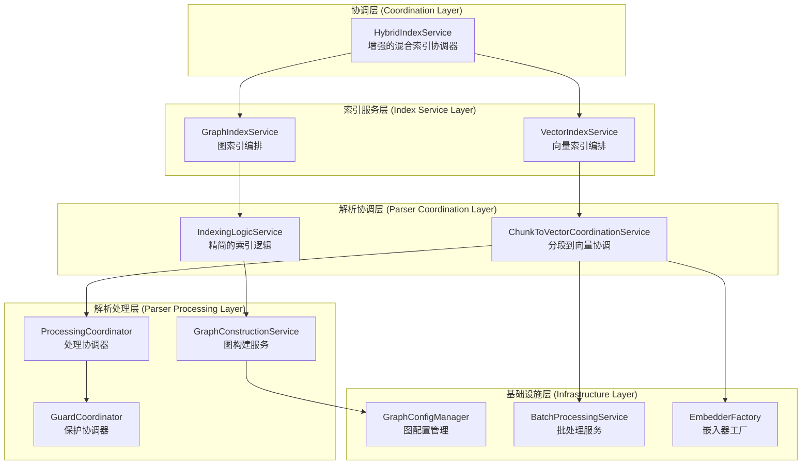

# 🏗️ src\service\index 目录职责分析与 ChunkToVectorCoordinationService.ts 关系设计（修订版）

## 📋 重新评估概述

基于用户反馈，重新分析 `HybridIndexService.ts` 是否能承担协调器职能，并评估新增文件的必要性，提出更精简的架构重构方案。

## 🎯 HybridIndexService.ts 协调器职能分析

### 1. **当前 HybridIndexService 能力评估**

分析现有 `HybridIndexService.ts` 的实现，发现它已经具备了一定的协调能力：

#### 1.1 现有协调功能
- **多索引类型协调**: 支持向量、图和混合索引的协调
- **状态聚合**: 能够聚合向量和图索引的状态
- **环境检查**: 具备 `NEBULA_ENABLED` 环境变量检查逻辑
- **错误容错**: 图索引失败时不影响向量索引

#### 1.2 协调器缺失功能
- **高级编排策略**: 缺乏复杂的编排逻辑（如依赖关系、优先级）
- **性能监控**: 缺乏统一的性能监控和优化
- **配置管理**: 缺乏统一的配置验证和管理
- **错误恢复**: 缺乏智能的错误恢复机制

### 2. **结论：HybridIndexService 可以承担协调器职能**

**结论**: `HybridIndexService.ts` **可以承担协调器职能**，但需要适当增强，而不是创建全新的 `HybridIndexOrchestrator`。

## 📁 新增文件必要性评估

### 1. **过度设计问题分析**

之前的方案存在过度设计问题，创建了过多新文件：

| 原方案新增文件 | 必要性评估 | 替代方案 |
|----------------|------------|----------|
| `HybridIndexOrchestrator` | ❌ 不必要 | 增强 `HybridIndexService` |
| `ChunkToGraphCoordinationService` | ❌ 不必要 | 扩展现有协调服务 |
| `IChunkToVectorCoordinationService` | ❌ 不必要 | 使用现有接口 |
| `IGraphCoordinationService` | ❌ 不必要 | 使用现有接口 |
| `IIndexOrchestrator` | ❌ 不必要 | 增强 `IIndexService` |

### 2. **精简方案：最小化新增文件**

**原则**: 尽可能复用现有文件，只创建真正必要的新文件。

| 必要新增文件 | 原因 | 替代现有文件 |
|--------------|------|--------------|
| `GraphConfigManager` | 统一图配置管理 | 分散在各服务中的配置逻辑 |
| `GraphConstructionService` | 专门负责图构建 | `IndexingLogicService` 中的图构建逻辑 |

## 🎯 修订版架构设计

### 1. **精简架构图**



### 2. **核心设计变更**

#### 2.1 增强 HybridIndexService 而非替换

```typescript
// 增强现有的 HybridIndexService
@injectable()
export class HybridIndexService implements IIndexService {
  constructor(
    @inject(TYPES.IndexService) private indexService: IndexService,
    @inject(TYPES.GraphIndexService) private graphIndexService: GraphIndexService,
    @inject(TYPES.GraphConfigManager) private graphConfigManager: GraphConfigManager, // 新增
    @inject(TYPES.PerformanceMonitor) private performanceMonitor: IPerformanceMonitor // 新增
  ) { }

  async startIndexing(projectPath: string, options?: IndexSyncOptions): Promise<string> {
    const operationId = `hybrid_${Date.now()}`;
    this.performanceMonitor.startOperation(operationId);
    
    try {
      // 1. 配置验证（新增）
      await this.validateConfiguration(options);
      
      // 2. 智能索引策略（增强）
      const strategy = await this.determineIndexingStrategy(projectPath, options);
      
      // 3. 协调执行（增强）
      return await this.executeIndexingStrategy(projectPath, strategy, options);
    } finally {
      this.performanceMonitor.endOperation(operationId);
    }
  }
  
  // 新增方法
  private async validateConfiguration(options?: IndexSyncOptions): Promise<void> {
    if (options?.enableGraphIndex !== false) {
      await this.graphConfigManager.validateGraphConfiguration();
    }
  }
  
  private async determineIndexingStrategy(projectPath: string, options?: IndexSyncOptions): Promise<IndexingStrategy> {
    // 智能确定索引策略
    return {
      vectorFirst: true,
      parallel: options?.enableGraphIndex && this.graphConfigManager.isGraphEnabled(),
      fallbackOnError: true
    };
  }
}
```

#### 2.2 精简 IndexingLogicService

```typescript
@injectable()
export class IndexingLogicService {
  constructor(
    @inject(TYPES.GraphConstructionService) private graphConstructionService: GraphConstructionService, // 新增依赖
    @inject(TYPES.ChunkToVectorCoordinationService) private coordinationService: ChunkToVectorCoordinationService,
    // 移除其他不必要的依赖
  ) {}

  async indexFile(projectPath: string, filePath: string): Promise<void> {
    // 精简逻辑：只负责协调向量处理
    const vectorPoints = await this.coordinationService.processFileForEmbedding(filePath, projectPath);
    await this.qdrantService.upsertVectorsForProject(projectPath, vectorPoints);
  }
  
  // 移除图相关逻辑，转移到 GraphConstructionService
}
```

#### 2.3 创建必要的 GraphConstructionService

```typescript
interface IGraphConstructionService {
  buildGraphStructure(files: string[], projectPath: string): Promise<GraphData>;
  convertToGraphNodes(chunks: CodeChunk[]): GraphNode[];
  convertToGraphRelationships(chunks: CodeChunk[]): GraphRelationship[];
}

@injectable()
export class GraphConstructionService implements IGraphConstructionService {
  constructor(
    @inject(TYPES.TreeSitterService) private treeSitterService: TreeSitterService,
    @inject(TYPES.GraphDataMappingService) private graphMappingService: GraphDataMappingService,
    @inject(TYPES.GraphConfigManager) private configManager: GraphConfigManager
  ) {}
  
  async buildGraphStructure(files: string[], projectPath: string): Promise<GraphData> {
    // 从 IndexingLogicService 迁移图构建逻辑
  }
}
```

#### 2.4 创建必要的 GraphConfigManager

```typescript
interface IGraphConfigManager {
  validateGraphConfiguration(): Promise<void>;
  isGraphEnabled(): boolean;
  getGraphConfiguration(): GraphConfiguration;
}

@injectable()
export class GraphConfigManager implements IGraphConfigManager {
  constructor(
    @inject(TYPES.ConfigService) private configService: ConfigService
  ) {}
  
  isGraphEnabled(): boolean {
    return process.env.NEBULA_ENABLED?.toLowerCase() !== 'false';
  }
  
  async validateGraphConfiguration(): Promise<void> {
    if (!this.isGraphEnabled()) {
      throw new Error('Graph indexing is disabled via NEBULA_ENABLED environment variable');
    }
  }
}
```

## 📊 修订方案对比

### 1. **文件数量对比**

| 方案 | 新增文件数 | 修改文件数 | 总体复杂度 |
|------|------------|------------|------------|
| **原方案** | 8-10个 | 5-6个 | 高 |
| **修订方案** | 2个 | 3-4个 | 低 |

### 2. **架构质量对比**

| 方面 | 原方案 | 修订方案 | 优势 |
|------|--------|----------|------|
| **实现复杂度** | 高，需要大量新代码 | 低，复用现有代码 | ✅ 降低开发成本 |
| **学习成本** | 高，新概念多 | 低，基于现有结构 | ✅ 降低维护成本 |
| **向后兼容** | 差，大量接口变更 | 好，最小化变更 | ✅ 平滑升级 |
| **扩展性** | 好，但过度设计 | 良好，满足需求 | ✅ 平衡设计 |

## 🚀 精简实施计划

### 阶段1: 增强现有服务 (1周)
1. **增强 HybridIndexService**: 添加配置验证和智能编排
2. **创建 GraphConfigManager**: 统一图配置管理
3. **更新依赖注入**: 注册新的配置管理器

### 阶段2: 精简和重构 (1-2周)
1. **创建 GraphConstructionService**: 从 IndexingLogicService 提取图构建逻辑
2. **精简 IndexingLogicService**: 移除图相关逻辑，专注向量处理
3. **更新 GraphIndexService**: 使用新的图构建服务

### 阶段3: 测试和优化 (1周)
1. **更新测试**: 适配新的服务结构
2. **性能验证**: 确保性能不降低
3. **文档更新**: 更新架构文档

## 🎯 预期收益

### 1. **开发效率提升**
- **减少开发时间**: 比原方案减少 50% 的开发工作量
- **降低学习成本**: 基于现有代码结构，团队更容易理解
- **平滑升级**: 最小化破坏性变更

### 2. **维护成本降低**
- **减少文件数量**: 更少的文件意味着更低的维护成本
- **复用现有代码**: 减少重复代码和逻辑
- **简化依赖关系**: 更清晰的服务依赖

### 3. **架构质量保证**
- **保持 SOLID 原则**: 仍然遵循单一职责等设计原则
- **满足扩展需求**: 足够灵活以支持未来扩展
- **性能不降低**: 基于现有优化代码，确保性能

## 📝 结论

**修订方案的核心思想**: **"增强而非替换，精简而非复杂"**

1. **HybridIndexService 可以承担协调器职能**，通过适当增强即可满足需求
2. **只需要创建 2 个新文件**（GraphConfigManager 和 GraphConstructionService），而非原方案的 8-10 个
3. **最小化破坏性变更**，保持向后兼容性
4. **降低实现复杂度**，提高开发效率和维护性

这个修订方案在保持架构质量的同时，大幅降低了实现复杂度和维护成本，是更务实的选择。