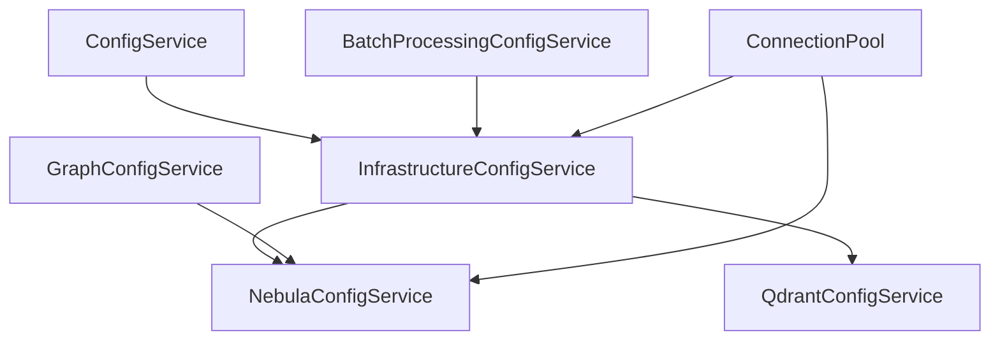
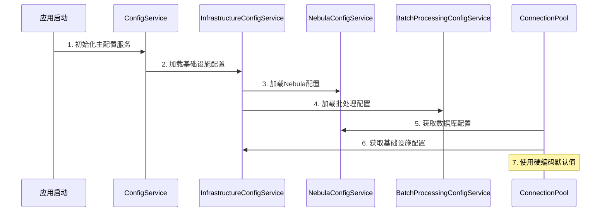
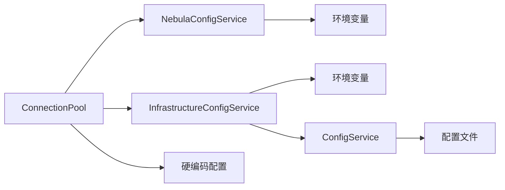
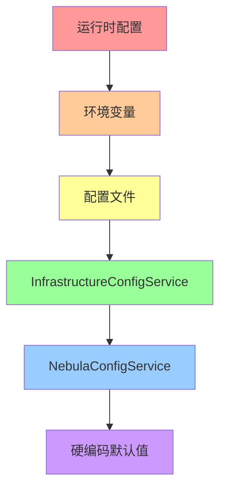

# 基础设施层与数据库层配置冲突分析

## 概述

本文档分析了项目中基础设施层与数据库层之间的配置冲突问题，提供了详细的冲突识别、优先级分析和解决方案设计。

## 1. 配置架构概览

### 1.1 配置服务层次结构

```
┌─────────────────────────────────────────────────────────────┐
│                    应用层配置                                │
│  ┌─────────────────┐  ┌─────────────────┐                  │
│  │ ConfigService   │  │ 各种专用配置服务  │                  │
│  │ (主配置服务)     │  │ (Embedding等)   │                  │
│  └─────────────────┘  └─────────────────┘                  │
└─────────────────────────────────────────────────────────────┘
                              │
┌─────────────────────────────────────────────────────────────┐
│                  基础设施层配置                              │
│  ┌─────────────────────────────────────────────────────────┐│
│  │        InfrastructureConfigService                     ││
│  │  ┌─────────────┐  ┌─────────────┐  ┌─────────────┐    ││
│  │  │   通用配置   │  │  Qdrant配置  │  │  Nebula配置  │    ││
│  │  └─────────────┘  └─────────────┘  └─────────────┘    ││
│  └─────────────────────────────────────────────────────────┘│
└─────────────────────────────────────────────────────────────┘
                              │
┌─────────────────────────────────────────────────────────────┐
│                   数据库层配置                               │
│  ┌─────────────────┐  ┌─────────────────┐                  │
│  │NebulaConfigService│  │QdrantConfigService│              │
│  │ (数据库特定配置)  │  │ (数据库特定配置)  │              │
│  └─────────────────┘  └─────────────────┘                  │
└─────────────────────────────────────────────────────────────┘
```

### 1.2 配置服务依赖关系



## 2. 配置冲突识别

### 2.1 连接池配置冲突

#### 冲突点1：最大连接数配置

| 配置服务 | 配置项 | 默认值 | 环境变量 | 使用位置 |
|---------|--------|--------|----------|----------|
| ConnectionPool | maxConnections | 10 | 无 | src/database/nebula/connection/ConnectionPool.ts:49 |
| NebulaConfigService | maxConnections | 10 | NEBULA_MAX_CONNECTIONS | src/config/service/NebulaConfigService.ts:43 |
| InfrastructureConfigService | maxConcurrentOperations | 5 | INFRA_NEBULA_BATCH_CONCURRENCY | src/infrastructure/config/InfrastructureConfigService.ts:147 |
| BatchProcessingConfigService | maxConcurrentOperations | 5 | MAX_CONCURRENT_OPERATIONS | src/config/service/BatchProcessingConfigService.ts:44 |

**冲突分析**：
- `ConnectionPool` 使用硬编码默认值
- `NebulaConfigService` 和 `InfrastructureConfigService` 都提供连接数配置
- `BatchProcessingConfigService` 提供批处理并发数配置
- 四个不同的配置项控制相似功能，容易造成混淆

#### 冲突点2：超时配置

| 配置服务 | 配置项 | 默认值 | 环境变量 | 使用位置 |
|---------|--------|--------|----------|----------|
| ConnectionPool | acquireTimeout | 30000 | 无 | ConnectionPool.ts:50 |
| ConnectionPool | idleTimeout | 300000 | 无 | ConnectionPool.ts:51 |
| NebulaConfigService | timeout | 30000 | NEBULA_TIMEOUT | NebulaConfigService.ts:42 |
| InfrastructureConfigService | processingTimeout | 300000 | INFRA_NEBULA_BATCH_PROCESSING_TIMEOUT | InfrastructureConfigService.ts:152 |
| BatchProcessingConfigService | processingTimeout | 300000 | PROCESSING_TIMEOUT | BatchProcessingConfigService.ts:48 |

**冲突分析**：
- 多个服务都定义了超时配置，但用途略有不同
- 环境变量命名不一致，容易造成配置错误
- 默认值存在差异，可能导致行为不一致

#### 冲突点3：重试配置

| 配置服务 | 配置项 | 默认值 | 环境变量 | 使用位置 |
|---------|--------|--------|----------|----------|
| NebulaConfigService | retryAttempts | 3 | NEBULA_RETRY_ATTEMPTS | NebulaConfigService.ts:44 |
| NebulaConfigService | retryDelay | 30000 | NEBULA_RETRY_DELAY | NebulaConfigService.ts:45 |
| InfrastructureConfigService | retryAttempts | 3 | INFRA_NEBULA_BATCH_RETRY_ATTEMPTS | InfrastructureConfigService.ts:153 |
| InfrastructureConfigService | retryDelay | 100 | INFRA_NEBULA_BATCH_RETRY_DELAY | InfrastructureConfigService.ts:154 |
| BatchProcessingConfigService | retryAttempts | 3 | RETRY_ATTEMPTS | BatchProcessingConfigService.ts:49 |
| BatchProcessingConfigService | retryDelay | 1000 | RETRY_DELAY | BatchProcessingConfigService.ts:50 |
| GraphConfigService | maxRetries | 3 | 无 | GraphConfigService.ts:17 |

**冲突分析**：
- 重试延迟配置差异巨大（100 vs 1000 vs 30000）
- 环境变量命名不统一
- 不同服务提供相似的重试配置

### 2.2 缓存配置冲突

| 配置服务 | 配置项 | 默认值 | 环境变量 | 使用位置 |
|---------|--------|--------|----------|----------|
| InfrastructureConfigService | defaultTTL | 30000 | INFRA_NEBULA_CACHE_TTL | InfrastructureConfigService.ts:129 |
| InfrastructureConfigService | maxEntries | 10000 | INFRA_NEBULA_CACHE_MAX_ENTRIES | InfrastructureConfigService.ts:130 |
| InfrastructureConfigService | cleanupInterval | 60000 | INFRA_NEBULA_CACHE_CLEANUP_INTERVAL | InfrastructureConfigService.ts:131 |

**冲突分析**：
- 缓存配置仅在基础设施层定义，数据库层缺乏对应配置
- 可能导致数据库层无法正确利用缓存功能

### 2.3 性能监控配置冲突

| 配置服务 | 配置项 | 默认值 | 环境变量 | 使用位置 |
|---------|--------|--------|----------|----------|
| InfrastructureConfigService | monitoringInterval | 1000 | INFRA_NEBULA_PERFORMANCE_INTERVAL | InfrastructureConfigService.ts:136 |
| InfrastructureConfigService | queryExecutionTime | 1000 | INFRA_NEBULA_PERFORMANCE_QUERY_TIMEOUT | InfrastructureConfigService.ts:140 |
| BatchProcessingConfigService | metricsInterval | 60000 | METRICS_INTERVAL | BatchProcessingConfigService.ts:56 |

**冲突分析**：
- 监控间隔配置差异巨大（1000ms vs 60000ms）
- 可能导致性能监控数据不一致

## 3. 配置优先级和依赖关系分析

### 3.1 当前配置加载顺序



### 3.2 配置优先级问题

#### 问题1：配置来源不明确
- `ConnectionPool` 优先使用硬编码配置
- `NebulaConfigService` 优先使用环境变量
- `InfrastructureConfigService` 使用多级降级策略

#### 问题2：配置覆盖机制不统一
- 有些配置服务支持运行时更新
- 有些配置服务只支持启动时加载
- 缺乏统一的配置变更通知机制

### 3.3 依赖关系复杂度



**依赖关系问题**：
- 循环依赖风险
- 配置服务之间缺乏清晰的边界
- 难以追踪配置的最终来源

## 4. 配置冲突解决方案设计

### 4.1 解决方案原则

1. **单一真实来源（Single Source of Truth）**
   - 每个配置项只能有一个权威来源
   - 避免多个服务定义相同的配置项

2. **配置分层清晰**
   - 基础设施层：提供通用配置和默认值
   - 数据库层：提供数据库特定的配置覆盖
   - 应用层：提供运行时配置和用户自定义

3. **向后兼容性**
   - 保持现有环境变量的支持
   - 提供配置迁移路径

### 4.2 配置统一化方案

#### 方案A：扩展 NebulaConfigService（推荐）

```typescript
// 扩展 NebulaConfig 接口
export interface NebulaConfig {
  // 现有基础配置
  host: string;
  port: number;
  username: string;
  password: string;
  timeout?: number;
  
  // 新增连接池配置
  connectionPool?: {
    minConnections?: number;
    maxConnections?: number;
    acquireTimeout?: number;
    idleTimeout?: number;
    healthCheckInterval?: number;
    healthCheckTimeout?: number;
    maxFailures?: number;
    retryDelay?: number;
  };
  
  // 新增缓存配置
  cache?: {
    defaultTTL?: number;
    maxEntries?: number;
    cleanupInterval?: number;
    enableStats?: boolean;
  };
  
  // 新增性能监控配置
  performance?: {
    monitoringInterval?: number;
    queryExecutionTime?: number;
    memoryUsage?: number;
    responseTime?: number;
  };
}
```

**优势**：
- 集中管理所有 Nebula 相关配置
- 利用现有的环境变量支持
- 保持与现有代码的兼容性

**实施步骤**：
1. 扩展 `NebulaConfigService` 配置接口
2. 添加相应的环境变量支持
3. 修改 `ConnectionPool` 使用配置服务
4. 逐步移除硬编码配置

#### 方案B：配置服务协调器

```typescript
export class ConfigurationCoordinator {
  constructor(
    private nebulaConfigService: NebulaConfigService,
    private infrastructureConfigService: InfrastructureConfigService,
    private batchProcessingConfigService: BatchProcessingConfigService
  ) {}
  
  getUnifiedNebulaConfig(): UnifiedNebulaConfig {
    // 按优先级合并配置
    const baseConfig = this.nebulaConfigService.loadConfig();
    const infraConfig = this.infrastructureConfigService.getDatabaseConfig(DatabaseType.NEBULA);
    const batchConfig = this.batchProcessingConfigService.loadConfig();
    
    return this.mergeConfigurations(baseConfig, infraConfig, batchConfig);
  }
  
  private mergeConfigurations(base: NebulaConfig, infra: any, batch: any): UnifiedNebulaConfig {
    // 实现配置合并逻辑
  }
}
```

**优势**：
- 保持现有配置服务的独立性
- 提供统一的配置访问接口
- 支持配置冲突检测和解决

### 4.3 配置优先级策略



**优先级说明**：
1. **运行时配置**：通过 API 动态设置的配置
2. **环境变量**：部署时设置的配置
3. **配置文件**：应用配置文件中的配置
4. **InfrastructureConfigService**：基础设施层提供的默认配置
5. **NebulaConfigService**：数据库层提供的特定配置
6. **硬编码默认值**：最后的降级选项

### 4.4 配置冲突检测机制

```typescript
export class ConfigurationConflictDetector {
  detectConflicts(configs: ConfigurationSource[]): ConflictReport {
    const conflicts: ConfigurationConflict[] = [];
    
    // 检查连接数配置冲突
    const connectionConfigs = configs.map(c => ({
      source: c.name,
      value: c.getConnectionConfig()?.maxConnections
    })).filter(c => c.value !== undefined);
    
    if (this.hasDuplicateValues(connectionConfigs)) {
      conflicts.push({
        type: 'CONNECTION_POOL_SIZE',
        sources: connectionConfigs,
        severity: 'HIGH',
        recommendation: '使用统一的连接池配置服务'
      });
    }
    
    return new ConflictReport(conflicts);
  }
}
```

## 5. 实施计划

### 5.1 阶段一：配置统一化（1-2周）

**目标**：消除硬编码配置，建立统一的配置来源

**任务**：
1. 扩展 `NebulaConfigService` 配置接口
2. 添加连接池、缓存、性能监控配置项
3. 修改 `ConnectionPool` 使用配置服务
4. 添加配置验证和默认值处理

**验收标准**：
- `ConnectionPool` 不再使用硬编码配置
- 所有配置项都有对应的环境变量支持
- 配置验证正常工作

### 5.2 阶段二：配置冲突解决（2-3周）

**目标**：解决现有配置冲突，建立清晰的配置边界

**任务**：
1. 实现配置优先级策略
2. 添加配置冲突检测机制
3. 统一环境变量命名规范
4. 更新文档和示例

**验收标准**：
- 配置冲突检测报告无严重冲突
- 环境变量命名规范统一
- 文档更新完整

### 5.3 阶段三：配置热更新（3-4周）

**目标**：支持配置的动态更新，提高系统灵活性

**任务**：
1. 实现配置变更通知机制
2. 添加配置热更新 API
3. 实现配置变更回滚机制
4. 添加配置变更审计日志

**验收标准**：
- 支持配置的动态更新
- 配置变更可以回滚
- 变更日志记录完整

## 6. 风险评估和缓解策略

### 6.1 风险识别

| 风险 | 影响 | 概率 | 缓解策略 |
|------|------|------|----------|
| 配置迁移导致服务中断 | 高 | 中 | 分阶段迁移，保持向后兼容 |
| 环境变量冲突 | 中 | 高 | 详细的配置验证和测试 |
| 性能回归 | 中 | 低 | 性能基准测试和监控 |
| 开发人员学习成本 | 低 | 中 | 详细的文档和培训 |

### 6.2 回滚计划

1. **配置备份**：在实施前备份所有现有配置
2. **版本控制**：使用 Git 管理配置变更
3. **快速回滚**：准备一键回滚脚本
4. **监控告警**：配置变更后密切监控系统状态

## 7. 总结

基础设施层与数据库层的配置冲突是项目架构演进过程中的自然结果。通过实施本文档提出的解决方案，可以：

1. **消除配置冲突**：建立统一的配置管理体系
2. **提高可维护性**：清晰的配置边界和优先级
3. **增强灵活性**：支持配置的动态更新
4. **降低运维成本**：统一的配置接口和文档

建议按照实施计划逐步推进，确保系统稳定性的同时完成配置体系的现代化改造。