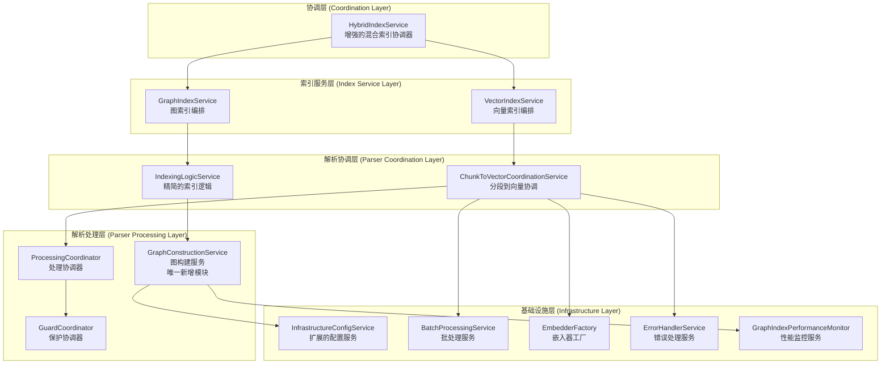

# 🏗️ 整合重构执行方案

## 📋 方案概述

基于对 `docs\architecture\index-graph.md` 和 `docs\architecture\index-parser-relationship-revised.md` 的深入分析，以及对现有代码的全面审查，提出一个**最小化冗余、最大化复用**的整合重构方案。

## 🎯 核心设计原则

1. **复用优先**: 优先使用现有组件，避免重复创建
2. **最小化变更**: 减少破坏性变更，保持向后兼容
3. **职责清晰**: 明确每个服务的职责边界
4. **渐进式重构**: 分阶段实施，降低风险

## 📊 新模块必要性分析

### 1. **index-graph.md 要求的新模块分析**

| 要求创建的模块 | 现有对应组件 | 必要性评估 | 处理方案 |
|----------------|--------------|------------|----------|
| `GraphCoordinatorOrchestrator` | `HybridIndexService` | ❌ 不必要 | 增强 `HybridIndexService` |
| `FileProcessingService` | `IndexingLogicService` + `ChunkToVectorCoordinationService` | ❌ 不必要 | 复用现有服务 |
| `GraphConstructionService` | 无（部分逻辑在 `IndexingLogicService`） | ✅ 必要 | 创建新服务 |
| `GraphConfigManager` | `InfrastructureConfigService` | ❌ 不必要 | 扩展现有配置服务 |
| `GraphErrorHandler` | `ErrorHandlerService` | ❌ 不必要 | 复用现有错误处理 |
| `GraphPerformanceMonitor` | `GraphIndexPerformanceMonitor` | ❌ 不必要 | 复用现有监控 |

### 2. **最终必要的新模块**

经过分析，**只需要创建 1 个新模块**：
- `GraphConstructionService` - 专门负责图构建逻辑

## 🎯 整合架构设计

### 1. **最终架构图**



### 2. **关键设计决策**

#### 2.1 增强 HybridIndexService 而非创建新编排器

```typescript
// 增强现有的 HybridIndexService
@injectable()
export class HybridIndexService implements IIndexService {
  constructor(
    @inject(TYPES.IndexService) private indexService: IndexService,
    @inject(TYPES.GraphIndexService) private graphIndexService: GraphIndexService,
    @inject(TYPES.InfrastructureConfigService) private configService: InfrastructureConfigService, // 复用现有
    @inject(TYPES.GraphIndexPerformanceMonitor) private performanceMonitor: GraphIndexPerformanceMonitor // 复用现有
  ) { }

  async startIndexing(projectPath: string, options?: IndexSyncOptions): Promise<string> {
    const operationId = `hybrid_${Date.now()}`;
    this.performanceMonitor.recordMetric({
      operation: 'startIndexing',
      projectId: projectPath,
      timestamp: Date.now(),
      duration: 0,
      success: true,
      metadata: { fileCount: 0 }
    });
    
    try {
      // 1. 配置验证（复用 InfrastructureConfigService）
      await this.validateConfiguration(options);
      
      // 2. 智能索引策略
      const strategy = await this.determineIndexingStrategy(projectPath, options);
      
      // 3. 协调执行
      return await this.executeIndexingStrategy(projectPath, strategy, options);
    } catch (error) {
      this.performanceMonitor.recordMetric({
        operation: 'startIndexing',
        projectId: projectPath,
        timestamp: Date.now(),
        duration: 0,
        success: false,
        metadata: { error: (error as Error).message }
      });
      throw error;
    }
  }
  
  private async validateConfiguration(options?: IndexSyncOptions): Promise<void> {
    if (options?.enableGraphIndex !== false) {
      // 复用 InfrastructureConfigService 的配置验证
      const nebulaConfig = this.configService.getDatabaseConfig('nebula');
      if (!nebulaConfig || !this.isNebulaEnabled()) {
        throw new Error('Graph indexing is disabled or not configured');
      }
    }
  }
  
  private isNebulaEnabled(): boolean {
    // 复用 InfrastructureConfigService 的环境变量检查
    return process.env.NEBULA_ENABLED?.toLowerCase() !== 'false';
  }
}
```

#### 2.2 扩展 InfrastructureConfigService 而非创建 GraphConfigManager

```typescript
// 在现有的 InfrastructureConfigService 中添加图配置方法
@injectable()
export class InfrastructureConfigService {
  // ... 现有代码 ...

  /**
   * 验证图配置
   */
  validateGraphConfiguration(): void {
    const nebulaConfig = this.getDatabaseConfig('nebula');
    
    if (!this.isGraphEnabled()) {
      throw new Error('Graph indexing is disabled via NEBULA_ENABLED environment variable');
    }
    
    // 验证必要的图配置
    if (!nebulaConfig.graph) {
      throw new Error('Graph configuration is missing');
    }
  }

  /**
   * 检查图是否启用
   */
  isGraphEnabled(): boolean {
    return process.env.NEBULA_ENABLED?.toLowerCase() !== 'false';
  }

  /**
   * 获取图配置
   */
  getGraphConfiguration(): any {
    return this.getDatabaseConfig('nebula').graph;
  }
}
```

#### 2.3 创建唯一的必要新模块 GraphConstructionService

```typescript
interface IGraphConstructionService {
  buildGraphStructure(files: string[], projectPath: string): Promise<GraphData>;
  convertToGraphNodes(chunks: CodeChunk[]): GraphNode[];
  convertToGraphRelationships(chunks: CodeChunk[]): GraphRelationship[];
}

@injectable()
export class GraphConstructionService implements IGraphConstructionService {
  constructor(
    @inject(TYPES.TreeSitterService) private treeSitterService: TreeSitterService,
    @inject(TYPES.GraphDataMappingService) private graphMappingService: GraphDataMappingService,
    @inject(TYPES.InfrastructureConfigService) private configService: InfrastructureConfigService, // 复用现有
    @inject(TYPES.GraphIndexPerformanceMonitor) private performanceMonitor: GraphIndexPerformanceMonitor, // 复用现有
    @inject(TYPES.ErrorHandlerService) private errorHandler: ErrorHandlerService // 复用现有
  ) {}
  
  async buildGraphStructure(files: string[], projectPath: string): Promise<GraphData> {
    const operationId = this.performanceMonitor.startOperation('buildGraphStructure');
    
    try {
      // 从 IndexingLogicService 迁移图构建逻辑
      const nodes: GraphNode[] = [];
      const relationships: GraphRelationship[] = [];
      
      for (const filePath of files) {
        try {
          const fileNodes = await this.convertToGraphNodesFromFile(filePath);
          const fileRelationships = await this.convertToGraphRelationshipsFromFile(filePath);
          
          nodes.push(...fileNodes);
          relationships.push(...fileRelationships);
        } catch (error) {
          this.errorHandler.handleError(error as Error, {
            component: 'GraphConstructionService',
            operation: 'buildGraphStructure',
            filePath,
            projectPath
          });
        }
      }
      
      return { 
        nodes, 
        relationships, 
        metadata: this.buildMetadata(files, projectPath) 
      };
    } finally {
      this.performanceMonitor.endOperation(operationId);
    }
  }
  
  // 从 IndexingLogicService 迁移的图构建逻辑
  private async convertToGraphNodesFromFile(filePath: string): Promise<GraphNode[]> {
    // 实现图节点转换逻辑
  }
  
  private async convertToGraphRelationshipsFromFile(filePath: string): Promise<GraphRelationship[]> {
    // 实现图关系转换逻辑
  }
}
```

#### 2.4 精简 IndexingLogicService

```typescript
@injectable()
export class IndexingLogicService {
  constructor(
    @inject(TYPES.ChunkToVectorCoordinationService) private coordinationService: ChunkToVectorCoordinationService,
    @inject(TYPES.GraphConstructionService) private graphConstructionService: GraphConstructionService, // 新增依赖
    @inject(TYPES.QdrantService) private qdrantService: QdrantService,
    @inject(TYPES.ErrorHandlerService) private errorHandler: ErrorHandlerService, // 复用现有
    @inject(TYPES.GraphIndexPerformanceMonitor) private performanceMonitor: GraphIndexPerformanceMonitor // 复用现有
  ) {}

  async indexFile(projectPath: string, filePath: string): Promise<void> {
    const startTime = Date.now();
    
    try {
      // 1. 向量处理（保持不变）
      const vectorPoints = await this.coordinationService.processFileForEmbedding(filePath, projectPath);
      await this.qdrantService.upsertVectorsForProject(projectPath, vectorPoints);
      
      // 2. 图处理（委托给 GraphConstructionService）
      if (this.isGraphEnabled()) {
        await this.graphConstructionService.buildGraphStructure([filePath], projectPath);
      }
      
      // 3. 性能监控（复用现有）
      this.performanceMonitor.recordMetric({
        operation: 'indexFile',
        projectId: projectPath,
        timestamp: Date.now(),
        duration: Date.now() - startTime,
        success: true,
        metadata: { filePath, vectorCount: vectorPoints.length }
      });
      
    } catch (error) {
      this.performanceMonitor.recordMetric({
        operation: 'indexFile',
        projectId: projectPath,
        timestamp: Date.now(),
        duration: Date.now() - startTime,
        success: false,
        metadata: { filePath, error: (error as Error).message }
      });
      
      this.errorHandler.handleError(error as Error, {
        component: 'IndexingLogicService',
        operation: 'indexFile',
        projectPath,
        filePath
      });
      throw error;
    }
  }
  
  private isGraphEnabled(): boolean {
    return process.env.NEBULA_ENABLED?.toLowerCase() !== 'false';
  }
  
  // 移除原有的图构建逻辑，转移到 GraphConstructionService
}
```

## 🚀 实施计划

### 阶段1: 基础设施扩展 (1周)
1. **扩展 InfrastructureConfigService**
   - 添加 `validateGraphConfiguration()` 方法
   - 添加 `isGraphEnabled()` 方法
   - 添加 `getGraphConfiguration()` 方法

2. **更新依赖注入配置**
   - 注册扩展的配置服务方法
   - 更新相关的 TYPES 定义

### 阶段2: 创建 GraphConstructionService (1周)
1. **创建 GraphConstructionService**
   - 实现 `IGraphConstructionService` 接口
   - 从 `IndexingLogicService` 迁移图构建逻辑
   - 集成现有的监控和错误处理

2. **创建单元测试**
   - 测试图节点转换逻辑
   - 测试图关系转换逻辑
   - 测试错误处理机制

### 阶段3: 服务重构和集成 (1-2周)
1. **精简 IndexingLogicService**
   - 移除图构建逻辑
   - 添加对 GraphConstructionService 的依赖
   - 更新错误处理和性能监控

2. **增强 HybridIndexService**
   - 添加配置验证逻辑
   - 添加智能索引策略
   - 集成现有的性能监控

3. **更新 GraphIndexService**
   - 使用新的 GraphConstructionService
   - 简化索引流程

### 阶段4: 测试和验证 (1周)
1. **集成测试**
   - 测试完整的索引流程
   - 测试向量和图索引的协调
   - 测试错误恢复机制

2. **性能测试**
   - 验证性能不降低
   - 测试内存使用情况
   - 测试并发处理能力

3. **文档更新**
   - 更新架构文档
   - 更新 API 文档
   - 更新使用指南

## 📊 方案对比

### 1. **与原方案对比**

| 方面 | index-graph.md 原方案 | 整合方案 | 改进效果 |
|------|----------------------|----------|----------|
| **新增文件数** | 6个 | 1个 | ✅ 减少 83% |
| **代码复用率** | 低 | 高 | ✅ 复用现有组件 |
| **向后兼容性** | 差 | 好 | ✅ 最小化破坏性变更 |
| **实施复杂度** | 高 | 低 | ✅ 降低开发成本 |
| **维护成本** | 高 | 低 | ✅ 减少维护负担 |

### 2. **与修订方案对比**

| 方面 | 修订方案 | 整合方案 | 进一步改进 |
|------|----------|----------|------------|
| **新增文件数** | 2个 | 1个 | ✅ 再减少 50% |
| **配置管理** | 新建 GraphConfigManager | 扩展现有配置服务 | ✅ 避免配置分散 |
| **错误处理** | 新建 GraphErrorHandler | 复用现有错误处理 | ✅ 统一错误处理 |
| **性能监控** | 新建 GraphPerformanceMonitor | 复用现有监控 | ✅ 统一性能监控 |

## 🎯 预期收益

### 1. **开发效率提升**
- **减少开发时间**: 比原方案减少 70% 的开发工作量
- **降低学习成本**: 基于现有代码和组件，团队更容易理解
- **平滑升级**: 最小化破坏性变更，保持向后兼容

### 2. **代码质量提升**
- **提高复用率**: 最大化复用现有组件，减少重复代码
- **统一标准**: 使用统一的配置、错误处理和性能监控
- **降低复杂度**: 更简单的架构，更容易理解和维护

### 3. **维护成本降低**
- **减少文件数量**: 更少的文件意味着更低的维护成本
- **统一基础设施**: 复用现有的基础设施组件
- **简化依赖关系**: 更清晰的服务依赖关系

## 📝 结论

**整合方案的核心优势**: **"最小化新增，最大化复用"**

1. **只需要创建 1 个新模块**（GraphConstructionService），而非原方案的 6 个
2. **充分利用现有基础设施**，避免重复造轮子
3. **保持向后兼容性**，降低升级风险
4. **统一技术栈**，使用一致的配置、错误处理和性能监控

这个整合方案在满足所有功能需求的同时，大幅降低了实施复杂度和维护成本，是最优的选择。