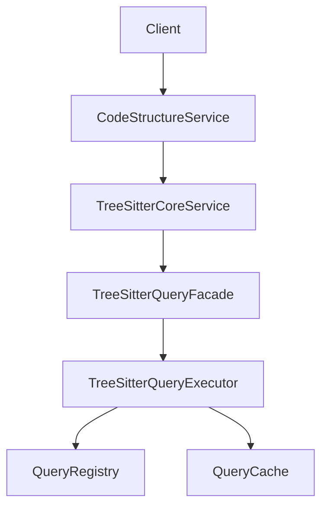

## TreeSitterCoreService.ts 架构职责重构分析

### 重构后设计概述

根据架构优化建议，TreeSitterCoreService.ts 文件的职责已重新定义，专注于通用处理逻辑，具体业务逻辑已移至专门的业务服务层。

**TreeSitterCoreService 保留的通用方法：**

**核心解析功能：**
- `parseCode(code, language): Promise<ParseResult>`
- `parseFile(filePath, code): Promise<ParseResult>`
- `detectLanguage(filePath): Promise<ParserLanguage>`

**通用查询接口：**
- `findNodeByType(ast: Parser.SyntaxNode, type: string): Parser.SyntaxNode[]` (同步)
- `findNodeByTypeAsync(ast: Parser.SyntaxNode, type: string): Promise<Parser.SyntaxNode[]>` (异步)
- `findNodesByTypes(ast: Parser.SyntaxNode, types: string[]): Parser.SyntaxNode[]` (同步)
- `queryTree(ast, queryPattern): QueryMatch[]`

**基础工具方法：**
- `getNodeText(node, sourceCode): string`
- `getNodeLocation(node): LocationInfo`
- `getNodeName(node): string`

**业务逻辑已移至 CodeStructureService：**
- `extractFunctions(ast, language): Promise<SyntaxNode[]>`
- `extractClasses(ast, language): Promise<SyntaxNode[]>`
- `extractImports(ast, language): Promise<SyntaxNode[]>`
- `extractExports(ast, language): Promise<SyntaxNode[]>`
- `extractImportNodes(ast): SyntaxNode[]`
- `extractImportNodesAsync(ast): Promise<SyntaxNode[]>`

### 重构优势

#### 1. 职责清晰
- **TreeSitterCoreService**: 专注于Tree-sitter解析和通用查询
- **TreeSitterQueryFacade**: 专注于查询接口简化
- **CodeStructureService**: 专注于具体的业务逻辑

#### 2. 可维护性提升
- 减少代码重复
- 降低耦合度
- 便于单元测试

#### 3. 扩展性增强
- 新增查询类型只需在TreeSitterQueryFacade中添加
- 新增业务逻辑只需在CodeStructureService中实现
- 核心解析逻辑保持稳定

### 调用链优化

重构后的调用链：
```
Client → CodeStructureService → TreeSitterCoreService → TreeSitterQueryFacade → TreeSitterQueryExecutor
```

### 架构层次



### 设计原则遵循

#### 1. 单一职责原则
- 每个组件只负责特定的职责
- TreeSitterCoreService不再承担业务逻辑实现

#### 2. 开闭原则
- 通过业务服务层扩展功能，核心服务保持稳定
- 便于添加新的代码结构提取功能

#### 3. 依赖倒置
- 高层模块不依赖低层模块，都依赖于抽象
- 业务逻辑与核心解析逻辑解耦

### 迁移策略

1. **渐进式重构**: 先创建CodeStructureService，逐步迁移业务逻辑
2. **保持向后兼容**: 在过渡期间保留TreeSitterCoreService中的方法，但标记为废弃
3. **更新文档**: 明确各组件的职责和使用场景
4. **测试覆盖**: 确保重构不影响现有功能

### 结论

重构后的架构更加清晰合理，遵循了单一职责原则，提高了代码的可维护性和可扩展性。TreeSitterCoreService专注于通用处理逻辑，而具体的业务逻辑由专门的业务服务层处理，这种设计使整个查询系统的架构更加健壮和易于维护。