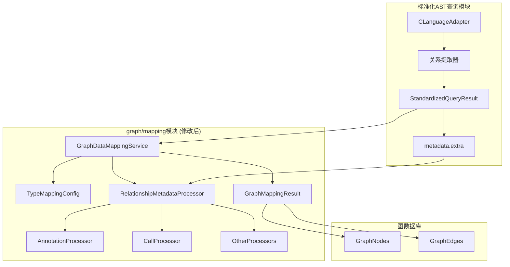

# Graph Mapping模块分析与修改方案

## 概述

本文档分析了当前标准化AST查询模块架构与`src\service\graph\mapping`模块之间的一致性问题，并提供了详细的修改方案。

## 1. 当前标准化AST查询模块架构分析

### 核心组件

1. **语言适配器层** (`src/service/parser/core/normalization/adapters/`)
   - [`BaseLanguageAdapter`](src/service/parser/core/normalization/BaseLanguageAdapter.ts): 抽象基类，定义通用接口
   - [`CLanguageAdapter`](src/service/parser/core/normalization/adapters/CLanguageAdapter.ts): C语言适配器实现
   - **c-utils**: C语言专用工具模块，包含各种关系提取器

2. **标准化类型系统** (`src/service/parser/core/normalization/types.ts`)
   - [`StandardizedQueryResult`](src/service/parser/core/normalization/types.ts:51): 核心标准化结果接口
   - [`SymbolInfo`](src/service/parser/core/normalization/types.ts:13): 符号信息接口
   - [`SymbolTable`](src/service/parser/core/normalization/types.ts:40): 符号表接口

3. **关系提取器** (`src/service/parser/core/normalization/adapters/c-utils/`)
   - [`CCallRelationshipExtractor`](src/service/parser/core/normalization/adapters/c-utils/CallRelationshipExtractor.ts): 调用关系提取
   - [`CDataFlowRelationshipExtractor`](src/service/parser/core/normalization/adapters/c-utils/DataFlowRelationshipExtractor.ts): 数据流关系提取
   - [`CInheritanceRelationshipExtractor`](src/service/parser/core/normalization/adapters/c-utils/InheritanceRelationshipExtractor.ts): 继承关系提取
   - 其他关系提取器...

### 关键设计原则

1. **确定性ID生成**: 使用[`generateDeterministicNodeId`](src/utils/deterministic-node-id.ts)确保节点ID的一致性
2. **统一类型映射**: 通过[`mapQueryTypeToStandardType`](src/service/parser/core/normalization/adapters/CLanguageAdapter.ts:80)将查询类型映射到标准类型
3. **关系元数据分离**: 关系特定元数据存储在[`metadata.extra`](src/service/parser/core/normalization/types.ts:84)字段中
4. **符号信息集成**: 通过[`symbolInfo`](src/service/parser/core/normalization/types.ts:88)字段直接提供符号信息

## 2. graph/mapping模块当前实现分析

### 核心组件

1. **主要映射服务** ([`GraphDataMappingService`](src/service/graph/mapping/GraphDataMappingService.ts))
   - 实现了[`IGraphDataMappingService`](src/service/graph/mapping/IGraphDataMappingService.ts)接口
   - 负责将标准化查询结果转换为图数据库节点和边

2. **接口定义** ([`IGraphDataMappingService`](src/service/graph/mapping/IGraphDataMappingService.ts))
   - 定义了图节点类型枚举[`GraphNodeType`](src/service/graph/mapping/IGraphDataMappingService.ts:7)
   - 定义了图关系类型枚举[`GraphRelationshipType`](src/service/graph/mapping/IGraphDataMappingService.ts:20)
   - 包含各种图节点和关系的接口定义

3. **语言节点类型映射** ([`LanguageNodeTypes`](src/service/graph/mapping/LanguageNodeTypes.ts))
   - 定义了不同语言的AST节点类型映射
   - 支持JavaScript、TypeScript、Python、Java、Rust、C/C++等多种语言

4. **关系提取器工厂** ([`RelationshipExtractorFactory`](src/service/graph/mapping/RelationshipExtractorFactory.ts))
   - 管理语言特定的关系提取器
   - 目前只实现了JavaScript关系提取器

### 关键方法分析

1. **[`mapToGraph`](src/service/graph/mapping/GraphDataMappingService.ts:137)方法**
   ```typescript
   async mapToGraph(
     filePath: string,
     standardizedNodes: StandardizedQueryResult[],
     ast: Parser.SyntaxNode
   ): Promise<GraphMappingResult>
   ```
   - 这是新的映射方法，直接处理标准化查询结果
   - 区分实体类型和关系类型，分别创建图节点和边

2. **类型判断方法**
   - [`isEntityType`](src/service/graph/mapping/GraphDataMappingService.ts:178): 判断是否为实体类型
   - [`isRelationshipType`](src/service/graph/mapping/GraphDataMappingService.ts:182): 判断是否为关系类型

3. **节点和边创建方法**
   - [`createVertexFromStandardizedNode`](src/service/graph/mapping/GraphDataMappingService.ts:186): 从标准化节点创建图顶点
   - [`createEdgeFromStandardizedNode`](src/service/graph/mapping/GraphDataMappingService.ts:198): 从标准化节点创建图边

## 3. 架构不一致性和潜在问题识别

### 主要不一致性问题

#### 3.1 关系类型支持不匹配

**问题**: 标准化AST查询模块支持的关系类型与graph/mapping模块支持的关系类型不匹配

**标准化模块支持的关系类型**:
- `call`, `data-flow`, `inheritance`, `implements`
- `annotation`, `creation`, `dependency`, `reference`
- `concurrency`, `lifecycle`, `semantic`, `control-flow`

**graph/mapping模块识别的关系类型**:
```typescript
// src/service/graph/mapping/GraphDataMappingService.ts:182
private isRelationshipType(type: StandardizedQueryResult['type']): boolean {
  return ['call', 'data-flow', 'inheritance', 'implements'].includes(type);
}
```

**影响**: 新增的关系类型（如`annotation`, `creation`等）会被错误地识别为实体类型，导致图结构错误。

#### 3.2 关系类型映射不完整

**问题**: [`mapRelationshipTypeToGraphType`](src/service/graph/mapping/GraphDataMappingService.ts:227)方法缺少对新关系类型的映射

**当前映射**:
```typescript
private mapRelationshipTypeToGraphType(relationshipType: string): GraphRelationshipType {
  const typeMapping: Record<string, GraphRelationshipType> = {
    'call': GraphRelationshipType.CALLS,
    'data-flow': GraphRelationshipType.DATA_FLOWS_TO,
    'inheritance': GraphRelationshipType.INHERITS,
    'implements': GraphRelationshipType.IMPLEMENTS,
  };
  return typeMapping[relationshipType] || GraphRelationshipType.USES;
}
```

**缺失的映射**:
- `annotation` → `GraphRelationshipType.ANNOTATES` (不存在)
- `creation` → `GraphRelationshipType.CREATES` (不存在)
- `dependency` → `GraphRelationshipType.DEPENDS_ON` (不存在)
- 其他新关系类型...

#### 3.3 关系元数据结构不一致

**问题**: 不同关系类型的元数据结构不同，但[`createEdgeFromStandardizedNode`](src/service/graph/mapping/GraphDataMappingService.ts:198)方法假设统一结构

**当前实现**:
```typescript
private createEdgeFromStandardizedNode(node: StandardizedQueryResult): GraphEdge | null {
  const relationshipData = node.metadata.extra;
  if (!relationshipData || !relationshipData.fromNodeId || !relationshipData.toNodeId) {
    this.logger.warn(`Skipping relationship node due to missing metadata: ${node.name}`);
    return null;
  }
  // ...
}
```

**实际元数据结构** (基于C语言适配器):
- 调用关系: `{ type: 'call', fromNodeId, toNodeId, callName, callType, ... }`
- 注解关系: `{ type: 'annotation', source, target, type: 'struct_tag'|'comment'|'directive', ... }`
- 创建关系: `{ type: 'creation', source, target, type: 'struct_instance'|'slice'|... }`

#### 3.4 实体类型识别不完整

**问题**: [`isEntityType`](src/service/graph/mapping/GraphDataMappingService.ts:178)方法可能遗漏某些实体类型

**当前实现**:
```typescript
private isEntityType(type: StandardizedQueryResult['type']): boolean {
  return ['function', 'class', 'method', 'import', 'variable', 'interface', 'type'].includes(type);
}
```

**可能遗漏的类型**: `union`, `enum` (在标准化类型中已定义)

### 潜在问题

#### 3.5 性能问题

1. **重复的符号解析**: graph/mapping模块中的[`RelationshipExtractorFactory`](src/service/graph/mapping/RelationshipExtractorFactory.ts)试图重新实现关系提取，但标准化模块已经完成了这项工作
2. **缓存不一致**: 两个不同的缓存系统可能导致数据不一致

#### 3.6 维护性问题

1. **代码重复**: 关系提取逻辑在两个地方实现（标准化模块和graph/mapping模块）
2. **职责不清**: graph/mapping模块既负责映射又负责关系提取，违反单一职责原则

#### 3.7 扩展性问题

1. **硬编码的类型判断**: 新增关系类型需要修改多个地方的硬编码列表
2. **缺乏统一的关系处理框架**: 每种关系类型可能需要特殊的处理逻辑

## 4. 修改方案设计

### 4.1 核心设计原则

1. **统一关系类型支持**: 确保graph/mapping模块支持所有标准化模块定义的关系类型
2. **灵活的元数据处理**: 支持不同关系类型的特定元数据结构
3. **可扩展的架构**: 便于添加新的关系类型和实体类型
4. **保持向后兼容**: 确保现有功能不受影响

### 4.2 具体修改方案

#### 4.2.1 扩展GraphRelationshipType枚举

**文件**: [`src/service/graph/mapping/IGraphDataMappingService.ts`](src/service/graph/mapping/IGraphDataMappingService.ts)

**修改内容**: 在[`GraphRelationshipType`](src/service/graph/mapping/IGraphDataMappingService.ts:20)枚举中添加新的关系类型

```typescript
export enum GraphRelationshipType {
  // 现有关系类型...
  CONTAINS = 'CONTAINS',
  IMPORTS = 'IMPORTS',
  CALLS = 'CALLS',
  INHERITS = 'INHERITS',
  IMPLEMENTS = 'IMPLEMENTS',
  USES = 'USES',
  DEFINES = 'DEFINES',
  
  // 新增关系类型
  // 注解/装饰关系
  ANNOTATES = 'ANNOTATES',
  DECORATES = 'DECORATES',
  TAGS = 'TAGS',
  
  // 创建关系
  CREATES = 'CREATES',
  INSTANTIATES = 'INSTANTIATES',
  ALLOCATES = 'ALLOCATES',
  
  // 依赖关系
  DEPENDS_ON = 'DEPENDS_ON',
  REFERENCES = 'REFERENCES',
  ACCESSES = 'ACCESSES',
  
  // 引用关系
  READS = 'READS',
  WRITES = 'WRITES',
  DECLARES = 'DECLARES',
  USES_VARIABLE = 'USES_VARIABLE',
  
  // 并发关系
  SYNCHRONIZES_WITH = 'SYNCHRONIZES_WITH',
  LOCKS = 'LOCKS',
  COMMUNICATES_WITH = 'COMMUNICATES_WITH',
  RACES_WITH = 'RACES_WITH',
  
  // 生命周期关系
  MANAGES_LIFECYCLE = 'MANAGES_LIFECYCLE',
  INITIALIZES = 'INITIALIZES',
  DESTROYS = 'DESTROYS',
  
  // 语义关系
  OVERRIDES = 'OVERRIDES',
  OVERLOADS = 'OVERLOADS',
  DELEGATES_TO = 'DELEGATES_TO',
  OBSERVES = 'OBSERVES',
  CONFIGURES = 'CONFIGURES',
  
  // 控制流关系
  CONTROLS = 'CONTROLS',
  HANDLES_EXCEPTION = 'HANDLES_EXCEPTION',
  CALLBACKS = 'CALLBACKS',
  AWAITS = 'AWAITS'
}
```

#### 4.2.2 更新关系类型判断方法

**文件**: [`src/service/graph/mapping/GraphDataMappingService.ts`](src/service/graph/mapping/GraphDataMappingService.ts)

**修改内容**: 更新[`isRelationshipType`](src/service/graph/mapping/GraphDataMappingService.ts:182)方法以支持所有关系类型

```typescript
private isEntityType(type: StandardizedQueryResult['type']): boolean {
  return [
    'function', 'class', 'method', 'import', 'variable', 
    'interface', 'type', 'union', 'enum'
  ].includes(type);
}

private isRelationshipType(type: StandardizedQueryResult['type']): boolean {
  return [
    'call', 'data-flow', 'inheritance', 'implements',
    'annotation', 'creation', 'dependency', 'reference',
    'concurrency', 'lifecycle', 'semantic', 'control-flow'
  ].includes(type);
}
```

#### 4.2.3 扩展关系类型映射方法

**修改内容**: 更新[`mapRelationshipTypeToGraphType`](src/service/graph/mapping/GraphDataMappingService.ts:227)方法

```typescript
private mapRelationshipTypeToGraphType(relationshipType: string): GraphRelationshipType {
  const typeMapping: Record<string, GraphRelationshipType> = {
    // 基础关系
    'call': GraphRelationshipType.CALLS,
    'data-flow': GraphRelationshipType.DATA_FLOWS_TO,
    'inheritance': GraphRelationshipType.INHERITS,
    'implements': GraphRelationshipType.IMPLEMENTS,
    
    // 注解/装饰关系
    'annotation': GraphRelationshipType.ANNOTATES,
    
    // 创建关系
    'creation': GraphRelationshipType.CREATES,
    
    // 依赖关系
    'dependency': GraphRelationshipType.DEPENDS_ON,
    
    // 引用关系
    'reference': GraphRelationshipType.REFERENCES,
    
    // 并发关系
    'concurrency': GraphRelationshipType.SYNCHRONIZES_WITH,
    
    // 生命周期关系
    'lifecycle': GraphRelationshipType.MANAGES_LIFECYCLE,
    
    // 语义关系
    'semantic': GraphRelationshipType.OVERRIDES, // 默认映射，可根据具体类型细化
    
    // 控制流关系
    'control-flow': GraphRelationshipType.CONTROLS
  };
  
  return typeMapping[relationshipType] || GraphRelationshipType.USES;
}
```

#### 4.2.4 重构关系元数据处理

**修改内容**: 创建灵活的关系元数据处理方法，支持不同关系类型的特定结构

```typescript
/**
 * 关系元数据处理器接口
 */
interface IRelationshipMetadataProcessor {
  processMetadata(relationshipData: any): {
    sourceNodeId: string;
    targetNodeId: string;
    properties: Record<string, any>;
  } | null;
}

/**
 * 注解关系元数据处理器
 */
class AnnotationRelationshipProcessor implements IRelationshipMetadataProcessor {
  processMetadata(relationshipData: any) {
    if (!relationshipData) return null;
    
    return {
      sourceNodeId: relationshipData.source,
      targetNodeId: relationshipData.target,
      properties: {
        annotationType: relationshipData.type,
        ...relationshipData
      }
    };
  }
}

/**
 * 调用关系元数据处理器
 */
class CallRelationshipProcessor implements IRelationshipMetadataProcessor {
  processMetadata(relationshipData: any) {
    if (!relationshipData) return null;
    
    return {
      sourceNodeId: relationshipData.fromNodeId,
      targetNodeId: relationshipData.toNodeId,
      properties: {
        callName: relationshipData.callName,
        callType: relationshipData.callType,
        callContext: relationshipData.callContext,
        ...relationshipData
      }
    };
  }
}

/**
 * 其他关系类型的处理器...
 */

/**
 * 更新createEdgeFromStandardizedNode方法
 */
private createEdgeFromStandardizedNode(node: StandardizedQueryResult): GraphEdge | null {
  const relationshipData = node.metadata.extra;
  if (!relationshipData) {
    this.logger.warn(`Skipping relationship node due to missing metadata: ${node.name}`);
    return null;
  }

  // 根据关系类型选择合适的处理器
  const processor = this.getRelationshipProcessor(node.type);
  if (!processor) {
    this.logger.warn(`No processor found for relationship type: ${node.type}`);
    return null;
  }

  const processedData = processor.processMetadata(relationshipData);
  if (!processedData) {
    this.logger.warn(`Failed to process relationship metadata: ${node.name}`);
    return null;
  }

  return {
    id: node.nodeId,
    type: this.mapRelationshipTypeToGraphType(node.type),
    sourceNodeId: processedData.sourceNodeId,
    targetNodeId: processedData.targetNodeId,
    properties: processedData.properties
  };
}

private getRelationshipProcessor(relationshipType: string): IRelationshipMetadataProcessor | null {
  const processors: Record<string, IRelationshipMetadataProcessor> = {
    'call': new CallRelationshipProcessor(),
    'annotation': new AnnotationRelationshipProcessor(),
    'creation': new CreationRelationshipProcessor(),
    'dependency': new DependencyRelationshipProcessor(),
    'reference': new ReferenceRelationshipProcessor(),
    'concurrency': new ConcurrencyRelationshipProcessor(),
    'lifecycle': new LifecycleRelationshipProcessor(),
    'semantic': new SemanticRelationshipProcessor(),
    'control-flow': new ControlFlowRelationshipProcessor(),
    'data-flow': new DataFlowRelationshipProcessor(),
    'inheritance': new InheritanceRelationshipProcessor(),
    'implements': new ImplementsRelationshipProcessor()
  };
  
  return processors[relationshipType] || null;
}
```

#### 4.2.5 创建配置驱动的类型映射

**新文件**: [`src/service/graph/mapping/TypeMappingConfig.ts`](src/service/graph/mapping/TypeMappingConfig.ts)

```typescript
/**
 * 类型映射配置
 */
export const TYPE_MAPPING_CONFIG = {
  entityTypes: [
    'function', 'class', 'method', 'import', 'variable', 
    'interface', 'type', 'union', 'enum'
  ],
  
  relationshipTypes: [
    'call', 'data-flow', 'inheritance', 'implements',
    'annotation', 'creation', 'dependency', 'reference',
    'concurrency', 'lifecycle', 'semantic', 'control-flow'
  ],
  
  relationshipTypeMappings: {
    'call': 'CALLS',
    'data-flow': 'DATA_FLOWS_TO',
    'inheritance': 'INHERITS',
    'implements': 'IMPLEMENTS',
    'annotation': 'ANNOTATES',
    'creation': 'CREATES',
    'dependency': 'DEPENDS_ON',
    'reference': 'REFERENCES',
    'concurrency': 'SYNCHRONIZES_WITH',
    'lifecycle': 'MANAGES_LIFECYCLE',
    'semantic': 'OVERRIDES',
    'control-flow': 'CONTROLS'
  }
};
```

#### 4.2.6 添加语义关系的细化映射

**修改内容**: 为语义关系添加更精确的映射

```typescript
/**
 * 细化语义关系映射
 */
private mapSemanticRelationshipType(semanticData: any): GraphRelationshipType {
  if (!semanticData || !semanticData.type) {
    return GraphRelationshipType.OVERRIDES;
  }
  
  const semanticMapping: Record<string, GraphRelationshipType> = {
    'overrides': GraphRelationshipType.OVERRIDES,
    'overloads': GraphRelationshipType.OVERLOADS,
    'delegates': GraphRelationshipType.DELEGATES_TO,
    'observes': GraphRelationshipType.OBSERVES,
    'configures': GraphRelationshipType.CONFIGURES
  };
  
  return semanticMapping[semanticData.type] || GraphRelationshipType.OVERRIDES;
}
```

### 4.3 架构图



## 5. 详细实施计划

### 5.1 实施阶段划分

#### 阶段1: 基础架构更新 (1-2天)
1. 扩展[`GraphRelationshipType`](src/service/graph/mapping/IGraphDataMappingService.ts:20)枚举
2. 创建[`TypeMappingConfig`](src/service/graph/mapping/TypeMappingConfig.ts)配置文件
3. 更新基础类型判断方法

#### 阶段2: 关系处理器实现 (2-3天)
1. 设计[`IRelationshipMetadataProcessor`](src/service/graph/mapping/GraphDataMappingService.ts)接口
2. 实现各种关系元数据处理器
3. 重构[`createEdgeFromStandardizedNode`](src/service/graph/mapping/GraphDataMappingService.ts:198)方法

#### 阶段3: 测试与验证 (1-2天)
1. 编写单元测试
2. 集成测试
3. 性能测试

#### 阶段4: 文档更新与清理 (1天)
1. 更新相关文档
2. 清理旧代码
3. 代码审查

### 5.2 实施优先级

| 优先级 | 任务 | 影响 | 复杂度 |
|--------|------|------|--------|
| 高 | 关系类型支持不匹配问题 | 严重 | 中 |
| 高 | 关系类型映射不完整问题 | 严重 | 中 |
| 中 | 关系元数据结构不一致 | 中等 | 高 |
| 低 | 实体类型识别不完整 | 低 | 低 |

### 5.3 风险评估与缓解策略

| 风险 | 影响 | 概率 | 缓解策略 |
|------|------|------|----------|
| 向后兼容性问题 | 高 | 中 | 保留旧接口，渐进式迁移 |
| 性能下降 | 中 | 低 | 性能测试，优化热点代码 |
| 复杂度增加 | 中 | 中 | 充分文档，代码审查 |

## 6. 最终建议和结论

### 6.1 核心结论

1. **必须修改**: `src\service\graph\mapping`模块确实需要修改，以与标准化AST查询模块保持一致
2. **关键问题**: 关系类型支持不匹配是最严重的问题，会导致新关系类型无法正确映射
3. **架构优化**: 通过引入关系元数据处理器模式，可以提高代码的可维护性和扩展性

### 6.2 具体建议

1. **立即实施**: 优先解决关系类型支持不匹配和映射不完整问题
2. **渐进式改进**: 采用分阶段实施策略，降低风险
3. **配置驱动**: 使用配置文件管理类型映射，提高可维护性
4. **充分测试**: 确保修改不会破坏现有功能

### 6.3 长期架构建议

1. **统一关系提取**: 考虑完全移除graph/mapping模块中的关系提取逻辑，统一使用标准化模块
2. **插件化架构**: 考虑将关系处理器设计为插件，支持动态加载
3. **性能优化**: 考虑使用缓存和批处理优化映射性能

## 参考文献

1. [语言适配器更新参考文档](language-adapter-update-reference.md)
2. [`CLanguageAdapter.ts`](../../src/service/parser/core/normalization/adapters/CLanguageAdapter.ts)
3. [`GraphDataMappingService.ts`](../../src/service/graph/mapping/GraphDataMappingService.ts)
4. [`types.ts`](../../src/service/parser/core/normalization/types.ts)