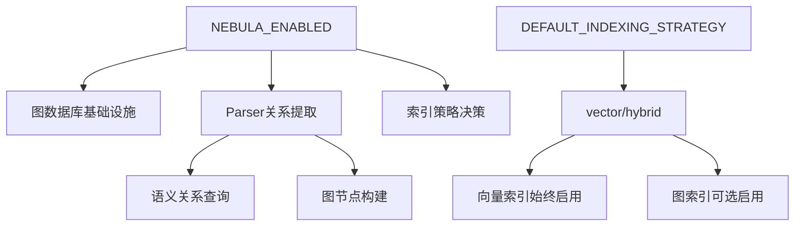

## 配置系统重构分析与设计方案

### 当前配置系统问题分析

#### 1. 配置冗余问题
- **NEBULA_ENABLED**: 控制图数据库基础设施
- **VECTOR_INDEX_ENABLED**: 仅在 HybridIndexService 中使用，功能重复
- **GRAPH_INDEX_ENABLED**: 完全未使用，仅存在于测试中
- **DEFAULT_INDEXING_STRATEGY**: 控制索引策略选择

#### 2. 策略复杂性
当前支持三种策略：`vector`、`graph`、`hybrid`，但 `graph-only` 策略在实际使用中存在问题，因为图索引需要向量索引作为基础。

#### 3. Parser 模块缺乏配置控制
Parser 模块始终提取关系节点，无法根据配置跳过关系提取，浪费资源。

### 简化配置架构设计

#### 核心设计原则
1. **单一职责**: 每个配置项有明确的单一职责
2. **层级清晰**: 基础设施层和业务逻辑层分离
3. **默认智能**: 合理的默认值，减少配置复杂度
4. **性能优先**: 配置直接影响资源使用和性能

#### 新的配置架构



#### 配置项简化方案

##### 保留的配置项
1. **`NEBULA_ENABLED`** (基础设施级别)
   - `true`: 启用图数据库基础设施和关系提取
   - `false`: 禁用图数据库基础设施，仅使用向量索引

2. **`DEFAULT_INDEXING_STRATEGY`** (业务逻辑级别)
   - `vector`: 仅向量索引
   - `hybrid`: 混合索引（当 NEBULA_ENABLED=true 时）

##### 移除的配置项
1. **`VECTOR_INDEX_ENABLED`** - 功能冗余
2. **`GRAPH_INDEX_ENABLED`** - 完全未使用

##### 移除的策略选项
1. **`graph`** - 仅图索引策略（不实用）
2. **`graph-only`** - 仅图索引（需要向量基础）

### 实施方案详细设计

#### 1. HybridIndexService 重构

##### 策略决策逻辑简化
```typescript
private async determineIndexingStrategy(projectPath: string, options?: IndexOptions): Promise<string> {
  const isGraphEnabled = this.configService.isGraphEnabled();
  
  // 检查显式选项
  if (options?.enableGraphIndex === false) {
    return 'vector-only';
  }
  
  // 检查环境变量配置
  const defaultStrategy = process.env.DEFAULT_INDEXING_STRATEGY?.toLowerCase() || 'hybrid';
  
  switch (defaultStrategy) {
    case 'vector':
      return 'vector-only';
    case 'hybrid':
    default:
      return isGraphEnabled ? 'hybrid' : 'vector-only';
  }
}
```

##### 移除冗余方法
- 删除 `isVectorEnabled()` 方法
- 简化 `startGraphIndexingIfEnabled()` 方法

#### 2. Parser 模块配置化改造

##### 新增配置接口
```typescript
export interface ParseOptions {
  extractRelationships?: boolean; // 是否提取关系节点
  // ... 其他选项
}
```

##### 修改 CodeStructureService
```typescript
async extractSemanticRelationships(ast: Parser.SyntaxNode, options: ParseOptions = {}): Promise<any[]> {
  if (!options.extractRelationships) {
    return [];
  }
  
  // 现有的关系提取逻辑
}
```

##### 查询系统配置化
```typescript
class QueryManager {
  private shouldExecuteRelationshipQueries(options: ParseOptions): boolean {
    return options.extractRelationships && process.env.NEBULA_ENABLED !== 'false';
  }
}
```

#### 3. 配置文件更新

##### .env 文件简化
```bash
# 移除的配置项
# VECTOR_INDEX_ENABLED = true
# GRAPH_INDEX_ENABLED = false

# 保留的配置项
NEBULA_ENABLED = false
DEFAULT_INDEXING_STRATEGY = vector  # 当 NEBULA_ENABLED=false 时的合理默认值
```

#### 4. 测试文件更新

##### 移除冗余测试
- 删除所有 `VECTOR_INDEX_ENABLED` 和 `GRAPH_INDEX_ENABLED` 相关测试
- 更新 `HybridIndexService` 测试用例

##### 新增配置测试
- 测试 `NEBULA_ENABLED` 对 Parser 模块的影响
- 测试简化后的策略决策逻辑

### 性能优化效果

#### 1. 资源使用优化
- **NEBULA_ENABLED=false**: 不初始化图数据库连接，节省内存和网络资源
- **关系提取跳过**: Parser 模块不执行语义关系查询，提升解析速度

#### 2. 配置复杂度降低
- 配置项从 4 个减少到 2 个
- 策略选项从 3 个减少到 2 个
- 消除配置冲突和混淆

#### 3. 维护成本降低
- 减少测试用例数量
- 简化代码逻辑
- 降低文档复杂度

### 迁移风险评估

#### 低风险变更
1. 移除 `GRAPH_INDEX_ENABLED` - 完全未使用
2. 移除 `VECTOR_INDEX_ENABLED` - 功能可被替代

#### 中等风险变更
1. 简化策略决策逻辑 - 需要全面测试
2. Parser 模块配置化 - 需要确保向后兼容

#### 缓解措施
1. **渐进式迁移**: 先移除未使用配置，再重构核心逻辑
2. **全面测试**: 覆盖所有配置组合和场景
3. **回滚计划**: 保留原有配置作为备份选项