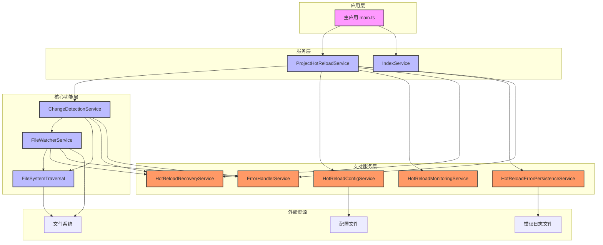
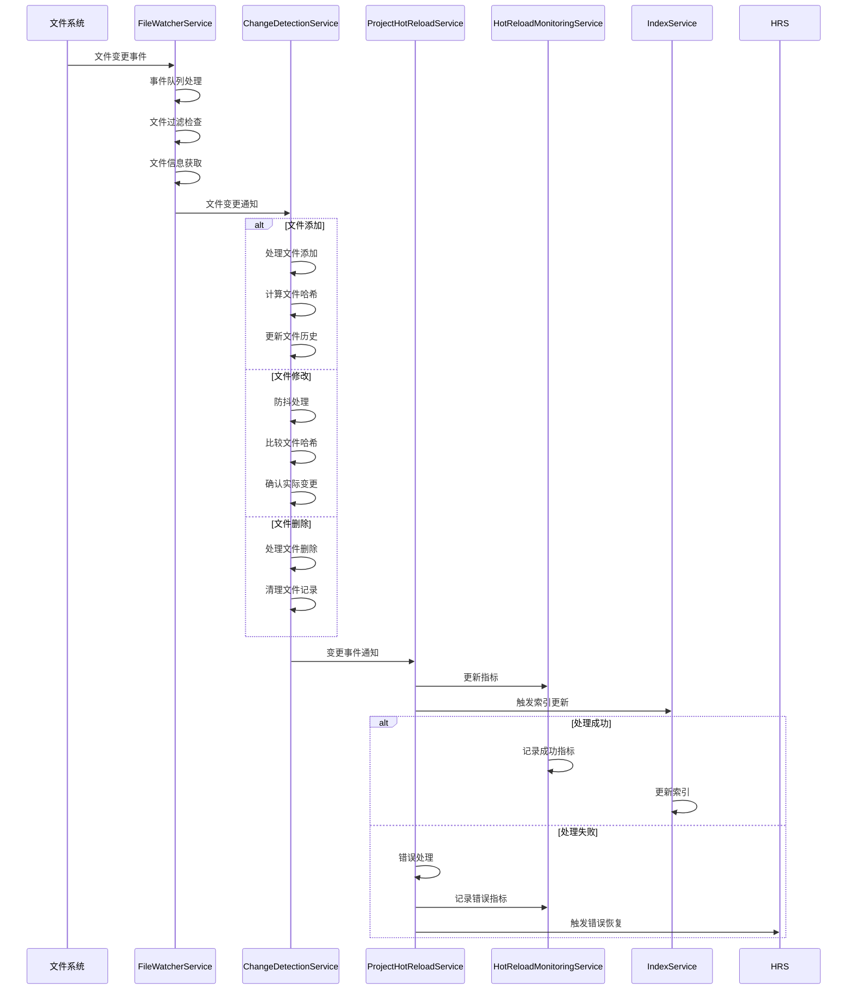
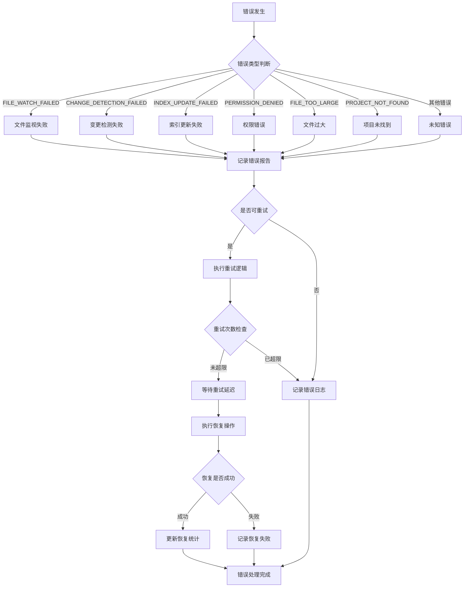
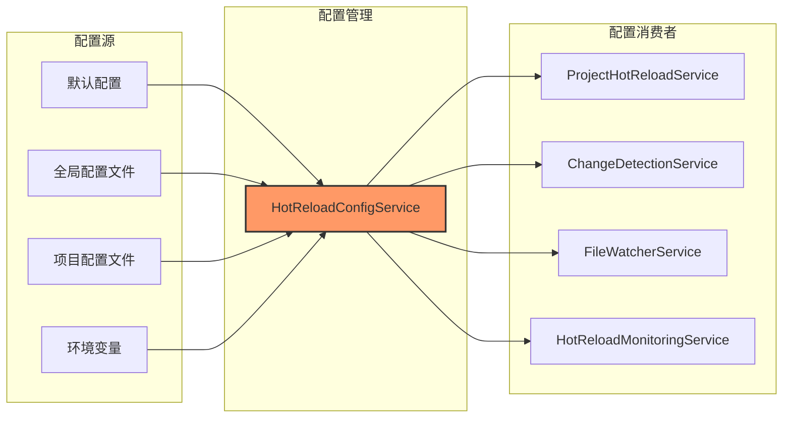
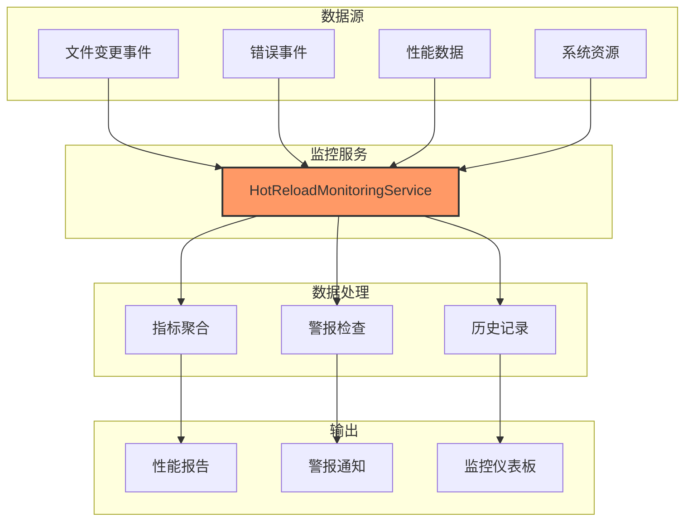
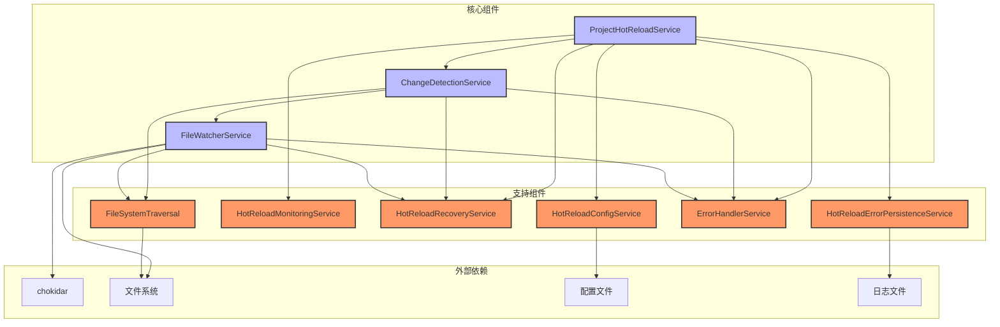
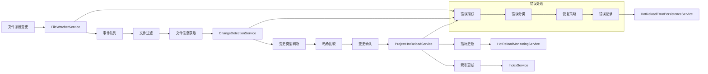

# 热更新功能架构图

## 整体架构图



## 文件变更检测流程图



## 错误处理流程图



## 配置管理架构图



## 监控和指标收集架构图



## 组件依赖关系图



## 数据流图



## 热更新生命周期图

```mermaid
stateDiagram-v2
    [*] --> 初始化
    初始化 --> 配置加载
    配置加载 --> 文件扫描
    文件扫描 --> 哈希计算
    哈希计算 --> 监控启动
    监控启动 --> 运行中
    
    运行中 --> 文件变更检测: 文件系统事件
    文件变更检测 --> 变更处理: 确认变更
    变更处理 --> 索引更新
    索引更新 --> 运行中
    
    运行中 --> 错误处理: 发生错误
    错误处理 --> 恢复尝试: 可恢复错误
    错误处理 --> 错误记录: 不可恢复错误
    恢复尝试 --> 运行中: 恢复成功
    恢复尝试 --> 错误记录: 恢复失败
    错误记录 --> 运行中
    
    运行中 --> 停止监控: 停止请求
    停止监控 --> 清理资源
    清理资源 --> [*]