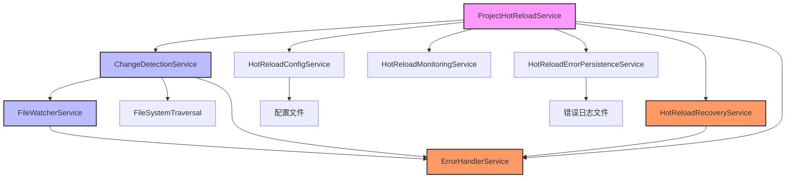

# 热更新功能分析报告

## 目录

1. [概述](#概述)
2. [架构分析](#架构分析)
3. [检测逻辑分析](#检测逻辑分析)
4. [错误处理机制分析](#错误处理机制分析)
5. [配置管理](#配置管理)
6. [监控与指标](#监控与指标)
7. [优缺点分析](#优缺点分析)
8. [改进建议](#改进建议)

## 概述

本报告详细分析了项目中热更新功能的实现，包括其架构设计、检测逻辑、错误处理机制等方面。热更新功能是项目的核心特性之一，它能够在代码文件发生变化时自动检测并更新索引，确保搜索结果的实时性和准确性。

### 主要功能

- **文件变更检测**: 实时监控项目文件的变化，包括创建、修改和删除操作
- **智能过滤**: 根据文件类型、大小和路径等条件过滤不需要处理的文件
- **错误恢复**: 提供多种错误恢复策略，确保系统的稳定性
- **性能监控**: 收集和监控热更新功能的性能指标
- **配置管理**: 支持全局和项目级别的配置管理

## 架构分析

### 核心组件

热更新功能由以下核心组件构成：

#### 1. ProjectHotReloadService
- **职责**: 项目级别的热更新管理，协调各个子服务
- **关键功能**:
  - 管理项目配置和状态
  - 协调变更检测和错误处理
  - 提供项目级别的指标和状态信息

#### 2. ChangeDetectionService
- **职责**: 检测文件变更并触发相应处理
- **关键功能**:
  - 文件系统监控
  - 文件变更事件处理
  - 防抖处理避免频繁触发
  - 文件哈希计算和比较

#### 3. FileWatcherService
- **职责**: 底层文件系统监控
- **关键功能**:
  - 使用chokidar库进行文件监控
  - 事件队列管理
  - 文件过滤和忽略规则处理
  - 重试机制处理失败事件

#### 4. HotReloadRecoveryService
- **职责**: 错误恢复策略管理
- **关键功能**:
  - 定义不同类型错误的恢复策略
  - 执行错误恢复操作
  - 管理重试逻辑

#### 5. HotReloadConfigService
- **职责**: 热更新配置管理
- **关键功能**:
  - 全局和项目级别配置管理
  - 配置验证和默认值处理
  - 配置文件加载和保存

#### 6. HotReloadMonitoringService
- **职责**: 性能监控和指标收集
- **关键功能**:
  - 收集性能指标
  - 错误统计和分析
  - 系统资源监控
  - 警报触发

#### 7. HotReloadErrorPersistenceService
- **职责**: 错误日志持久化
- **关键功能**:
  - 错误日志存储
  - 日志轮转管理
  - 错误统计分析

#### 8. ErrorHandlerService
- **职责**: 统一错误处理
- **关键功能**:
  - 错误报告生成
  - 错误日志记录
  - 错误统计和分析

### 组件关系图



## 检测逻辑分析

### 文件监控流程

#### 1. 初始化阶段

```typescript
// ChangeDetectionService.initialize()
async initialize(rootPaths: string[], watcherOptions?: FileWatcherOptions): Promise<void> {
  // 1. 初始化文件哈希
  await this.initializeFileHashes(rootPaths);
  
  // 2. 设置文件监视器回调
  const fileWatcherCallbacks: FileWatcherCallbacks = {
    onFileAdded: fileInfo => this.handleFileAdded(fileInfo),
    onFileChanged: fileInfo => this.handleFileChanged(fileInfo),
    onFileDeleted: filePath => this.handleFileDeleted(filePath),
    onError: error => this.handleWatcherError(error),
    onReady: () => this.handleWatcherReady(),
  };
  
  // 3. 启动文件监视
  await this.fileWatcherService.startWatching(watchOptions);
}
```

#### 2. 文件变更检测

##### 文件添加处理
```typescript
private async handleFileAdded(fileInfo: FileInfo): Promise<void> {
  // 1. 检查是否为新文件
  const previousHash = this.fileHashes.get(fileInfo.relativePath);
  if (previousHash === undefined) {
    // 2. 记录文件哈希
    this.fileHashes.set(fileInfo.relativePath, fileInfo.hash);
    
    // 3. 添加到文件历史
    if (this.options.trackFileHistory) {
      this.addFileHistoryEntry(fileInfo);
    }
    
    // 4. 触发文件创建事件
    const event: FileChangeEvent = {
      type: 'created',
      path: fileInfo.path,
      relativePath: fileInfo.relativePath,
      currentHash: fileInfo.hash,
      timestamp: new Date(),
      size: fileInfo.size,
      language: fileInfo.language,
    };
    
    this.emit('fileCreated', event);
  }
}
```

##### 文件修改处理
```typescript
private async handleFileChanged(fileInfo: FileInfo): Promise<void> {
  // 1. 获取之前的文件哈希
  const previousHash = this.fileHashes.get(fileInfo.relativePath);
  
  // 2. 防抖处理
  if (this.pendingChanges.has(fileInfo.relativePath)) {
    clearTimeout(this.pendingChanges.get(fileInfo.relativePath)!);
  }
  
  // 3. 设置防抖定时器
  const timeoutId = setTimeout(async () => {
    try {
      // 4. 计算当前文件哈希
      const currentHash = this.options.enableHashComparison
        ? await this.fileSystemTraversal['calculateFileHash'](fileInfo.path)
        : fileInfo.hash;
      
      // 5. 比较哈希值确认实际变更
      if (previousHash !== currentHash) {
        // 6. 更新哈希值
        this.fileHashes.set(fileInfo.relativePath, currentHash);
        
        // 7. 触发文件修改事件
        const event: FileChangeEvent = {
          type: 'modified',
          path: fileInfo.path,
          relativePath: fileInfo.relativePath,
          previousHash,
          currentHash,
          timestamp: new Date(),
          size: fileInfo.size,
          language: fileInfo.language,
        };
        
        this.emit('fileModified', event);
      }
    } catch (error) {
      this.handleFileEventError('change', fileInfo.relativePath, error);
    } finally {
      this.pendingChanges.delete(fileInfo.relativePath);
    }
  }, this.options.debounceInterval);
  
  this.pendingChanges.set(fileInfo.relativePath, timeoutId);
}
```

##### 文件删除处理
```typescript
private handleFileDeleted(filePath: string): void {
  // 1. 转换为相对路径
  const relativePath = path.relative(process.cwd(), filePath);
  const previousHash = this.fileHashes.get(relativePath);
  
  // 2. 检查文件是否被跟踪
  if (previousHash !== undefined) {
    // 3. 从哈希映射中删除
    this.fileHashes.delete(relativePath);
    
    // 4. 触发文件删除事件
    const event: FileChangeEvent = {
      type: 'deleted',
      path: filePath,
      relativePath,
      previousHash,
      timestamp: new Date(),
    };
    
    this.emit('fileDeleted', event);
  }
}
```

### 文件过滤机制

#### 1. 忽略规则处理

```typescript
// FileWatcherService.shouldIgnoreFile()
private shouldIgnoreFile(relativePath: string): boolean {
  const fileName = path.basename(relativePath).toLowerCase();
  
  // 1. 检查隐藏文件
  if (this.traversalOptions.ignoreHiddenFiles !== false && fileName.startsWith('.')) {
    return true;
  }
  
  // 2. 检查忽略模式
  for (const pattern of this.allIgnorePatterns) {
    if (this.fileSystemTraversal['matchesPattern'](relativePath, pattern)) {
      return true;
    }
  }
  
  return false;
}
```

#### 2. 文件类型过滤

```typescript
// FileWatcherService.getFileInfo()
private async getFileInfo(filePath: string, watchPath: string): Promise<FileInfo | null> {
  // ... 其他代码 ...
  
  // 1. 检查文件扩展名
  const extension = path.extname(fullPath).toLowerCase();
  const language = this.detectLanguage(extension);
  
  if (!language) {
    return null;
  }
  
  // 2. 检查是否为二进制文件
  const isBinary = await this.fileSystemTraversal['isBinaryFile'](fullPath);
  if (isBinary) {
    return null;
  }
  
  // ... 其他代码 ...
}
```

#### 3. 文件大小限制

```typescript
// FileWatcherService.getFileInfo()
private async getFileInfo(filePath: string, watchPath: string): Promise<FileInfo | null> {
  // ... 其他代码 ...
  
  // 检查文件大小
  const maxFileSize = this.traversalOptions.maxFileSize || 10 * 1024 * 1024; // 10MB default
  if (stats.size > maxFileSize) {
    this.logger.warn(`File too large: ${relativePath} (${stats.size} bytes)`);
    return null;
  }
  
  // ... 其他代码 ...
}
```

### 事件队列管理

```typescript
// FileWatcherService.queueFileEvent()
private queueFileEvent(type: string, filePath: string, stats: any, watchPath: string): void {
  const event: FileChangeEvent = {
    type: type as FileChangeEvent['type'],
    path: filePath,
    stats,
  };
  
  // 1. 添加到事件队列
  if (!this.eventQueue.has(watchPath)) {
    this.eventQueue.set(watchPath, []);
  }
  
  const queue = this.eventQueue.get(watchPath)!;
  
  // 2. 检查队列大小限制
  if (queue.length >= this.maxEventQueueSize) {
    queue.shift();
    this.logger.warn(`Event queue for ${watchPath} exceeded limit, removed oldest event`);
  }
  
  queue.push(event);
  
  // 3. 重置重试计数器
  this.retryAttempts.delete(filePath);
  
  // 4. 调度事件处理
  this.scheduleEventProcessing();
}
```

## 错误处理机制分析

### 错误类型定义

```typescript
// HotReloadError.ts
export enum HotReloadErrorCode {
  FILE_WATCH_FAILED = 'FILE_WATCH_FAILED',
  CHANGE_DETECTION_FAILED = 'CHANGE_DETECTION_FAILED',
  INDEX_UPDATE_FAILED = 'INDEX_UPDATE_FAILED',
  PERMISSION_DENIED = 'PERMISSION_DENIED',
  FILE_TOO_LARGE = 'FILE_TOO_LARGE',
  HOT_RELOAD_DISABLED = 'HOT_RELOAD_DISABLED',
  PROJECT_NOT_FOUND = 'PROJECT_NOT_FOUND',
  INVALID_CONFIG = 'INVALID_CONFIG'
}

export class HotReloadError extends Error {
  constructor(
    public code: HotReloadErrorCode,
    message: string,
    public context?: Record<string, any>
  ) {
    super(message);
    this.name = 'HotReloadError';
  }
}
```

### 错误处理流程

#### 1. 错误捕获和报告

```typescript
// ErrorHandlerService.handleHotReloadError()
handleHotReloadError(error: any, context: {
  component: string;
  operation: string;
  [key: string]: any;
}): ErrorReport {
  const errorId = this.generateErrorId();
  const timestamp = new Date();
  
  // 1. 确定错误代码
  const errorCode = error.code || (error.constructor?.name === 'HotReloadError' ? error.code : undefined);
  
  // 2. 创建错误报告
  const report: ErrorReport = {
    id: errorId,
    timestamp,
    component: context.component,
    operation: context.operation,
    message: error.message,
    stack: error.stack,
    context: {
      ...context,
      component: undefined,
      operation: undefined,
    },
    errorCode,
  };
  
  // 3. 存储错误报告
  this.errorReports.set(errorId, report);
  
  // 4. 记录错误日志
  this.logError(report);
  
  return report;
}
```

#### 2. 错误恢复策略

```typescript
// HotReloadRecoveryService.setupRecoveryStrategies()
private setupRecoveryStrategies(): void {
  // 文件监视失败恢复策略
  this.recoveryStrategies.set(HotReloadErrorCode.FILE_WATCH_FAILED, {
    maxRetries: 3,
    retryDelay: 1000,
    shouldRetry: (error) => true,
    recoveryAction: async (error, context) => {
      this.logger.warn('Attempting to restart file watcher after failure', context);
      // 这里将通过IndexService重新启动文件监视
    }
  });
  
  // 变更检测失败恢复策略
  this.recoveryStrategies.set(HotReloadErrorCode.CHANGE_DETECTION_FAILED, {
    maxRetries: 2,
    retryDelay: 2000,
    shouldRetry: (error) => true,
    recoveryAction: async (error, context) => {
      this.logger.warn('Attempting to restart change detection after failure', context);
      // 这里将通过ChangeDetectionService重新启动
    }
  });
  
  // 索引更新失败恢复策略
  this.recoveryStrategies.set(HotReloadErrorCode.INDEX_UPDATE_FAILED, {
    maxRetries: 1,
    retryDelay: 1000,
    shouldRetry: (error) => true,
    recoveryAction: async (error, context) => {
      this.logger.warn('Attempting to retry index update after failure', context);
      // 这里将通过IndexService重新尝试索引更新
    }
  });
  
  // 权限错误恢复策略
  this.recoveryStrategies.set(HotReloadErrorCode.PERMISSION_DENIED, {
    maxRetries: 1,
    retryDelay: 0,
    shouldRetry: (error) => false, // 权限错误不重试
    recoveryAction: async (error, context) => {
      // 记录错误并通知用户
      this.logger.warn('Permission denied for file monitoring - please check file permissions', context);
    }
  });
  
  // 文件过大错误恢复策略
  this.recoveryStrategies.set(HotReloadErrorCode.FILE_TOO_LARGE, {
    maxRetries: 0,
    retryDelay: 0,
    shouldRetry: (error) => false, // 文件过大不重试
    recoveryAction: async (error, context) => {
      this.logger.info('File too large for monitoring - skipping', context);
    }
  });
}
```

#### 3. 错误恢复执行

```typescript
// HotReloadRecoveryService.handleError()
async handleError(error: HotReloadError, context: ErrorContext): Promise<void> {
  const strategy = this.recoveryStrategies.get(error.code);
  if (strategy) {
    await strategy.recoveryAction(error, context);
  }
}
```

#### 4. 错误持久化

```typescript
// HotReloadErrorPersistenceService.persistError()
async persistError(errorReport: HotReloadErrorReport): Promise<void> {
  if (!this.config.enabled) {
    return;
  }
  
  try {
    // 1. 立即添加到队列并刷新
    this.errorQueue.push(errorReport);
    await this.flushErrors();
  } catch (error) {
    this.errorHandler.handleError(
      new Error(`Failed to persist error immediately: ${error instanceof Error ? error.message : String(error)}`),
      { component: 'HotReloadErrorPersistenceService', operation: 'persistError', errorId: errorReport.id }
    );
  }
}
```

#### 5. 错误日志轮转

```typescript
// HotReloadErrorPersistenceService.rotateLogFileIfNeeded()
private async rotateLogFileIfNeeded(logFilePath: string): Promise<void> {
  try {
    const stats = await fs.stat(logFilePath);
    if (stats.size > this.config.maxFileSize) {
      // 1. 生成带时间戳的归档文件名
      const timestamp = new Date().toISOString().replace(/[:.]/g, '-').replace('T', '_').replace('Z', '');
      const archiveFileName = this.errorArchivePattern.replace('{date}', timestamp);
      const archivePath = path.join(this.config.storagePath, archiveFileName);
      
      // 2. 重命名当前日志文件为归档文件
      await fs.rename(logFilePath, archivePath);
      
      this.logger.info(`Log file rotated: ${logFilePath} -> ${archivePath}`);
      
      // 3. 清理旧的归档文件
      await this.cleanupOldArchives();
    }
  } catch (error) {
    this.errorHandler.handleError(
      new Error(`Failed to rotate log file: ${error instanceof Error ? error.message : String(error)}`),
      { component: 'HotReloadErrorPersistenceService', operation: 'rotateLogFileIfNeeded', logFilePath }
    );
  }
}
```

### 初始化错误处理

```typescript
// ChangeDetectionService.handleInitializationError()
private async handleInitializationError(error: any, rootPaths: string[]): Promise<void> {
  const errorContext: ErrorContext = {
    component: 'ChangeDetectionService',
    operation: 'initialize',
    metadata: { rootPaths, options: this.options },
  };
  
  // 1. 创建热更新错误
  const hotReloadError = new HotReloadError(
    HotReloadErrorCode.CHANGE_DETECTION_FAILED,
    `Failed to initialize ChangeDetectionService: ${error instanceof Error ? error.message : String(error)}`,
    { rootPaths, options: this.options }
  );
  
  // 2. 使用错误处理服务处理错误
  const report = this.errorHandler.handleHotReloadError(hotReloadError, errorContext);
  
  // 3. 使用恢复服务处理错误
  await this.hotReloadRecoveryService.handleError(hotReloadError, errorContext);
  
  this.logger.error('Failed to initialize ChangeDetectionService', { errorId: report.id });
  throw hotReloadError;
}
```

## 配置管理

### 全局配置

```typescript
// HotReloadConfigService.getDefaultGlobalConfig()
private getDefaultGlobalConfig(): HotReloadGlobalConfig {
  return {
    enabled: true,
    defaultDebounceInterval: 500,
    defaultWatchPatterns: ['**/*.{js,ts,jsx,tsx,json,md,py,go,java,css,html,scss}'],
    defaultIgnorePatterns: [
      '**/node_modules/**',
      '**/.git/**',
      '**/dist/**',
      '**/build/**',
      '**/target/**',
      '**/venv/**',
      '**/.vscode/**',
      '**/.idea/**',
      '**/logs/**',
      '**/*.log',
      '**/coverage/**',
      '**/tmp/**',
      '**/temp/**'
    ],
    defaultMaxFileSize: 10 * 1024 * 1024, // 10MB
    defaultErrorHandling: {
      maxRetries: 3,
      alertThreshold: 5,
      autoRecovery: true
    },
    enableDetailedLogging: false,
    maxConcurrentProjects: 5
  };
}
```

### 项目级别配置

```typescript
// ProjectHotReloadService.enableForProject()
async enableForProject(projectPath: string, config?: Partial<ProjectHotReloadConfig>): Promise<void> {
  try {
    const defaultConfig: ProjectHotReloadConfig = {
      enabled: true,
      debounceInterval: 500,
      watchPatterns: ['**/*.{js,ts,jsx,tsx,json,md}'],
      ignorePatterns: ['**/node_modules/**', '**/.git/**', '**/dist/**', '**/build/**'],
      maxFileSize: 10 * 1024 * 1024, // 10MB
      errorHandling: {
        maxRetries: 3,
        alertThreshold: 5,
        autoRecovery: true
      }
    };
    
    // 合并配置
    const finalConfig: ProjectHotReloadConfig = {
      ...defaultConfig,
      ...config,
      errorHandling: {
        ...defaultConfig.errorHandling,
        ...(config?.errorHandling || {})
      }
    };
    
    this.projectConfigs.set(projectPath, finalConfig);
    
    // ... 其他初始化代码
  } catch (error) {
    // 错误处理
  }
}
```

### 配置验证

```typescript
// HotReloadConfigService.validateConfig()
validateConfig(config: Partial<ProjectHotReloadConfig>): { isValid: boolean; errors: string[] } {
  const errors: string[] = [];
  
  if (config.debounceInterval !== undefined && config.debounceInterval < 50) {
    errors.push('Debounce interval must be at least 50ms');
  }
  
  if (config.maxFileSize !== undefined && (config.maxFileSize <= 0 || config.maxFileSize > 100 * 1024 * 1024)) {
    errors.push('Max file size must be between 1 byte and 100MB');
  }
  
  if (config.errorHandling?.maxRetries !== undefined && config.errorHandling.maxRetries < 0) {
    errors.push('Max retries must be non-negative');
  }
  
  return {
    isValid: errors.length === 0,
    errors
  };
}
```

## 监控与指标

### 指标收集

```typescript
// HotReloadMonitoringService.updateProjectMetrics()
updateProjectMetrics(projectPath: string, metricsUpdate: Partial<HotReloadMetrics>): void {
  const currentMetrics = this.getProjectMetrics(projectPath);
  const updatedMetrics: HotReloadMetrics = {
    ...currentMetrics,
    ...metricsUpdate,
    errorBreakdown: {
      ...currentMetrics.errorBreakdown,
      ...(metricsUpdate.errorBreakdown || {})
    },
    recoveryStats: {
      ...currentMetrics.recoveryStats,
      ...(metricsUpdate.recoveryStats || {})
    }
  };
  
  // 计算平均处理时间
  if (metricsUpdate.averageProcessingTime !== undefined) {
    updatedMetrics.averageProcessingTime = metricsUpdate.averageProcessingTime;
  } else if (metricsUpdate.lastUpdated) {
    const currentTime = Date.now();
    const lastTime = this.lastMetricsTime.get(projectPath) || currentTime;
    this.lastMetricsTime.set(projectPath, currentTime);
  }
  
  updatedMetrics.lastUpdated = new Date();
  
  this.projectMetrics.set(projectPath, updatedMetrics);
  
  // 检查是否需要触发警报
  this.checkAlerts(projectPath, updatedMetrics);
}
```

### 警报检查

```typescript
// HotReloadMonitoringService.checkAlerts()
private checkAlerts(projectPath: string, metrics: HotReloadMetrics): void {
  // 1. 检查错误率
  const timeSinceLastUpdate = (Date.now() - metrics.lastUpdated.getTime()) / 1000 / 60; // 转换为分钟
  const errorRate = timeSinceLastUpdate > 0 ? metrics.errorCount / timeSinceLastUpdate : 0;
  
  if (errorRate > this.config.alertThresholds.errorRate) {
    this.logger.warn(`High error rate detected for project ${projectPath}`, {
      errorRate,
      threshold: this.config.alertThresholds.errorRate,
      metrics
    });
  }
  
  // 2. 检查处理时间
  if (metrics.averageProcessingTime > this.config.alertThresholds.processingTime) {
    this.logger.warn(`High average processing time detected for project ${projectPath}`, {
      averageProcessingTime: metrics.averageProcessingTime,
      threshold: this.config.alertThresholds.processingTime,
      metrics
    });
  }
}
```

### 系统资源监控

```typescript
// HotReloadMonitoringService.startSystemMetricsCollection()
private startSystemMetricsCollection(): void {
  // 定期收集系统指标
  setInterval(() => {
    this.systemMetrics = {
      memoryUsage: process.memoryUsage(),
      cpuUsage: null, // Node.js doesn't provide direct CPU usage
      uptime: process.uptime()
    };
  }, 5000); // 每5秒更新一次系统指标
}
```

## 优缺点分析

### 优点

1. **模块化设计**: 热更新功能采用模块化设计，各组件职责明确，便于维护和扩展
2. **全面的错误处理**: 提供多种错误类型和恢复策略，确保系统稳定性
3. **灵活的配置管理**: 支持全局和项目级别的配置，满足不同场景需求
4. **完善的监控机制**: 提供详细的性能指标和警报功能，便于问题排查
5. **智能过滤机制**: 通过文件类型、大小和路径等条件过滤，提高处理效率
6. **防抖处理**: 避免频繁变更导致的性能问题
7. **错误持久化**: 错误日志持久化存储，便于后续分析

### 缺点

1. **复杂度高**: 组件较多，交互复杂，增加了理解和维护的难度
2. **内存占用**: 文件哈希和历史记录的维护可能占用较多内存
3. **性能瓶颈**: 大量文件变更时可能出现性能瓶颈
4. **依赖外部库**: 依赖chokidar等外部库，可能存在兼容性问题
5. **错误恢复不完整**: 部分错误恢复策略尚未完全实现
6. **测试覆盖不足**: 部分边缘情况测试覆盖不够全面

## 改进建议

### 架构优化

1. **简化组件交互**: 减少组件间的直接依赖，引入事件总线或消息队列
2. **引入插件机制**: 将文件过滤、处理逻辑等设计为可插拔的插件
3. **分层设计**: 将热更新功能分为核心层、服务层和扩展层，提高可维护性

### 性能优化

1. **增量处理**: 只处理真正发生变更的文件，避免全量扫描
2. **内存优化**: 优化文件哈希和历史记录的存储方式，减少内存占用
3. **并发处理**: 引入并发处理机制，提高大量文件变更时的处理效率
4. **缓存机制**: 对频繁访问的文件信息进行缓存

### 错误处理改进

1. **完善恢复策略**: 实现所有定义的错误恢复策略
2. **智能重试**: 根据错误类型和历史记录动态调整重试策略
3. **错误分类**: 对错误进行更细致的分类，提供针对性的处理方案
4. **用户反馈**: 提供更友好的错误提示和解决建议

### 监控和诊断

1. **实时监控**: 提供实时监控界面，展示热更新状态和性能指标
2. **性能分析**: 引入性能分析工具，识别性能瓶颈
3. **日志增强**: 增加更详细的日志记录，便于问题排查
4. **健康检查**: 定期进行健康检查，及时发现潜在问题

### 测试改进

1. **增加测试覆盖**: 提高测试覆盖率，特别是边缘情况
2. **性能测试**: 引入性能测试，评估系统在高负载下的表现
3. **集成测试**: 加强组件间的集成测试，确保整体功能正常
4. **模拟测试**: 模拟各种错误场景，验证错误处理机制

### 配置管理改进

1. **动态配置**: 支持运行时动态调整配置，无需重启服务
2. **配置验证**: 加强配置验证，提供更详细的错误提示
3. **配置模板**: 提供常用场景的配置模板，简化配置过程
4. **配置迁移**: 支持配置版本管理和迁移

## 总结

项目的热更新功能整体设计较为完善，采用了模块化架构，提供了全面的错误处理和监控机制。但在性能优化、错误恢复实现和测试覆盖等方面还有改进空间。通过实施上述改进建议，可以进一步提升热更新功能的稳定性、性能和可维护性。