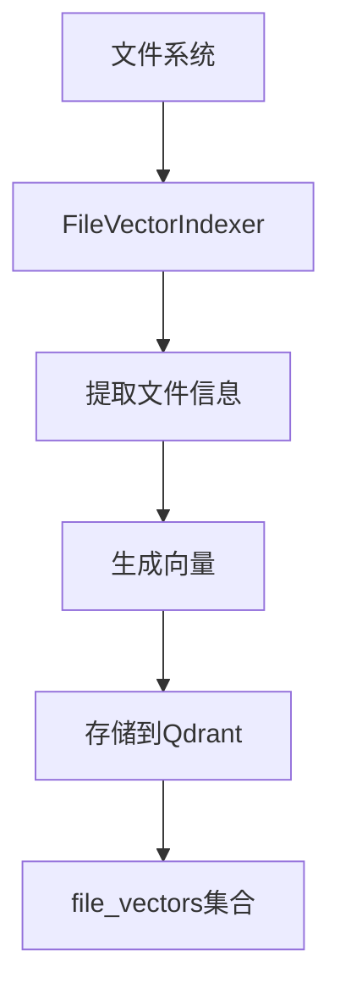
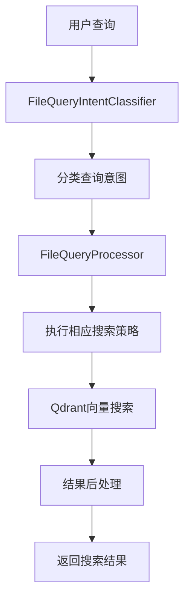

# 文件名及相对路径索引信息分析报告

## 概述

本报告分析了当前代码库索引项目是否提供了文件名及相对路径的索引信息。通过对项目文件搜索服务的深入分析，我们确认项目已经实现了完整的文件名和路径索引功能。

## 核心发现

### 1. 文件向量索引结构

项目在 [`src/service/filesearch/types.ts`](src/service/filesearch/types.ts:6-24) 中定义了完整的文件向量索引结构：

```typescript
interface FileVectorIndex {
  id: string;                    // 文件唯一ID
  projectId: string;            // 项目ID
  filePath: string;              // 完整路径
  fileName: string;              // 文件名（不含路径）
  directory: string;             // 目录路径
  extension: string;             // 文件扩展名
  
  // 向量表示
  nameVector: number[];          // 文件名语义向量
  pathVector: number[];          // 路径语义向量
  combinedVector: number[];      // 路径+名称组合向量
  
  // 元数据
  semanticDescription: string;   // AI生成的语义描述
  lastModified: Date;            // 修改时间
  fileSize: number;              // 文件大小
  fileType: 'file' | 'directory'; // 文件类型
}
```

**关键点**：
- 明确存储了文件名（fileName）和目录路径（directory）
- 为文件名和路径分别生成了语义向量
- 提供了组合向量用于综合搜索

### 2. 文件索引实现

[`FileVectorIndexer`](src/service/filesearch/FileVectorIndexer.ts:16) 类负责将文件信息转换为向量并存储到Qdrant中：

```typescript
async indexFile(filePath: string, projectId: string): Promise<void> {
  const fileName = path.basename(filePath);
  const directory = path.dirname(filePath);
  const extension = path.extname(fileName);
  
  // 生成向量
  const nameVectorResult = await embedder.embed({ text: fileName });
  const pathVectorResult = await embedder.embed({ text: filePath });
  const combinedVectorResult = await embedder.embed({ text: `${directory} ${fileName}` });
  
  // 构建文件向量索引并存储到Qdrant
}
```

**关键功能**：
- 自动提取文件名、目录路径和扩展名
- 为文件名和路径分别生成语义向量
- 将索引信息存储到Qdrant向量数据库的`file_vectors`集合中

### 3. 查询处理能力

[`FileQueryProcessor`](src/service/filesearch/FileQueryProcessor.ts:14) 提供了多种搜索类型的处理：

#### 3.1 精确文件名搜索
```typescript
private async searchExactFilename(request: FileSearchRequest, keywords: string[], strategy: any): Promise<any[]> {
  // 提取可能的文件名
  const possibleFilenames = keywords.filter(keyword => keyword.includes('.'));
  
  // 使用文件名进行向量搜索
  for (const filename of possibleFilenames) {
    const filenameVector = await embedder.embed({ text: filename });
    const filenameResults = await this.fileSearchService.vectorSearch(filenameVectorArray, 'name', request.options);
  }
}
```

#### 3.2 路径模式搜索
```typescript
private async searchPathPattern(request: FileSearchRequest, keywords: string[], strategy: any): Promise<any[]> {
  // 提取路径关键词
  const pathKeywords = keywords.filter(keyword => 
    !keyword.startsWith('.') && keyword.length > 2 && 
    !['文件', 'file', '目录', 'directory', '路径', 'path'].includes(keyword)
  );
  
  // 使用路径关键词进行搜索
  for (const pathKeyword of pathKeywords) {
    const pathVector = await embedder.embed({ text: pathKeyword });
    const pathResults = await this.fileSearchService.vectorSearch(pathVectorArray, 'path', request.options);
  }
}
```

#### 3.3 扩展名搜索
```typescript
private async searchByExtension(request: FileSearchRequest, keywords: string[], strategy: any): Promise<any[]> {
  // 提取扩展名
  const extensions = keywords.filter(keyword => keyword.startsWith('.') && keyword.length > 1);
  
  // 使用扩展名进行搜索
  for (const extension of extensions) {
    const extResults = await this.fileSearchService.vectorSearch(extVectorArray, 'name', {
      filter: {
        must: [{ key: 'extension', match: { value: extension } }]
      }
    });
  }
}
```

### 4. 查询意图分类

[`FileQueryIntentClassifier`](src/service/filesearch/FileQueryIntentClassifier.ts:11) 能够智能识别不同类型的搜索查询：

```typescript
export type FileQueryType = 
  | 'EXACT_FILENAME'      // 精确文件名匹配，如：config.json
  | 'SEMANTIC_DESCRIPTION' // 语义描述搜索，如：认证相关的配置文件
  | 'PATH_PATTERN'        // 路径模式搜索，如：src/services下的文件
  | 'EXTENSION_SEARCH'    // 扩展名搜索，如：所有.ts文件
  | 'HYBRID_QUERY';       // 混合查询，结合多种条件
```

**分类逻辑**：
- 检测查询中是否包含文件扩展名（如`.ts`, `.js`）
- 识别路径模式关键词（如"目录下"、"文件夹下"、"in directory"）
- 分析语义描述词汇（如"相关"、"关于"、"涉及"）
- 支持混合查询类型的自动识别

### 5. API接口

[`FileSearchRoutes`](src/api/routes/FileSearchRoutes.ts:12) 提供了完整的文件搜索API：

```typescript
// 文件搜索
this.router.post('/search', this.searchFiles.bind(this));

// 智能文件搜索（推荐）
this.router.post('/smart-search', this.smartSearchFiles.bind(this));

// 获取搜索建议
this.router.get('/suggestions', this.getSearchSuggestions.bind(this));

// 文件索引操作
this.router.post('/index', this.indexFile.bind(this));
this.router.post('/index-batch', this.indexFiles.bind(this));
this.router.delete('/index/:filePath', this.deleteFileIndex.bind(this));
```

### 6. 向量存储

文件索引信息存储在Qdrant向量数据库的`file_vectors`集合中，包含以下关键信息：

```typescript
await this.qdrantService.upsertVectorsWithOptions(this.COLLECTION_NAME, [{
  id: fileIndex.id,
  vector: combinedVector,
  payload: {
    content: fileIndex.semanticDescription,
    filePath: fileIndex.filePath,
    fileName: fileIndex.fileName,
    directory: fileIndex.directory,
    extension: fileIndex.extension,
    // ...其他元数据
  }
}]);
```

## 功能评估

### 已实现的功能

1. **文件名索引** ✅
   - 存储文件名（不含路径）
   - 为文件名生成语义向量
   - 支持精确文件名匹配和语义搜索

2. **相对路径索引** ✅
   - 存储目录路径信息
   - 为路径生成语义向量
   - 支持路径模式搜索

3. **扩展名索引** ✅
   - 存储文件扩展名
   - 支持按扩展名过滤和搜索

4. **组合搜索** ✅
   - 支持文件名+路径的组合向量
   - 提供混合查询能力

5. **智能查询分类** ✅
   - 自动识别查询意图
   - 根据查询类型选择最佳搜索策略

### 搜索能力

1. **精确文件名搜索**
   - 支持如"config.json"、"package.json"等精确匹配
   - 使用文件名向量进行语义相似性搜索

2. **路径模式搜索**
   - 支持如"src/services下的文件"、"in directory utils"等查询
   - 使用路径向量进行匹配

3. **扩展名搜索**
   - 支持如".ts文件"、"所有.js文件"等查询
   - 结合向量搜索和元数据过滤

4. **语义描述搜索**
   - 支持如"认证相关的配置文件"、"工具类文件"等查询
   - 使用AI生成的语义描述进行匹配

5. **混合查询**
   - 支持结合多种条件的复杂查询
   - 自动调整不同搜索结果的权重

## 技术架构

### 索引流程



### 搜索流程



## 结论

**当前项目已经完整实现了文件名及相对路径的索引信息功能**，具体体现在：

1. **数据结构完整**：[`FileVectorIndex`](src/service/filesearch/types.ts:6)接口明确定义了文件名、目录路径等关键信息
2. **索引功能完备**：[`FileVectorIndexer`](src/service/filesearch/FileVectorIndexer.ts:16)实现了文件信息的向量化存储
3. **搜索能力强大**：支持精确匹配、语义搜索、路径模式、扩展名过滤等多种搜索方式
4. **查询智能分类**：[`FileQueryIntentClassifier`](src/service/filesearch/FileQueryIntentClassifier.ts:11)能够自动识别查询意图
5. **API接口完善**：提供了完整的文件搜索和索引管理API

项目不仅提供了基础的文件名和路径索引，还通过向量化技术实现了智能语义搜索，大大提升了文件检索的准确性和用户体验。

## 建议

1. **性能优化**：考虑为大型项目实现分层索引，提高搜索效率
2. **实时更新**：添加文件系统监听，实现索引的实时更新
3. **缓存优化**：增强搜索结果缓存机制，减少重复查询的计算开销
4. **搜索建议**：完善搜索建议功能，提供更智能的查询推荐