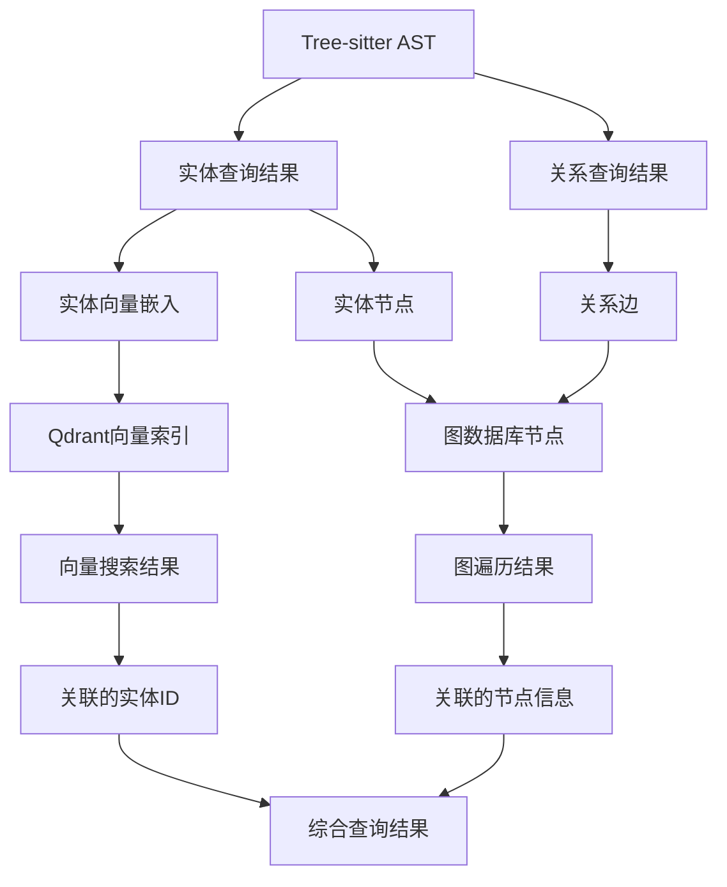

理解了您的计划。让我分析如何实现向量索引只处理实体、图索引只处理关系的架构，以及如何通过图遍历结果找出AST节点。

## 向量索引与图索引分离架构分析

### 架构设计原则

1. **职责分离**：向量索引专注于实体的语义搜索，图索引专注于关系的结构化查询
2. **数据一致性**：确保向量索引和图索引中的节点ID保持一致
3. **性能优化**：各自优化存储和查询策略，避免混合存储的性能损失
4. **协同工作**：通过节点ID关联，实现向量搜索和图遍历的协同

### 实现方案分析

#### 1. 数据流设计



#### 2. 节点ID统一策略

```typescript
/**
 * 统一的节点ID生成策略
 */
class NodeIdGenerator {
  /**
   * 生成实体节点ID
   * 格式: entity_{filePath_hash}_{entityType}_{entityName}_{startLine}
   */
  static generateEntityId(entity: EntityQueryResult): string {
    const filePathHash = this.hashPath(entity.filePath);
    const sanitizedName = this.sanitizeName(entity.name);
    return `entity_${filePathHash}_${entity.entityType}_${sanitizedName}_${entity.location.startLine}`;
  }
  
  /**
   * 生成关系边ID
   * 格式: relationship_{fromEntityId}_{toEntityId}_{relationshipType}_{startLine}
   */
  static generateRelationshipId(
    fromEntityId: string, 
    toEntityId: string, 
    relationshipType: string, 
    startLine: number
  ): string {
    return `relationship_${fromEntityId}_${toEntityId}_${relationshipType}_${startLine}`;
  }
  
  /**
   * 从节点ID提取实体信息
   */
  static parseEntityId(nodeId: string): {
    filePathHash: string;
    entityType: string;
    entityName: string;
    startLine: number;
  } | null {
    const match = nodeId.match(/^entity_(.+?)_(.+?)_(.+?)_(\d+)$/);
    if (!match) return null;
    
    return {
      filePathHash: match[1],
      entityType: match[2],
      entityName: match[3],
      startLine: parseInt(match[4])
    };
  }
  
  /**
   * 从关系ID提取关系信息
   */
  static parseRelationshipId(relationshipId: string): {
    fromEntityId: string;
    toEntityId: string;
    relationshipType: string;
    startLine: number;
  } | null {
    const match = relationshipId.match(/^relationship_(.+?)_(.+?)_(.+?)_(\d+)$/);
    if (!match) return null;
    
    return {
      fromEntityId: match[1],
      toEntityId: match[2],
      relationshipType: match[3],
      startLine: parseInt(match[4])
    };
  }
  
  private static hashPath(filePath: string): string {
    // 简单的哈希实现，实际应用中可以使用更强的哈希算法
    return filePath.split('/').map(part => part.substring(0, 3)).join('_');
  }
  
  private static sanitizeName(name: string): string {
    return name.replace(/[^a-zA-Z0-9_]/g, '_');
  }
}
```

#### 3. 向量索引专用结构

```typescript
/**
 * 向量索引专用的实体向量点
 * 只包含实体信息，不包含关系信息
 */
interface EntityVectorPoint {
  /** 统一的实体ID */
  id: string;
  
  /** 向量嵌入 */
  vector: number[];
  
  /** 实体专用的payload */
  payload: {
    /** 基础标识信息 */
    entityType: string;
    entityName: string;
    filePath: string;
    language: string;
    
    /** 位置信息 */
    startLine: number;
    endLine: number;
    
    /** 语义信息 */
    content: string;
    naturalLanguageText: string;
    
    /** 分类信息 */
    category: string;
    subcategory: string;
    
    /** 复杂度信息 */
    complexity: number;
    lineCount: number;
    
    /** 依赖信息 */
    dependencies: string[];
    
    /** 质量信息 */
    qualityScore: number;
    
    /** 项目信息 */
    projectId: string;
    moduleName: string;
    
    /** 时间戳 */
    createdAt: number;
    updatedAt: number;
  };
}
```

#### 4. 图索引专用结构

```typescript
/**
 * 图索引专用的节点结构
 * 包含实体节点和关系边
 */
interface GraphEntityNode {
  /** 统一的实体ID */
  id: string;
  
  /** 节点标签 */
  labels: ['entity', string];
  
  /** 节点属性 */
  properties: {
    /** 基础信息 */
    entityType: string;
    entityName: string;
    filePath: string;
    language: string;
    
    /** 位置信息 */
    startLine: number;
    endLine: number;
    startColumn: number;
    endColumn: number;
    
    /** 内容信息 */
    content: string;
    
    /** 复杂度信息 */
    complexity: number;
    
    /** 向量嵌入ID（可选，用于关联） */
    vectorId?: string;
    
    /** 项目信息 */
    projectId: string;
    moduleName: string;
    
    /** 时间戳 */
    createdAt: number;
    updatedAt: number;
  };
}

/**
 * 图索引专用的关系边结构
 */
interface GraphRelationshipEdge {
  /** 关系边ID */
  id: string;
  
  /** 源节点ID */
  fromNodeId: string;
  
  /** 目标节点ID */
  toNodeId: string;
  
  /** 边类型 */
  type: string;
  
  /** 边属性 */
  properties: {
    /** 关系信息 */
    relationshipType: string;
    relationshipCategory: string;
    
    /** 位置信息 */
    startLine: number;
    endLine: number;
    startColumn: number;
    endColumn: number;
    
    /** 关系强度 */
    strength?: number;
    weight?: number;
    
    /** 关系特有属性 */
    [key: string]: any;
    
    /** 项目信息 */
    projectId: string;
    moduleName: string;
    
    /** 时间戳 */
    createdAt: number;
    updatedAt: number;
  };
}
```

#### 5. 协同查询接口

```typescript
/**
 * 协同查询服务
 * 协调向量索引和图索引的查询
 */
class HybridQueryService {
  constructor(
    private vectorIndex: VectorIndexOperations,
    private graphIndex: GraphDatabase
  ) {}
  
  /**
   * 语义搜索 + 关系扩展
   * 先通过向量搜索找到相关实体，再通过图遍历找到相关关系
   */
  async semanticSearchWithRelations(
    queryText: string,
    options: {
      entityTypes?: string[];
      relationshipTypes?: string[];
      maxDepth?: number;
      limit?: number;
    } = {}
  ): Promise<HybridSearchResult> {
    // 1. 向量搜索找到相关实体
    const queryVector = await this.generateQueryVector(queryText);
    const vectorResults = await this.vectorIndex.searchVectors(
      queryVector,
      this.buildEntityFilter(options.entityTypes),
      options.limit || 10
    );
    
    // 2. 提取实体ID
    const entityIds = vectorResults.map(result => result.id);
    
    // 3. 图遍历找到相关关系
    const relationshipResults = await this.findRelatedRelationships(
      entityIds,
      options.relationshipTypes,
      options.maxDepth || 2
    );
    
    // 4. 组合结果
    return this.combineResults(vectorResults, relationshipResults);
  }
  
  /**
   * 关系查询 + 语义扩展
   * 先通过图遍历找到相关实体，再通过向量搜索找到语义相似的实体
   */
  async relationshipQueryWithSemantics(
    startEntityId: string,
    options: {
      relationshipTypes?: string[];
      maxDepth?: number;
      semanticThreshold?: number;
      limit?: number;
    } = {}
  ): Promise<HybridSearchResult> {
    // 1. 图遍历找到相关实体
    const relatedEntities = await this.graphIndex.findRelatedEntities(
      startEntityId,
      options.relationshipTypes,
      options.maxDepth || 2
    );
    
    // 2. 提取实体内容
    const entityContents = relatedEntities.map(entity => entity.properties.content);
    
    // 3. 向量搜索找到语义相似的实体
    const semanticResults = await this.vectorIndex.searchByContent(
      entityContents,
      options.semanticThreshold || 0.7,
      options.limit || 10
    );
    
    // 4. 组合结果
    return this.combineResults(semanticResults, relatedEntities);
  }
  
  /**
   * 获取实体的完整上下文
   * 包括实体本身、相关关系和相关实体
   */
  async getEntityContext(
    entityId: string,
    options: {
      includeRelationships?: boolean;
      includeRelatedEntities?: boolean;
      maxDepth?: number;
    } = {}
  ): Promise<EntityContextResult> {
    const result: EntityContextResult = {
      entity: null,
      relationships: [],
      relatedEntities: []
    };
    
    // 1. 获取实体信息
    result.entity = await this.graphIndex.getNode(entityId);
    
    if (!result.entity) {
      return result;
    }
    
    if (options.includeRelationships) {
      // 2. 获取相关关系
      result.relationships = await this.graphIndex.queryEdges({
        fromNodeId: entityId
      });
    }
    
    if (options.includeRelatedEntities) {
      // 3. 获取相关实体
      const relatedNodeIds = result.relationships.map(rel => rel.toNodeId);
      result.relatedEntities = await this.graphIndex.queryNodes({
        ids: relatedNodeIds
      });
    }
    
    return result;
  }
  
  /**
   * 构建实体过滤器
   */
  private buildEntityFilter(entityTypes?: string[]): FilterCondition | undefined {
    if (!entityTypes || entityTypes.length === 0) {
      return undefined;
    }
    
    const builder = new CodeSearchFilterBuilder();
    if (entityTypes.length === 1) {
      builder.byEntityType(entityTypes[0]);
    } else {
      builder.or(entityTypes.map(type => ({
        key: 'entityType',
        value: type
      })));
    }
    
    return builder.build();
  }
  
  /**
   * 查找相关关系
   */
  private async findRelatedRelationships(
    entityIds: string[],
    relationshipTypes?: string[],
    maxDepth: number = 2
  ): Promise<GraphRelationshipEdge[]> {
    const relationships: GraphRelationshipEdge[] = [];
    
    for (const entityId of entityIds) {
      const edges = await this.graphIndex.queryEdges({
        fromNodeId: entityId,
        type: relationshipTypes
      });
      relationships.push(...edges);
    }
    
    return relationships;
  }
  
  /**
   * 组合查询结果
   */
  private combineResults(
    vectorResults: SearchResult[],
    relationshipResults: GraphRelationshipEdge[]
  ): HybridSearchResult {
    return {
      entities: vectorResults,
      relationships: relationshipResults,
      stats: {
        entityCount: vectorResults.length,
        relationshipCount: relationshipResults.length,
        totalProcessingTime: 0 // 需要实际计算
      }
    };
  }
  
  /**
   * 生成查询向量
   */
  private async generateQueryVector(queryText: string): Promise<number[]> {
    // 实现查询文本向量化逻辑
    return [];
  }
}

/**
 * 混合搜索结果
 */
interface HybridSearchResult {
  /** 实体搜索结果 */
  entities: SearchResult[];
  
  /** 关系搜索结果 */
  relationships: GraphRelationshipEdge[];
  
  /** 统计信息 */
  stats: {
    entityCount: number;
    relationshipCount: number;
    totalProcessingTime: number;
  };
}

/**
 * 实体上下文结果
 */
interface EntityContextResult {
  /** 目标实体 */
  entity: GraphEntityNode | null;
  
  /** 相关关系 */
  relationships: GraphRelationshipEdge[];
  
  /** 相关实体 */
  relatedEntities: GraphEntityNode[];
}
```

#### 6. 数据同步策略

```typescript
/**
 * 数据同步服务
 * 确保向量索引和图索引的数据一致性
 */
class DataSyncService {
  constructor(
    private vectorIndex: VectorIndexOperations,
    private graphIndex: GraphDatabase
  ) {}
  
  /**
   * 同步实体数据
   */
  async syncEntity(entity: EntityQueryResult, embedding: number[]): Promise<void> {
    const entityId = NodeIdGenerator.generateEntityId(entity);
    
    // 1. 创建/更新向量索引
    const vectorPoint = this.createVectorPoint(entity, embedding, entityId);
    await this.vectorIndex.createVector(vectorPoint);
    
    // 2. 创建/更新图节点
    const graphNode = this.createGraphNode(entity, entityId);
    await this.graphIndex.createNode(graphNode);
  }
  
  /**
   * 同步关系数据
   */
  async syncRelationship(
    relationship: RelationshipQueryResult,
    fromEntityId: string,
    toEntityId: string
  ): Promise<void> {
    const relationshipId = NodeIdGenerator.generateRelationshipId(
      fromEntityId,
      toEntityId,
      relationship.type,
      relationship.location.startLine
    );
    
    // 1. 创建图边
    const graphEdge = this.createGraphEdge(relationship, relationshipId, fromEntityId, toEntityId);
    await this.graphIndex.createEdge(graphEdge);
    
    // 2. 关系不存储在向量索引中
  }
  
  /**
   * 删除实体数据
   */
  async deleteEntity(entityId: string): Promise<void> {
    // 1. 删除向量索引
    await this.vectorIndex.deleteVector(entityId);
    
    // 2. 删除图节点
    await this.graphIndex.deleteNode(entityId);
    
    // 3. 删除相关关系
    const relatedEdges = await this.graphIndex.queryEdges({
      fromNodeId: entityId
    });
    
    for (const edge of relatedEdges) {
      await this.graphIndex.deleteEdge(edge.id);
    }
  }
  
  /**
   * 批量同步数据
   */
  async syncBatch(
    entities: EntityQueryResult[],
    relationships: RelationshipQueryResult[],
    embeddings: number[]
  ): Promise<void> {
    // 1. 批量同步实体
    const vectorPoints: EntityVectorPoint[] = [];
    const graphNodes: GraphEntityNode[] = [];
    
    for (let i = 0; i < entities.length; i++) {
      const entity = entities[i];
      const embedding = embeddings[i];
      const entityId = NodeIdGenerator.generateEntityId(entity);
      
      vectorPoints.push(this.createVectorPoint(entity, embedding, entityId));
      graphNodes.push(this.createGraphNode(entity, entityId));
    }
    
    await this.vectorIndex.createVectors(vectorPoints);
    await this.graphIndex.createNodes(graphNodes);
    
    // 2. 批量同步关系
    const graphEdges: GraphRelationshipEdge[] = [];
    
    for (const relationship of relationships) {
      const fromEntityId = NodeIdGenerator.generateEntityId(relationship.fromNodeId as any);
      const toEntityId = NodeIdGenerator.generateEntityId(relationship.toNodeId as any);
      
      const relationshipId = NodeIdGenerator.generateRelationshipId(
        fromEntityId,
        toEntityId,
        relationship.type,
        relationship.location.startLine
      );
      
      graphEdges.push(this.createGraphEdge(relationship, relationshipId, fromEntityId, toEntityId));
    }
    
    await this.graphIndex.createEdges(graphEdges);
  }
  
  private createVectorPoint(
    entity: EntityQueryResult, 
    embedding: number[], 
    entityId: string
  ): EntityVectorPoint {
    return {
      id: entityId,
      vector: embedding,
      payload: {
        entityType: entity.entityType,
        entityName: entity.name,
        filePath: entity.filePath,
        language: entity.language,
        startLine: entity.location.startLine,
        endLine: entity.location.endLine,
        content: entity.content,
        naturalLanguageText: entity.properties.naturalLanguageText || entity.content,
        category: this.getCategory(entity.entityType),
        subcategory: entity.entityType,
        complexity: entity.properties.complexity || 1.0,
        lineCount: entity.location.endLine - entity.location.startLine + 1,
        dependencies: entity.properties.dependencies || [],
        qualityScore: entity.properties.qualityScore || 0.5,
        projectId: entity.properties.projectId || 'default',
        moduleName: entity.properties.moduleName || 'default',
        createdAt: Date.now(),
        updatedAt: Date.now()
      }
    };
  }
  
  private createGraphNode(entity: EntityQueryResult, entityId: string): GraphEntityNode {
    return {
      id: entityId,
      labels: ['entity', entity.entityType],
      properties: {
        entityType: entity.entityType,
        entityName: entity.name,
        filePath: entity.filePath,
        language: entity.language,
        startLine: entity.location.startLine,
        endLine: entity.location.endLine,
        startColumn: entity.location.startColumn,
        endColumn: entity.location.endColumn,
        content: entity.content,
        complexity: entity.properties.complexity || 1.0,
        projectId: entity.properties.projectId || 'default',
        moduleName: entity.properties.moduleName || 'default',
        createdAt: Date.now(),
        updatedAt: Date.now()
      }
    };
  }
  
  private createGraphEdge(
    relationship: RelationshipQueryResult,
    relationshipId: string,
    fromEntityId: string,
    toEntityId: string
  ): GraphRelationshipEdge {
    return {
      id: relationshipId,
      fromNodeId: fromEntityId,
      toNodeId: toEntityId,
      type: relationship.type,
      properties: {
        relationshipType: relationship.type,
        relationshipCategory: relationship.category,
        startLine: relationship.location.startLine,
        endLine: relationship.location.endLine,
        startColumn: relationship.location.startColumn,
        endColumn: relationship.location.endColumn,
        strength: relationship.strength,
        weight: relationship.weight,
        ...relationship.properties,
        projectId: relationship.properties.projectId || 'default',
        moduleName: relationship.properties.moduleName || 'default',
        createdAt: Date.now(),
        updatedAt: Date.now()
      }
    };
  }
  
  private getCategory(entityType: string): string {
    // 根据实体类型返回大类
    switch (entityType) {
      case EntityType.FUNCTION:
      case EntityType.FUNCTION_PROTOTYPE:
      case EntityType.FUNCTION_POINTER:
        return 'function';
      case EntityType.STRUCT:
      case EntityType.UNION:
      case EntityType.ENUM:
      case EntityType.TYPE_ALIAS:
        return 'type';
      case EntityType.VARIABLE:
      case EntityType.ARRAY:
      case EntityType.POINTER:
        return 'variable';
      default:
        return 'other';
    }
  }
}
```

### 实现优势分析

1. **职责清晰**：向量索引专注于语义搜索，图索引专注于关系查询
2. **性能优化**：各自使用最适合的存储和查询策略
3. **扩展性强**：可以独立优化向量索引和图索引
4. **数据一致性**：通过统一的ID生成策略确保数据关联
5. **查询灵活**：支持纯向量搜索、纯图查询和混合查询