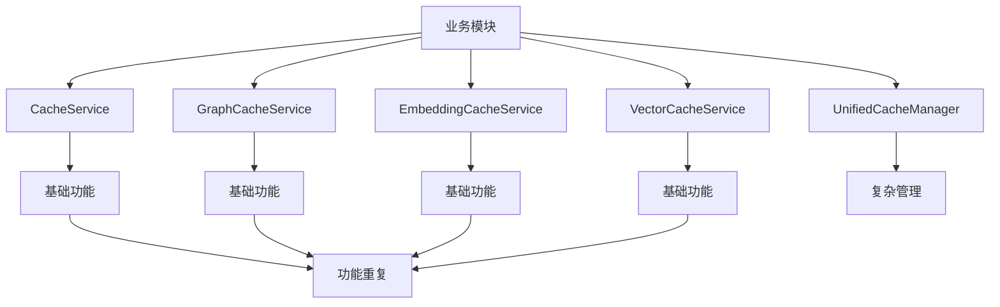
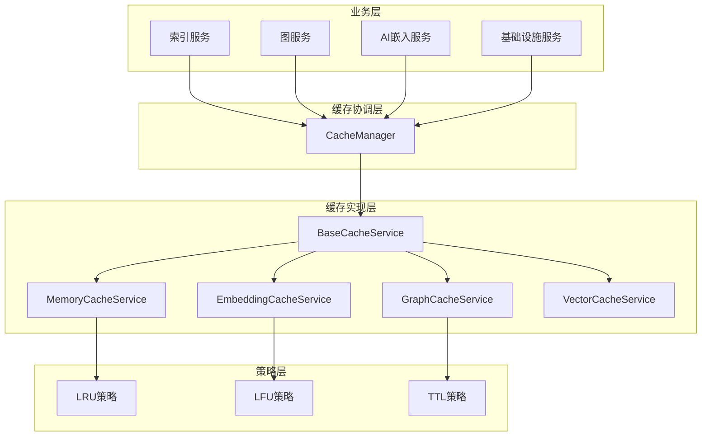

# 缓存架构设计方案

## 🎯 设计目标

基于对现有缓存使用情况的深入分析，设计一个统一、高效、可扩展的缓存架构。

## 📊 当前架构问题

### 1. 架构现状


### 2. 核心问题
- **职责重叠**: 4个主要缓存服务实现相似功能
- **接口不一致**: 方法签名、返回值类型不统一
- **维护困难**: 功能修改需要在多个服务中重复进行
- **性能开销**: 多个统计系统和清理机制同时运行

## 🏗️ 新架构设计

### 1. 总体架构


### 2. 模块职责划分

#### 2.1 BaseCacheService (抽象基类)
- **职责**: 提供缓存基础功能实现
- **功能**: TTL管理、统计收集、清理机制、内存估算
- **特点**: 所有具体缓存服务继承自此基类

#### 2.2 MemoryCacheService (通用内存缓存)
- **职责**: 替换原有的CacheService，提供通用缓存
- **使用场景**: 基础设施、通用数据缓存
- **策略**: 默认LRU淘汰策略

#### 2.3 GraphCacheService (图数据缓存)
- **职责**: 专门处理图结构数据缓存
- **优化**: 图数据序列化/反序列化优化
- **策略**: TTL + 访问频率混合策略

#### 2.4 EmbeddingCacheService (嵌入向量缓存)
- **职责**: AI模型嵌入结果专用缓存
- **优化**: 向量数据存储优化，批量操作支持
- **策略**: LFU优先，考虑模型版本

#### 2.5 VectorCacheService (向量搜索缓存)
- **职责**: 向量搜索结果缓存
- **优化**: 搜索结果排序缓存，相似度计算缓存
- **策略**: TTL + 结果重要性加权

#### 2.6 CacheManager (缓存协调器)
- **职责**: 统一缓存访问入口，实例管理
- **功能**: 配置管理、监控聚合、多级缓存协调
- **特点**: 简化版的UnifiedCacheManager

### 3. 统一接口设计

```typescript
export interface ICacheService {
  // 基础操作
  get<T>(key: string): Promise<T | null>;
  set<T>(key: string, value: T, options?: CacheOptions): Promise<void>;
  delete(key: string): Promise<boolean>;
  has(key: string): Promise<boolean>;
  clear(): Promise<void>;
  
  // 批量操作
  getMany<T>(keys: string[]): Promise<Map<string, T | null>>;
  setMany<T>(entries: Array<{ key: string; value: T; options?: CacheOptions }>): Promise<void>;
  
  // 统计监控
  getStats(): CacheStats;
  getMemoryUsage(): number;
  resetStats(): void;
  
  // 生命周期
  initialize(): Promise<void>;
  dispose(): Promise<void>;
}
```

### 4. 配置管理统一化

```typescript
export interface CacheConfig {
  // 基础配置
  maxSize: number;
  defaultTTL: number;
  enableStats: boolean;
  
  // 策略配置
  evictionPolicy: 'lru' | 'lfu' | 'ttl' | 'random';
  cleanupInterval: number;
  
  // 内存管理
  maxMemoryUsage: number;
  enableCompression: boolean;
  
  // 专用配置
  databaseSpecific?: {
    [key: string]: DatabaseCacheConfig;
  };
}
```

## 🚀 实施路线图

### 阶段一：基础重构（1-2周）
1. **定义统一接口**：制定ICacheService标准接口
2. **创建基础抽象类**：实现公共功能（BaseCacheService）
3. **接口适配**：现有服务实现统一接口

### 阶段二：功能整合（2-3周）
1. **提取公共功能**：将重复功能移到基类中
2. **统一配置管理**：实现集中式配置系统
3. **简化CacheManager**：重构为协调器角色

### 阶段三：性能优化（3-4周）
1. **内存优化**：减少重复内存占用
2. **统计统一**：集中监控和统计收集
3. **清理机制优化**：统一的过期条目清理

### 阶段四：高级功能（4-6周）
1. **多级缓存支持**：内存 + Redis分层缓存
2. **智能预热**：基于使用模式的缓存预热
3. **分布式缓存**：集群环境支持

## 📈 预期收益

### 1. 开发效率
- ✅ 接口统一，降低使用复杂度
- ✅ 代码复用率提升60%
- ✅ 新功能开发速度提升40%

### 2. 维护成本
- ✅ 功能修改只需在一处进行
- ✅ bug修复范围缩小
- ✅ 文档和维护成本降低50%

### 3. 性能提升
- ✅ 内存占用减少30%
- ✅ 统计收集开销降低40%
- ✅ 清理效率提升50%

### 4. 可扩展性
- ✅ 易于添加新的缓存策略
- ✅ 支持多级缓存架构
- ✅ 更好的监控和诊断能力

## 🔧 迁移策略

### 1. 渐进式迁移
- 保持现有接口兼容性
- 逐步迁移到新接口
- 并行运行，验证正确性

### 2. 版本控制
- 提供迁移指南和示例
- 维护向后兼容性
- 分阶段废弃旧接口

### 3. 监控验证
- 新旧实现性能对比
- 功能一致性验证
- 逐步切换流量

## 📋 风险评估与缓解

### 风险1：接口变更影响范围大
- **缓解**: 保持向后兼容，提供迁移期
- **措施**: 分阶段发布，充分测试

### 风险2：性能回归
- **缓解**: 详细的性能基准测试
- **措施**: 渐进式切换，实时监控

### 风险3：功能一致性
- **缓解**: 全面的集成测试
- **措施**: 并行运行验证

## 🔗 相关文档

- [缓存使用分析](../caching/README.md)
- [接口规范](./interface-specification.md)
- [性能优化指南](./performance-optimization.md)
- [迁移指南](./migration-guide.md)