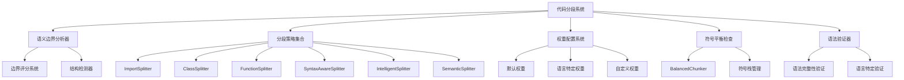
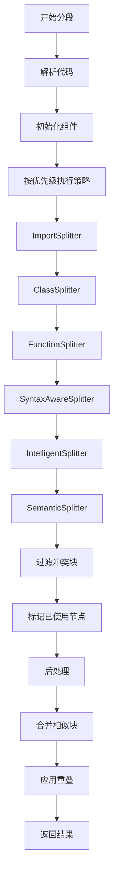

# 代码分段系统文档

## 概述

本文档集合详细介绍了 `src\service\parser\` 模块中分段时寻找语义边界的所有策略及最终分段边界的确定逻辑。代码分段系统是一个多层次、多策略的复杂系统，旨在确保代码分段在语法正确性和语义完整性方面达到最佳效果。

## 文档结构

1. [语义边界策略概述](semantic-boundary-strategies.md) - 系统整体概述和边界确定流程
2. [语义边界分析器详解](semantic-boundary-analyzer.md) - 语义边界分析器的核心实现
3. [分段策略中的边界确定逻辑](chunking-boundary-logic.md) - 各种分段策略的详细实现
4. [分段单位与边界确定](chunking-units-and-boundaries.md) - 分段单位类型和边界确定方式
5. [查询时自动合并相邻块的设计](query-time-chunk-merging.md) - 查询时自动合并相邻块的设计与实现
6. [语言权重配置系统](language-weights-configuration.md) - 权重配置系统详解
7. [符号平衡检查与语法验证](symbol-balance-and-syntax-validation.md) - 符号平衡和语法验证实现

## 系统架构

### 核心组件



### 分段流程



## 关键特性

### 1. 多策略分段

系统采用多策略分段机制，按优先级执行不同的分段策略：

- **ImportSplitter**: 处理导入语句（最高优先级）
- **ClassSplitter**: 处理类和接口定义
- **FunctionSplitter**: 处理函数和方法
- **SyntaxAwareSplitter**: 语法感知分段
- **IntelligentSplitter**: 智能分段（后备方案）
- **SemanticSplitter**: 语义分段（最后后备）

### 2. 语义边界分析

语义边界分析器通过多维度评估代码行作为分段边界的适合度：

- **语法完整性检查** (权重: 0.3)
- **语义边界检查** (权重: 0.4)
- **逻辑分组检查** (权重: 0.5)
- **注释边界检查** (权重: 0.1)

### 3. 语言特定权重

系统为不同编程语言提供特定的权重配置：

- **TypeScript/JavaScript**: 语法和函数权重较高
- **Python**: 函数和类权重较高，导入权重中等
- **Java/C#**: 语法和函数权重较高，逻辑权重较低
- **Go/Rust**: 函数权重较高，类权重较低

### 4. 符号平衡检查

符号平衡检查确保分段不会破坏语法结构：

- **括号平衡**: 圆括号 `()` 平衡检查
- **花括号平衡**: 花括号 `{}` 平衡检查
- **方括号平衡**: 方括号 `[]` 平衡检查
- **模板字符串平衡**: 模板字符串 `` ` `` 平衡检查

### 5. 语法验证

语法验证确保分段后的代码片段语法正确：

- **符号平衡验证**: 使用 BalancedChunker 验证符号平衡
- **语言特定验证**: 针对不同编程语言的特定语法检查
- **错误处理**: 优雅处理验证失败的情况

## 使用示例

### 基本使用

```typescript
// 创建代码分割器
const splitter = new ASTCodeSplitter(treeSitterService, logger);

// 分段代码
const chunks = await splitter.split(code, language, filePath);

// 处理分段结果
chunks.forEach(chunk => {
  console.log(`Chunk ${chunk.metadata.startLine}-${chunk.metadata.endLine}:`);
  console.log(chunk.content);
});
```

### 自定义权重配置

```typescript
// 创建语义边界分析器
const analyzer = new SemanticBoundaryAnalyzer();

// 设置自定义权重
analyzer.setCustomWeights('python', {
  syntactic: 0.8,
  function: 0.95,
  class: 0.95,
  method: 0.85,
  import: 0.9,
  logical: 0.8,
  comment: 0.6
});
```

### 自定义分段选项

```typescript
const options = {
  maxChunkSize: 1000,
  overlapSize: 100,
  enableChunkDeduplication: true,
  enablePerformanceOptimization: true,
  classSpecificOptions: {
    keepMethodsTogether: true
  },
  functionSpecificOptions: {
    preferWholeFunctions: true,
    maxFunctionLines: 100
  }
};

const chunks = await splitter.split(code, language, filePath, options);
```

## 性能优化

### 1. 缓存机制

- **LRU 缓存**: 使用最近最少使用算法缓存分析结果
- **预缓存**: 预缓存常见代码模式
- **哈希优化**: 使用简单哈希函数快速识别重复代码行

### 2. 内存管理

- **缓存大小限制**: 限制缓存大小防止内存溢出
- **定期清理**: 定期清理过期缓存条目
- **内存监控**: 监控内存使用情况

### 3. 优化级别

系统根据代码大小自动调整优化级别：

- **低级别**: 小文件（< 50 行），使用基本符号跟踪
- **中级别**: 中等文件（50-500 行），使用缓存优化
- **高级别**: 大文件（> 500 行），使用完整优化策略

## 扩展性

### 1. 新增分段策略

```typescript
// 创建自定义分段策略
class CustomSplitter extends BaseSplitStrategy {
  getName(): string {
    return 'CustomSplitter';
  }
  
  supportsLanguage(language: string): boolean {
    return language === 'custom-language';
  }
  
  getPriority(): number {
    return 1; // 高优先级
  }
  
  async split(
    content: string,
    language: string,
    filePath?: string,
    options?: ChunkingOptions,
    nodeTracker?: any,
    ast?: any
  ): Promise<CodeChunk[]> {
    // 自定义分段逻辑
    return chunks;
  }
}

// 注册自定义策略
strategyFactory.registerStrategy('CustomSplitter', CustomSplitter);
```

### 2. 新增语言支持

```typescript
// 添加新语言的权重配置
LanguageWeights.setWeights('new-language', {
  syntactic: 0.8,
  function: 0.9,
  class: 0.7,
  method: 0.8,
  import: 0.7,
  logical: 0.6,
  comment: 0.4
});
```

### 3. 自定义边界检测

```typescript
// 扩展结构检测器
class CustomStructureDetector extends StructureDetector {
  isCustomStructure(line: string): boolean {
    // 自定义结构检测逻辑
    return /custom-pattern/.test(line);
  }
  
  detectStructureType(line: string): string | null {
    if (this.isCustomStructure(line)) {
      return 'custom_structure';
    }
    return super.detectStructureType(line);
  }
}
```

## 最佳实践

### 1. 分段策略选择

- **小型文件**: 使用 SemanticSplitter 或 IntelligentSplitter
- **中型文件**: 使用 SyntaxAwareSplitter 或 FunctionSplitter
- **大型文件**: 使用协调器组合多种策略

### 2. 权重配置

- **函数式语言**: 提高函数权重
- **面向对象语言**: 提高类和方法权重
- **脚本语言**: 提高逻辑和注释权重

### 3. 性能优化

- **启用缓存**: 对于重复代码，启用缓存机制
- **调整块大小**: 根据内存限制调整最大块大小
- **监控性能**: 使用性能监控系统跟踪分段效率

## 故障排除

### 1. 常见问题

- **分段过多**: 调整权重配置，降低边界评分阈值
- **分段过少**: 提高边界评分阈值，增加最大块大小
- **语法错误**: 检查符号平衡和语法验证配置

### 2. 调试技巧

- **启用日志**: 使用详细日志记录分段过程
- **分析评分**: 检查边界评分和权重配置
- **验证结果**: 使用语法验证器检查分段结果

## 总结

代码分段系统通过多层次的策略和评分机制，确保代码分段在语法正确性和语义完整性方面达到最佳效果。系统结合了语法分析、符号平衡、语义边界检测和权重配置，为不同编程语言提供了灵活而精确的分段能力。

通过本文档集合，开发者可以深入了解系统的内部机制，并根据特定需求进行定制和扩展。