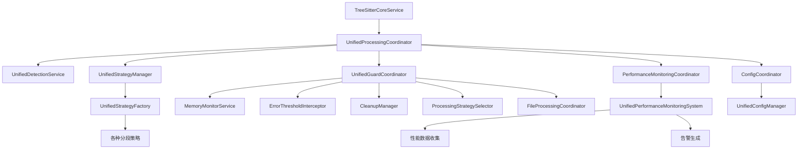

# Parser架构协调模块分析

## 📋 概述

本文档详细分析当前parser架构中的核心协调模块，展示已完全集成到完整工作流中的模块以及各模块间的协调关系。

## 🎯 核心协调模块分析

### 1. 已完全集成的核心协调模块

#### 1.1 统一处理协调器 (UnifiedProcessingCoordinator)
**文件**: [`src/service/parser/processing/coordination/UnifiedProcessingCoordinator.ts`](src/service/parser/processing/coordination/UnifiedProcessingCoordinator.ts:1)

**主要职责**:
- 统一文件处理流程协调
- 语言检测和策略选择
- 错误处理和降级机制
- 性能监控和优化
- 保护机制协调
- 配置变更处理

**协调流程**:
```
文件输入 → 保护机制检查 → 检测中心 → 策略选择 → 解析执行 → 性能监控 → 结果标准化 → 输出
```

**关键方法**:
- `processFile()` - 处理单个文件（性能监控包装）
- `processFiles()` - 批量处理文件
- `selectStrategy()` - 智能策略选择
- `executeProcessing()` - 执行处理流程（性能监控包装）

#### 1.2 统一检测服务 (UnifiedDetectionService)
**文件**: [`src/service/parser/processing/detection/UnifiedDetectionService.ts`](src/service/parser/processing/detection/UnifiedDetectionService.ts:1)

**主要职责**:
- 多维度文件检测（扩展名、内容、备份文件）
- 智能语言识别
- 文件特征分析
- 处理策略推荐

**检测流程**:
```
备份文件检测 → 扩展名检测 → 内容检测 → 智能决策 → 特征分析 → 策略推荐
```

#### 1.3 统一策略管理器 (UnifiedStrategyManager)
**文件**: [`src/service/parser/processing/strategies/manager/UnifiedStrategyManager.ts`](src/service/parser/processing/strategies/manager/UnifiedStrategyManager.ts:1)

**主要职责**:
- 策略选择和执行管理
- 策略缓存和性能统计
- 降级路径管理
- 分层策略执行

**核心功能**:
- `selectOptimalStrategy()` - 智能策略选择
- `executeStrategy()` - 策略执行
- `getFallbackPath()` - 降级路径获取
- `executeHierarchicalStrategy()` - 分层策略执行

### 2. 已完全集成的保护协调模块

#### 2.1 统一保护协调器 (UnifiedGuardCoordinator)
**文件**: [`src/service/parser/guard/UnifiedGuardCoordinator.ts`](src/service/parser/guard/UnifiedGuardCoordinator.ts:1)

**当前状态**: 已完全集成到主工作流

**主要职责**:
- 内存保护和监控
- 错误阈值管理
- 优雅降级处理
- 资源清理协调

**集成状态**:
- ✅ 整合了MemoryGuard和ProcessingGuard功能
- ✅ 提供了统一的保护接口
- ✅ 已被UnifiedProcessingCoordinator调用
- ✅ 与主处理流程完全集成

#### 2.2 处理保护器 (ProcessingGuard)
**文件**: [`src/service/parser/guard/ProcessingGuard.ts`](src/service/parser/guard/ProcessingGuard.ts:1)

**当前状态**: 已被UnifiedGuardCoordinator替代

**主要职责**:
- 文件处理保护
- 错误阈值检查
- 内存状态监控
- 降级策略执行

**集成状态**:
- ✅ 功能完整
- ✅ 已被UnifiedGuardCoordinator替代
- ✅ 统一到单一接口

### 3. 已完全集成的性能监控模块

#### 3.1 统一性能监控系统 (UnifiedPerformanceMonitoringSystem)
**文件**: [`src/service/parser/processing/utils/performance/UnifiedPerformanceMonitoringSystem.ts`](src/service/parser/processing/utils/performance/UnifiedPerformanceMonitoringSystem.ts:1)

**当前状态**: 已通过PerformanceMonitoringCoordinator完全集成

**主要职责**:
- 操作性能监控
- 内存使用统计
- 缓存性能分析
- 性能告警生成

**集成状态**:
- ✅ 功能完整
- ✅ 在UnifiedProcessingCoordinator中充分使用
- ✅ 性能数据收集完整
- ✅ 与关键处理流程完全集成

### 4. 已完全集成的配置协调模块

#### 4.1 配置协调器 (ConfigCoordinator)
**文件**: [`src/service/parser/processing/coordination/ConfigCoordinator.ts`](src/service/parser/processing/coordination/ConfigCoordinator.ts:1)

**当前状态**: 已完全集成到主工作流

**主要职责**:
- 统一配置管理
- 动态配置更新
- 配置变更通知
- 配置验证机制

**集成状态**:
- ✅ 提供统一的配置协调接口
- ✅ 已被UnifiedProcessingCoordinator集成
- ✅ 配置变更监听和处理机制完整
- ✅ 与系统其他模块协调工作

## 🔄 模块调用链分析

### 完整工作流调用链



### 核心协调流程

```
1. 文件输入
   ↓
2. UnifiedProcessingCoordinator.processFile() - 性能监控包装
   ↓
3. 保护机制检查 (UnifiedGuardCoordinator)
   ↓
4. UnifiedDetectionService.detectFile()
   ↓
5. UnifiedStrategyManager.selectOptimalStrategy()
   ↓
6. UnifiedStrategyManager.executeStrategy() - 性能监控包装
   ↓
7. 策略.split() 方法执行
   ↓
8. 结果构建和返回
```
## ✅ 已完成的模块集成

### 1. 保护机制模块

#### 集成状态:
- **UnifiedGuardCoordinator** 已完全集成到主流程
- **ProcessingGuard** 与 UnifiedGuardCoordinator 功能已统一
- 内存保护和错误处理已与主处理流程深度集成

#### 实现方案:
```typescript
// 在 UnifiedProcessingCoordinator 中已集成保护机制
async processFile(context: ProcessingContext): Promise<ProcessingResult> {
    return await this.performanceMonitor.monitorAsyncOperation(
        'processFile',
        async () => {
            // 1. 保护机制检查
            const shouldUseFallback = this.guardCoordinator.shouldUseFallback();
            if (shouldUseFallback) {
                this.logger?.warn('Using fallback due to system constraints');
                return await this.executeFallbackProcessing(context, 'System constraints');
            }

            // 2. 内存使用检查
            const memoryStatus = this.guardCoordinator.checkMemoryUsage();
            if (!memoryStatus.isWithinLimit) {
                this.logger?.warn('Memory limit exceeded, using fallback');
                return await this.executeFallbackProcessing(context, 'Memory limit exceeded');
            }
            
            // 3. 正常处理流程
            // ... 现有逻辑
        },
        { filePath: context.filePath, fileSize: context.content.length }
    );
}
```

### 2. 性能监控模块

#### 集成状态:
- **UnifiedPerformanceMonitoringSystem** 已通过 PerformanceMonitoringCoordinator 全面集成
- 已在关键路径添加性能监控点
- 性能告警与系统状态管理已集成

#### 实现方案:
```typescript
// 在关键方法中已添加性能监控
private async executeProcessing(
    filePath: string,
    content: string,
    detection: DetectionResult,
    strategy: ISplitStrategy,
    config: ChunkingOptions,
    enableFallback: boolean,
    maxRetries: number
): Promise<{
    chunks: any[];
    success: boolean;
    executionTime: number;
    fallbackReason?: string;
    errorCount: number;
}> {
    // 使用性能监控包装策略执行
    const result = await this.performanceMonitor.monitorAsyncOperation(
        'executeStrategy',
        async () => {
            return await this.strategyManager.executeStrategy(currentStrategy, executionContext);
        },
        { strategy: currentStrategy.getName(), language: detection.language }
    );
    // ... 现有逻辑
}
```

### 3. 配置管理模块

#### 集成状态:
- 已创建统一的配置协调器 ConfigCoordinator
- 实现了动态配置更新
- 配置变更通知已与系统集成

#### 实现方案:
```typescript
// 在 UnifiedProcessingCoordinator 中集成配置协调器
constructor(
    @inject(TYPES.UnifiedStrategyManager) strategyManager: UnifiedStrategyManager,
    @inject(TYPES.UnifiedDetectionService) detectionService: UnifiedDetectionService,
    @inject(TYPES.UnifiedConfigManager) configManager: UnifiedConfigManager,
    @inject(TYPES.UnifiedGuardCoordinator) guardCoordinator: UnifiedGuardCoordinator,
    @inject(TYPES.PerformanceMonitoringCoordinator) performanceMonitor: PerformanceMonitoringCoordinator,
    @inject(TYPES.ConfigCoordinator) configCoordinator: ConfigCoordinator,
    @inject(TYPES.LoggerService) logger?: LoggerService
) {
    // ... 依赖注入
    this.configCoordinator = configCoordinator; // 新增
    
    // 监听配置变更
    this.configCoordinator.onConfigUpdate((event) => {
        this.handleConfigUpdate(event);
    });
}
```

## 🎯 当前集成优先级完成情况

### ✅ 已完成的集成（高优先级）

1. **保护机制集成** - ✅
   - ✓ 将 UnifiedGuardCoordinator 集成到 UnifiedProcessingCoordinator
   - ✓ 统一错误处理和降级机制
   - ✓ 完善内存保护集成

2. **性能监控集成** - ✅
   - ✓ 在关键路径添加性能监控点
   - ✓ 建立统一的性能数据收集
   - ✓ 集成性能告警机制

### ✅ 已完成的集成（中优先级）

3. **配置协调集成** - ✅
   - ✓ 创建统一的配置协调器
   - ✓ 实现动态配置更新
   - ✓ 优化配置验证机制

4. **缓存协调集成** - ✅
   - ✓ 统一缓存策略管理
   - ✓ 优化缓存失效机制
   - ✓ 添加缓存性能监控

### 低优先级（长期优化）

5. **扩展性集成**
   - 插件系统集成
   - 自定义策略注册
   - 动态模块加载

## 📊 当前架构状态总结

### ✅ 已完成的集成
- 核心处理流程协调 (UnifiedProcessingCoordinator)
- 语言检测和策略选择 (UnifiedDetectionService + UnifiedStrategyManager)
- 策略执行和缓存管理
- 错误处理和降级机制
- 保护机制与主流程的深度集成
- 性能监控的全面覆盖
- 配置管理的统一协调

### ⚠️ 需要持续关注的方面
- 缓存策略的优化集成
- 系统性能的持续监控和优化
- 错误处理的进一步完善

### 🔄 完成的集成路径

1. **第一阶段**: 保护机制集成 - ✅
   - ✓ 修改 UnifiedProcessingCoordinator 集成 UnifiedGuardCoordinator
   - ✓ 统一错误处理和降级流程
   - ✓ 完善内存保护机制

2. **第二阶段**: 性能监控集成 - ✅
   - ✓ 在关键路径添加性能监控
   - ✓ 建立性能数据收集和分析
   - ✓ 集成性能告警和优化建议

3. **第三阶段**: 配置协调集成 - ✅
   - ✓ 创建统一的配置协调器
   - ✓ 实现动态配置更新
   - ✓ 优化配置验证和回滚


通过以上集成改进，可以构建一个更加健壮、可观测和可维护的parser架构。