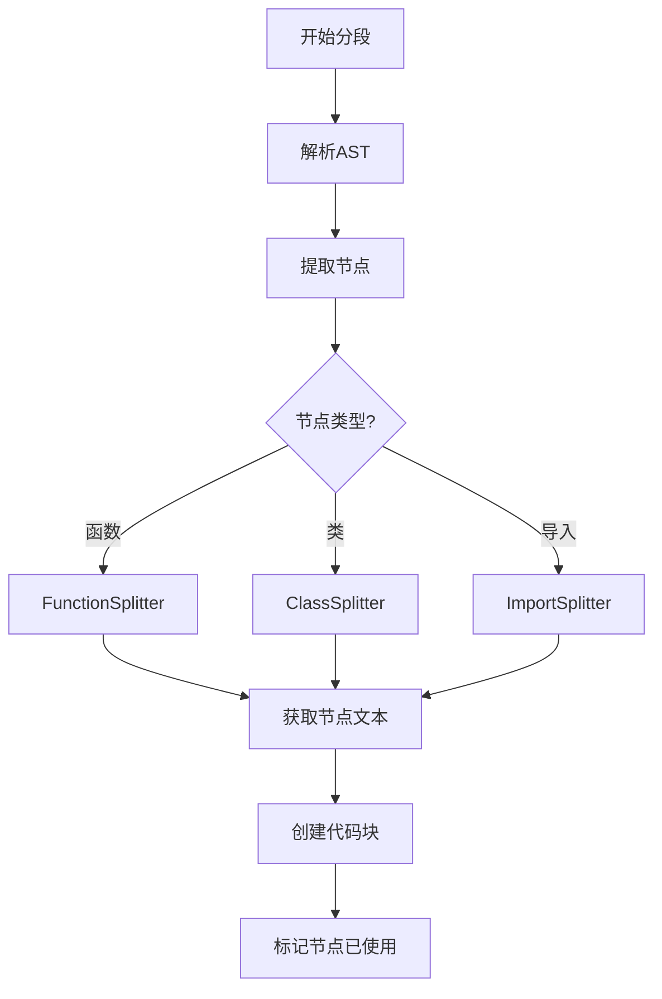
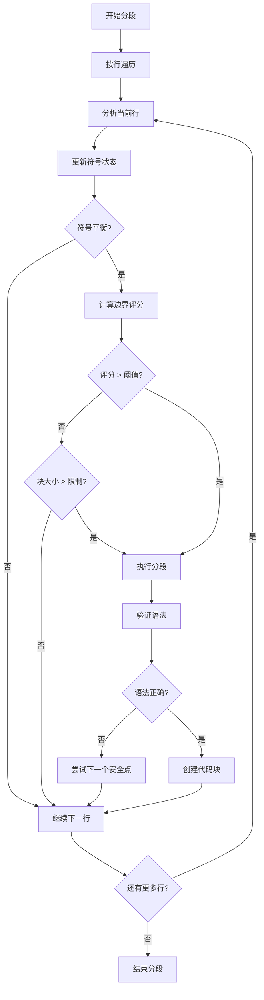

# 分段单位与边界确定

## 概述

代码分段系统并非总是以行为单位进行分块，而是根据不同的策略采用不同的分段单位。本文档详细说明各种分段策略的分段单位和边界确定方式。

## 分段单位类型

### 1. AST 节点级分段

#### 1.1 FunctionSplitter 和 ClassSplitter

`FunctionSplitter` 和 `ClassSplitter` 使用 AST 节点级分段，不以行为单位，而是以完整的语法结构为单位：

```typescript
// 获取函数文本和位置信息
const functionText = this.treeSitterService!.getNodeText(functionNode, content);
const location = this.treeSitterService!.getNodeLocation(functionNode);
```

**特点**:
- 分段单位是完整的函数或类定义
- 边界由 AST 节点的 `startIndex` 和 `endIndex` 确定
- 不受行边界限制，可以跨越多行
- 保证语法结构的完整性

#### 1.2 ImportSplitter

`ImportSplitter` 同样使用 AST 节点级分段：

```typescript
// 获取导入文本和位置信息
const importText = this.treeSitterService!.getNodeText(importNode, content);
const location = this.treeSitterService!.getNodeLocation(importNode);
```

**特点**:
- 分段单位是完整的导入语句
- 边界由 AST 节点确定
- 支持多行导入语句

### 2. 行级分段

#### 2.1 IntelligentSplitter

`IntelligentSplitter` 主要采用行级分段，但结合语义边界分析：

```typescript
for (let i = 0; i < lines.length; i++) {
  const line = lines[i];
  const lineSize = line.length + 1; // +1 for newline
  
  // 更新符号跟踪
  this.balancedChunker.analyzeLineSymbols(line, i + 1);
  
  // 使用语义边界评分检查是否应该在逻辑边界处分段
  const shouldSplit = this.shouldSplitWithSemanticBoundary(
    line,
    currentChunk,
    currentSize,
    lineSize,
    this.options.maxChunkSize,
    language,
    lines,
    i
  );
}
```

**特点**:
- 基本单位是行
- 但分段决策考虑多行上下文
- 结合符号平衡和语义边界分析

#### 2.2 SemanticSplitter

`SemanticSplitter` 也采用行级分段：

```typescript
for (let i = 0; i < maxLines; i++) {
  const line = lines[i];
  const trimmedLine = line.trim();
  
  // 计算语义分数
  const lineScore = this.complexityCalculator.calculateSemanticScore(trimmedLine);
  semanticScore += lineScore;
  
  // 决定是否分段
  const shouldSplit = semanticScore > this.options.maxChunkSize * 0.8 ||
    (trimmedLine === '' && currentChunk.length > 3) ||
    i === maxLines - 1;
}
```

**特点**:
- 基本单位是行
- 基于语义分数累积决定分段
- 考虑空行作为自然边界

### 3. 混合分段单位

#### 3.1 SyntaxAwareSplitter

`SyntaxAwareSplitter` 采用混合分段单位，结合 AST 节点和行级处理：

```typescript
// 1. 函数和方法分段（包含嵌套函数）
if (this.functionSplitter && typeof (this.functionSplitter as any).extractFunctions === 'function') {
  const functionChunks = (this.functionSplitter as any).extractFunctions(content, parseResult.ast, language, filePath);
  if (functionChunks && functionChunks.length > 0) {
    chunks.push(...functionChunks);
  }
}

// 2. 类和接口分段
if (this.classSplitter && typeof (this.classSplitter as any).extractClasses === 'function') {
  const classChunks = (this.classSplitter as any).extractClasses(content, parseResult.ast, language, filePath);
  if (classChunks && classChunks.length > 0) {
    chunks.push(...classChunks);
  }
}
```

**特点**:
- 优先使用 AST 节点级分段
- 对于无法用 AST 处理的部分，回退到行级分段
- 结合多种策略的优势

## 边界确定方式

### 1. AST 节点边界

AST 节点边界由 TreeSitter 解析器确定，基于语法结构：

```typescript
// 使用tree-sitter节点的正确位置信息
const startLine = item.startPosition ? item.startPosition.row + 1 : 1;
const endLine = item.endPosition ? item.endPosition.row + 1 : startLine + 1;

// 确保行号在有效范围内
const adjustedStartLine = Math.max(1, Math.min(startLine, lines.length));
const adjustedEndLine = Math.max(adjustedStartLine, Math.min(endLine, lines.length));

const content = lines.slice(adjustedStartLine - 1, adjustedEndLine).join('\n');
```

**特点**:
- 边界精确对应语法结构
- 不受行边界限制
- 保证语法完整性

### 2. 语义边界

语义边界由 `SemanticBoundaryAnalyzer` 确定，基于多维度评分：

```typescript
calculateBoundaryScore(line: string, context: string[], language: string): BoundaryScore {
  // 使用公共的权重配置
  const weights = this.weightsProvider.getWeights(language);
  
  let score = 0;
  
  // 1. 基础语法完整性检查 (权重: 0.3)
  if (this.isSyntacticallySafe(line)) {
    score += weights.syntactic * 0.3;
  }
  
  // 2. 语义边界检查 (权重: 0.4)
  if (this.isFunctionEnd(line)) score += weights.function * 0.4;
  if (this.isClassEnd(line)) score += weights.class * 0.4;
  if (this.isMethodEnd(line)) score += weights.method * 0.35;
  if (this.isImportEnd(line)) score += weights.import * 0.2;
  
  // 3. 逻辑分组检查 (权重: 0.5)
  if (this.isEmptyLine(line) && this.hasLogicalSeparation(context)) {
    score += weights.logical * 0.5;
  }
  
  // 4. 注释边界检查 (权重: 0.1)
  if (this.isCommentBlockEnd(line)) score += weights.comment * 0.1;
}
```

**特点**:
- 考虑语法完整性
- 考虑语义结构
- 考虑逻辑分组
- 考虑注释边界

### 3. 符号平衡边界

符号平衡边界由 `BalancedChunker` 确定，确保不破坏语法结构：

```typescript
canSafelySplit(): boolean {
  return this.symbolStack.brackets === 0 &&
         this.symbolStack.braces === 0 &&
         this.symbolStack.squares === 0 &&
         this.symbolStack.templates === 0;
}
```

**特点**:
- 确保符号平衡
- 防止破坏语法结构
- 支持嵌套结构

## 分段决策流程

### 1. AST 节点级分段决策



### 2. 行级分段决策



## 分段单位对比

| 分段策略 | 分段单位 | 边界确定方式 | 优点 | 缺点 |
|---------|---------|-------------|------|------|
| FunctionSplitter | AST 节点 | AST 节点边界 | 语法完整性高 | 依赖 AST 解析 |
| ClassSplitter | AST 节点 | AST 节点边界 | 语法完整性高 | 依赖 AST 解析 |
| ImportSplitter | AST 节点 | AST 节点边界 | 导入语句完整 | 依赖 AST 解析 |
| IntelligentSplitter | 行 | 语义边界评分 | 灵活性高 | 可能破坏语法 |
| SemanticSplitter | 行 | 语义分数累积 | 简单高效 | 精确度较低 |
| SyntaxAwareSplitter | 混合 | AST + 语义边界 | 综合优势 | 复杂度高 |

## 实际应用示例

### 1. AST 节点级分段示例

```javascript
// 原始代码
function calculateSum(a, b) {
  return a + b;
}

class Calculator {
  add(a, b) {
    return this.calculateSum(a, b);
  }
}

// FunctionSplitter 分段结果
// 块 1:
function calculateSum(a, b) {
  return a + b;
}

// 块 2:
class Calculator {
  add(a, b) {
    return this.calculateSum(a, b);
  }
}
```

### 2. 行级分段示例

```javascript
// 原始代码
const x = 10;
const y = 20;

function calculateSum(a, b) {
  return a + b;
}

// IntelligentSplitter 分段结果（假设最大块大小较小）
// 块 1:
const x = 10;
const y = 20;

// 块 2:
function calculateSum(a, b) {
  return a + b;
}
```

## 总结

代码分段系统并非总是以行为单位进行分块，而是根据不同的策略采用不同的分段单位：

1. **AST 节点级分段**：FunctionSplitter、ClassSplitter、ImportSplitter 使用完整的语法结构作为分段单位
2. **行级分段**：IntelligentSplitter、SemanticSplitter 以行为基本单位，但结合语义分析
3. **混合分段**：SyntaxAwareSplitter 结合 AST 节点和行级处理

这种多层次的分段策略确保了系统在不同场景下都能提供最优的分段效果，既保证了语法完整性，又提供了足够的灵活性。