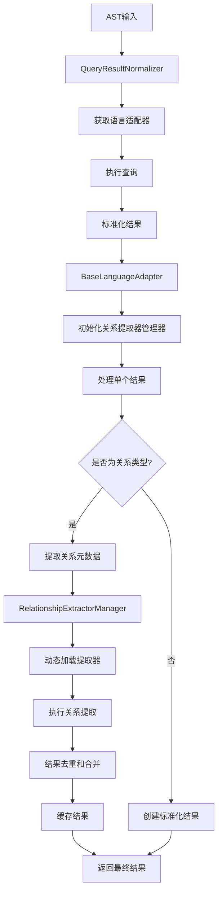
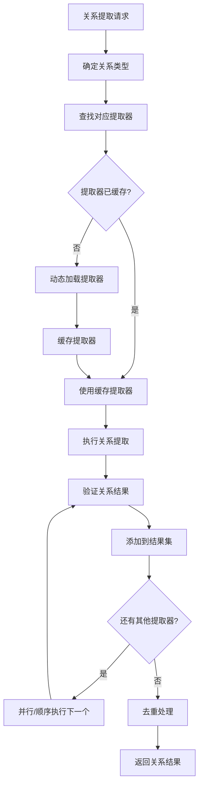

# 标准化模块关系提取机制分析

## 概述

本文档深入分析了 `src/service/parser/core/normalization` 目录中关系提取的实现机制。该模块采用多层次架构设计，通过抽象工厂模式、策略模式和模板方法模式，实现了高效、可扩展的代码关系提取功能。

## 1. 整体架构设计

### 1.1 架构层次

关系提取系统采用分层架构，从上到下包括：

```
┌─────────────────────────────────────────────────────────────┐
│                    应用层 (Application Layer)                │
├─────────────────────────────────────────────────────────────┤
│  RelationshipAnalyzer (核心关系分析器)                      │
├─────────────────────────────────────────────────────────────┤
│                    服务层 (Service Layer)                   │
├─────────────────────────────────────────────────────────────┤
│  QueryResultNormalizer (查询结果标准化器)                    │
├─────────────────────────────────────────────────────────────┤
│                    管理层 (Management Layer)                │
├─────────────────────────────────────────────────────────────┤
│  RelationshipExtractorManager (关系提取器管理器)             │
├─────────────────────────────────────────────────────────────┤
│                    适配层 (Adapter Layer)                   │
├─────────────────────────────────────────────────────────────┤
│  BaseLanguageAdapter + Language Adapters                    │
├─────────────────────────────────────────────────────────────┤
│                    提取层 (Extraction Layer)                │
├─────────────────────────────────────────────────────────────┤
│  BaseRelationshipExtractor + Specific Extractors            │
├─────────────────────────────────────────────────────────────┤
│                    基础层 (Foundation Layer)                │
├─────────────────────────────────────────────────────────────┤
│  Helper Methods + Utils + Types                            │
└─────────────────────────────────────────────────────────────┘
```

### 1.2 设计模式应用

1. **抽象工厂模式**: `BaseRelationshipExtractor` 作为抽象工厂，创建具体的关系提取器
2. **策略模式**: 不同类型的关系提取器实现不同的提取策略
3. **模板方法模式**: `BaseLanguageAdapter` 定义标准化流程模板，子类实现具体步骤
4. **适配器模式**: 语言适配器将不同语言的AST转换为统一格式
5. **单例模式**: 全局提取器注册表 `globalExtractorRegistry`

## 2. 核心组件分析

### 2.1 RelationshipAnalyzer (核心关系分析器)

**位置**: [`src/service/parser/core/normalization/RelationshipAnalyzer.ts`](src/service/parser/core/normalization/RelationshipAnalyzer.ts:1)

**核心功能**:
- 分析嵌套关系 (包含、继承、实现)
- 分析代码引用关系 (函数调用、变量引用)
- 分析代码依赖关系 (模块导入、包依赖)
- 构建调用图、继承层次、模块依赖图

**关键机制**:

```typescript
// 缓存机制
const cacheKey = `graph:nesting:${language}:${this.hashContent(content)}`;
const cached = this.cacheService.getFromCache<NestingRelationship[]>(cacheKey);

// 标准化系统集成
const normalizedResults = await this.queryNormalizer.normalize(ast, language);
const normalizedResult = this.convertNormalizedResults(normalizedResults);

// 降级机制
if (!normalizedResult || !normalizedResult.structures) {
  return this.analyzeNestingRelationshipsBasic(ast, content);
}
```

**性能优化**:
- 多级缓存策略 (内容哈希 + 语言 + 类型)
- 性能监控集成
- 异步处理机制
- 错误恢复和降级处理

### 2.2 BaseRelationshipExtractor (基础关系提取器)

**位置**: [`src/service/parser/core/normalization/base/BaseRelationshipExtractor.ts`](src/service/parser/core/normalization/base/BaseRelationshipExtractor.ts:1)

**抽象设计**:
- 定义关系提取的通用接口和基础实现
- 提供缓存、验证、日志等通用功能
- 支持可配置的提取选项

**核心抽象方法**:
```typescript
abstract getName(): string;
abstract getSupportedRelationshipTypes(): RelationshipType[];
abstract getRelationshipCategory(): RelationshipCategory;
abstract canHandle(astNode: Parser.SyntaxNode): boolean;
abstract extractRelationships(context: RelationshipExtractionContext): Promise<RelationshipResult[]>;
abstract extractMetadata(context: RelationshipExtractionContext): Promise<TMetadata>;
```

**通用功能**:
- 关系验证: `validateRelationship()`
- 缓存管理: `extractRelationshipsWithCache()`
- 节点操作: `extractNodeName()`, `findParentNode()`, `traverseAST()`
- 健康检查: `healthCheck()`

### 2.3 RelationshipExtractorManager (关系提取器管理器)

**位置**: [`src/service/parser/core/normalization/base/RelationshipExtractorManager.ts`](src/service/parser/core/normalization/base/RelationshipExtractorManager.ts:1)

**协调机制**:
- 管理多个关系提取器的注册、调度和执行
- 支持按语言和关系类型筛选提取器
- 提供并行和顺序执行模式

**核心功能**:
```typescript
// 提取器注册
registerExtractor(name: string, extractor: BaseRelationshipExtractor, options): void

// 按类型提取
async extractRelationshipsByType(relationshipType: RelationshipType, context): Promise<RelationshipResult[]>

// 并行执行
private async executeExtractorsParallel(extractors, context): Promise<RelationshipResult[]>

// 去重处理
private deduplicateRelationships(relationships: RelationshipResult[]): RelationshipResult[]
```

**高级特性**:
- 优先级调度
- 并行执行控制
- 结果去重
- 统计信息收集
- 健康检查

### 2.4 语言适配器系统

**基础适配器**: [`src/service/parser/core/normalization/adapters/base/BaseLanguageAdapter.ts`](src/service/parser/core/normalization/adapters/base/BaseLanguageAdapter.ts:1)

**C语言适配器示例**: [`src/service/parser/core/normalization/adapters/CLanguageAdapter.ts`](src/service/parser/core/normalization/adapters/CLanguageAdapter.ts:1)

**模板方法模式实现**:
```typescript
async normalize(queryResults: any[], queryType: string, language: string): Promise<StandardizedQueryResult[]> {
  // 1. 初始化处理上下文
  this.initializeProcessingContext(language);
  
  // 2. 预处理查询结果
  const preprocessedResults = this.preprocessResults(queryResults);
  
  // 3. 增强的标准化流程
  const standardizedResults = await this.processResultsWithEnhancedFlow(...);
  
  // 4. 后处理（去重、排序等）
  const finalResults = this.postProcessResults(standardizedResults);
  
  return finalResults;
}
```

**关系提取集成**:
```typescript
// 关系元数据提取
protected async extractRelationshipMetadata(result: any, standardType: string, astNode: Parser.SyntaxNode): Promise<any> {
  return await this.relationshipExtractorManager.extractMetadata(result, standardType, astNode, this.symbolTable);
}

// 高级关系提取方法
async extractDataFlowRelationships(result: any): Promise<Array<any>> {
  return await this.relationshipExtractorManager.extractDataFlowRelationships(result);
}
```

## 3. 具体关系提取器实现

### 3.1 C++ 调用关系提取器

**位置**: [`src/service/parser/core/normalization/adapters/cpp-utils/CallRelationshipExtractor.ts`](src/service/parser/core/normalization/adapters/cpp-utils/CallRelationshipExtractor.ts:1)

**实现模式**:
```typescript
export class CallRelationshipExtractor extends BaseRelationshipExtractor {
  extractCallMetadata(result: any, astNode: Parser.SyntaxNode, symbolTable: any): RelationshipMetadata | null {
    const calleeName = CppHelperMethods.extractCalleeName(astNode);
    const callerNode = CppHelperMethods.findCallerFunctionContext(astNode);
    const callContext = CppHelperMethods.analyzeCallContext(astNode);
    
    return {
      type: 'call',
      fromNodeId: callerNode ? CppHelperMethods.generateNodeId(callerNode) : 'unknown',
      toNodeId: functionNode ? CppHelperMethods.generateNodeId(functionNode) : 'unknown',
      callName: calleeName || 'unknown',
      callType: CppHelperMethods.determineCallType(astNode, null),
      callContext,
      location: CppHelperMethods.createLocationInfo(astNode, symbolTable?.filePath)
    };
  }
}
```

### 3.2 C++ 继承关系提取器

**位置**: [`src/service/parser/core/normalization/adapters/cpp-utils/InheritanceRelationshipExtractor.ts`](src/service/parser/core/normalization/adapters/cpp-utils/InheritanceRelationshipExtractor.ts:1)

**复杂继承关系处理**:
- 多重继承识别
- 虚继承检测
- 模板继承分析
- CRTP模式识别
- 虚函数重写检测

**继承类型判断**:
```typescript
private determineInheritanceType(astNode: Parser.SyntaxNode): string {
  if (nodeType === 'class_specifier' || nodeType === 'struct_specifier') {
    const baseClassClause = astNode.childForFieldName('base_class_clause');
    if (baseClassClause) {
      // 检查多重继承
      const baseClasses = this.extractBaseClasses(baseClassClause);
      if (baseClasses.length > 1) return 'multiple_inheritance';
      
      // 检查虚继承
      if (this.hasVirtualInheritance(baseClassClause)) return 'virtual_inheritance';
      
      // 检查模板继承
      if (this.hasTemplateInheritance(baseClassClause)) return 'template_inheritance';
      
      // 检查CRTP模式
      if (this.isCRTPPattern(astNode, baseClassClause)) return 'crtp_pattern';
    }
  }
  // ... 其他类型检查
}
```

### 3.3 C++ 依赖关系提取器

**位置**: [`src/service/parser/core/normalization/adapters/cpp-utils/DependencyRelationshipExtractor.ts`](src/service/parser/core/normalization/adapters/cpp-utils/DependencyRelationshipExtractor.ts:1)

**依赖类型覆盖**:
- 头文件包含 (`preproc_include`)
- Using声明 (`using_declaration`, `using_directive`)
- 模板依赖 (`template_type`, `template_function`)
- 命名空间 (`namespace_definition`)
- 友元声明 (`friend_declaration`)
- 继承依赖 (`base_class_clause`)

## 4. 类型系统设计

### 4.1 关系类型分类

**位置**: [`src/service/parser/core/normalization/types/RelationshipTypes.ts`](src/service/parser/core/normalization/types/RelationshipTypes.ts:1)

**关系类别枚举**:
```typescript
export enum RelationshipCategory {
  DATA_FLOW = 'data-flow',      // 数据流关系
  CONTROL_FLOW = 'control-flow', // 控制流关系
  SEMANTIC = 'semantic',        // 语义关系
  LIFECYCLE = 'lifecycle',      // 生命周期关系
  CONCURRENCY = 'concurrency',  // 并发关系
  ANNOTATION = 'annotation',    // 注解关系
  CALL = 'call',                // 调用关系
  CREATION = 'creation',        // 创建关系
  DEPENDENCY = 'dependency',    // 依赖关系
  INHERITANCE = 'inheritance',  // 继承关系
  REFERENCE = 'reference'       // 引用关系
}
```

**具体关系类型**:
- **数据流**: `assignment`, `parameter`, `return`, `field_access`, `channel_operation`
- **控制流**: `conditional`, `loop`, `exception`, `callback`, `select`, `switch`, `jump`
- **语义**: `overrides`, `overloads`, `delegates`, `observes`, `configures`, `implements`
- **生命周期**: `instantiates`, `initializes`, `destroys`, `manages`, `allocates`, `releases`
- **并发**: `synchronizes`, `locks`, `communicates`, `races`, `waits`, `coordinates`

### 4.2 关系结果接口

```typescript
export interface RelationshipResult {
  source: string;                    // 源节点ID
  target: string;                    // 目标节点ID
  type: RelationshipType;            // 关系类型
  category: RelationshipCategory;    // 关系类别
  metadata?: Record<string, any>;    // 元数据
  location?: {                       // 位置信息
    filePath: string;
    lineNumber: number;
    columnNumber: number;
  };
}
```

## 5. 缓存和性能优化

### 5.1 多级缓存策略

**内容级缓存**:
```typescript
// RelationshipAnalyzer 中的缓存
const cacheKey = `graph:nesting:${language}:${this.hashContent(content)}`;
const cached = this.cacheService.getFromCache<NestingRelationship[]>(cacheKey);
```

**适配器级缓存**:
```typescript
// BaseLanguageAdapter 中的缓存
protected cache?: LRUCache<string, StandardizedQueryResult[]>;
protected complexityCache?: LRUCache<string, number>;
```

**提取器级缓存**:
```typescript
// BaseRelationshipExtractor 中的缓存
protected cache: Map<string, RelationshipResult[]> = new Map();
```

### 5.2 性能监控集成

**监控指标**:
- 缓存命中率
- 处理时间统计
- 错误率统计
- 内存使用监控

**性能优化技术**:
- 迭代算法替代递归 (避免栈溢出)
- 复杂度计算缓存
- 并行处理支持
- 智能去重算法

## 6. 查询结果标准化器的作用

### 6.1 核心协调功能

**位置**: [`src/service/parser/core/normalization/QueryResultNormalizer.ts`](src/service/parser/core/normalization/QueryResultNormalizer.ts:1)

**关系提取集成**:
```typescript
async normalize(ast: Parser.SyntaxNode, language: string, queryTypes?: string[]): Promise<StandardizedQueryResult[]> {
  // 并行处理所有查询类型
  const normalizationPromises = typesToQuery.map(async (queryType) => {
    const queryResults = await this.executeQueryForType(ast, language, queryType);
    const normalized = await this.normalizeQueryResults(queryResults, language, queryType);
    return normalized;
  });
  
  const resultsArrays = await Promise.all(normalizationPromises);
  return resultsArrays.flat();
}
```

**降级机制**:
```typescript
private fallbackNormalization(ast: Parser.SyntaxNode, language: string, queryTypes?: string[]): StandardizedQueryResult[] {
  this.logger.warn(`Using fallback normalization for ${language}`);
  const results: StandardizedQueryResult[] = [];
  this.extractBasicStructures(ast, language, results, visited);
  return results;
}
```

### 6.2 适配器管理

**动态适配器加载**:
```typescript
private async getAdapter(language: string): Promise<any> {
  const cacheKey = `adapter:${language}`;
  let adapter = this.cacheService.getFromCache(cacheKey);
  
  if (!adapter) {
    switch (language.toLowerCase()) {
      case 'c':
      case 'cpp':
        adapter = new CLanguageAdapter();
        break;
      default:
        adapter = null;
    }
    
    if (adapter) {
      this.cacheService.setCache(cacheKey, adapter, this.ADAPTER_CACHE_TTL);
    }
  }
  
  return adapter;
}
```

## 7. 辅助工具和 Helper 方法

### 7.1 C++ Helper Methods

**位置**: [`src/service/parser/core/normalization/adapters/cpp-utils/CppHelperMethods.ts`](src/service/parser/core/normalization/adapters/cpp-utils/CppHelperMethods.ts:1)

**核心功能**:
- 节点名称提取: `extractNameFromNode()`
- 函数上下文查找: `findCallerFunctionContext()`
- 调用分析: `extractCalleeName()`, `determineCallType()`
- 数据流分析: `extractDataFlowSource()`, `extractDataFlowTarget()`
- 依赖分析: `extractDependencyTarget()`
- 节点ID生成: `generateNodeId()`

### 7.2 通用关系提取工具

**位置**: [`src/service/parser/core/normalization/adapters/utils/RelationshipExtractorUtils.ts`](src/service/parser/core/normalization/adapters/utils/RelationshipExtractorUtils.ts:1)

**通用基类**:
```typescript
export abstract class BaseRelationshipExtractor {
  protected extractRelationshipMetadata(result, astNode, symbolTable, relationshipType, extractSpecificMetadata): RelationshipMetadata | null
  protected extractRelationships(result, isRelationshipNode, extractMetadata): Array<any>
  protected extractNameFromNode(node: Parser.SyntaxNode, fieldNames: string[]): string | null
  protected generateNodeId(node: Parser.SyntaxNode, prefix: string): string
}
```

**工具函数**:
```typescript
export class RelationshipExtractorUtils {
  static findParentOfType(node: Parser.SyntaxNode, nodeTypes: string[]): Parser.SyntaxNode | null
  static extractNodeText(node: Parser.SyntaxNode, fieldNames: string[]): string | null
  static isNodeType(node: Parser.SyntaxNode, nodeTypes: string[]): boolean
  static getChildNode(node: Parser.SyntaxNode, fieldName: string): Parser.SyntaxNode | null
}
```

## 8. 关系提取流程

### 8.1 完整流程图



### 8.2 关系提取子流程



## 9. 扩展性设计

### 9.1 新增关系类型

1. 在 `RelationshipTypes.ts` 中定义新的关系类型
2. 创建对应的关系提取器类
3. 在语言适配器中添加提取方法
4. 注册到关系提取器管理器

### 9.2 新增语言支持

1. 创建语言适配器类继承 `BaseLanguageAdapter`
2. 实现抽象方法
3. 创建语言特定的 Helper Methods
4. 实现语言特定的关系提取器
5. 在 `QueryResultNormalizer` 中注册适配器

### 9.3 插件化架构

系统支持插件化扩展：
- 关系提取器插件
- 语言适配器插件
- 缓存策略插件
- 性能监控插件

## 10. 最佳实践和建议

### 10.1 性能优化建议

1. **合理使用缓存**: 根据数据特性设置合适的TTL
2. **并行处理**: 对于独立的查询类型使用并行处理
3. **批量操作**: 减少单次操作，增加批量处理
4. **内存管理**: 及时清理不需要的缓存数据

### 10.2 扩展开发建议

1. **遵循接口契约**: 严格按照抽象接口实现
2. **错误处理**: 实现完善的错误恢复机制
3. **测试覆盖**: 为新的提取器编写充分的测试
4. **文档维护**: 及时更新相关文档

### 10.3 维护建议

1. **定期清理**: 清理过期的缓存数据
2. **性能监控**: 持续监控系统性能指标
3. **版本兼容**: 保持向后兼容性
4. **代码重构**: 定期重构优化代码结构

## 11. 总结

标准化模块的关系提取机制采用了高度模块化和可扩展的设计，通过分层架构、设计模式和性能优化技术，实现了高效、灵活的代码关系提取功能。系统支持多种关系类型、多种编程语言，并提供了完善的缓存、监控和错误处理机制。

该设计具有以下优势：
- **高度可扩展**: 易于添加新的关系类型和语言支持
- **性能优化**: 多级缓存和并行处理机制
- **错误恢复**: 完善的降级和错误处理机制
- **类型安全**: 强类型系统保证代码质量
- **易于维护**: 清晰的架构和良好的代码组织

这种设计为代码分析和理解提供了强大的基础设施支持，是现代代码分析系统的重要组件。