# 关系提取机制流程图和架构图

## 1. 系统整体架构图

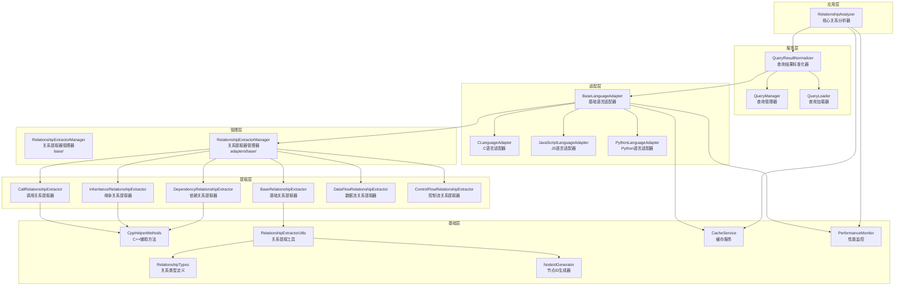

## 2. 关系提取核心流程图

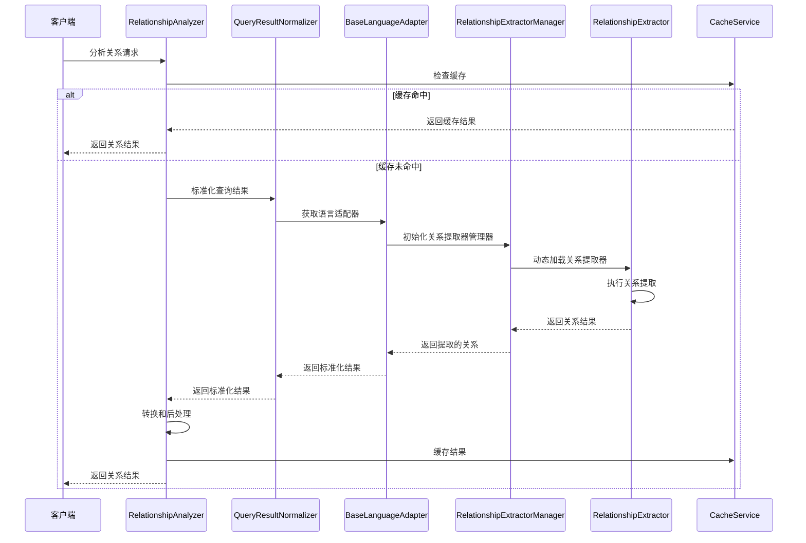

## 3. 关系提取器管理器内部流程

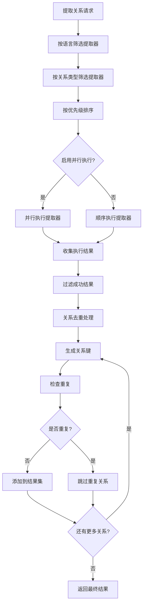

## 4. 语言适配器工作流程

```mermaid
stateDiagram-v2
    [*] --> 初始化处理上下文
    初始化处理上下文 --> 预处理查询结果
    预处理查询结果 --> 处理单个结果
    处理单个结果 --> 映射查询类型
    映射查询类型 --> 提取基本信息
    提取基本信息 --> 生成节点ID
    生成节点ID --> 创建元数据构建器
    创建元数据构建器 --> {是否为关系类型?}
    {是否为关系类型?} -->|是| 提取关系元数据
    {是否为关系类型?} -->|否| 创建符号信息
    提取关系元数据 --> 创建标准化结果
    创建符号信息 --> 创建标准化结果
    创建标准化结果 --> {还有更多结果?}
    {还有更多结果?} -->|是| 处理单个结果
    {还有更多结果?} -->|否| 后处理结果
    后处理结果 --> 缓存结果
    缓存结果 --> [*]
```

## 5. 具体关系提取器实现模式

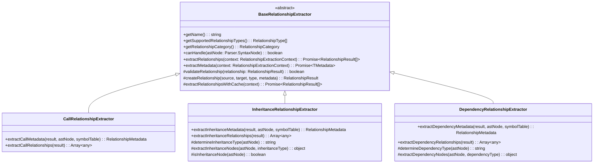

## 6. 缓存系统架构

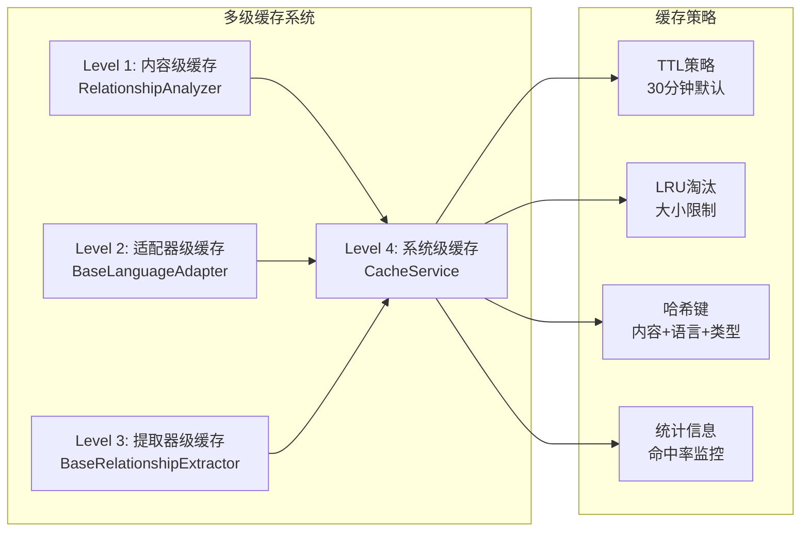

## 7. 关系类型分类体系

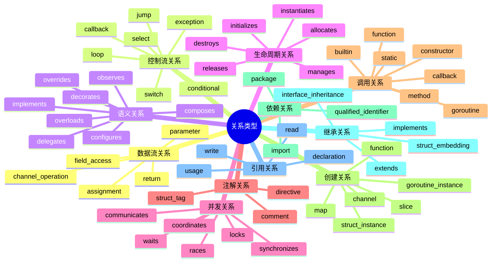

## 8. 错误处理和降级机制

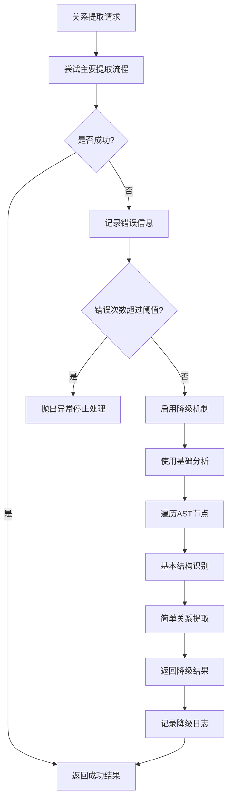

## 9. 性能监控系统

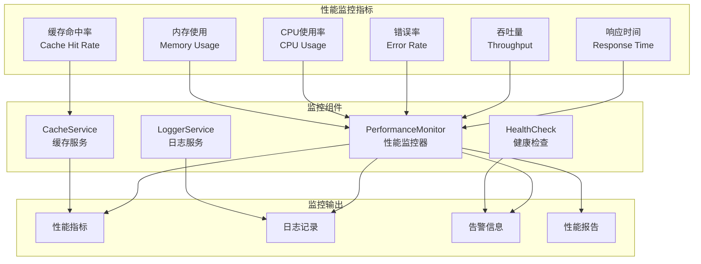

## 10. 扩展点架构

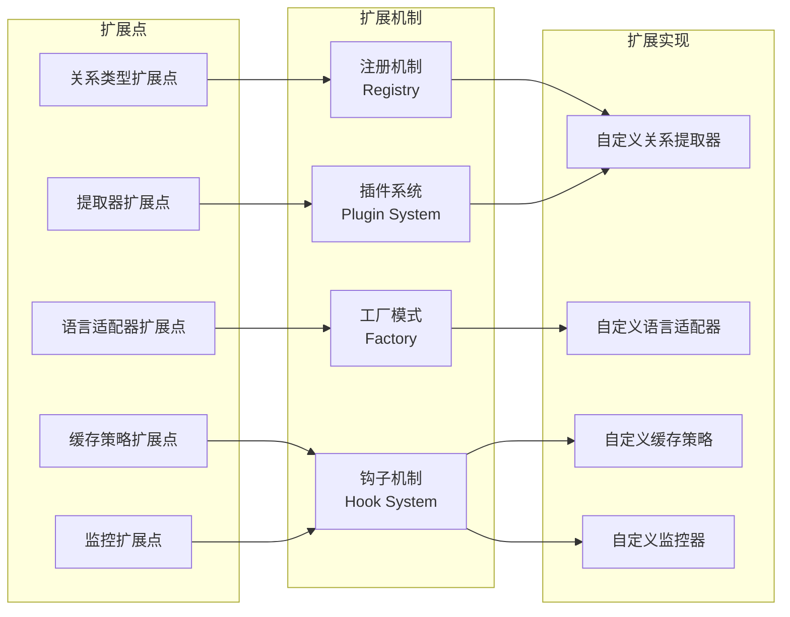

## 11. 数据流图

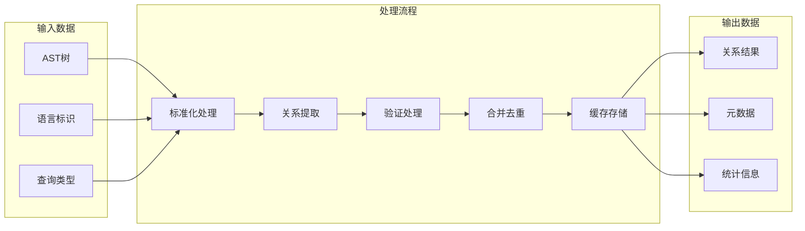

## 12. 部署架构图

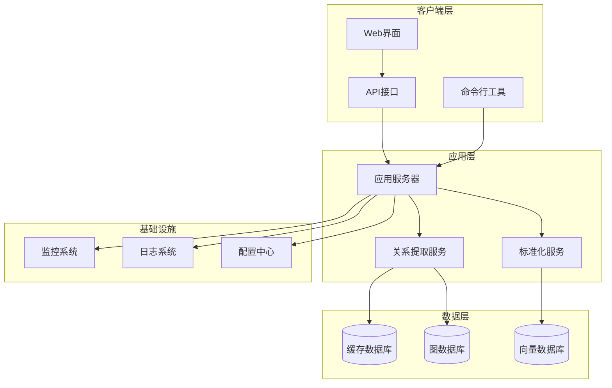

这些图表全面展示了关系提取机制的各个方面，从整体架构到具体实现细节，为理解和维护系统提供了清晰的视觉指导。