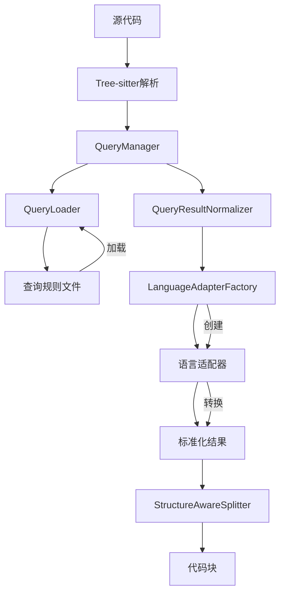
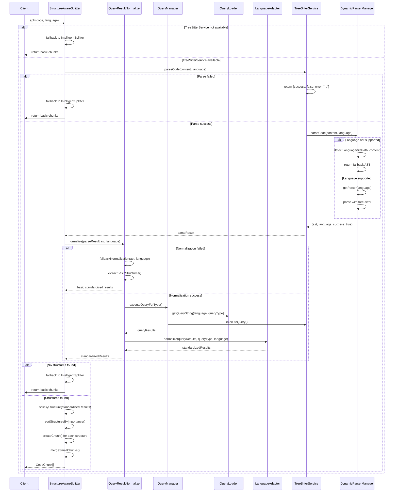

# 解析器标准化模块工作流分析

## 概述

本文档详细分析了 `src/service/parser/core/normalization` 目录及相关模块的完整工作流，从查询规则解析到最终完成分段的全过程。

## 系统架构

### 核心组件关系图



## 详细工作流程

### 1. 查询规则解析阶段

#### QueryLoader - 查询加载器
- **功能**: 动态加载和发现查询规则文件
- **目录结构**: `constants/queries/{language}/{queryType}.ts`
- **主要方法**:
  - `loadLanguageQueries()`: 加载指定语言的查询
  - `discoverQueryTypes()`: 动态发现查询类型
  - `getQuery()`: 获取查询字符串

#### QueryManager - 查询管理器
- **功能**: 查询执行和缓存管理
- **缓存机制**: LRU缓存查询对象和模式
- **主要方法**:
  - `getQuery()`: 获取查询对象（带缓存）
  - `executeQuery()`: 执行查询并返回结果
  - `executeBatchQueries()`: 批量执行查询

### 2. 标准化转换阶段

#### QueryResultNormalizer - 标准化器
- **核心流程**:
  ```typescript
  async normalize(ast, language, queryTypes): StandardizedQueryResult[]
  ```
  1. 生成缓存键
  2. 检查缓存
  3. 获取支持的查询类型（带映射）
  4. 执行查询并标准化
  5. 排序和缓存结果

- **特性**:
  - 性能监控和统计收集
  - 错误处理和降级机制
  - 缓存管理

#### LanguageAdapterFactory - 适配器工厂
- **功能**: 创建和管理语言适配器
- **支持的语言**: TypeScript、Python、Java、C++、Rust等
- **缓存策略**: 基于语言和配置的实例缓存

### 3. 语言适配器实现

#### BaseLanguageAdapter - 基础适配器
- **模板方法模式**:
  ```typescript
  normalize(queryResults, queryType, language): StandardizedQueryResult[]
  ```
  1. 预处理结果
  2. 转换为标准化结果
  3. 后处理（去重、排序、过滤）

- **抽象方法**:
  - `extractName()`: 提取名称
  - `extractLanguageSpecificMetadata()`: 提取语言特定元数据
  - `mapNodeType()`: 节点类型映射

#### 具体语言适配器
- **TypeScriptLanguageAdapter**: 处理TypeScript/JavaScript
- **PythonLanguageAdapter**: 处理Python
- **JavaLanguageAdapter**: 处理Java
- 等...

### 4. 查询类型映射机制

#### QueryTypeMappings - 类型映射器
- **映射配置**:
  ```typescript
  const LANGUAGE_QUERY_MAPPINGS = {
    'typescript': {
      'functions': ['functions'],
      'classes': ['classes'],
      'methods': ['methods'],
      // ...
    }
  }
  ```

- **功能**:
  - 查询文件到标准类型的映射
  - 类型验证和发现
  - 多对多映射支持

### 5. 后续处理阶段

#### StructureAwareSplitter - 结构感知分割器
- **分割策略**:
  1. 按结构重要性排序
  2. 处理结构间隙
  3. 合并过小的代码块

- **重要性顺序**:
  ```typescript
  const importanceOrder = {
    'import': 1,      // 最高优先级
    'export': 2,
    'class': 3,
    'interface': 4,
    'type': 5,
    'function': 6,
    'method': 7,
    'variable': 8,
    'control-flow': 9,
    'expression': 10  // 最低优先级
  }
  ```

## 降级处理机制分析

### 1. Tree-sitter 解析失败时的降级方案

#### DynamicParserManager 降级机制
当 tree-sitter 解析器不可用或失败时，系统采用多层降级策略：

**第一层：查询系统降级**
- 当查询系统未初始化时，使用 `legacyExtractFunctions()` 等回退方法
- 当查询模式不存在时，回退到基于节点类型的遍历提取

**第二层：语言检测降级**
- 当语言检测失败时，使用基于文件扩展名的简单映射
- 当 AST 语言检测失败时，使用预定义的语言映射表

**第三层：基础结构提取**
```typescript
private legacyExtractFunctions(ast: Parser.SyntaxNode): Parser.SyntaxNode[] {
  const functionTypes = new Set([
    'function_declaration', 'function_definition', 'method_definition',
    'arrow_function', 'function_expression', 'generator_function'
  ]);
  
  const traverse = (node: Parser.SyntaxNode, depth: number = 0) => {
    if (depth > 100) return;
    if (functionTypes.has(node.type)) {
      functions.push(node);
    }
    // 递归处理子节点
  };
}
```

#### TreeSitterCoreService 降级机制
**查询引擎降级链**：
1. 优化查询引擎（SimpleQueryEngine）
2. 动态管理器（DynamicParserManager）
3. 工具方法（TreeSitterUtils）
4. 回退机制（legacyExtractFunctions）

**错误处理**：
```typescript
try {
  // 使用优化查询系统
  return await SimpleQueryEngine.findFunctions(ast, lang);
} catch (error) {
  // 回退到动态管理器
  return await this.dynamicManager.extractFunctions(ast, lang);
}
```

### 2. 标准化失败时的降级方案

#### QueryResultNormalizer 降级机制
**标准化降级**：
```typescript
private fallbackNormalization(ast: Parser.SyntaxNode, language: string): StandardizedQueryResult[] {
  const results: StandardizedQueryResult[] = [];
  const visited = new Set<string>();
  
  // 简单遍历AST，提取基本结构
  this.extractBasicStructures(ast, language, results, visited);
  return results;
}
```

**基本结构识别**：
```typescript
private identifyBasicStructure(node: Parser.SyntaxNode, language: string): string | null {
  const nodeType = node.type.toLowerCase();
  
  if (nodeType.includes('function') || nodeType.includes('method')) return 'function';
  if (nodeType.includes('class') || nodeType.includes('struct')) return 'class';
  if (nodeType.includes('import') || nodeType.includes('include')) return 'import';
  if (nodeType.includes('variable') || nodeType.includes('declaration')) return 'variable';
  // ... 其他类型识别
}
```

#### BaseLanguageAdapter 降级机制
**适配器降级**：
```typescript
protected fallbackNormalization(queryResults: any[], queryType: string, language: string): StandardizedQueryResult[] {
  return queryResults.slice(0, 10).map((result, index) => {
    return {
      type: 'expression',
      name: `fallback_${index}`,
      startLine: this.extractStartLine(result),
      endLine: this.extractEndLine(result),
      content: this.extractContent(result),
      metadata: { language, complexity: 1, dependencies: [], modifiers: [] }
    };
  });
}
```

### 3. 分割失败时的降级方案

#### StructureAwareSplitter 降级机制
**分割降级链**：
1. 结构感知分割（基于标准化结果）
2. 智能分割（IntelligentSplitter）
3. 基础分割（BalancedChunker）

**降级触发条件**：
```typescript
// 如果没有设置标准化器，回退到基础分割器
if (!this.queryNormalizer || !this.treeSitterService) {
  return super.split(content, language, filePath, options, nodeTracker);
}

// 如果解析失败，回退到基础分割器
if (!parseResult.success || !parseResult.ast) {
  return super.split(content, language, filePath, options, nodeTracker);
}

// 如果没有找到结构，回退到基础分割器
if (standardizedResults.length === 0) {
  return super.split(content, language, filePath, options, nodeTracker);
}

// 如果发生错误，回退到基础分割器
} catch (error) {
  return super.split(content, language, filePath, options, nodeTracker);
}
```

#### IntelligentSplitter 基础分割
当所有高级分割方法都失败时，使用基础的分割策略：
```typescript
private createIntelligentChunks(content: string, language: string): CodeChunk[] {
  const lines = content.split('\n');
  const chunks: CodeChunk[] = [];
  let currentChunk: string[] = [];
  let currentLine = 1;
  let currentSize = 0;

  // 基于行数和大小进行简单分割
  for (let i = 0; i < lines.length; i++) {
    const line = lines[i];
    currentChunk.push(line);
    currentSize += line.length;

    // 当达到最大块大小时，创建新块
    if (currentSize >= options.maxChunkSize || 
        currentChunk.length >= options.maxLinesPerChunk) {
      chunks.push(this.createChunk(currentChunk, currentLine, i + 1, language));
      currentChunk = [];
      currentSize = 0;
      currentLine = i + 2;
    }
  }

  // 处理剩余内容
  if (currentChunk.length > 0) {
    chunks.push(this.createChunk(currentChunk, currentLine, lines.length, language));
  }

  return chunks;
}
```

## 完整工作流程图



## 关键特性

### 1. 缓存机制
- **查询缓存**: LRU缓存查询对象和模式
- **标准化结果缓存**: 基于AST内容和查询类型的缓存键
- **适配器缓存**: 语言适配器实例缓存

### 2. 错误处理
- **降级机制**: 当标准化失败时使用基础标准化
- **错误阈值**: 超过阈值时停止处理
- **性能监控**: 记录处理时间和错误率

### 3. 性能优化
- **懒加载**: 按需加载查询和适配器
- **批量处理**: 支持批量查询执行
- **智能去重**: 避免重复处理相同内容

### 4. 扩展性
- **插件化架构**: 易于添加新语言支持
- **配置驱动**: 通过配置调整行为
- **模块化设计**: 各组件职责清晰分离

## 配置选项

### NormalizationOptions
```typescript
interface NormalizationOptions {
  enableCache?: boolean;        // 启用缓存
  cacheSize?: number;          // 缓存大小
  enablePerformanceMonitoring?: boolean; // 性能监控
  customTypeMappings?: QueryTypeMapping[]; // 自定义类型映射
  debug?: boolean;             // 调试模式
}
```

### AdapterOptions
```typescript
interface AdapterOptions {
  enableDeduplication?: boolean;     // 启用去重
  enablePerformanceMonitoring?: boolean; // 性能监控
  enableErrorRecovery?: boolean;     // 错误恢复
  enableCaching?: boolean;           // 启用缓存
  cacheSize?: number;               // 缓存大小
  customTypeMappings?: Record<string, string>; // 自定义类型映射
}
```

## 降级处理总结

### 降级触发条件
1. **Tree-sitter 服务不可用**：服务未初始化或语言不支持
2. **解析失败**：AST 生成失败或解析错误
3. **标准化失败**：查询执行失败或适配器错误
4. **结构发现失败**：未找到任何代码结构
5. **查询系统故障**：查询模式不存在或查询引擎错误

### 降级处理模块
1. **DynamicParserManager**：提供 legacyExtractFunctions() 等基础提取方法
2. **TreeSitterCoreService**：提供 legacyExtractFunctions() 等回退机制
3. **QueryResultNormalizer**：提供 fallbackNormalization() 基础标准化
4. **BaseLanguageAdapter**：提供 fallbackNormalization() 基础适配
5. **StructureAwareSplitter**：回退到 IntelligentSplitter 基础分割
6. **IntelligentSplitter**：提供 createIntelligentChunks() 简单分割

### 降级处理特点
- **多层降级**：从高级到基础的渐进式降级
- **容错性强**：即使部分组件失败，系统仍可运行
- **性能考虑**：降级处理通常比完整处理更快
- **日志记录**：详细记录降级原因，便于调试
- **配置灵活**：可通过配置控制降级行为

这种多层次的降级机制确保了系统在各种异常情况下的稳定性和可用性，即使在 tree-sitter 不可用或失败的情况下，也能提供基本的代码分析和分割功能。