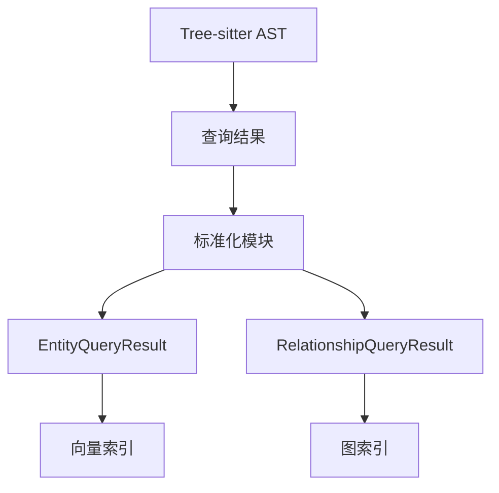

基于对当前项目parser模块的分析，我现在来分析当前项目的标准化模块该如何实现。

## 当前项目标准化模块实现分析

### 现有架构分析

当前项目的parser模块已经具备了以下核心组件：

1. **TreeSitterCoreService**: 核心解析服务，统一管理解析、查询和语言检测
2. **CodeStructureService**: 代码结构服务，负责具体的代码结构提取业务逻辑
3. **TreeSitterQueryFacade**: 简化查询引擎，提供常见用例的简单接口
4. **QueryEngine**: 查询引擎，执行Tree-sitter查询
5. **DynamicParserManager**: 动态解析器管理器，支持多语言解析

### 标准化模块实现策略

#### 1. 标准化模块定位

标准化模块应该作为**中间层**，位于：
- **上游**: Tree-sitter查询结果（原始AST节点）
- **下游**: 向量索引和图索引



#### 2. 模块结构设计

```
src/service/parser/core/normalization/
├── types/
│   ├── EntityTypes.ts          # 实体类型定义
│   ├── RelationshipTypes.ts    # 关系类型定义
│   ├── VectorTypes.ts          # 向量相关类型
│   └── GraphTypes.ts           # 图相关类型
├── adapters/
│   ├── CLanguageAdapter.ts     # C语言适配器
│   ├── LanguageAdapterFactory.ts
│   └── ILanguageAdapter.ts     # 语言适配器接口
├── services/
│   ├── EntityNormalizer.ts     # 实体标准化服务
│   ├── RelationshipNormalizer.ts # 关系标准化服务
│   ├── NormalizationCoordinator.ts # 标准化协调器
│   └── BatchNormalizer.ts      # 批量标准化服务
├── utils/
│   ├── NodeIdGenerator.ts      # 节点ID生成器
│   ├── PayloadConverter.ts     # Payload转换器
│   └── TypeMapper.ts           # 类型映射器
└── index.ts                    # 统一导出
```

#### 3. 核心接口设计

##### 标准化协调器接口

```typescript
interface INormalizationCoordinator {
  /**
   * 标准化查询结果
   */
  normalizeQueryResults(
    ast: Parser.SyntaxNode,
    language: string,
    filePath: string
  ): Promise<NormalizationResult>;
  
  /**
   * 批量标准化
   */
  normalizeBatch(
    items: Array<{
      ast: Parser.SyntaxNode;
      language: string;
      filePath: string;
    }>
  ): Promise<BatchNormalizationResult>;
  
  /**
   * 获取支持的语言
   */
  getSupportedLanguages(): string[];
}
```

##### 标准化结果接口

```typescript
interface NormalizationResult {
  /** 实体查询结果 */
  entities: EntityQueryResult[];
  
  /** 关系查询结果 */
  relationships: RelationshipQueryResult[];
  
  /** 处理统计 */
  stats: {
    entityCount: number;
    relationshipCount: number;
    processingTime: number;
  };
  
  /** 错误信息 */
  errors: string[];
}
```

#### 4. 与现有系统的集成点

##### 4.1 与TreeSitterCoreService集成

在TreeSitterCoreService中添加标准化方法：

```typescript
class TreeSitterCoreService {
  private normalizer: INormalizationCoordinator;
  
  constructor(
    @inject(TYPES.CacheService) cacheService: ICacheService,
    @inject(TYPES.NormalizationCoordinator) normalizer: INormalizationCoordinator
  ) {
    // 现有初始化代码...
    this.normalizer = normalizer;
  }
  
  /**
   * 解析并标准化代码
   */
  async parseAndNormalize(
    code: string, 
    language: string, 
    filePath: string
  ): Promise<ParseAndNormalizeResult> {
    // 1. 解析代码
    const parseResult = await this.parseCode(code, language);
    
    if (!parseResult.success) {
      throw new Error(`解析失败: ${parseResult.error}`);
    }
    
    // 2. 标准化查询结果
    const normalizationResult = await this.normalizer.normalizeQueryResults(
      parseResult.ast,
      language,
      filePath
    );
    
    return {
      parseResult,
      normalizationResult
    };
  }
}
```

##### 4.2 与CodeStructureService集成

扩展CodeStructureService以支持标准化：

```typescript
class CodeStructureService {
  /**
   * 提取并标准化实体
   */
  async extractAndNormalizeEntities(
    ast: Parser.SyntaxNode, 
    language: string, 
    filePath: string
  ): Promise<EntityQueryResult[]> {
    // 1. 提取原始节点
    const functionNodes = await this.extractFunctions(ast, language);
    const classNodes = await this.extractClasses(ast, language);
    const importNodes = await this.extractImports(ast, language);
    
    // 2. 转换为标准化实体
    const entities: EntityQueryResult[] = [];
    
    // 处理函数节点
    for (const node of functionNodes) {
      const entity = await this.normalizeFunctionNode(node, language, filePath);
      entities.push(entity);
    }
    
    // 处理其他节点...
    
    return entities;
  }
  
  /**
   * 提取并标准化关系
   */
  async extractAndNormalizeRelationships(
    ast: Parser.SyntaxNode, 
    language: string, 
    filePath: string
  ): Promise<RelationshipQueryResult[]> {
    // 1. 提取语义关系节点
    const relationshipNodes = await this.extractSemanticRelationships(ast, language);
    
    // 2. 转换为标准化关系
    const relationships: RelationshipQueryResult[] = [];
    
    for (const node of relationshipNodes) {
      const relationship = await this.normalizeRelationshipNode(node, language, filePath);
      relationships.push(relationship);
    }
    
    return relationships;
  }
}
```

#### 5. 实现优先级和阶段

##### 阶段1: 基础框架搭建
1. 创建标准化模块基础结构
2. 实现基础的EntityQueryResult和RelationshipQueryResult类型
3. 创建C语言适配器的基础框架
4. 实现简单的标准化协调器

##### 阶段2: C语言适配器完善
1. 完善C语言实体适配器，支持所有C语言实体类型
2. 完善C语言关系适配器，支持所有C语言关系类型
3. 实现节点ID生成策略
4. 添加单元测试

##### 阶段3: 与现有系统集成
1. 在TreeSitterCoreService中集成标准化功能
2. 扩展CodeStructureService支持标准化
3. 实现批量标准化功能
4. 添加性能监控和错误处理

##### 阶段4: 向量和图索引集成
1. 实现向量索引的Payload转换
2. 实现图索引的节点和边转换
3. 创建数据同步服务
4. 添加一致性检查机制

#### 6. 关键设计考虑

##### 6.1 性能优化
- 利用现有的缓存机制
- 实现批量处理减少重复计算
- 延迟标准化，只在需要时进行

##### 6.2 错误处理
- 标准化失败时回退到原始节点
- 提供详细的错误信息和恢复建议
- 实现渐进式标准化，部分失败不影响整体

##### 6.3 扩展性
- 语言适配器插件化，便于添加新语言
- 标准化规则可配置，支持自定义扩展
- 提供钩子函数，允许自定义处理逻辑

##### 6.4 向后兼容
- 保持现有API不变
- 标准化功能作为可选特性
- 提供迁移指南和工具

#### 7. 配置管理

```typescript
interface NormalizationConfig {
  /** 是否启用标准化 */
  enabled: boolean;
  
  /** 支持的语言列表 */
  supportedLanguages: string[];
  
  /** 批处理配置 */
  batchConfig: {
    maxBatchSize: number;
    maxConcurrency: number;
  };
  
  /** 缓存配置 */
  cacheConfig: {
    enabled: boolean;
    maxSize: number;
    ttl: number;
  };
  
  /** 错误处理配置 */
  errorHandling: {
    fallbackToRaw: boolean;
    maxRetries: number;
    logErrors: boolean;
  };
}
```

### 实现建议

1. **渐进式实现**: 先实现C语言的基础功能，再逐步扩展到其他语言
2. **测试驱动**: 每个组件都要有完整的单元测试和集成测试
3. **性能监控**: 从一开始就加入性能监控，及时发现瓶颈
4. **文档完善**: 提供详细的API文档和使用示例

这种实现策略既保持了与现有系统的兼容性，又为未来的扩展留下了充足的空间，同时确保了系统的稳定性和性能。