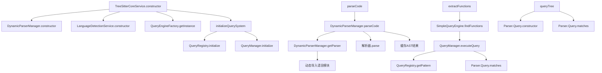
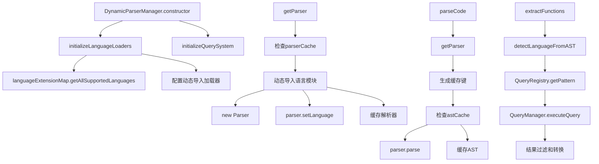
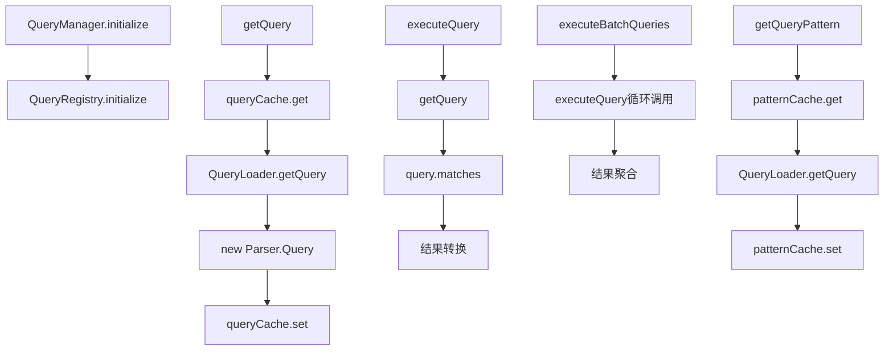
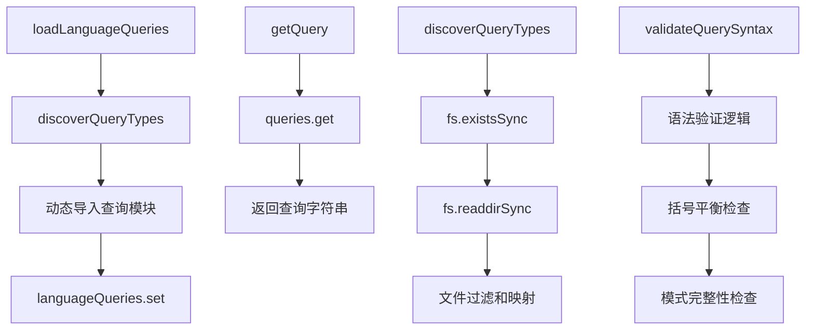
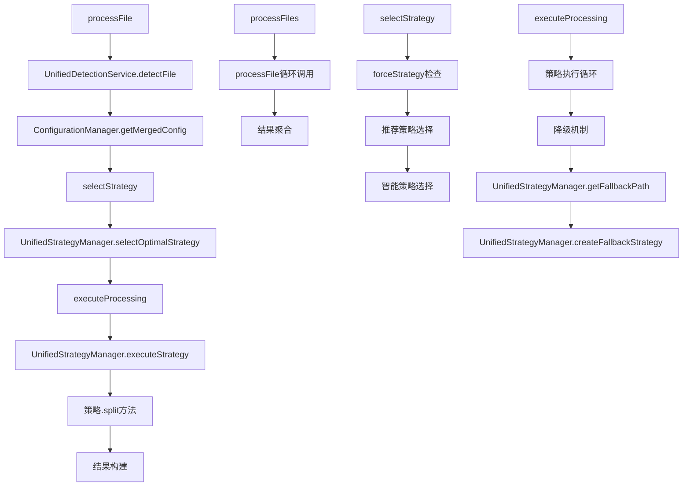
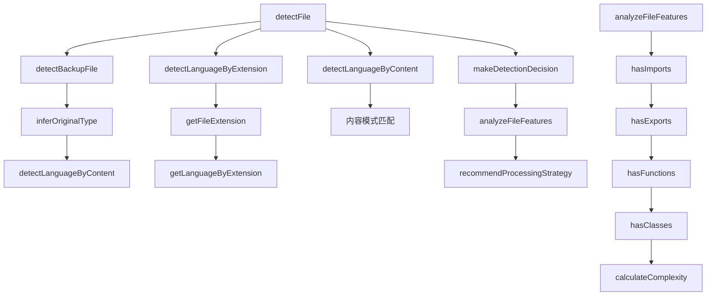
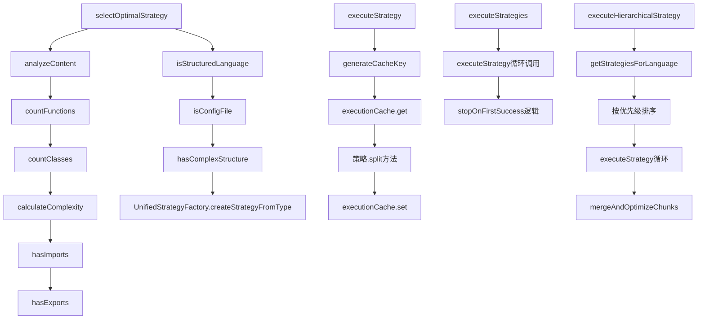
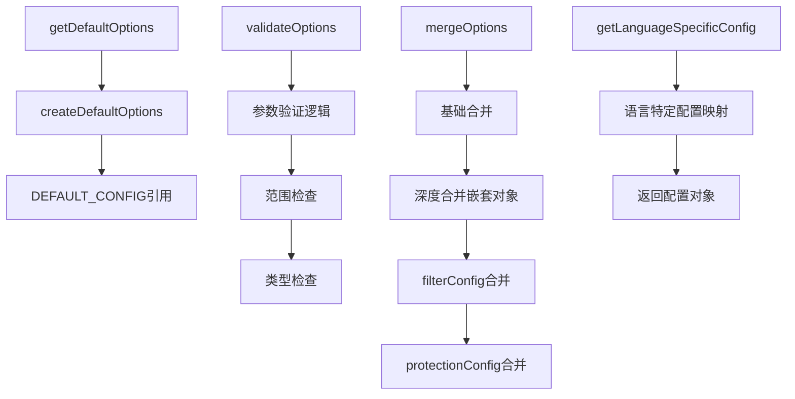
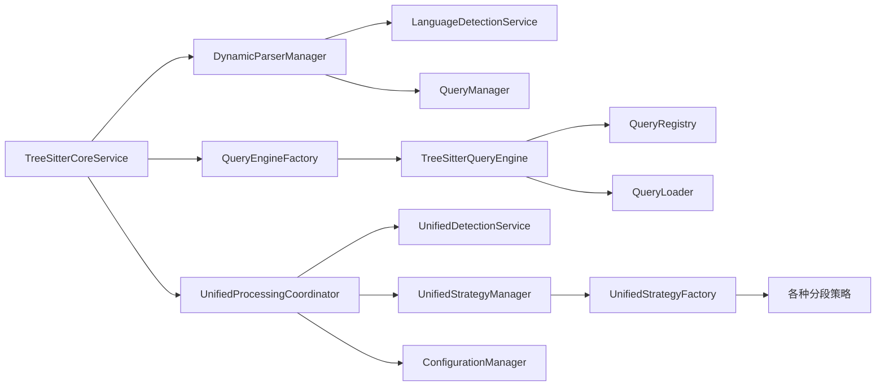
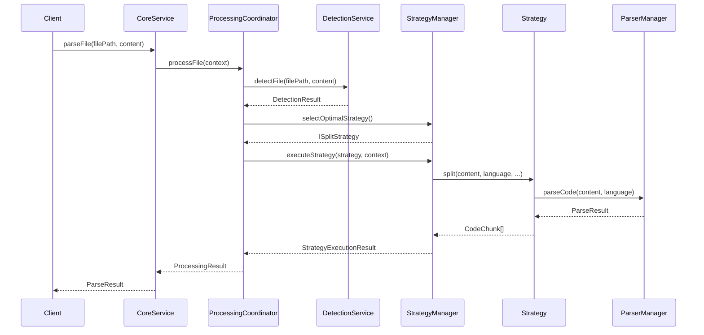

# Parser详细调用链分析

## 📋 文件-方法级别调用关系

### 1. 核心解析服务调用链

#### TreeSitterCoreService (src/service/parser/core/parse/TreeSitterCoreService.ts)

**主要方法调用关系**:



**具体方法调用**:

| 方法 | 调用链 | 描述 |
|------|--------|------|
| `parseCode()` | `DynamicParserManager.parseCode()` → `getParser()` → `parser.parse()` | 解析代码为AST |
| `parseFile()` | `detectLanguage()` → `parseCode()` | 解析文件内容 |
| `extractFunctions()` | `SimpleQueryEngine.findFunctions()` → `QueryManager.executeQuery()` | 提取函数节点 |
| `extractClasses()` | `SimpleQueryEngine.findClasses()` → `QueryManager.executeQuery()` | 提取类节点 |
| `extractImports()` | `TreeSitterUtils.extractImportNodes()` | 提取导入节点 |
| `queryTree()` | `Parser.Query.constructor()` → `Parser.Query.matches()` | 执行树查询 |

### 2. 动态解析器管理器调用链

#### DynamicParserManager (src/service/parser/core/parse/DynamicParserManager.ts)

**主要方法调用关系**:



**具体方法调用**:

| 方法 | 调用链 | 描述 |
|------|--------|------|
| `getParser()` | `parserCache.get()` → `langConfig.loader()` → `new Parser()` → `setLanguage()` | 获取语言解析器 |
| `parseCode()` | `getParser()` → `hashCode()` → `astCache.get/set()` → `parser.parse()` | 解析代码并缓存 |
| `detectLanguage()` | `LanguageDetectionService.detectLanguage()` | 检测文件语言 |
| `extractFunctions()` | `QueryRegistry.getPattern()` → `QueryManager.executeQuery()` → 结果过滤 | 提取函数 |

### 3. 查询系统调用链

#### QueryManager (src/service/parser/core/query/QueryManager.ts)

**主要方法调用关系**:



**具体方法调用**:

| 方法 | 调用链 | 描述 |
|------|--------|------|
| `getQuery()` | `queryCache.get()` → `QueryLoader.getQuery()` → `new Parser.Query()` | 获取查询对象 |
| `executeQuery()` | `getQuery()` → `query.matches()` → 结果转换 | 执行查询 |
| `executeBatchQueries()` | 循环调用`executeQuery()` → 结果聚合 | 批量执行查询 |
| `getQueryPattern()` | `patternCache.get()` → `QueryLoader.getQuery()` | 获取查询模式 |

#### QueryLoader (src/service/parser/core/query/QueryLoader.ts)

**主要方法调用关系**:



### 4. 处理协调器调用链

#### UnifiedProcessingCoordinator (src/service/parser/processing/coordination/UnifiedProcessingCoordinator.ts)

**主要方法调用关系**:



**具体方法调用**:

| 方法 | 调用链 | 描述 |
|------|--------|------|
| `processFile()` | `detectFile()` → `getMergedConfig()` → `selectStrategy()` → `executeProcessing()` | 处理单个文件 |
| `processFiles()` | 循环调用`processFile()` → 结果聚合 | 批量处理文件 |
| `selectStrategy()` | `selectOptimalStrategy()` → 策略选择逻辑 | 选择处理策略 |
| `executeProcessing()` | `executeStrategy()` → 降级机制 → 结果验证 | 执行处理流程 |

### 5. 检测服务调用链

#### UnifiedDetectionService (src/service/parser/processing/detection/UnifiedDetectionService.ts)

**主要方法调用关系**:



**具体方法调用**:

| 方法 | 调用链 | 描述 |
|------|--------|------|
| `detectFile()` | `detectBackupFile()` → `detectLanguageByExtension()` → `detectLanguageByContent()` → `makeDetectionDecision()` | 综合文件检测 |
| `detectLanguageByExtension()` | `getFileExtension()` → `getLanguageByExtension()` | 基于扩展名检测 |
| `detectLanguageByContent()` | 正则表达式模式匹配 → 置信度计算 | 基于内容检测 |
| `analyzeFileFeatures()` | `hasImports()` → `hasExports()` → `hasFunctions()` → `hasClasses()` → `calculateComplexity()` | 分析文件特征 |

### 6. 策略管理器调用链

#### UnifiedStrategyManager (src/service/parser/processing/strategies/manager/UnifiedStrategyManager.ts)

**主要方法调用关系**:



**具体方法调用**:

| 方法 | 调用链 | 描述 |
|------|--------|------|
| `selectOptimalStrategy()` | `analyzeContent()` → `isStructuredLanguage()` → `createStrategyFromType()` | 选择最优策略 |
| `executeStrategy()` | `generateCacheKey()` → `executionCache.get()` → `strategy.split()` → `executionCache.set()` | 执行策略 |
| `executeStrategies()` | 循环调用`executeStrategy()` → 结果聚合 | 批量执行策略 |
| `executeHierarchicalStrategy()` | `getStrategiesForLanguage()` → 排序 → 执行 → `mergeAndOptimizeChunks()` | 分层策略执行 |

### 7. 配置管理器调用链

#### ConfigurationManager (src/service/parser/processing/config/ConfigurationManager.ts)

**主要方法调用关系**:



## 🔄 跨模块调用关系

### 核心服务间调用



### 数据流示例：完整文件处理流程



## 📊 性能关键路径分析

### 1. 解析性能关键路径
```
TreeSitterCoreService.parseCode()
  ↓
DynamicParserManager.parseCode()
  ↓
DynamicParserManager.getParser() [缓存检查]
  ↓
动态导入语言模块 [性能瓶颈]
  ↓
parser.parse() [核心解析]
  ↓
AST缓存存储
```

### 2. 查询性能关键路径
```
TreeSitterQueryEngine.executeQuery()
  ↓
QueryCache.getResult() [缓存检查]
  ↓
QueryRegistry.getPattern() [模式获取]
  ↓
Parser.Query.matches() [查询执行]
  ↓
结果转换和缓存
```

### 3. 处理性能关键路径
```
UnifiedProcessingCoordinator.processFile()
  ↓
UnifiedDetectionService.detectFile() [检测逻辑]
  ↓
UnifiedStrategyManager.selectOptimalStrategy() [策略选择]
  ↓
策略.split() [分段执行]
  ↓
结果构建和验证
```

## 🔧 配置和调优点

### 缓存配置调优
```typescript
// DynamicParserManager 缓存配置
private parserCache: LRUCache<string, Parser> = new LRUCache(50);      // 解析器缓存
private astCache: LRUCache<string, Parser.Tree> = new LRUCache(500);   // AST缓存
private nodeCache: LRUCache<string, Parser.SyntaxNode[]> = new LRUCache(1000); // 节点缓存

// QueryManager 缓存配置
private static queryCache = new LRUCache<string, Parser.Query>(100);   // 查询缓存
private static patternCache = new LRUCache<string, string>(50);        // 模式缓存
```

### 性能监控点
- 解析时间统计 (`performanceStats`)
- 缓存命中率 (`cacheStats`)
- 策略执行时间 (`executionTime`)
- 错误率和降级情况

## 🎯 总结

通过详细的调用链分析，我们可以看到Parser模块采用了分层架构设计，各模块职责清晰，调用关系明确。系统通过缓存机制、智能降级和并行处理等手段优化性能，同时保持了良好的扩展性和可维护性。

**关键设计特点**:
- ✅ 模块化设计，职责分离
- ✅ 多级缓存，性能优化
- ✅ 智能降级，高可用性
- ✅ 配置驱动，灵活调整
- ✅ 全面监控，易于调试