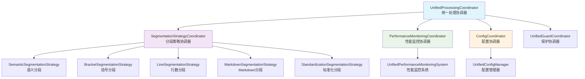
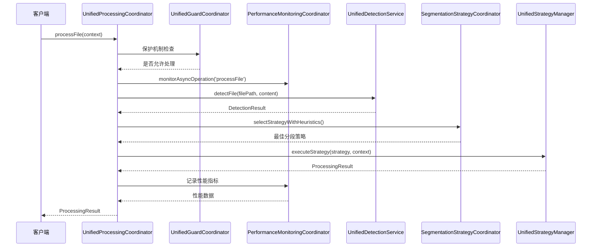
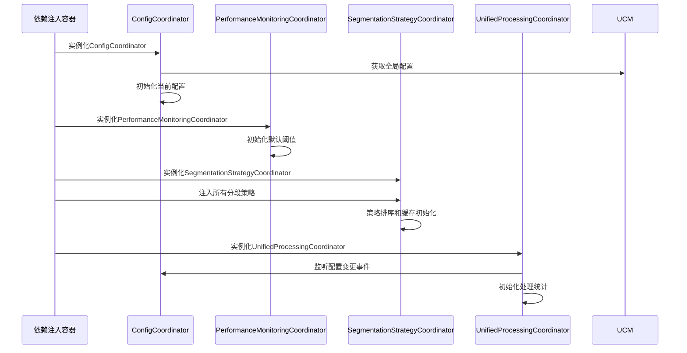
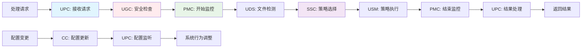

基于我对代码的深入分析，我现在为您详细解析parser模块中各个协调器的关系及工作流调用顺序。

## 📊 协调器架构分析

### 1. 协调器职责分工

#### [`ConfigCoordinator`](src/service/parser/processing/coordination/ConfigCoordinator.ts)
- **职责**: 配置管理协调器
- **功能**: 
  - 管理全局配置的获取和更新
  - 验证配置有效性
  - 监听配置变更并通知相关模块
  - 检测配置变化并发出事件

#### [`PerformanceMonitoringCoordinator`](src/service/parser/processing/coordination/PerformanceMonitoringCoordinator.ts)
- **职责**: 性能监控协调器
- **功能**:
  - 记录操作性能指标
  - 包装异步/同步操作进行性能监控
  - 设置性能阈值并生成告警
  - 生成性能报告和健康检查

#### [`SegmentationStrategyCoordinator`](src/service/parser/processing/coordination/SegmentationStrategyCoordinator.ts)
- **职责**: 分段策略协调器
- **功能**:
  - 管理多个分段策略（语义、括号、行数、Markdown、标准化）
  - 智能选择最佳分段策略
  - 执行分段策略并处理降级
  - 策略缓存和优先级管理

#### [`UnifiedProcessingCoordinator`](src/service/parser/processing/coordination/UnifiedProcessingCoordinator.ts)
- **职责**: 统一处理协调器（主协调器）
- **功能**:
  - 整合所有协调器功能
  - 管理文件处理完整工作流
  - 协调保护机制、性能监控、配置管理
  - 处理批量文件和单个文件

### 2. 协调器关系图



### 3. 工作流调用顺序



### 4. 详细工作流分析

#### 阶段1: 预处理检查
1. **保护机制检查** - [`UnifiedGuardCoordinator`](src/service/parser/guard/UnifiedGuardCoordinator.ts)
   - 内存使用检查
   - 系统状态检查
   - 决定是否启用降级处理

2. **性能监控包装** - [`PerformanceMonitoringCoordinator`](src/service/parser/processing/coordination/PerformanceMonitoringCoordinator.ts)
   - 包装整个处理流程进行性能监控
   - 记录开始时间和操作上下文

#### 阶段2: 文件检测和配置获取
3. **文件检测** - [`UnifiedDetectionService`](src/service/parser/processing/detection/UnifiedDetectionService.ts)
   - 检测文件语言和特征
   - 生成检测结果和推荐策略

4. **配置管理** - [`ConfigCoordinator`](src/service/parser/processing/coordination/ConfigCoordinator.ts)
   - 获取当前配置
   - 监听配置变更事件

#### 阶段3: 策略选择和执行
5. **智能策略选择** - [`SegmentationStrategyCoordinator`](src/service/parser/processing/coordination/SegmentationStrategyCoordinator.ts)
   - 基于内容特征选择最佳策略
   - 考虑文件类型、复杂度、大小等因素
   - 使用策略缓存优化性能

6. **策略执行** - [`UnifiedStrategyManager`](src/service/parser/processing/strategies/manager/UnifiedStrategyManager.ts)
   - 执行选定的分段策略
   - 处理策略执行失败和降级

#### 阶段4: 结果处理和监控
7. **结果验证和处理** - [`UnifiedProcessingCoordinator`](src/service/parser/processing/coordination/UnifiedProcessingCoordinator.ts)
   - 验证处理结果的有效性
   - 更新处理统计信息

8. **性能监控完成** - [`PerformanceMonitoringCoordinator`](src/service/parser/processing/coordination/PerformanceMonitoringCoordinator.ts)
   - 记录操作完成时间和结果
   - 生成性能报告

### 5. 协调器协作模式

#### 事件驱动协作
- **配置变更事件**: `ConfigCoordinator` → `UnifiedProcessingCoordinator`
- **性能监控事件**: `PerformanceMonitoringCoordinator` → 所有协调操作
- **保护机制事件**: `UnifiedGuardCoordinator` → 处理流程控制

#### 责任链模式
```
文件处理请求 → UnifiedProcessingCoordinator
    ↓
保护机制检查 → UnifiedGuardCoordinator
    ↓
性能监控包装 → PerformanceMonitoringCoordinator  
    ↓
文件检测 → UnifiedDetectionService
    ↓
策略选择 → SegmentationStrategyCoordinator
    ↓
策略执行 → UnifiedStrategyManager
    ↓
结果处理 → UnifiedProcessingCoordinator
```

#### 策略模式
`SegmentationStrategyCoordinator` 使用策略模式管理多种分段策略，根据上下文智能选择最佳策略。

## 6. 协调器在完整工作流中的角色定位

### 6.1 系统启动阶段



### 6.2 文件处理工作流中的角色定位

#### 6.2.1 入口协调器 - [`UnifiedProcessingCoordinator`](src/service/parser/processing/coordination/UnifiedProcessingCoordinator.ts)
- **定位**: 总协调器，负责整个处理流程的编排
- **关键职责**:
  - 接收处理请求并验证参数
  - 协调所有子协调器的执行顺序
  - 处理异常和降级逻辑
  - 返回统一格式的处理结果

#### 6.2.2 保护协调器 - [`UnifiedGuardCoordinator`](src/service/parser/guard/UnifiedGuardCoordinator.ts)
- **定位**: 安全卫士，确保系统稳定性
- **关键职责**:
  - 内存使用监控和限制
  - 错误阈值管理
  - 系统状态检查
  - 降级处理决策

#### 6.2.3 性能协调器 - [`PerformanceMonitoringCoordinator`](src/service/parser/processing/coordination/PerformanceMonitoringCoordinator.ts)
- **定位**: 性能观察者，监控系统健康
- **关键职责**:
  - 包装关键操作进行性能监控
  - 记录操作时间和成功率
  - 生成性能报告和告警
  - 提供健康检查状态

#### 6.2.4 配置协调器 - [`ConfigCoordinator`](src/service/parser/processing/coordination/ConfigCoordinator.ts)
- **定位**: 配置管理者，动态调整系统行为
- **关键职责**:
  - 管理运行时配置变更
  - 验证配置有效性
  - 通知相关模块配置更新
  - 维护配置一致性

#### 6.2.5 策略协调器 - [`SegmentationStrategyCoordinator`](src/service/parser/processing/coordination/SegmentationStrategyCoordinator.ts)
- **定位**: 策略专家，智能选择最佳处理方案
- **关键职责**:
  - 管理多种分段策略
  - 基于内容特征智能选择
  - 策略缓存优化性能
  - 处理策略执行失败

### 6.3 协调器间的数据流



### 6.4 异常处理和工作流

#### 正常流程
```
1. 保护检查通过 → 性能监控开始 → 文件检测 → 策略选择 → 策略执行 → 性能监控结束 → 结果返回
```

#### 异常流程 - 保护机制触发
```
1. 保护检查失败 → 降级处理 → 返回降级结果
```

#### 异常流程 - 策略执行失败  
```
1. 策略执行失败 → 尝试降级策略 → 性能监控记录错误 → 返回失败结果
```

#### 异常流程 - 配置变更
```
1. 配置变更事件 → 配置协调器处理 → 通知相关模块 → 系统行为调整
```

### 6.5 协调器的设计模式应用

#### 门面模式 (Facade Pattern)
- **`UnifiedProcessingCoordinator`** 作为门面，为客户端提供统一接口
- 隐藏内部复杂的协调逻辑，简化客户端使用

#### 观察者模式 (Observer Pattern)  
- **`ConfigCoordinator`** 作为被观察者，其他协调器作为观察者
- 实现配置变更的实时通知机制

#### 策略模式 (Strategy Pattern)
- **`SegmentationStrategyCoordinator`** 管理多种分段策略
- 根据上下文动态选择最佳策略

#### 装饰器模式 (Decorator Pattern)
- **`PerformanceMonitoringCoordinator`** 包装操作进行监控
- 在不修改原有逻辑的情况下添加监控功能

## 7. 协调器职责分工和协作模式总结

### 7.1 职责分工矩阵

| 协调器 | 核心职责 | 关键方法 | 依赖关系 | 输出结果 |
|--------|----------|----------|----------|----------|
| **UnifiedProcessingCoordinator** | 总协调，流程编排 | `processFile()`, `processFiles()` | 所有其他协调器 | `ProcessingResult` |
| **SegmentationStrategyCoordinator** | 策略管理，智能选择 | `selectStrategy()`, `executeStrategy()` | 分段策略，配置管理器 | `CodeChunk[]` |
| **PerformanceMonitoringCoordinator** | 性能监控，健康检查 | `monitorAsyncOperation()`, `generateReport()` | 日志服务 | `PerformanceMetrics` |
| **ConfigCoordinator** | 配置管理，变更通知 | `updateConfig()`, `onConfigUpdate()` | 配置管理器 | `ConfigUpdateEvent` |
| **UnifiedGuardCoordinator** | 系统保护，降级处理 | `checkMemoryUsage()`, `shouldUseFallback()` | 内存监控，错误处理 | 保护决策 |

### 7.2 协作模式详解

#### 7.2.1 主从协作模式
- **主协调器**: `UnifiedProcessingCoordinator`
- **从协调器**: 其他所有协调器
- **协作方式**: 主协调器按需调用从协调器，管理执行顺序和异常处理

#### 7.2.2 事件驱动协作
- **事件源**: `ConfigCoordinator` (配置变更事件)
- **事件监听器**: `UnifiedProcessingCoordinator`
- **协作方式**: 异步事件通知，实现松耦合的配置更新

#### 7.2.3 责任链协作
```
处理请求 → UPC → UGC(保护检查) → PMC(性能监控) → SSC(策略选择) → USM(策略执行)
```

#### 7.2.4 策略模式协作
- **策略上下文**: `SegmentationStrategyCoordinator`
- **具体策略**: 各种分段策略实现
- **协作方式**: 基于内容特征动态选择最佳策略

### 7.3 协调器间的数据流向

#### 配置数据流


#### 性能数据流  


#### 策略数据流


### 7.4 协调器的设计优势

#### 7.4.1 单一职责原则
- 每个协调器专注于特定领域
- 职责边界清晰，易于维护

#### 7.4.2 开闭原则
- 新增策略只需实现新策略类
- 配置变更无需修改协调器代码

#### 7.4.3 依赖倒置原则
- 协调器依赖抽象接口而非具体实现
- 通过依赖注入实现松耦合

#### 7.4.4 接口隔离原则
- 每个协调器提供最小化的必要接口
- 客户端只需关注需要的功能

### 7.5 实际工作流示例

#### 示例1: 正常文件处理
```typescript
// 1. 客户端调用
const result = await unifiedProcessingCoordinator.processFile({
    filePath: "example.ts",
    content: "const x = 1;",
    options: { maxChunkSize: 2000 }
});

// 2. 内部协调流程
// - UnifiedGuardCoordinator: 内存检查通过
// - PerformanceMonitoringCoordinator: 开始监控
// - UnifiedDetectionService: 检测为TypeScript
// - SegmentationStrategyCoordinator: 选择语义分段策略
// - UnifiedStrategyManager: 执行分段
// - PerformanceMonitoringCoordinator: 结束监控
// - UnifiedProcessingCoordinator: 返回结果
```

#### 示例2: 系统资源紧张时的处理
```typescript
// 1. 客户端调用（系统内存紧张）
const result = await unifiedProcessingCoordinator.processFile(context);

// 2. 内部协调流程
// - UnifiedGuardCoordinator: 检测到内存紧张，启用降级
// - 直接使用降级处理，跳过复杂策略
// - 返回简化结果，保证系统稳定
```

### 7.6 协调器的扩展性

#### 新增策略扩展
```typescript
// 1. 实现新策略类
class NewSegmentationStrategy implements ISegmentationStrategy {
    // 实现接口方法
}

// 2. 在依赖注入中注册
container.bind<NewSegmentationStrategy>(TYPES.NewSegmentationStrategy)
    .to(NewSegmentationStrategy).inSingletonScope();

// 3. 自动集成到SegmentationStrategyCoordinator
```

#### 新增监控指标扩展
```typescript
// 1. 在PerformanceMonitoringCoordinator中添加新指标
setThreshold('newOperation', 1000);

// 2. 在相关操作中使用监控
await performanceMonitor.monitorAsyncOperation('newOperation', () => {
    // 新操作逻辑
});
```

### 7.7 总结

parser模块的协调器架构体现了现代软件设计的优秀实践：

1. **清晰的职责分工** - 每个协调器专注于特定领域
2. **松耦合的协作** - 通过接口和事件实现模块间解耦  
3. **灵活的扩展性** - 易于添加新策略和功能
4. **完善的异常处理** - 多层保护机制确保系统稳定
5. **全面的性能监控** - 实时监控系统健康状态

这种架构设计使得parser模块能够高效、稳定地处理各种文件分段需求，同时保持良好的可维护性和可扩展性。