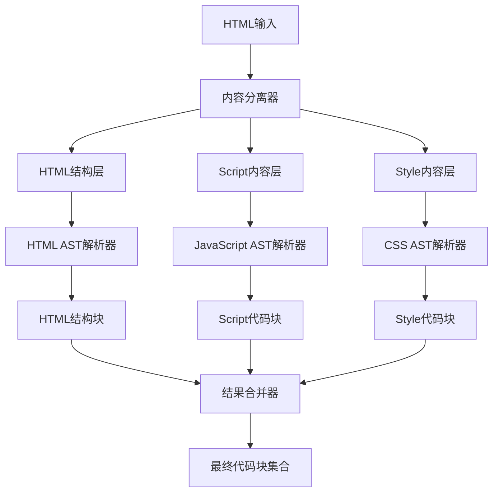

## 最终期望架构设计

基于深入分析，我提出以下最终期望的HTML处理架构：

### 核心架构理念：**分层+AST混合处理**

最终架构应该结合LayeredHTMLStrategy的内容分离能力和ASTCodeSplitter的精确解析优势，形成一个既保持HTML特殊性又具备统一处理能力的混合架构。

### 期望架构图



### 分层后执行AST解析的可行性分析

#### 1. 技术可行性：**完全可行**

**优势**：
- **精确解析**：每种内容类型使用专门的AST解析器，提高解析精度
- **语言特性支持**：JavaScript/TypeScript/CSS各自的语法特性得到完整支持
- **错误定位**：可以在具体的语言上下文中精确定位错误
- **优化机会**：每种解析器可以独立优化

**实现方式**：
```typescript
// 期望的架构实现
class HybridHTMLProcessor {
  async process(content: string): Promise<CodeChunk[]> {
    // 1. 内容分离
    const separated = await this.contentSeparator.separate(content);
    
    // 2. 并行AST解析
    const [htmlChunks, scriptChunks, styleChunks] = await Promise.all([
      this.parseHTMLStructure(separated.html),
      this.parseScriptContent(separated.scripts),
      this.parseStyleContent(separated.styles)
    ]);
    
    // 3. 结果合并
    return this.mergeResults(htmlChunks, scriptChunks, styleChunks);
  }
  
  private async parseScriptContent(scripts: ScriptBlock[]): Promise<CodeChunk[]> {
    const chunks: CodeChunk[] = [];
    
    for (const script of scripts) {
      // 根据语言类型选择对应的AST解析器
      const astParser = this.getASTParser(script.language);
      const ast = await astParser.parse(script.content);
      const chunks = await this.extractChunksFromAST(ast, script);
      chunks.push(...chunks);
    }
    
    return chunks;
  }
}
```

#### 2. 架构优势

**统一性**：
- 所有内容类型都使用AST解析，保持处理逻辑的一致性
- 可以复用ASTCodeSplitter的通用功能（缓存、错误处理、复杂度计算）

**精确性**：
- HTML结构使用HTML AST解析器
- JavaScript使用JavaScript/TypeScript AST解析器
- CSS使用CSS AST解析器

**扩展性**：
- 容易添加新的内容类型支持（如Vue、Svelte）
- 可以独立优化每种解析器

#### 3. 关键设计决策

##### 3.1 内容分离策略
```typescript
interface ContentSeparator {
  separate(content: string): Promise<{
    html: string;
    scripts: ScriptBlock[];
    styles: StyleBlock[];
    templates?: TemplateBlock[]; // 未来扩展
  }>;
}
```

##### 3.2 AST解析器选择
```typescript
class ASTParserFactory {
  getParser(language: string): ASTParser {
    switch (language) {
      case 'html':
        return new HTMLASTParser();
      case 'javascript':
      case 'typescript':
        return new JavaScriptASTParser();
      case 'css':
      case 'scss':
      case 'less':
        return new CSSASTParser();
      default:
        return new GenericASTParser();
    }
  }
}
```

##### 3.3 结果合并策略
```typescript
interface ResultMerger {
  merge(
    htmlChunks: CodeChunk[],
    scriptChunks: CodeChunk[],
    styleChunks: CodeChunk[]
  ): CodeChunk[];
}
```

### 4. 与现有系统的兼容性

#### 4.1 适配器集成
```typescript
// 现有适配器的新角色
class HtmlLanguageAdapter {
  // 保持现有的内容分离功能
  extractScripts(content: string): ScriptBlock[];
  extractStyles(content: string): StyleBlock[];
  
  // 新增：支持AST解析结果标准化
  normalizeASTResults(
    astResults: any[],
    contentType: 'html' | 'script' | 'style',
    language: string
  ): StandardizedQueryResult[];
}
```

#### 4.2 策略集成
```typescript
// 新的混合策略
class HybridHTMLStrategy extends BaseStrategy {
  async process(context: IProcessingContext): Promise<ProcessingResult> {
    const processor = new HybridHTMLProcessor();
    const chunks = await processor.process(context.content);
    
    return {
      chunks,
      success: true,
      executionTime: Date.now() - startTime,
      strategy: 'hybrid-html-ast'
    };
  }
}
```

### 5. 实施路径

#### 阶段1：内容分离+AST解析验证
- 保持现有的内容分离逻辑
- 为每种内容类型添加AST解析
- 验证技术可行性

#### 阶段2：统一处理流程
- 重构为统一的处理架构
- 集成现有的ASTCodeSplitter功能
- 优化性能和错误处理

#### 阶段3：完整替换
- 完全替换LayeredHTMLStrategy
- 保持向后兼容性
- 添加新功能支持

### 6. 预期收益

1. **精确性提升**：每种内容类型使用专门的AST解析器
2. **维护性改善**：统一的处理架构，减少代码重复
3. **扩展性增强**：容易添加新的内容类型和语言支持
4. **性能优化**：并行处理多种内容类型
5. **错误处理**：更精确的错误定位和处理

### 结论

**分层后分别执行AST解析是完全可行的，并且是理想的架构方向**。这种架构既保持了HTML内容分离的优势，又获得了AST解析的精确性，是HTML处理策略的最佳演进路径。

通过这种设计，我们可以：
- 保持HTML的特殊性处理需求
- 利用AST解析的技术优势
- 建立统一的处理架构
- 为未来的扩展奠定基础

这种架构既解决了LayeredHTMLStrategy的复杂性问题，又避免了完全替换为AST策略的功能缺失问题，是一个平衡且可持续的解决方案。