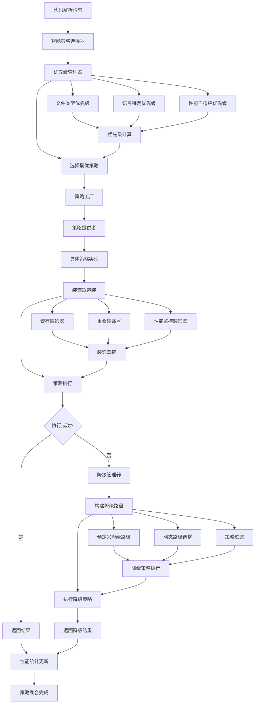

# 策略处理聚合机制分析

## 📋 概述

本文档详细分析了 `src\service\parser\processing\strategies` 目录中的策略聚合机制。该系统采用**工厂模式 + 装饰器模式 + 策略模式**的组合设计，实现了高度模块化、可扩展的代码解析策略管理系统。

## 🏗️ 架构设计

### 核心组件架构

策略聚合系统包含以下核心组件：

1. **统一策略工厂** ([`UnifiedStrategyFactory`](src/service/parser/processing/strategies/factory/UnifiedStrategyFactory.ts:32))
   - 负责管理所有策略提供者
   - 提供多种策略创建方式
   - 支持策略的注册和注销

2. **统一策略管理器** ([`UnifiedStrategyManager`](src/service/parser/processing/strategies/manager/UnifiedStrategyManager.ts:35))
   - 整合策略选择和执行逻辑
   - 提供缓存和性能监控
   - 支持并行执行和降级处理

3. **智能策略选择器** ([`SmartStrategySelector`](src/service/parser/processing/strategies/priority/SmartStrategySelector.ts:8))
   - 基于多维度信息选择最优策略
   - 支持启发式规则和得分计算

4. **优先级管理器** ([`PriorityManager`](src/service/parser/processing/strategies/priority/PriorityManager.ts:43))
   - 管理策略优先级配置
   - 支持动态优先级调整
   - 基于性能统计优化选择

5. **降级管理器** ([`FallbackManager`](src/service/parser/processing/strategies/priority/FallbackManager.ts:24))
   - 处理策略失败情况
   - 构建和执行降级路径
   - 支持动态路径调整

## 🔄 策略创建和注册流程

### 策略提供者注册机制

系统采用**提供者-策略**分离的设计模式：

```typescript
// 策略提供者负责创建策略实例
class ASTStrategyProvider implements IStrategyProvider {
  createStrategy(options?: ChunkingOptions): ISplitStrategy {
    return new ASTSplitStrategy(this.treeSitterService, this.logger);
  }
}

// 工厂注册所有提供者
private registerDefaultProviders(): void {
  this.registerProvider(new ASTStrategyProvider(treeSitterService, this.logger));
  this.registerProvider(new SemanticStrategyProvider(this.logger));
  // ... 注册其他提供者
}
```

### 策略创建方式

系统支持多种策略创建方式：

1. **按类型创建**：`createStrategyFromType('treesitter_ast')`
2. **按语言创建**：`createStrategyFromLanguage('javascript')`
3. **按AST创建**：`createStrategyFromAST(language, ast)`
4. **装饰器包装**：`createDecoratedStrategy(type, decoratorOptions)`

## 🎯 策略选择和执行机制

### 智能策略选择

策略选择采用多层次的智能机制：

#### 启发式规则选择
- **文件类型触发**：Markdown文件自动选择Markdown策略
- **测试文件处理**：测试文件优先选择函数级分段
- **配置文件处理**：配置文件使用行级分段
- **大文件优化**：大文件使用语义分段

#### 得分计算机制
```typescript
// 策略得分计算
private calculateStrategyScore(strategy: ISplitStrategy, context: StrategyContext): number {
  let score = 0;
  
  // 基础优先级得分
  const priority = this.priorityManager.getPriority(strategy.getName(), context);
  score += (12 - priority) * 10;
  
  // 语言支持得分
  if (context.language && strategy.supportsLanguage(context.language)) {
    score += 20;
  }
  
  // AST支持得分
  if (context.hasAST && (strategy as any).canHandleNode) {
    score += 15;
  }
  
  // 文件大小适应性得分
  score += this.calculateSizeAdaptability(strategy, context.fileSize);
  
  return score;
}
```

### 策略执行流程

```typescript
// 完整的策略执行流程
async executeStrategyWithFallback(
  strategy: ISplitStrategy,
  context: StrategyExecutionContext
): Promise<StrategyExecutionResult> {
  
  // 1. 检查缓存
  const cacheKey = this.generateCacheKey(strategy, context);
  if (this.isCacheEnabled()) {
    const cached = this.executionCache.get(cacheKey);
    if (cached) return cached;
  }
  
  // 2. 执行策略
  const startTime = Date.now();
  try {
    const chunks = await strategy.split(
      context.sourceCode,
      context.language,
      context.filePath,
      context.customParams,
      undefined,
      context.ast
    );
    
    // 3. 缓存结果并返回
    const result = { strategyName: strategy.getName(), chunks, executionTime: Date.now() - startTime, success: true };
    if (this.isCacheEnabled()) {
      this.executionCache.set(cacheKey, result);
    }
    
    return result;
  } catch (error) {
    // 4. 处理失败，触发降级
    return await this.handleStrategyFailure(strategy, context, error);
  }
}
```

## 🎨 装饰器系统

### 装饰器架构

系统采用装饰器模式为策略添加额外功能：

#### 装饰器构建器 ([`StrategyDecoratorBuilder`](src/service/parser/processing/strategies/decorators/StrategyDecoratorBuilder.ts:29))
```typescript
// 装饰器配置选项
interface DecoratorOptions {
  overlap?: { enabled: boolean; calculator: IOverlapCalculator };
  cache?: { enabled: boolean; maxSize?: number; ttl?: number };
  performance?: { enabled: boolean; logger?: any };
}

// 流畅API设计
const decoratedStrategy = new StrategyDecoratorBuilder(baseStrategy)
  .withCache(100, 300000)        // 缓存装饰器
  .withOverlap(overlapCalculator) // 重叠装饰器
  .withPerformanceMonitor(logger) // 性能监控装饰器
  .build();
```

#### 装饰器应用顺序
1. **缓存装饰器**（最外层）：避免重复计算
2. **重叠装饰器**（中间层）：处理内容重叠
3. **性能监控装饰器**（最内层）：监控实际执行

### 核心装饰器类型

1. **缓存装饰器** ([`CacheDecorator`](src/service/parser/processing/strategies/decorators/CacheDecorator.ts))
   - LRU缓存机制
   - 可配置缓存大小和TTL
   - 最大化缓存效果

2. **重叠装饰器** ([`OverlapDecorator`](src/service/parser/processing/strategies/decorators/OverlapDecorator.ts))
   - 处理代码块重叠
   - 确保上下文完整性
   - 优化分段质量

3. **性能监控装饰器** ([`PerformanceMonitorDecorator`](src/service/parser/processing/strategies/decorators/PerformanceMonitorDecorator.ts))
   - 监控执行时间
   - 收集性能统计
   - 支持性能分析

## 📊 优先级和降级管理

### 优先级管理系统

#### 优先级层次结构
```typescript
// 优先级配置示例
{
  defaultPriorities: {
    'treesitter_ast': 1,      // 最高优先级
    'semantic': 2,
    'function': 3,
    'line_based': 4,
    'minimal_fallback': 999   // 最低优先级
  },
  languageSpecificPriorities: {
    'javascript': {
      'treesitter_ast': 1,
      'function': 2
    }
  },
  fileTypePriorities: {
    '.md': {
      'markdown_specialized': 1
    }
  }
}
```

#### 动态优先级调整
```typescript
// 基于性能数据调整优先级
adjustPriority(strategyName: string): number {
  const stats = this.performanceStats.get(strategyName);
  if (!stats || stats.executionCount < 10) {
    return this.config.defaultPriorities[strategyName] || 999;
  }

  const basePriority = this.config.defaultPriorities[strategyName] || 999;
  const performanceScore = this.calculatePerformanceScore(stats);
  
  // 性能越好，优先级越高
  return Math.max(0, basePriority - Math.floor(performanceScore * 5));
}
```

### 降级管理系统

#### 降级路径构建
```typescript
// 构建降级路径
buildFallbackPath(
  failedStrategy: string,
  availableStrategies: ISplitStrategy[],
  context: StrategyContext
): ISplitStrategy[] {
  
  // 1. 获取配置的降级路径
  const configuredPath = this.priorityManager.getFallbackPath(failedStrategy, '');
  
  // 2. 创建策略映射
  const strategyMap = new Map<string, ISplitStrategy>();
  for (const strategy of availableStrategies) {
    strategyMap.set(strategy.getName(), strategy);
  }
  
  // 3. 构建实际降级路径
  const fallbackPath: ISplitStrategy[] = [];
  
  // 添加配置的降级策略
  for (const strategyName of configuredPath) {
    const strategy = strategyMap.get(strategyName);
    if (strategy && this.isStrategyApplicable(strategy, context)) {
      fallbackPath.push(strategy);
      strategyMap.delete(strategyName);
    }
  }
  
  // 添加其他可用策略（按优先级排序）
  const remainingStrategies = Array.from(strategyMap.values())
    .filter(strategy => this.isStrategyApplicable(strategy, context))
    .sort((a, b) => {
      const priorityA = this.priorityManager.getPriority(a.getName(), context);
      const priorityB = this.priorityManager.getPriority(b.getName(), context);
      return priorityA - priorityB;
    });
  
  fallbackPath.push(...remainingStrategies);
  return fallbackPath;
}
```

#### 降级执行流程
1. **超时控制**：每个策略独立超时限制
2. **错误分类**：根据错误类型调整后续策略
3. **性能统计**：记录降级过程数据
4. **结果合并**：合并多个策略的执行结果

## 📈 策略聚合流程图



## ✨ 系统优势和特点

### 架构设计优势

1. **高度模块化**
   - 关注点分离，职责明确
   - 易于扩展和维护
   - 支持热插拔策略

2. **灵活的策略组合**
   - 装饰器模式支持功能动态组合
   - 工厂模式统一管理创建逻辑
   - 策略模式支持运行时切换

### 智能选择机制

1. **多维度策略选择**
   - 文件类型感知
   - 语言特性适配
   - 内容特征分析
   - 性能自适应

2. **智能降级处理**
   - 预定义降级路径
   - 动态路径调整
   - 错误分类处理

### 性能优化特性

1. **缓存机制**
   - LRU缓存避免重复计算
   - 多级缓存支持
   - 智能失效管理

2. **并行执行支持**
   - 批量策略执行
   - 超时控制
   - 资源管理

### 可维护性和可扩展性

1. **配置驱动**
   - 外部化配置管理
   - 环境适配支持
   - 热重载能力

2. **监控和统计**
   - 性能数据收集
   - 错误追踪记录
   - 丰富监控指标

## 🎯 总结

`src\service\parser\processing\strategies` 目录中的策略聚合机制是一个设计精良、功能完善的系统，具有以下核心特点：

- **高可用性**：通过完善的降级机制确保系统始终可用
- **高性能**：缓存和并行执行优化性能表现
- **高扩展性**：模块化设计便于功能扩展和定制
- **智能化**：基于多维度信息的智能策略选择
- **容错性强**：完善的错误处理和恢复机制
- **可观测性好**：提供丰富的监控和统计功能

该系统成功地将多种设计模式有机结合，为代码解析提供了强大而灵活的策略管理能力。