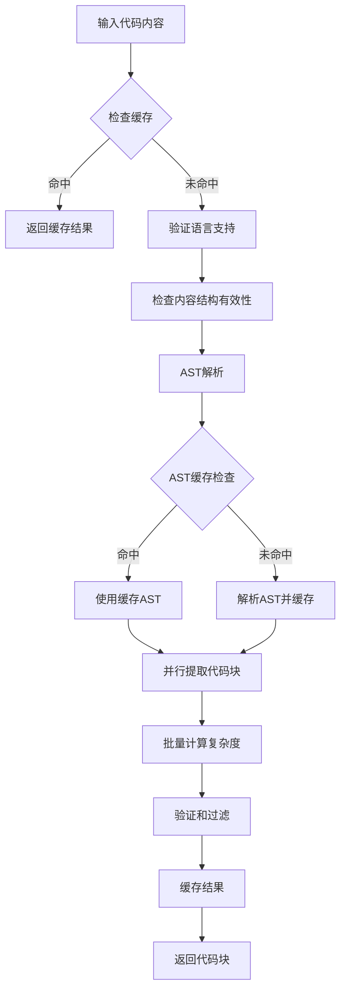

# ASTCodeSplitter 分析报告

## 概述

`ASTCodeSplitter` 是一个基于 Tree-sitter 的 AST 解析代码分割器，实现了智能代码分段功能。它支持分层提取架构和多语言处理，集成了 AST 缓存、统一复杂度计算和并行处理优化。

## 主要处理方法和架构

### 1. 核心架构设计

ASTCodeSplitter 采用了分层架构设计，主要包含以下组件：

- **AST 缓存系统** (`ASTCache`): 缓存 AST 解析结果，避免重复解析
- **统一复杂度计算器** (`UnifiedComplexityCalculator`): 批量计算代码块复杂度
- **并行处理器** (`ParallelProcessor`): 并行处理嵌套结构提取
- **统一内容分析器** (`UnifiedContentAnalyzer`): 提取代码结构信息

### 2. 主要处理流程



### 3. 核心方法分析

#### 3.1 `split()` 方法
主要的代码分割入口点，实现了完整的处理流程：
- 缓存检查和结果缓存
- 语言支持和内容结构验证
- AST 解析和缓存管理
- 并行代码块提取
- 批量复杂度计算
- 性能监控和统计

#### 3.2 `extractChunksFromASTParallel()` 方法
实现了并行化的代码块提取：
- 使用 `unifiedContentAnalyzer.extractAllStructures()` 提取结构
- 分别处理顶级结构和嵌套结构
- 转换为分层结构并生成代码块
- 提供降级机制（无结构时返回完整内容）

#### 3.3 `calculateComplexityBatch()` 方法
批量复杂度计算优化：
- 使用 `UnifiedComplexityCalculator` 进行批量计算
- 提供单个计算回退机制
- 过滤复杂度有效的代码块

## 能处理的 AST 类型和结构

### 1. 支持的编程语言

根据 `StrategyFactory.ts` 中的配置，ASTCodeSplitter 支持以下语言：
- TypeScript/JavaScript
- Python
- Java
- C/C++
- C#
- Go
- Rust
- PHP
- Ruby
- Swift
- Kotlin
- Scala

### 2. 支持的代码结构类型

基于 `ChunkType` 枚举和 `StructureType` 映射，支持以下结构类型：

#### 2.1 主要结构类型
- **函数/方法** (`FUNCTION`, `METHOD`)
- **类/接口/结构体** (`CLASS`, `INTERFACE`, `STRUCT`)
- **枚举** (`ENUM`)
- **变量声明** (`VARIABLE`)
- **导入/导出** (`IMPORT`, `EXPORT`)
- **类型定义** (`TYPE`, `TYPE_DEF`)
- **模块** (`MODULE`)
- **控制流** (`CONTROL_FLOW`)
- **表达式** (`EXPRESSION`)
- **注释/文档** (`COMMENT`, `DOCUMENTATION`)

#### 2.2 特殊结构类型
- **注解** (`ANNOTATION`)
- **调用** (`CALL`)
- **数据流** (`DATA_FLOW`)
- **参数流** (`PARAMETER_FLOW`)
- **联合类型** (`UNION`)
- **配置项** (`CONFIG_ITEM`)
- **数组/表格** (`ARRAY`, `TABLE`)

### 3. 结构提取策略

#### 3.1 分层提取架构
- **顶级结构**: 文件级别的独立结构
- **嵌套结构**: 包含在其他结构内部的子结构
- **内部结构**: 结构内部的辅助元素

#### 3.2 提取配置
```typescript
{
  includeTopLevel: true,           // 包含顶级结构
  includeNested: boolean,          // 包含嵌套结构
  includeInternal: false,          // 包含内部结构
  maxNestingLevel: number,         // 最大嵌套层级
  enableCache: boolean,            // 启用缓存
  enablePerformanceMonitoring: true // 启用性能监控
}
```

## 性能优化机制

### 1. 多层缓存系统

#### 1.1 AST 缓存 (`ASTCache`)
- **缓存内容**: AST 解析结果、解析时间、节点数量
- **缓存策略**: LRU 算法，支持 TTL
- **内存管理**: 自动清理、内存阈值监控
- **统计信息**: 命中率、节省时间、内存使用

```typescript
interface ASTCacheConfig {
  maxSize?: number;              // 最大缓存条目数
  defaultTTL?: number;           // 默认TTL（毫秒）
  enableStats?: boolean;         // 启用统计
  enableMemoryMonitoring?: boolean; // 启用内存监控
  memoryThreshold?: number;      // 内存阈值
  cleanupInterval?: number;      // 清理间隔
}
```

#### 1.2 复杂度计算缓存
- 缓存复杂度计算结果
- 支持批量计算缓存
- 类型特定的复杂度阈值缓存

#### 1.3 结果缓存
- 缓存最终的代码块分割结果
- 基于内容哈希的缓存键生成
- 支持缓存失效和清理

### 2. 并行处理优化

#### 2.1 并行处理器 (`ParallelProcessor`)
- **并发控制**: 基于 CPU 核心数的动态并发
- **任务超时**: 防止长时间阻塞
- **错误处理**: 并行任务的错误隔离

```typescript
interface ParallelProcessorConfig {
  maxConcurrency?: number;       // 最大并发数
  taskTimeout?: number;          // 任务超时时间
}
```

#### 2.2 并行提取策略
- 嵌套结构的并行处理
- 复杂度计算的批量并行处理
- 基于优先级的任务调度

### 3. 性能监控

#### 3.1 执行时间监控
- 总体处理时间
- AST 解析时间
- 结构提取时间
- 复杂度计算时间

#### 3.2 资源使用监控
- 内存使用情况
- 缓存命中率
- 并发任务数量

## 复杂度计算和验证机制

### 1. 统一复杂度计算器 (`UnifiedComplexityCalculator`)

#### 1.1 复杂度计算配置
```typescript
interface UnifiedComplexityConfig {
  enableCache?: boolean;         // 启用缓存
  cacheSize?: number;           // 缓存大小
  cacheTTL?: number;            // 缓存TTL
  enablePerformanceMonitoring?: boolean; // 性能监控
  batchConcurrency?: number;    // 批量并发数
  thresholds?: {                // 复杂度阈值
    minComplexity?: number;
    maxComplexity?: number;
    typeSpecific?: { [key in ChunkType]?: { min?: number; max?: number; }; };
  };
}
```

#### 1.2 复杂度计算策略
- **类型特定计算**: 不同类型结构使用不同的计算方法
- **批量计算**: 支持多个代码块的并行复杂度计算
- **缓存优化**: 缓存复杂度计算结果避免重复计算

### 2. 验证机制

#### 2.1 结构验证
- **大小验证**: 基于配置的最小/最大字符数和行数
- **类型验证**: 使用验证策略进行特定类型验证
- **复杂度验证**: 基于复杂度阈值的验证

#### 2.2 验证策略系统
```typescript
// 根据不同 ChunkType 使用不同的验证策略
const strategy = getValidationStrategy(chunkType);
const validationConfig = { ...strategy.config, ...config };
```

#### 2.3 验证配置
```typescript
const validationConfig = {
  minChars: this.config.global.minChunkSize,
  maxChars: this.config.global.maxChunkSize,
  minLines: this.config.global.minLinesPerChunk
};
```

## 嵌套结构处理策略

### 1. 嵌套级别控制

#### 1.1 嵌套配置
```typescript
interface NestingConfig {
  enableNestedExtraction?: boolean;  // 启用嵌套提取
  maxNestingLevel?: number;          // 最大嵌套级别
  preserveNestedMethods?: boolean;   // 保留嵌套方法
  preserveNestedFunctions?: boolean; // 保留嵌套函数
  preserveNestedClasses?: boolean;   // 保留嵌套类
}
```

#### 1.2 嵌套级别处理
- 递归提取深层嵌套结构
- 基于配置的最大嵌套级别限制
- 嵌套级别信息的保留和传递

### 2. 嵌套结构保留策略

#### 2.1 完整实现 vs 签名保留
根据 `shouldPreserveNestedStructure()` 方法决定：
- **完整实现**: 保留嵌套结构的完整代码
- **签名保留**: 仅保留结构签名（如函数声明）

#### 2.2 签名提取策略
针对不同结构类型使用不同的签名提取方法：
- **函数/方法**: 查找包含函数名的行或函数关键字
- **类/接口**: 查找包含类名的行或类关键字
- **变量声明**: 查找包含变量名的行或变量关键字
- **导入/导出**: 查找包含导入/导出关键字的行
- **枚举/类型**: 查找包含枚举/类型关键字的行

### 3. 智能签名提取

#### 3.1 提取方法
```typescript
private extractSignatureFromStructure(
  structure: any, 
  language: string
): { content: string; lineCount: number; extractionMethod: string } | null
```

#### 3.2 提取策略
- **名称匹配**: 查找包含结构名称的行
- **关键字匹配**: 查找包含类型关键字的行
- **位置优先**: 优先选择前几行的内容
- **回退机制**: 无匹配时使用第一行

## 签名提取详细策略

### 1. 函数/方法签名提取
- 查找包含函数名和括号/箭头/关键字的行
- 查找包含 function 关键字的行
- 回退到第一行

### 2. 类/接口/结构体签名提取
- 查找包含类名和 class/interface/struct 关键字的行
- 查找包含类关键字的行
- 回退到第一行

### 3. 变量声明签名提取
- 查找包含变量名和赋值/类型声明的行
- 查找包含 const/let/var 关键字的行
- 回退到第一行

### 4. 导入/导出签名提取
- 优先使用第一行（通常导入/导出在第一行）
- 查找包含 import/export 关键字的行
- 回退到第一行

## 错误处理和降级机制

### 1. 错误处理策略
- **缓存错误**: 缓存操作失败时记录警告但继续处理
- **解析错误**: AST 解析失败时抛出错误
- **复杂度计算错误**: 批量计算失败时回退到单个计算
- **结构提取错误**: 记录错误信息但继续处理其他结构

### 2. 降级机制
- **无结构处理**: 当没有提取到任何结构时，返回包含整个文件的单一代码块
- **复杂度计算降级**: 批量计算失败时使用单个计算
- **缓存降级**: 缓存不可用时直接计算

## 配置系统

### 1. 分段配置 (`SegmentationConfig`)
```typescript
interface SegmentationConfig {
  global: {
    minChunkSize: number;
    maxChunkSize: number;
    minLinesPerChunk: number;
  };
  nesting: {
    enableNestedExtraction: boolean;
    maxNestingLevel: number;
  };
  performance: {
    enableCaching: boolean;
    maxCacheSize: number;
    enableParallelProcessing: boolean;
  };
}
```

### 2. 动态配置更新
- 支持运行时配置更新
- 配置变更时的缓存清理
- 配置验证和默认值处理

## 总结

ASTCodeSplitter 是一个功能强大、高度优化的代码分割器，具有以下特点：

### 优势
1. **多语言支持**: 支持 13 种主流编程语言
2. **智能结构识别**: 基于 AST 的精确结构提取
3. **性能优化**: 多层缓存和并行处理
4. **灵活配置**: 丰富的配置选项和动态更新
5. **健壮性**: 完善的错误处理和降级机制
6. **可扩展性**: 模块化设计便于扩展新功能

### 适用场景
- 大型代码库的智能分段
- 代码索引和搜索系统
- 代码分析和重构工具
- 文档生成系统
- 代码相似度分析

### 性能特点
- 通过缓存机制显著减少重复解析
- 并行处理提高大规模代码处理效率
- 智能复杂度计算确保代码块质量
- 内存管理和自动清理防止内存泄漏

这个实现展示了现代代码处理系统的最佳实践，结合了性能优化、错误处理和可扩展性设计。

