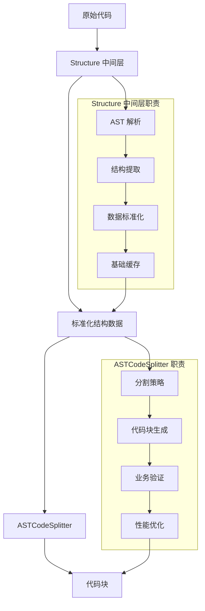

# Structure 中间层与 ASTCodeSplitter 职责划分分析

## 概述

本文档详细分析 Structure 中间层与 ASTCodeSplitter 之间的职责划分，确保两个组件各司其职，避免功能重叠，实现清晰的架构分层。

## 当前职责重叠分析

### 1. 功能重叠识别

#### 1.1 结构提取功能重叠

**ASTCodeSplitter 当前职责**:
```typescript
// 当前 ASTCodeSplitter 中的结构提取逻辑
async extractChunksFromASTParallel(ast, content, filePath, language) {
  // 使用 unifiedContentAnalyzer.extractAllStructures()
  const extractionResult = await this.unifiedContentAnalyzer.extractAllStructures(...)
  
  // 处理顶级结构
  for (const structure of extractionResult.topLevelStructures) {
    // 转换为分层结构
    const hierarchicalStructure = TypeMappingUtils.convertTopLevelToHierarchical(structure)
    // 转换为代码块
    const chunk = QueryResultConverter.convertSingleHierarchicalStructure(...)
  }
}
```

**Structure 中间层计划职责**:
```typescript
// Structure 中间层的结构提取逻辑
async extractAllStructures(content, language, options) {
  // 使用 ParserFacade 进行解析和查询
  const ast = await this.parserFacade.parseCode(content, language)
  const [entities, relationships] = await Promise.all([
    this.parserFacade.findAllEntities(ast, language),
    this.parserFacade.findAllRelationships(ast, language)
  ])
  
  // 转换为标准结构格式
  return this.queryResultAdapter.convertQueryResults(entities, relationships)
}
```

**重叠问题**:
- 两者都负责从 AST 提取结构
- 都需要进行数据格式转换
- 都需要处理嵌套关系

#### 1.2 缓存功能重叠

**ASTCodeSplitter 缓存**:
```typescript
// AST 缓存
this.astCache = new ASTCache(this.logger, {...})
// 结果缓存
cached = this.cacheService?.getFromCache<CodeChunk[]>(cacheKey)
```

**Structure 中间层缓存**:
```typescript
// 结构缓存
class StructureCache {
  cache(key: string, result: ExtractionResult): void
  get(key: string): ExtractionResult | null
}
```

#### 1.3 复杂度计算重叠

**ASTCodeSplitter 复杂度计算**:
```typescript
// 使用统一复杂度计算器
this.complexityCalculator = new UnifiedComplexityCalculator(...)
const enhancedChunks = await this.calculateComplexityBatch(chunks)
```

**Structure 中间层复杂度计算**:
```typescript
// 结构标准化器中的复杂度计算
calculateComplexity(structure: Structure): ComplexityScore
```

## 职责划分原则

### 1. 单一职责原则 (SRP)
- 每个模块应该只有一个改变的理由
- 职责应该明确且内聚

### 2. 开闭原则 (OCP)
- 对扩展开放，对修改封闭
- 通过接口和抽象实现扩展

### 3. 依赖倒置原则 (DIP)
- 高层模块不应该依赖低层模块
- 两者都应该依赖抽象

### 4. 接口隔离原则 (ISP)
- 客户端不应该依赖它不需要的接口
- 接口应该小而专一

## 重新设计的职责划分

### 1. Structure 中间层职责

#### 1.1 核心职责：结构数据的标准化和提供

```typescript
interface StructureFacade {
  // 主要职责：提供标准化的结构数据
  extractAllStructures(content: string, language: string, options?: ExtractionOptions): Promise<ExtractionResult>
  extractStructuresByType(content: string, language: string, structureType: StructureType): Promise<Structure[]>
  extractFromAST(ast: Parser.SyntaxNode, language: string, options?: ExtractionOptions): Promise<ExtractionResult>
}
```

**具体职责**:
- ✅ **数据源适配**: 将不同数据源（ParserQueryService、Tree-sitter等）的结果统一为标准格式
- ✅ **结构标准化**: 确保所有结构数据遵循统一的数据模型
- ✅ **基础缓存**: 提供结构级别的缓存（基于内容哈希）
- ✅ **数据验证**: 验证结构数据的完整性和有效性
- ✅ **元数据丰富**: 为结构添加基础元数据（语言、类型、位置等）

#### 1.2 明确不负责的职责

```typescript
// ❌ Structure 中间层不应该负责的功能
interface StructureFacade {
  // 这些功能应该由上层处理
  // convertToCodeChunks(): Promise<CodeChunk[]>  // ❌ 代码块转换
  // calculateChunkComplexity(): Promise<void>    // ❌ 复杂度计算
  // validateChunkSize(): boolean                 // ❌ 大小验证
  // applyProcessingStrategy(): Promise<void>     // ❌ 处理策略应用
}
```

### 2. ASTCodeSplitter 职责

#### 2.1 核心职责：代码分割策略和业务逻辑

```typescript
class ASTCodeSplitter {
  // 主要职责：将结构数据转换为代码块
  async split(content: string, filePath: string, language: string): Promise<CodeChunk[]>
  
  // 核心处理逻辑
  private async processStructuresToChunks(structures: Structure[], context: ProcessingContext): Promise<CodeChunk[]>
  private async applySplittingStrategy(structures: Structure[], strategy: SplittingStrategy): Promise<CodeChunk[]>
  private async optimizeChunks(chunks: CodeChunk[]): Promise<CodeChunk[]>
}
```

**具体职责**:
- ✅ **分割策略**: 实现不同的代码分割策略（语义边界、大小限制等）
- ✅ **代码块生成**: 将结构数据转换为 CodeChunk 对象
- ✅ **业务验证**: 根据业务规则验证代码块（大小、复杂度等）
- ✅ **嵌套处理**: 处理嵌套结构的分割逻辑
- ✅ **签名提取**: 智能提取结构签名
- ✅ **性能优化**: 代码块级别的性能优化（并行处理、缓存等）

#### 2.2 依赖关系调整

```typescript
class ASTCodeSplitter {
  constructor(
    // 依赖 Structure 中间层而不是 UnifiedContentAnalyzer
    @inject(TYPES.StructureFacade) private structureFacade: StructureFacade,
    @inject(TYPES.LoggerService) private logger: LoggerService,
    @inject(TYPES.SegmentationConfigService) private segmentationConfigService: SegmentationConfigService,
    // 保留业务相关的依赖
    @inject(TYPES.ComplexityCalculator) private complexityCalculator: ComplexityCalculator,
    @inject(TYPES.CacheService) private cacheService?: ICacheService,
    @inject(TYPES.PerformanceMonitor) private performanceMonitor?: IPerformanceMonitor
  ) {}

  async split(content: string, filePath: string, language: string): Promise<CodeChunk[]> {
    // 1. 使用 Structure 中间层获取标准化结构数据
    const extractionResult = await this.structureFacade.extractAllStructures(
      content, 
      language, 
      this.convertConfigToExtractionOptions()
    )

    // 2. 应用分割策略和业务逻辑
    return this.processStructuresToChunks(extractionResult.structures, { filePath, language })
  }
}
```

## 详细职责矩阵

### 1. 数据处理职责

| 功能 | Structure 中间层 | ASTCodeSplitter | 说明 |
|------|------------------|-----------------|------|
| AST 解析 | ✅ 负责 | ❌ 不负责 | 中间层统一处理不同数据源 |
| 结构提取 | ✅ 负责 | ❌ 不负责 | 中间层提供标准化结构 |
| 数据格式转换 | ✅ 负责 | ❌ 不负责 | 中间层统一数据模型 |
| 代码块生成 | ❌ 不负责 | ✅ 负责 | ASTCodeSplitter 专注业务逻辑 |
| 分割策略应用 | ❌ 不负责 | ✅ 负责 | ASTCodeSplitter 实现具体策略 |

### 2. 缓存职责

| 缓存类型 | Structure 中间层 | ASTCodeSplitter | 说明 |
|----------|------------------|-----------------|------|
| AST 缓存 | ✅ 负责 | ❌ 不负责 | 中间层统一管理 AST 缓存 |
| 结构缓存 | ✅ 负责 | ❌ 不负责 | 中间层提供结构级缓存 |
| 代码块缓存 | ❌ 不负责 | ✅ 负责 | ASTCodeSplitter 管理最终结果缓存 |
| 复杂度缓存 | ❌ 不负责 | ✅ 负责 | ASTCodeSplitter 管理业务相关缓存 |

### 3. 验证职责

| 验证类型 | Structure 中间层 | ASTCodeSplitter | 说明 |
|----------|------------------|-----------------|------|
| 数据完整性验证 | ✅ 负责 | ❌ 不负责 | 中间层确保基础数据正确 |
| 结构有效性验证 | ✅ 负责 | ❌ 不负责 | 中间层验证结构格式 |
| 业务规则验证 | ❌ 不负责 | ✅ 负责 | ASTCodeSplitter 验证业务规则 |
| 大小限制验证 | ❌ 不负责 | ✅ 负责 | ASTCodeSplitter 验证配置限制 |
| 复杂度验证 | ❌ 不负责 | ✅ 负责 | ASTCodeSplitter 验证复杂度阈值 |

### 4. 性能优化职责

| 优化类型 | Structure 中间层 | ASTCodeSplitter | 说明 |
|----------|------------------|-----------------|------|
| 解析优化 | ✅ 负责 | ❌ 不负责 | 中间层优化 AST 解析 |
| 结构提取优化 | ✅ 负责 | ❌ 不负责 | 中间层优化结构提取 |
| 并行处理 | ✅ 负责 | ✅ 负责 | 各自优化自己的并行逻辑 |
| 内存管理 | ✅ 负责 | ✅ 负责 | 各自管理自己的内存使用 |

## 接口设计

### 1. Structure 中间层接口

```typescript
// 专注结构数据提供
interface IStructureProvider {
  extractAllStructures(content: string, language: string, options?: ExtractionOptions): Promise<ExtractionResult>
  extractStructuresByType(content: string, language: string, structureType: StructureType): Promise<Structure[]>
  validateStructures(structures: Structure[]): ValidationResult
  getStructureStats(structures: Structure[]): StructureStats
}

// 专注缓存管理
interface IStructureCache {
  getStructures(key: string): Promise<ExtractionResult | null>
  cacheStructures(key: string, result: ExtractionResult): Promise<void>
  invalidateCache(pattern: string): Promise<void>
  getCacheStats(): CacheStats
}
```

### 2. ASTCodeSplitter 接口

```typescript
// 专注代码分割
interface ICodeSplitter {
  split(content: string, filePath: string, language: string): Promise<CodeChunk[]>
  splitWithStructures(structures: Structure[], context: ProcessingContext): Promise<CodeChunk[]>
  applySplittingStrategy(structures: Structure[], strategy: SplittingStrategy): Promise<CodeChunk[]>
  optimizeChunks(chunks: CodeChunk[]): Promise<CodeChunk[]>
}

// 专注业务验证
interface IChunkValidator {
  validateChunkSize(chunk: CodeChunk, config: ValidationConfig): ValidationResult
  validateChunkComplexity(chunk: CodeChunk, thresholds: ComplexityThresholds): ValidationResult
  validateChunkContent(chunk: CodeChunk, rules: ValidationRules): ValidationResult
}
```

## 数据流设计

### 1. 清晰的数据流向



### 2. 错误处理边界

```typescript
// Structure 中间层错误处理
class StructureFacade {
  async extractAllStructures(content: string, language: string): Promise<ExtractionResult> {
    try {
      // 只处理结构提取相关的错误
      return await this.doExtraction(content, language)
    } catch (error) {
      if (this.isStructureExtractionError(error)) {
        // 返回空结果而不是抛出错误，让上层决定如何处理
        return this.createEmptyResult(content, language)
      }
      throw error // 重新抛出非结构提取相关的错误
    }
  }
}

// ASTCodeSplitter 错误处理
class ASTCodeSplitter {
  async split(content: string, filePath: string, language: string): Promise<CodeChunk[]> {
    try {
      const structures = await this.structureFacade.extractAllStructures(content, language)
      
      if (structures.structures.length === 0) {
        // 处理无结构的情况 - 这是业务逻辑
        return this.createFallbackChunk(content, filePath, language)
      }
      
      return this.processStructures(structures, { filePath, language })
    } catch (error) {
      // 处理业务逻辑相关的错误
      this.logger.error(`代码分割失败: ${filePath}`, error)
      throw new CodeSplittingError(`无法分割文件 ${filePath}: ${error.message}`, error)
    }
  }
}
```

## 配置分离

### 1. Structure 中间层配置

```typescript
interface StructureConfig {
  // 数据源配置
  dataSource: {
    preferredSource: 'parser-facade' | 'tree-sitter' | 'fallback'
    enableParallelExtraction: boolean
    maxExtractionConcurrency: number
  }
  
  // 缓存配置
  cache: {
    enabled: boolean
    strategy: 'memory' | 'redis' | 'hybrid'
    ttl: number
    maxSize: number
  }
  
  // 验证配置
  validation: {
    enableStructureValidation: boolean
    strictMode: boolean
    allowedStructureTypes: StructureType[]
  }
}
```

### 2. ASTCodeSplitter 配置

```typescript
interface SplitterConfig {
  // 分割策略配置
  splitting: {
    strategy: 'semantic' | 'size-based' | 'hybrid'
    maxChunkSize: number
    minChunkSize: number
    preferSemanticBoundaries: boolean
  }
  
  // 业务验证配置
  validation: {
    enableSizeValidation: boolean
    enableComplexityValidation: boolean
    complexityThresholds: Record<ChunkType, ComplexityThreshold>
  }
  
  // 性能配置
  performance: {
    enableParallelProcessing: boolean
    maxProcessingConcurrency: number
    enableResultCaching: boolean
  }
}
```

## 迁移策略

### 1. 阶段一：接口定义
- 定义清晰的接口边界
- 确定各自的职责范围
- 设计数据契约

### 2. 阶段二：逐步迁移
- 先迁移数据提供职责到 Structure 中间层
- 保留 ASTCodeSplitter 的业务逻辑
- 逐步移除重叠功能

### 3. 阶段三：优化整合
- 优化接口调用
- 完善错误处理
- 性能调优

## 测试策略

### 1. 单元测试边界
- Structure 中间层：测试结构提取和标准化
- ASTCodeSplitter：测试分割策略和业务逻辑

### 2. 集成测试
- 测试两个组件的协作
- 验证数据流正确性
- 性能基准测试

## 总结

通过明确的职责划分：

1. **Structure 中间层**专注于数据层面的处理：
   - 统一数据源适配
   - 标准化数据格式
   - 基础缓存和验证

2. **ASTCodeSplitter**专注于业务层面的处理：
   - 分割策略实现
   - 代码块生成
   - 业务规则验证

这种划分确保了：
- ✅ 职责单一且明确
- ✅ 低耦合高内聚
- ✅ 易于测试和维护
- ✅ 支持独立演进
- ✅ 清晰的错误边界

通过这种设计，两个组件可以各司其职，共同构建一个清晰、可维护的代码处理架构。