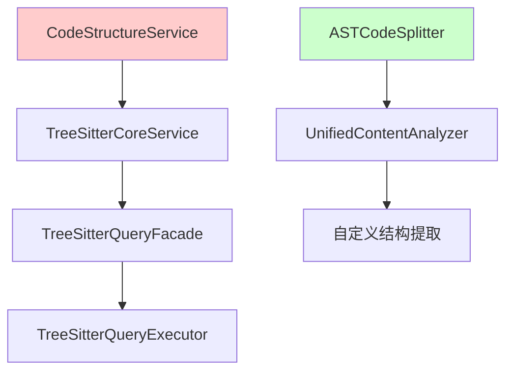
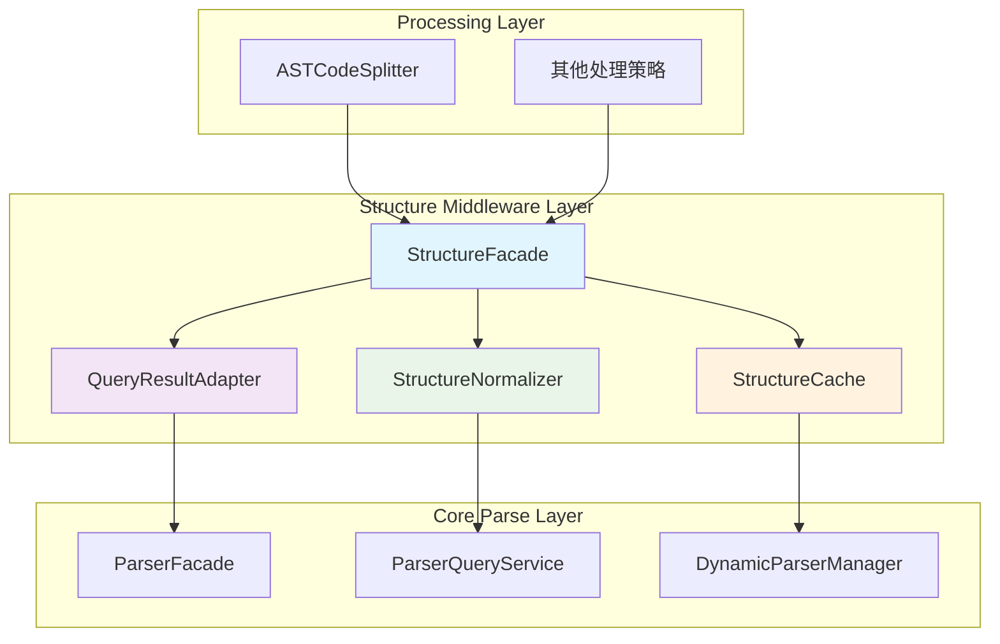

# Structure 中间层设计方案

## 概述

本文档分析将 `src\service\parser\core\structure` 目录扩展为中间层的可行性，并提供完整的设计方案，以解决 ASTCodeSplitter 与 core/parse 目录之间的数据兼容性问题。

## 当前状态分析

### 1. 现有 CodeStructureService 分析

#### 1.1 当前功能
- 提取函数、类、导入、导出等基本结构
- 支持同步和异步操作
- 具备回退机制
- 依赖 TreeSitterCoreService

#### 1.2 现有架构问题


**问题识别**:
1. **数据孤岛**: 两个系统使用不同的数据格式和接口
2. **重复实现**: 相似的功能在不同模块中重复实现
3. **维护困难**: 缺乏统一的结构抽象层

### 2. 中间层可行性评估

#### 2.1 技术可行性 ✅
- **位置优势**: structure 目录位于 core 层，适合作为中间层
- **扩展性**: 现有 CodeStructureService 可以作为基础进行扩展
- **依赖关系**: 可以同时依赖 parse 层和为 processing 层提供服务

#### 2.2 架构可行性 ✅
- **职责清晰**: 专门负责结构数据的标准化和转换
- **接口统一**: 为上层提供统一的结构数据接口
- **解耦合**: 减少处理层与解析层的直接依赖

## 中间层架构设计

### 1. 整体架构



### 2. 核心组件设计

#### 2.1 StructureFacade (结构外观)

```typescript
interface StructureFacade {
  /**
   * 提取所有结构 - 主要接口
   */
  extractAllStructures(
    content: string,
    language: string,
    options?: ExtractionOptions
  ): Promise<ExtractionResult>

  /**
   * 提取特定类型的结构
   */
  extractStructuresByType(
    content: string,
    language: string,
    structureType: StructureType,
    options?: ExtractionOptions
  ): Promise<Structure[]>

  /**
   * 从 AST 提取结构
   */
  extractFromAST(
    ast: Parser.SyntaxNode,
    language: string,
    options?: ExtractionOptions
  ): Promise<ExtractionResult>

  /**
   * 批量处理多个文件
   */
  extractBatch(
    files: Array<{ content: string; language: string; filePath: string }>,
    options?: BatchExtractionOptions
  ): Promise<BatchExtractionResult>
}
```

#### 2.2 QueryResultAdapter (查询结果适配器)

```typescript
class QueryResultAdapter {
  /**
   * 将 ParserQueryService 结果转换为标准结构
   */
  adaptQueryResults(
    entities: EntityQueryResults,
    relationships: RelationshipQueryResults,
    language: string
  ): ExtractionResult

  /**
   * 转换单个实体查询结果
   */
  adaptEntityResult(entity: EntityQueryResult): Structure

  /**
   * 转换单个关系查询结果
   */
  adaptRelationshipResult(relationship: RelationshipQueryResult): Structure

  /**
   * 批量转换优化
   */
  adaptBatch(
    queryResults: Array<{
      entities: EntityQueryResults
      relationships: RelationshipQueryResults
      language: string
    }>
  ): ExtractionResult[]
}
```

#### 2.3 StructureNormalizer (结构标准化器)

```typescript
class StructureNormalizer {
  /**
   * 标准化结构数据
   */
  normalize(structure: Structure): NormalizedStructure

  /**
   * 验证结构完整性
   */
  validate(structure: Structure): ValidationResult

  /**
   * 增强结构元数据
   */
  enrichMetadata(structure: Structure, context: EnrichmentContext): Structure

  /**
   * 计算结构复杂度
   */
  calculateComplexity(structure: Structure): ComplexityScore
}
```

#### 2.4 StructureCache (结构缓存)

```typescript
class StructureCache {
  /**
   * 缓存提取结果
   */
  cache(key: string, result: ExtractionResult): void

  /**
   * 获取缓存结果
   */
  get(key: string): ExtractionResult | null

  /**
   * 智能缓存键生成
   */
  generateKey(
    content: string,
    language: string,
    options: ExtractionOptions
  ): string

  /**
   * 缓存统计和管理
   */
  getStats(): CacheStats
  clear(): void
}
```

### 3. 数据模型设计

#### 3.1 统一结构模型

```typescript
interface Structure {
  // 基础信息
  id: string
  type: StructureType
  name?: string
  content: string
  
  // 位置信息
  location: {
    startLine: number
    endLine: number
    startColumn: number
    endColumn: number
    startIndex: number
    endIndex: number
  }
  
  // 层级信息
  level: number
  parentId?: string
  childrenIds: string[]
  
  // 元数据
  metadata: {
    language: string
    complexity: ComplexityScore
    confidence: number
    source: 'query' | 'ast' | 'fallback'
    priority: QueryPriority
    tags: string[]
    properties: Record<string, any>
  }
  
  // 关系信息
  relationships: Relationship[]
}

interface ExtractionResult {
  structures: Structure[]
  topLevelStructures: Structure[]
  nestedStructures: Structure[]
  relationships: Relationship[]
  stats: ExtractionStats
  metadata: ExtractionMetadata
}
```

#### 3.2 结构类型枚举

```typescript
enum StructureType {
  // 实体类型
  FUNCTION = 'function',
  METHOD = 'method',
  CLASS = 'class',
  INTERFACE = 'interface',
  STRUCT = 'struct',
  ENUM = 'enum',
  UNION = 'union',
  TYPE_ALIAS = 'type_alias',
  VARIABLE = 'variable',
  CONSTANT = 'constant',
  
  // 模块类型
  IMPORT = 'import',
  EXPORT = 'export',
  MODULE = 'module',
  NAMESPACE = 'namespace',
  
  // 控制类型
  CONTROL_FLOW = 'control_flow',
  LOOP = 'loop',
  CONDITIONAL = 'conditional',
  
  // 关系类型
  CALL = 'call',
  DEPENDENCY = 'dependency',
  INHERITANCE = 'inheritance',
  DATA_FLOW = 'data_flow',
  
  // 其他类型
  COMMENT = 'comment',
  ANNOTATION = 'annotation',
  GENERIC = 'generic'
}
```

### 4. 实现策略

#### 4.1 渐进式迁移

**阶段一：基础框架搭建**
1. 创建 StructureFacade 接口和基础实现
2. 实现 QueryResultAdapter 基础转换功能
3. 建立统一的数据模型

**阶段二：功能完善**
1. 实现 StructureNormalizer 标准化功能
2. 添加 StructureCache 缓存支持
3. 完善错误处理和回退机制

**阶段三：性能优化**
1. 实现批量处理优化
2. 添加并行处理支持
3. 优化内存使用和缓存策略

**阶段四：集成替换**
1. 修改 ASTCodeSplitter 使用新的中间层
2. 逐步替换其他处理策略的依赖
3. 清理旧的适配器代码

#### 4.2 兼容性保证

```typescript
// 向后兼容的适配器
class LegacyUnifiedContentAnalyzerAdapter {
  constructor(private structureFacade: StructureFacade) {}

  async extractAllStructures(
    content: string,
    language: string,
    options: any
  ): Promise<any> {
    const result = await this.structureFacade.extractAllStructures(
      content,
      language,
      this.convertOptions(options)
    )
    
    return this.convertToLegacyFormat(result)
  }

  private convertOptions(options: any): ExtractionOptions {
    // 转换旧选项格式到新格式
  }

  private convertToLegacyFormat(result: ExtractionResult): any {
    // 转换新结果格式到旧格式
  }
}
```

### 5. 性能优化策略

#### 5.1 缓存策略
- **多级缓存**: 内存缓存 + 分布式缓存
- **智能失效**: 基于内容哈希的缓存失效
- **预热机制**: 常用结构的预加载

#### 5.2 并行处理
- **结构级并行**: 不同类型结构的并行提取
- **文件级并行**: 多个文件的并行处理
- **任务调度**: 基于优先级的智能任务调度

#### 5.3 内存优化
- **流式处理**: 大文件的流式结构提取
- **对象池**: 重用结构对象减少 GC 压力
- **延迟加载**: 按需加载详细结构信息

### 6. 配置和扩展

#### 6.1 配置系统

```typescript
interface StructureConfig {
  // 提取配置
  extraction: {
    enabledTypes: StructureType[]
    maxDepth: number
    includeComments: boolean
    includeRelationships: boolean
  }
  
  // 缓存配置
  cache: {
    enabled: boolean
    maxSize: number
    ttl: number
    strategy: 'lru' | 'lfu' | 'fifo'
  }
  
  // 性能配置
  performance: {
    parallelProcessing: boolean
    maxConcurrency: number
    batchSize: number
  }
  
  // 语言特定配置
  languageSpecific: Record<string, LanguageConfig>
}
```

#### 6.2 扩展机制

```typescript
interface StructureExtractor {
  canHandle(language: string, structureType: StructureType): boolean
  extract(ast: Parser.SyntaxNode, options: ExtractionOptions): Promise<Structure[]>
}

interface StructureEnricher {
  canEnrich(structure: Structure): boolean
  enrich(structure: Structure, context: EnrichmentContext): Promise<Structure>
}

// 插件注册机制
class StructurePluginRegistry {
  registerExtractor(extractor: StructureExtractor): void
  registerEnricher(enricher: StructureEnricher): void
  getExtractors(language: string, structureType: StructureType): StructureExtractor[]
  getEnrichers(structure: Structure): StructureEnricher[]
}
```

### 7. 监控和调试

#### 7.1 性能监控

```typescript
interface StructureMetrics {
  extraction: {
    totalExtractions: number
    averageTime: number
    successRate: number
    errorRate: number
  }
  
  cache: {
    hitRate: number
    missRate: number
    evictionCount: number
    memoryUsage: number
  }
  
  performance: {
    throughput: number
    latency: LatencyStats
    resourceUsage: ResourceStats
  }
}
```

#### 7.2 调试支持

```typescript
interface StructureDebugInfo {
  extractionTrace: ExtractionStep[]
  structureGraph: StructureGraph
  performanceProfile: PerformanceProfile
  errorDetails: ErrorDetail[]
}
```

## 实施计划

### 第一阶段：基础实现 (2-3周)
- [ ] 创建 StructureFacade 接口和基础实现
- [ ] 实现 QueryResultAdapter 核心转换逻辑
- [ ] 定义统一的数据模型
- [ ] 编写基础单元测试

### 第二阶段：功能完善 (2-3周)
- [ ] 实现 StructureNormalizer
- [ ] 添加 StructureCache 支持
- [ ] 实现错误处理和回退机制
- [ ] 添加配置系统

### 第三阶段：性能优化 (1-2周)
- [ ] 实现并行处理
- [ ] 优化缓存策略
- [ ] 添加性能监控
- [ ] 性能测试和调优

### 第四阶段：集成部署 (1-2周)
- [ ] 修改 ASTCodeSplitter 集成新中间层
- [ ] 创建兼容性适配器
- [ ] 集成测试
- [ ] 文档更新

## 风险评估和缓解

### 1. 技术风险
- **风险**: 新中间层可能引入性能瓶颈
- **缓解**: 实施详细的性能测试和监控

### 2. 兼容性风险
- **风险**: 现有代码可能不兼容新接口
- **缓解**: 提供适配器模式保证向后兼容

### 3. 复杂性风险
- **风险**: 系统复杂度增加
- **缓解**: 清晰的接口设计和完善的文档

## 总结

将 `core/structure` 目录扩展为中间层是一个可行的解决方案，具有以下优势：

1. **统一接口**: 为上层处理提供统一的结构数据接口
2. **解耦合**: 减少处理层与解析层的直接依赖
3. **可扩展性**: 支持新的结构类型和提取策略
4. **性能优化**: 集中的缓存和优化策略
5. **维护性**: 集中的结构处理逻辑便于维护

通过渐进式的实施策略，可以在保证系统稳定性的前提下，逐步完成架构升级，最终实现更加清晰、高效和可维护的代码处理系统。