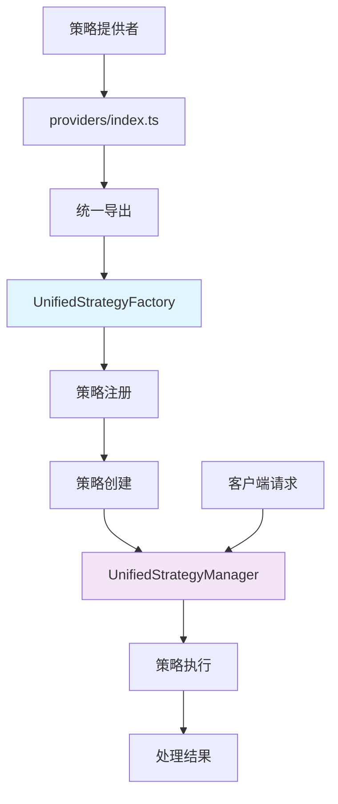
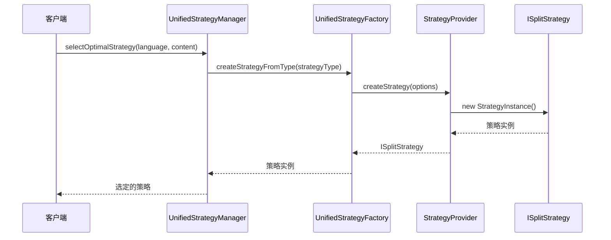

## 📊 strategies目录策略导出机制分析

### 1. 策略导出的核心模块

strategies目录中的策略导出主要由以下三个核心模块处理：

#### 1.1 [`UnifiedStrategyFactory`](src/service/parser/processing/strategies/factory/UnifiedStrategyFactory.ts)
- **职责**: 策略创建的中央工厂
- **功能**:
  - 注册和管理所有策略提供者
  - 根据类型、语言、AST等条件创建策略
  - 支持策略装饰器（缓存、性能监控等）
  - 提供策略验证和统计功能

#### 1.2 [`UnifiedStrategyManager`](src/service/parser/processing/strategies/manager/UnifiedStrategyManager.ts)
- **职责**: 策略管理和执行协调
- **功能**:
  - 智能策略选择和优先级管理
  - 策略执行和性能监控
  - 降级路径管理和错误处理
  - 策略缓存和统计收集

#### 1.3 [`providers/index.ts`](src/service/parser/processing/strategies/providers/index.ts)
- **职责**: 策略提供者的统一导出
- **功能**:
  - 集中导出所有策略提供者
  - 保持向后兼容的接口
  - 提供策略类型的统一访问点

### 2. 策略导出工作流



### 3. 详细的导出机制

#### 3.1 提供者注册机制
在`UnifiedStrategyFactory.ts`中，所有策略提供者通过`registerDefaultProviders`方法进行注册：

```typescript
private registerDefaultProviders(): void {
    // 注册AST策略提供者
    this.registerProvider(new ASTStrategyProvider(treeSitterService, this.logger));
    // 注册语义策略提供者
    this.registerProvider(new SemanticStrategyProvider(this.logger));
    // 注册行级策略提供者
    this.registerProvider(new LineStrategyProvider(universalTextSplitter, this.logger));
    // 注册专门格式策略提供者
    this.registerProvider(new MarkdownStrategyProvider(markdownSplitter, this.logger));
    this.registerProvider(new XMLStrategyProvider(xmlSplitter, this.logger));
    // 注册括号策略提供者
    this.registerProvider(new BracketStrategyProvider(universalTextSplitter, this.logger));
    // 注册AST高级策略提供者
    this.registerProvider(new FunctionStrategyProvider(treeSitterService, this.logger));
    this.registerProvider(new ClassStrategyProvider(treeSitterService, this.logger));
    this.registerProvider(new ModuleStrategyProvider(treeSitterService, this.logger));
    this.registerProvider(new HierarchicalStrategyProvider(treeSitterService, this.logger));
}
```

#### 3.2 策略创建流程


### 4. 具体的策略提供者类型

| 提供者类型 | 策略名称 | 主要功能 | 优先级 |
|-----------|----------|----------|---------|
| **ASTStrategyProvider** | `treesitter_ast` | AST解析和结构化提取 | 1 |
| **SemanticStrategyProvider** | `semantic_provider` | 语义分数后备分割 | 5 |
| **LineStrategyProvider** | `universal_line` | 简单行分段 | 10 |
| **BracketStrategyProvider** | `universal_bracket` | 括号平衡分段 | 3 |
| **MarkdownStrategyProvider** | `markdown_specialized` | Markdown专门处理 | 2 |
| **XMLStrategyProvider** | `xml_specialized` | XML专门处理 | 2 |

### 5. 策略导出的设计优势

#### 5.1 开闭原则
- 新增策略只需实现新的Strategy和Provider
- 无需修改核心工厂和管理器逻辑

#### 5.2 单一职责原则
- Provider专注于策略创建
- Strategy专注于具体分段逻辑
- Factory专注于策略管理
- Manager专注于策略协调

#### 5.3 依赖注入
- 所有策略通过依赖注入获取所需服务
- 支持灵活的依赖配置和替换

### 6. 总结

strategies目录中的策略导出机制是一个精心设计的工厂模式实现：

1. **核心模块**: `UnifiedStrategyFactory` + `UnifiedStrategyManager` + `providers/index.ts`
2. **工作流**: 提供者注册 → 策略创建 → 智能选择 → 策略执行
3. **设计模式**: 工厂模式 + 策略模式 + 装饰器模式
4. **扩展性**: 易于添加新策略类型和提供者
5. **健壮性**: 完善的降级机制和错误处理

这种设计使得parser模块能够灵活、高效地处理各种代码分段需求，同时保持良好的可维护性和可扩展性。