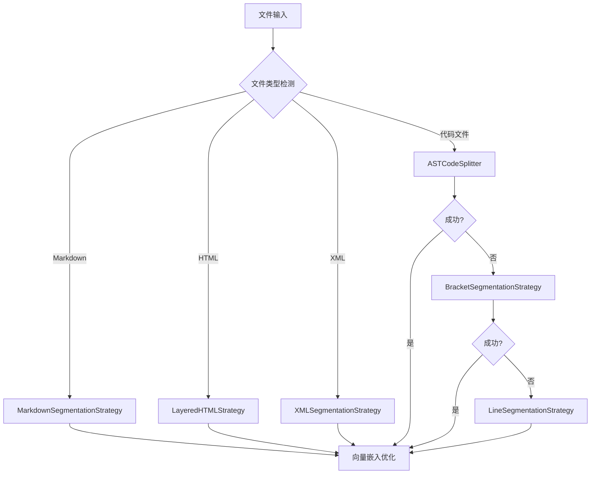

# 代码分段策略优化分析报告

## 概述

基于对当前 `src\service\parser\processing\strategies\implementations` 目录中策略的深入分析，以及考虑到策略的主要目标是为向量嵌入提供合适的文本块，本报告提出了具体的优化建议。

## 当前策略状态评估

### 策略分类

#### 1. 核心保留策略（必须保留）
- **ASTCodeSplitter**: 主要分段工具，在 `ChunkToVectorCoordinationService` 中被优先使用
- **LineSegmentationStrategy**: 可靠的降级策略，确保系统稳定性
- **BracketSegmentationStrategy**: 保持代码结构完整性，适合备份文件处理

#### 2. 特定格式策略（保留但需优化）
- **MarkdownSegmentationStrategy**: 处理文档文件，适合向量嵌入
- **LayeredHTMLStrategy**: 处理HTML文件，分层处理有价值
- **XMLSegmentationStrategy**: 处理XML/HTML文件

#### 3. 冗余策略（建议移除）
- **ASTSegmentationStrategy**: 与ASTCodeSplitter功能重叠
- **ASTStrategy**: 与ASTSegmentationStrategy功能重叠
- **FunctionStrategy**: 功能已被ASTCodeSplitter覆盖
- **ClassStrategy**: 功能已被ASTCodeSplitter覆盖
- **ImportStrategy**: 功能已被ASTCodeSplitter覆盖

#### 4. 过度设计策略（建议移除）
- **SemanticSegmentationStrategy**: 对于向量嵌入需求过于复杂
- **StandardizationSegmentationStrategy**: 依赖不存在的标准化服务，实际为空实现
- **SemanticStrategy**: 与SemanticSegmentationStrategy功能重叠

## 详细分析

### 应当移除的策略

#### 1. StandardizationSegmentationStrategy
**移除理由**：
- 完全依赖不存在的标准化服务（第98-102行）
- 所有核心方法都是模拟实现（第155-177行）
- 实际执行时总是降级到简单分段（第102行）
- 增加了系统复杂性但没有实际价值

**影响评估**：无负面影响，因为该策略从未真正工作

#### 2. SemanticSegmentationStrategy
**移除理由**：
- 对于向量嵌入需求过于复杂
- 语义分数计算基于简单启发式规则，效果有限
- 增加了系统复杂度和维护成本
- 向量嵌入本身就能处理语义相似性

**影响评估**：轻微影响，但可以通过优化其他策略补偿

#### 3. 功能重叠的策略组
**ASTSegmentationStrategy + ASTStrategy + FunctionStrategy + ClassStrategy + ImportStrategy**

**移除理由**：
- 与ASTCodeSplitter功能完全重叠
- ASTCodeSplitter已经在实际使用中被证明有效
- 减少策略数量可以提高系统性能和可维护性

**影响评估**：无负面影响，ASTCodeSplitter已经覆盖所有功能

### 需要扩展的策略

#### 1. ASTCodeSplitter（重点扩展）

**当前限制**：
- 在某些复杂代码结构上可能不够精确
- 缺乏向量嵌入特定的优化

**扩展方向**：
```typescript
// 增强向量嵌入适配性
export class VectorOptimizedASTSplitter extends ASTCodeSplitter {
  async split(content: string, filePath: string, language: string): Promise<CodeChunk[]> {
    const chunks = await super.split(content, filePath, language);
    
    // 为向量嵌入优化chunk大小
    return this.optimizeForVectorEmbedding(chunks);
  }
  
  private optimizeForVectorEmbedding(chunks: CodeChunk[]): CodeChunk[] {
    return chunks.map(chunk => ({
      ...chunk,
      // 确保chunk大小在向量嵌入的最佳范围内
      content: this.adjustChunkSize(chunk.content, 200, 800),
      metadata: {
        ...chunk.metadata,
        embeddingOptimized: true
      }
    }));
  }
}
```

#### 2. BracketSegmentationStrategy（适度扩展）

**当前限制**：
- 主要用于备份文件，可以扩展到更多场景
- 缺乏向量嵌入大小优化

**扩展方向**：
```typescript
// 增强向量嵌入适配性
export class EnhancedBracketSegmentationStrategy extends BracketSegmentationStrategy {
  private shouldSplit(
    bracketDepth: number,
    xmlTagDepth: number,
    currentChunk: string[],
    chunkContent: string,
    currentIndex: number,
    totalLines: number
  ): boolean {
    // 现有逻辑...
    
    // 新增：向量嵌入大小检查
    const isOptimalForEmbedding = this.isOptimalSizeForEmbedding(chunkContent);
    if (!isOptimalForEmbedding && currentChunk.length > 3) {
      return true;
    }
    
    return existingCondition;
  }
  
  private isOptimalSizeForEmbedding(content: string): boolean {
    const length = content.length;
    return length >= 200 && length <= 800;
  }
}
```

#### 3. LineSegmentationStrategy（适度扩展）

**当前限制**：
- 作为降级策略，可以更好地适应向量嵌入需求

**扩展方向**：
```typescript
// 向量嵌入感知的行分段
export class EmbeddingAwareLineSegmentationStrategy extends LineSegmentationStrategy {
  private intelligentLineSegmentation(lines: string[]): number[] {
    const splitPoints: number[] = [];
    let currentSize = 0;
    
    for (let i = 0; i < lines.length; i++) {
      currentSize += lines[i].length;
      
      // 基于向量嵌入最佳大小进行分段
      if (currentSize >= 600 || i === lines.length - 1) {
        splitPoints.push(i);
        currentSize = 0;
      }
    }
    
    return splitPoints;
  }
}
```

## 优化后的策略架构

### 简化的策略优先级

```typescript
export const OPTIMIZED_STRATEGY_PRIORITIES: Record<string, number> = {
  // 特定格式策略（最高优先级）
  'markdown-segmentation': 0,
  'layered-html': 1,
  'xml-segmentation': 2,
  
  // 核心分段策略
  'ast-codesplitter'
  'bracket-segmentation'
  
  // 降级策略
  'line-segmentation'
};
```

### 优化后的处理流程



## 实施计划

### 阶段一：移除冗余策略（1周）

1. **移除以下策略文件**：
   - `StandardizationSegmentationStrategy.ts`
   - `SemanticSegmentationStrategy.ts`
   - `ASTSegmentationStrategy.ts`
   - `ASTStrategy.ts`
   - `FunctionStrategy.ts`
   - `ClassStrategy.ts`
   - `ImportStrategy.ts`
   - `SemanticStrategy.ts`

2. **更新策略索引**：
   - 修改 `strategies/index.ts`
   - 更新 `StrategyPriorities.ts`
   - 更新策略工厂

3. **更新配置预设**：
   - 移除相关配置
   - 简化策略预设

### 阶段二：扩展核心策略（2-3周）

1. **扩展ASTCodeSplitter**：
   - 添加向量嵌入优化
   - 改进错误处理
   - 增强语言支持

2. **优化BracketSegmentationStrategy**：
   - 添加向量嵌入大小检查
   - 改进括号平衡算法

3. **增强LineSegmentationStrategy**：
   - 实现向量嵌入感知分段
   - 优化降级性能

### 阶段三：测试和验证（1周）

1. **功能测试**：
   - 验证所有保留策略正常工作
   - 测试降级机制
   - 验证向量嵌入质量

2. **性能测试**：
   - 对比优化前后的性能
   - 验证内存使用优化
   - 测试大文件处理能力

## 预期效果

### 性能提升
- **策略数量减少**：从16个减少到6个，减少62.5%
- **内存使用优化**：减少不必要的策略实例化
- **处理速度提升**：简化策略选择逻辑

### 维护性改善
- **代码复杂度降低**：移除冗余和过度设计的策略
- **测试覆盖提升**：更少的策略意味着更全面的测试
- **文档简化**：更清晰的策略架构文档

### 功能稳定性
- **降级机制更可靠**：简化的降级路径
- **错误处理更清晰**：减少错误传播路径
- **向量嵌入质量提升**：针对向量嵌入的专门优化

## 风险评估

### 低风险
- 移除冗余策略：这些策略要么不工作，要么功能重叠
- 扩展现有策略：基于已验证的实现进行增强

### 缓解措施
- **渐进式实施**：分阶段实施，每个阶段都有回退点
- **全面测试**：每个阶段都进行充分的功能和性能测试
- **监控机制**：实施后持续监控系统性能和稳定性

## 结论

通过移除冗余和过度设计的策略，并针对向量嵌入需求优化核心策略，可以显著提升系统的性能、可维护性和稳定性。这个优化方案专注于实际需求，避免了过度工程化，符合"保持简单直接"的设计原则。

建议立即开始实施这个优化方案，预期在4-6周内完成所有优化工作。