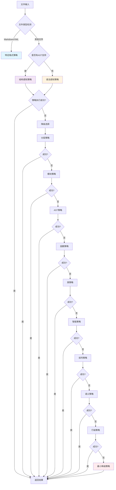

# 🎯 策略优先级设计方案

## 📋 设计原则

基于"复杂规则优先、简单规则放最后，特定文件直接触发相应策略"的原则，设计以下策略优先级体系：

### 核心原则
1. **复杂规则优先**：使用AST解析、语义分析等复杂策略优先执行
2. **简单规则放最后**：行级分段、语义后备等简单策略作为最后保障
3. **特定文件直接触发**：特定格式文件（Markdown、XML等）直接使用专用策略
4. **智能降级机制**：当复杂策略失败时，按复杂度降序选择替代策略

## 🏗️ 策略优先级体系

### 优先级定义（数值越小优先级越高）

| 优先级 | 策略类型 | 策略名称 | 复杂度 | 适用场景 |
|--------|----------|----------|--------|----------|
| **0** | **特定格式策略** | `markdown_specialized`, `xml_specialized` | 高 | 特定格式文件直接触发 |
| **1** | **结构感知策略** | `StructureAwareStrategyProvider` | 极高 | 基于标准化查询结果的智能分割 |
| **2** | **语法感知策略** | `SyntaxAwareStrategyProvider` | 高 | 组合函数、类、导入策略 |
| **3** | **分层策略** | `hierarchical_provider` | 高 | 分层代码结构处理 |
| **4** | **模块策略** | `module_provider` | 中高 | 导入/导出语句提取 |
| **5** | **AST策略** | `treesitter_ast` | 中高 | 基础AST解析 |
| **6** | **函数策略** | `function_provider` | 中 | 函数级别分段 |
| **7** | **类策略** | `class_provider` | 中 | 类级别分段 |
| **8** | **智能策略** | `IntelligentStrategyProvider` | 中 | 语义边界分析 |
| **9** | **括号策略** | `universal_bracket` | 中低 | 括号平衡分段 |
| **10** | **语义策略** | `semantic_provider` | 低 | 语义分数后备 |
| **11** | **行级策略** | `universal_line` | 最低 | 简单行分段 |
| **12** | **最小降级策略** | `minimal_fallback` | 最低 | 最后保障 |

## 🔄 策略选择工作流



## 📁 特定文件类型映射

### 直接触发策略的文件类型

| 文件扩展名 | 策略名称 | 优先级 | 说明 |
|-----------|----------|--------|------|
| `.md`, `.markdown` | `markdown_specialized` | 0 | Markdown专用策略 |
| `.xml`, `.html`, `.xhtml`, `.svg` | `xml_specialized` | 0 | XML/HTML专用策略 |
| `.json`, `.yaml`, `.yml`, `.toml` | `treesitter_ast` | 5 | 配置文件使用AST策略 |
| `.test.js`, `.spec.js`, `.test.ts`, `.spec.ts` | `function_provider` | 6 | 测试文件使用函数策略 |

### 语言特定策略映射

| 语言 | 首选策略 | 备选策略 | 说明 |
|------|----------|----------|------|
| TypeScript/JavaScript | 结构感知策略 | 语法感知策略 | 结构化语言优先使用复杂策略 |
| Python | 语法感知策略 | AST策略 | Python支持良好AST解析 |
| Java/C# | 分层策略 | 类策略 | 面向对象语言优先处理类结构 |
| Go/Rust | AST策略 | 函数策略 | 函数式语言优先处理函数 |
| 配置文件 | AST策略 | 行级策略 | 配置文件使用AST策略 |

## ⚙️ 实现方案

### 1. 统一优先级枚举

```typescript
export enum StrategyPriority {
  // 特定格式策略（直接触发）
  SPECIALIZED_FORMAT = 0,
  
  // 复杂策略（AST和语义分析）
  STRUCTURE_AWARE = 1,
  SYNTAX_AWARE = 2,
  HIERARCHICAL = 3,
  MODULE_LEVEL = 4,
  AST_BASED = 5,
  
  // 中等复杂度策略
  FUNCTION_LEVEL = 6,
  CLASS_LEVEL = 7,
  INTELLIGENT = 8,
  
  // 简单策略
  BRACKET_BALANCED = 9,
  SEMANTIC_FALLBACK = 10,
  LINE_BASED = 11,
  
  // 降级策略
  MINIMAL_FALLBACK = 12
}
```

### 2. 智能策略选择器

```typescript
class SmartStrategySelector {
  selectOptimalStrategy(
    filePath: string,
    language: string,
    content: string,
    hasAST: boolean,
    fileSize: number
  ): string {
    // 1. 特定文件类型直接触发
    const specificStrategy = this.getSpecificFileStrategy(filePath);
    if (specificStrategy) return specificStrategy;
    
    // 2. 根据语言特性选择
    const languageStrategy = this.getLanguageSpecificStrategy(language, hasAST);
    if (languageStrategy) return languageStrategy;
    
    // 3. 根据文件大小选择
    return this.getSizeBasedStrategy(fileSize, language);
  }
  
  private getSpecificFileStrategy(filePath: string): string | null {
    const extension = filePath.split('.').pop()?.toLowerCase();
    
    switch (extension) {
      case 'md':
      case 'markdown':
        return 'markdown_specialized';
      case 'xml':
      case 'html':
      case 'xhtml':
      case 'svg':
        return 'xml_specialized';
      case 'json':
      case 'yaml':
      case 'yml':
      case 'toml':
        return 'treesitter_ast';
      default:
        return null;
    }
  }
}
```

### 3. 降级路径管理

```typescript
class FallbackManager {
  private readonly fallbackPaths: Record<string, string[]> = {
    'markdown_specialized': ['universal_line'],
    'xml_specialized': ['universal_bracket', 'universal_line'],
    'StructureAwareStrategyProvider': [
      'SyntaxAwareStrategyProvider', 'hierarchical_provider', 'module_provider',
      'treesitter_ast', 'function_provider', 'class_provider', 'IntelligentStrategyProvider',
      'universal_bracket', 'semantic_provider', 'universal_line'
    ],
    // ... 其他策略的降级路径
  };
  
  getFallbackPath(failedStrategy: string, failureReason: string): string[] {
    const basePath = this.fallbackPaths[failedStrategy] || [
      'universal_bracket', 'semantic_provider', 'universal_line'
    ];
    
    // 根据失败原因调整降级路径
    if (failureReason.includes('AST') || failureReason.includes('TreeSitter')) {
      // 如果AST相关失败，跳过AST相关策略
      return basePath.filter(strategy => 
        !strategy.includes('ast') && !strategy.includes('Structure') && 
        !strategy.includes('Syntax') && !strategy.includes('hierarchical')
      );
    }
    
    return basePath;
  }
}
```

## 📊 性能优化建议

### 1. 策略缓存
- 缓存策略执行结果，避免重复计算
- 基于文件内容和配置的哈希值作为缓存键

### 2. 预检测机制
- 在策略执行前进行快速预检测
- 避免不必要的复杂策略执行

### 3. 并行执行优化
- 对于可并行执行的策略进行优化
- 设置合理的超时机制

## 🔧 配置选项

```typescript
interface StrategyPriorityConfig {
  // 启用/禁用特定策略类型
  enableASTStrategies: boolean;
  enableSemanticStrategies: boolean;
  enableSimpleStrategies: boolean;
  
  // 性能调优
  maxExecutionTime: number;
  enableCaching: boolean;
  cacheSize: number;
  
  // 特定策略配置
  specializedFormats: Record<string, string>;
  languagePreferences: Record<string, string[]>;
}
```

## 📈 监控和调优

### 监控指标
- 策略执行成功率
- 平均执行时间
- 内存使用情况
- 降级频率统计

### 自适应调整
- 基于历史性能数据动态调整优先级
- 学习最优策略选择模式
- 自动优化降级路径

## ✅ 总结

这个设计方案实现了：
1. **复杂规则优先**：AST和语义分析策略具有最高优先级
2. **简单规则放最后**：行级和语义后备策略作为保障机制
3. **特定文件直接触发**：专用格式文件使用专用策略
4. **智能降级**：基于失败原因的智能降级选择
5. **可配置性**：支持运行时调整和优化

通过这个优先级体系，系统能够在保证处理质量的同时，最大化执行效率，为不同场景提供最优的策略选择。