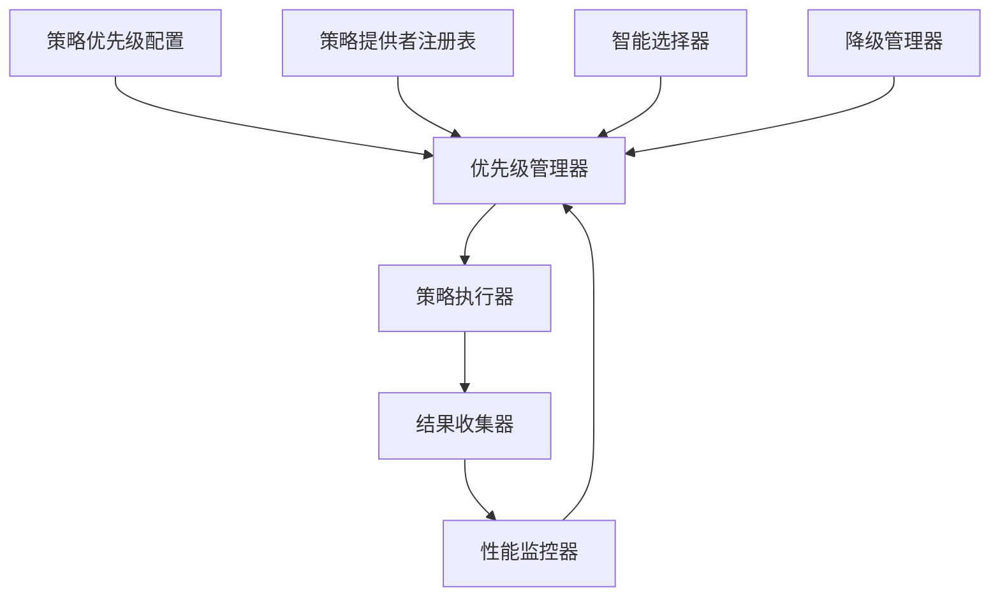

# 🎯 策略优先级实施方案

## 📋 概述

本方案旨在实现一个与策略文件分离的优先级管理系统，解决当前策略优先级硬编码的问题，提供灵活的配置和动态调整能力。

## 🎯 设计目标

1. **分离关注点**：将优先级配置与策略实现分离
2. **动态配置**：支持运行时调整优先级
3. **智能选择**：基于文件特征自动选择最优策略
4. **灵活降级**：支持可配置的降级路径
5. **监控优化**：基于性能数据动态优化优先级

## 🏗️ 架构设计

### 核心组件



### 组件职责

1. **优先级管理器 (PriorityManager)**：管理所有策略的优先级配置
2. **智能选择器 (SmartStrategySelector)**：基于文件特征选择最优策略
3. **降级管理器 (FallbackManager)**：管理策略失败时的降级路径
4. **性能监控器 (PerformanceMonitor)**：收集策略执行数据用于优化

## 📁 实现方案

### 1. 优先级配置系统

#### 配置文件结构

```typescript
// config/strategy-priorities.json
{
  "defaultPriorities": {
    "markdown_specialized": 0,
    "xml_specialized": 0,
    "structure_aware": 1,
    "syntax_aware": 2,
    "hierarchical": 3,
    "module": 4,
    "treesitter_ast": 5,
    "function": 6,
    "class": 7,
    "intelligent": 8,
    "universal_bracket": 9,
    "semantic": 10,
    "universal_line": 11,
    "minimal_fallback": 12
  },
  
  "languageSpecificPriorities": {
    "typescript": {
      "structure_aware": 1,
      "syntax_aware": 2,
      "treesitter_ast": 3,
      "hierarchical": 4,
      "module": 5,
      "function": 6,
      "class": 7,
      "intelligent": 8,
      "universal_bracket": 9,
      "semantic": 10,
      "universal_line": 11
    },
    "javascript": {
      "structure_aware": 1,
      "syntax_aware": 2,
      "treesitter_ast": 3,
      "hierarchical": 4,
      "module": 5,
      "function": 6,
      "class": 7,
      "intelligent": 8,
      "universal_bracket": 9,
      "semantic": 10,
      "universal_line": 11
    },
    "python": {
      "syntax_aware": 1,
      "treesitter_ast": 2,
      "hierarchical": 3,
      "function": 4,
      "class": 5,
      "intelligent": 6,
      "universal_bracket": 7,
      "semantic": 8,
      "universal_line": 9
    },
    "java": {
      "hierarchical": 1,
      "class": 2,
      "treesitter_ast": 3,
      "function": 4,
      "syntax_aware": 5,
      "intelligent": 6,
      "universal_bracket": 7,
      "semantic": 8,
      "universal_line": 9
    },
    "cpp": {
      "hierarchical": 1,
      "class": 2,
      "treesitter_ast": 3,
      "function": 4,
      "syntax_aware": 5,
      "intelligent": 6,
      "universal_bracket": 7,
      "semantic": 8,
      "universal_line": 9
    },
    "c": {
      "function": 1,
      "treesitter_ast": 2,
      "syntax_aware": 3,
      "universal_bracket": 4,
      "intelligent": 5,
      "semantic": 6,
      "universal_line": 7
    },
    "go": {
      "function": 1,
      "treesitter_ast": 2,
      "syntax_aware": 3,
      "universal_bracket": 4,
      "intelligent": 5,
      "semantic": 6,
      "universal_line": 7
    },
    "rust": {
      "function": 1,
      "treesitter_ast": 2,
      "syntax_aware": 3,
      "universal_bracket": 4,
      "intelligent": 5,
      "semantic": 6,
      "universal_line": 7
    },
    "kotlin": {
      "class": 1,
      "function": 2,
      "treesitter_ast": 3,
      "syntax_aware": 4,
      "hierarchical": 5,
      "intelligent": 6,
      "universal_bracket": 7,
      "semantic": 8,
      "universal_line": 9
    },
    "css": {
      "universal_bracket": 1,
      "universal_line": 2,
      "semantic": 3
    },
    "html": {
      "xml_specialized": 0,
      "universal_bracket": 1,
      "universal_line": 2
    },
    "vue": {
      "xml_specialized": 1,
      "treesitter_ast": 2,
      "syntax_aware": 3,
      "universal_bracket": 4,
      "universal_line": 5
    },
    "markdown": {
      "markdown_specialized": 0,
      "universal_line": 1
    },
    "json": {
      "treesitter_ast": 1,
      "universal_line": 2
    },
    "yaml": {
      "treesitter_ast": 1,
      "universal_line": 2
    },
    "toml": {
      "treesitter_ast": 1,
      "universal_line": 2
    }
  },
  
  "fileTypePriorities": {
    ".test.js": {
      "function": 1,
      "universal_line": 2
    },
    ".spec.ts": {
      "function": 1,
      "universal_line": 2
    },
    ".json": {
      "treesitter_ast": 1,
      "universal_line": 2
    }
  },
  
  "fallbackPaths": {
    "structure_aware": [
      "syntax_aware", "hierarchical", "module", "treesitter_ast", 
      "function", "class", "intelligent", "universal_bracket", 
      "semantic", "universal_line"
    ],
    "treesitter_ast": [
      "universal_bracket", "universal_line", "minimal_fallback"
    ],
    "universal_line": ["minimal_fallback"]
  }
}
```

#### 优先级管理器实现

```typescript
// src/service/parser/processing/strategies/priority/PriorityManager.ts

import { injectable, inject } from 'inversify';
import { LoggerService } from '../../../../../utils/LoggerService';
import { TYPES } from '../../../../../types';

export interface StrategyPriorityConfig {
  defaultPriorities: Record<string, number>;
  languageSpecificPriorities: Record<string, Record<string, number>>;
  fileTypePriorities: Record<string, Record<string, number>>;
  fallbackPaths: Record<string, string[]>;
  adaptiveWeights: {
    performanceWeight: number;
    successRateWeight: number;
    complexityWeight: number;
  };
}

@injectable()
export class PriorityManager {
  private config: StrategyPriorityConfig;
  private performanceStats: Map<string, PerformanceStats> = new Map();
  private logger?: LoggerService;

  constructor(
    @inject(TYPES.LoggerService) logger?: LoggerService
  ) {
    this.logger = logger;
    this.config = this.loadDefaultConfig();
  }

  /**
   * 获取策略优先级
   */
  getPriority(strategyName: string, context: StrategyContext): number {
    // 1. 检查文件类型特定优先级
    const fileTypePriority = this.getFileTypePriority(strategyName, context.filePath);
    if (fileTypePriority !== null) {
      return fileTypePriority;
    }

    // 2. 检查语言特定优先级
    const languagePriority = this.getLanguagePriority(strategyName, context.language);
    if (languagePriority !== null) {
      return languagePriority;
    }

    // 3. 使用默认优先级
    return this.config.defaultPriorities[strategyName] || 999;
  }

  /**
   * 获取降级路径
   */
  getFallbackPath(failedStrategy: string, failureReason: string): string[] {
    const basePath = this.config.fallbackPaths[failedStrategy] || 
                    ['universal_bracket', 'universal_line', 'minimal_fallback'];

    // 根据失败原因调整降级路径
    if (failureReason.includes('AST') || failureReason.includes('TreeSitter')) {
      return basePath.filter(strategy => 
        !strategy.includes('ast') && !strategy.includes('Structure') && 
        !strategy.includes('Syntax') && !strategy.includes('hierarchical')
      );
    }

    return basePath;
  }

  /**
   * 更新性能统计
   */
  updatePerformance(strategyName: string, executionTime: number, success: boolean): void {
    const stats = this.performanceStats.get(strategyName) || {
      executionCount: 0,
      totalTime: 0,
      successCount: 0,
      averageTime: 0,
      successRate: 0
    };

    stats.executionCount++;
    stats.totalTime += executionTime;
    stats.averageTime = stats.totalTime / stats.executionCount;
    
    if (success) {
      stats.successCount++;
    }
    stats.successRate = stats.successCount / stats.executionCount;

    this.performanceStats.set(strategyName, stats);
  }

  /**
   * 基于性能数据动态调整优先级
   */
  adjustPriority(strategyName: string): number {
    const stats = this.performanceStats.get(strategyName);
    if (!stats || stats.executionCount < 10) {
      return this.config.defaultPriorities[strategyName] || 999;
    }

    const basePriority = this.config.defaultPriorities[strategyName] || 999;
    const performanceScore = this.calculatePerformanceScore(stats);
    
    // 根据性能得分调整优先级（性能越好，优先级越高）
    return Math.max(0, basePriority - Math.floor(performanceScore * 5));
  }

  private calculatePerformanceScore(stats: PerformanceStats): number {
    const { performanceWeight, successRateWeight, complexityWeight } = this.config.adaptiveWeights;
    
    const timeScore = 1 - Math.min(stats.averageTime / 1000, 1); // 时间越短得分越高
    const successScore = stats.successRate;
    
    return (timeScore * performanceWeight + successScore * successRateWeight) / 
           (performanceWeight + successRateWeight);
  }

  private getFileTypePriority(strategyName: string, filePath?: string): number | null {
    if (!filePath) return null;

    const extension = filePath.split('.').pop()?.toLowerCase();
    if (!extension) return null;

    const fileTypeConfig = this.config.fileTypePriorities[`.${extension}`];
    return fileTypeConfig?.[strategyName] ?? null;
  }

  private getLanguagePriority(strategyName: string, language?: string): number | null {
    if (!language) return null;
    
    const languageConfig = this.config.languageSpecificPriorities[language.toLowerCase()];
    return languageConfig?.[strategyName] ?? null;
  }

  private loadDefaultConfig(): StrategyPriorityConfig {
    return {
      defaultPriorities: {
        'markdown_specialized': 0,
        'xml_specialized': 0,
        'structure_aware': 1,
        'syntax_aware': 2,
        'hierarchical': 3,
        'module': 4,
        'treesitter_ast': 5,
        'function': 6,
        'class': 7,
        'intelligent': 8,
        'universal_bracket': 9,
        'semantic': 10,
        'universal_line': 11,
        'minimal_fallback': 12
      },
      // ... 其他配置
    };
  }
}

interface PerformanceStats {
  executionCount: number;
  totalTime: number;
  successCount: number;
  averageTime: number;
  successRate: number;
}

interface StrategyContext {
  filePath?: string;
  language?: string;
  content?: string;
  fileSize?: number;
  hasAST?: boolean;
}
```

### 2. 智能策略选择器

```typescript
// src/service/parser/processing/strategies/priority/SmartStrategySelector.ts

import { injectable, inject } from 'inversify';
import { LoggerService } from '../../../../../utils/LoggerService';
import { TYPES } from '../../../../../types';
import { PriorityManager } from './PriorityManager';
import { ISplitStrategy } from '../../../interfaces/ISplitStrategy';

@injectable()
export class SmartStrategySelector {
  private priorityManager: PriorityManager;
  private logger?: LoggerService;

  constructor(
    @inject(TYPES.PriorityManager) priorityManager: PriorityManager,
    @inject(TYPES.LoggerService) logger?: LoggerService
  ) {
    this.priorityManager = priorityManager;
    this.logger = logger;
  }

  /**
   * 智能选择最优策略
   */
  selectOptimalStrategy(
    availableStrategies: ISplitStrategy[],
    context: StrategyContext
  ): ISplitStrategy {
    // 1. 特定文件类型直接触发
    const specificStrategy = this.getSpecificFileStrategy(context.filePath, availableStrategies);
    if (specificStrategy) {
      this.logger?.debug(`Selected specific strategy for ${context.filePath}: ${specificStrategy.getName()}`);
      return specificStrategy;
    }

    // 2. 根据语言和文件特征选择
    const scoredStrategies = availableStrategies.map(strategy => ({
      strategy,
      score: this.calculateStrategyScore(strategy, context)
    }));

    // 3. 选择得分最高的策略
    scoredStrategies.sort((a, b) => b.score - a.score);
    const bestStrategy = scoredStrategies[0].strategy;

    this.logger?.debug(`Selected strategy: ${bestStrategy.getName()} with score ${scoredStrategies[0].score}`);
    return bestStrategy;
  }

  private calculateStrategyScore(strategy: ISplitStrategy, context: StrategyContext): number {
    let score = 0;

    // 基础优先级得分
    const priority = this.priorityManager.getPriority(strategy.getName(), context);
    score += (12 - priority) * 10; // 优先级越高得分越高

    // 语言支持得分
    if (context.language && strategy.supportsLanguage(context.language)) {
      score += 20;
    }

    // AST支持得分（如果有AST）
    if (context.hasAST && (strategy as any).canHandleNode) {
      score += 15;
    }

    // 文件大小适应性得分
    if (context.fileSize) {
      score += this.calculateSizeAdaptability(strategy, context.fileSize);
    }

    // 内容特征得分
    if (context.content) {
      score += this.calculateContentAdaptability(strategy, context.content, context.language);
    }

    return score;
  }

  private getSpecificFileStrategy(
    filePath?: string, 
    availableStrategies: ISplitStrategy[] = []
  ): ISplitStrategy | null {
    if (!filePath) return null;

    const extension = filePath.split('.').pop()?.toLowerCase();
    
    // Markdown文件
    if (['md', 'markdown'].includes(extension || '')) {
      return availableStrategies.find(s => s.getName().includes('markdown')) || null;
    }

    // XML/HTML文件
    if (['xml', 'html', 'xhtml', 'svg'].includes(extension || '')) {
      return availableStrategies.find(s => s.getName().includes('xml')) || null;
    }

    // 测试文件
    if (filePath.includes('.test.') || filePath.includes('.spec.')) {
      return availableStrategies.find(s => s.getName().includes('function')) || null;
    }

    return null;
  }

  private calculateSizeAdaptability(strategy: ISplitStrategy, fileSize: number): number {
    const strategyName = strategy.getName().toLowerCase();
    
    // 小文件适合简单策略
    if (fileSize < 1000) {
      if (strategyName.includes('line') || strategyName.includes('bracket')) {
        return 10;
      }
    }
    
    // 大文件适合复杂策略
    if (fileSize > 10000) {
      if (strategyName.includes('ast') || strategyName.includes('semantic')) {
        return 15;
      }
    }
    
    return 5;
  }

  private calculateContentAdaptability(strategy: ISplitStrategy, content: string, language?: string): number {
    let score = 0;
    const strategyName = strategy.getName().toLowerCase();

    // 检查是否有复杂结构
    const hasComplexStructure = this.hasComplexStructure(content, language);
    if (hasComplexStructure && strategyName.includes('ast')) {
      score += 10;
    }

    // 检查是否有函数定义
    const functionCount = this.countFunctions(content, language);
    if (functionCount > 0 && strategyName.includes('function')) {
      score += 8;
    }

    // 检查是否有类定义
    const classCount = this.countClasses(content, language);
    if (classCount > 0 && strategyName.includes('class')) {
      score += 8;
    }

    return score;
  }

  // 辅助方法（与现有UnifiedStrategyManager中的方法类似）
  private hasComplexStructure(content: string, language?: string): boolean {
    const nestedBrackets = (content.match(/\{[^{}]*\{[^{}]*\}/g) || []).length;
    const nestedFunctions = (content.match(/function\s+\w+\s*\([^)]*\)\s*\{[^}]*function/g) || []).length;
    return nestedBrackets > 5 || nestedFunctions > 3;
  }

  private countFunctions(content: string, language?: string): number {
    // 简化的函数计数逻辑
    const patterns: Record<string, RegExp> = {
      javascript: /function\s+\w+|=>\s*{|const\s+\w+\s*=\s*\(/g,
      typescript: /function\s+\w+|=>\s*{|const\s+\w+\s*=\s*\(/g,
      python: /def\s+\w+/g,
      java: /(?:public|private|protected)?\s*(?:static\s+)?(?:\w+\s+)*\w+\s*\([^)]*\)\s*\{/g,
    };
    
    const pattern = language ? patterns[language.toLowerCase()] : /function\s+\w+/g;
    return pattern ? (content.match(pattern) || []).length : 0;
  }

  private countClasses(content: string, language?: string): number {
    const patterns: Record<string, RegExp> = {
      javascript: /class\s+\w+/g,
      typescript: /class\s+\w+/g,
      python: /class\s+\w+/g,
      java: /(?:public\s+)?class\s+\w+/g,
    };
    
    const pattern = language ? patterns[language.toLowerCase()] : /class\s+\w+/g;
    return pattern ? (content.match(pattern) || []).length : 0;
  }
}
```

### 3. 集成到现有系统

#### 更新UnifiedStrategyManager

```typescript
// 在UnifiedStrategyManager中添加优先级管理

export class UnifiedStrategyManager {
  private priorityManager: PriorityManager;
  private smartSelector: SmartStrategySelector;

  constructor(
    // ... 现有参数
    @inject(TYPES.PriorityManager) priorityManager: PriorityManager,
    @inject(TYPES.SmartStrategySelector) smartSelector: SmartStrategySelector
  ) {
    // ... 现有初始化
    this.priorityManager = priorityManager;
    this.smartSelector = smartSelector;
  }

  /**
   * 使用智能选择器选择策略
   */
  selectOptimalStrategy(
    language: string,
    content: string,
    filePath?: string,
    ast?: any,
    options?: any
  ): ISplitStrategy {
    const context: StrategyContext = {
      language,
      content,
      filePath,
      fileSize: content.length,
      hasAST: !!ast
    };

    const availableStrategies = this.getAllStrategies();
    return this.smartSelector.selectOptimalStrategy(availableStrategies, context);
  }

  /**
   * 更新策略执行结果到优先级管理器
   */
  private updatePriorityStats(strategyName: string, executionTime: number, success: boolean): void {
    this.priorityManager.updatePerformance(strategyName, executionTime, success);
  }
}
```

## 🔧 配置管理

### 配置文件位置

```
config/
├── strategy-priorities.json          # 主优先级配置
├── strategy-priorities.dev.json      # 开发环境配置
└── strategy-priorities.prod.json     # 生产环境配置
```

### 环境特定配置

支持通过环境变量加载不同的配置：

```typescript
const configFile = process.env.NODE_ENV === 'production' 
  ? 'strategy-priorities.prod.json'
  : 'strategy-priorities.dev.json';
```

## 📊 监控和优化

### 性能指标收集

- 策略执行时间
- 成功率统计
- 内存使用情况
- 降级频率

### 自适应优化

基于收集的数据动态调整：
- 性能差的策略降低优先级
- 成功率高的策略提升优先级
- 根据文件特征优化选择逻辑

## 🚀 迁移计划

### 阶段一：基础框架（1周）
- 实现PriorityManager和SmartStrategySelector
- 创建配置文件结构
- 更新UnifiedStrategyManager集成

### 阶段二：策略适配（2周）
- 移除策略提供者中的硬编码优先级
- 更新所有策略使用新的优先级系统
- 测试和验证

### 阶段三：优化和监控（1周）
- 实现性能监控
- 添加自适应优化逻辑
- 性能测试和调优

## ✅ 收益

1. **可维护性**：优先级配置与代码分离，易于修改
2. **灵活性**：支持运行时调整和动态优化
3. **性能提升**：基于实际数据优化策略选择
4. **扩展性**：易于添加新策略和调整优先级关系

这个方案实现了策略优先级与策略实现的完全分离，提供了灵活的配置和动态优化能力。