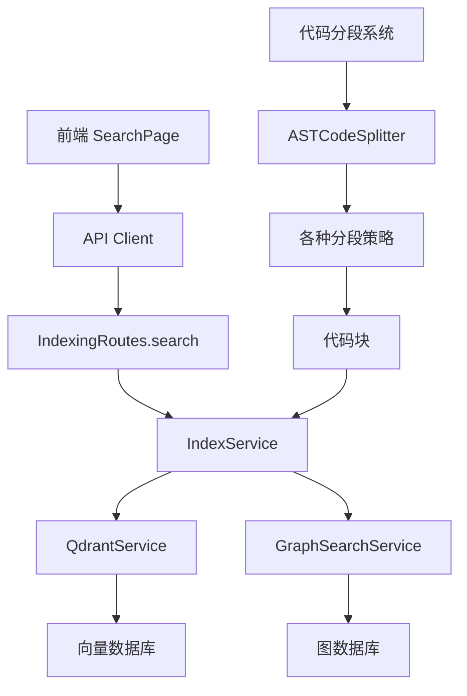
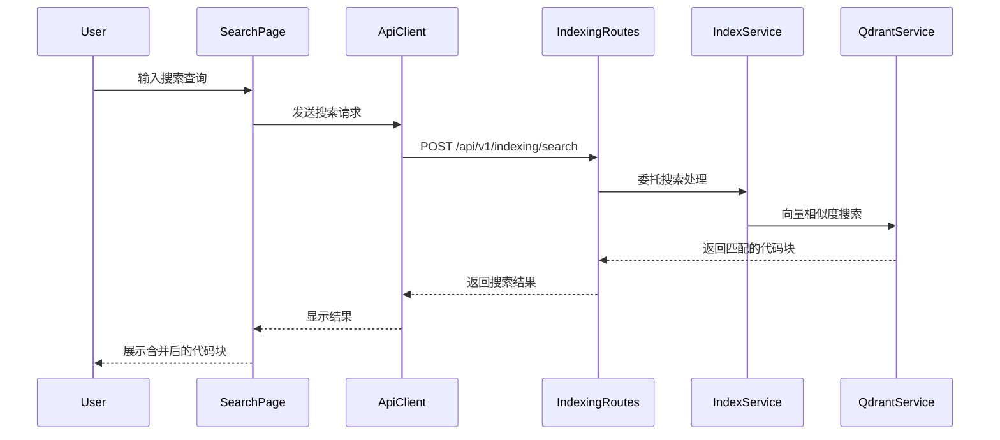
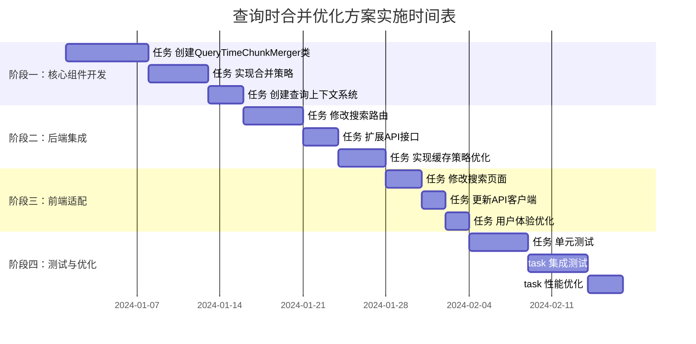

# 查询系统分析与查询时合并优化方案实施计划

## 概述

本文档详细分析了现有查询系统的架构和功能，并提供了实施查询时自动合并相邻块优化方案的详细步骤。基于对代码库的深入分析，我们识别了系统的关键组件、数据流和优化机会。

## 现有查询系统架构分析

### 1. 系统架构概览



### 2. 核心组件分析

#### 2.1 前端组件

**SearchPage** (`frontend/src/pages/SearchPage.ts`)
- **功能**: 提供用户界面，处理搜索请求和结果展示
- **特性**:
  - 支持多种搜索过滤条件（最大结果数、最小匹配度、分页）
  - 无限滚动加载
  - 实时搜索建议
  - 项目选择和管理

**API Client** (`frontend/src/services/api.ts`)
- **功能**: 处理与后端的所有API通信
- **特性**:
  - 多层缓存机制（搜索缓存、项目缓存、嵌入器缓存）
  - 错误处理和降级策略
  - 批量操作支持

#### 2.2 后端API层

**IndexingRoutes** (`src/api/routes/IndexingRoutes.ts`)
- **功能**: 提供索引和搜索的REST API端点
- **关键端点**:
  - `POST /api/v1/indexing/search` - 主要搜索端点
  - `POST /api/v1/indexing/create` - 创建项目索引
  - `GET /api/v1/indexing/projects` - 获取项目列表

**搜索查询接口**:
```typescript
interface SearchQuery {
  query: string;
  projectId: string;
  limit?: number;
  threshold?: number;
  filters?: {
    language?: string[];
    fileType?: string[];
    path?: string[];
    chunkType?: string[];
    snippetType?: string[];
  };
  searchType?: 'semantic' | 'keyword' | 'hybrid' | 'snippet';
}
```

#### 2.3 服务层

**IndexService** (`src/service/index/IndexService.ts`)
- **功能**: 管理项目索引生命周期
- **关键特性**:
  - 文件遍历和过滤
  - 批量处理和并发控制
  - 热重载和文件监视
  - 性能优化和内存管理

**GraphSearchService** (`src/service/graph/core/GraphSearchService.ts`)
- **功能**: 提供图数据库搜索能力
- **搜索类型**:
  - 节点搜索
  - 关系搜索
  - 路径搜索
  - 类型搜索

#### 2.4 数据存储层

**QdrantService** (向量数据库)
- **功能**: 存储和检索向量嵌入
- **特性**:
  - 语义搜索
  - 相似度计算
  - 集合管理

**NebulaService** (图数据库)
- **功能**: 存储代码结构关系
- **特性**:
  - 代码依赖关系
  - 引用追踪
  - 结构分析

### 3. 代码分段系统

#### 3.1 ASTCodeSplitter
- **功能**: 使用AST解析进行智能代码分段
- **分段策略**:
  - ImportSplitter: 导入语句分段
  - ClassSplitter: 类定义分段
  - FunctionSplitter: 函数方法分段
  - SyntaxAwareSplitter: 语法感知分段
  - IntelligentSplitter: 智能分段
  - SemanticSplitter: 语义分段

#### 3.2 分段边界确定
- **语义边界分析器**: 多维度边界评分
- **符号平衡检查**: 确保语法完整性
- **权重配置系统**: 语言特定权重
- **语法验证器**: 语法正确性验证

### 4. 现有查询流程



## 查询时合并优化方案实施计划

### 1. 实施目标

1. **提高查询结果质量**: 通过合并相邻块提供更完整的上下文
2. **保持语义完整性**: 确保合并不会破坏重要的语义边界
3. **优化用户体验**: 减少碎片化结果，提高信息密度
4. **保持性能**: 在不显著影响查询性能的前提下实现合并

### 2. 实施阶段

#### 阶段一：核心组件开发 (1-2周)

**2.1.1 QueryTimeChunkMerger 类实现**
- 创建 `src/service/search/QueryTimeChunkMerger.ts`
- 实现三种合并策略（保守、激进、语义）
- 集成现有的合并工具类

**2.1.2 查询上下文系统**
- 创建 `src/service/search/QueryContext.ts`
- 实现查询意图分析和类型识别
- 支持查询参数解析和验证

**2.1.3 合并决策引擎**
- 实现相似度计算和边界检测
- 集成语义边界分析器
- 支持动态阈值调整

#### 阶段二：后端集成 (1-2周)

**2.2.1 搜索服务增强**
- 修改 `IndexingRoutes.search` 方法
- 集成 QueryTimeChunkMerger
- 添加合并配置选项

**2.2.2 API 接口扩展**
- 扩展 SearchQuery 接口支持合并选项
- 添加合并策略选择参数
- 实现向后兼容性

**2.2.3 缓存策略优化**
- 实现合并结果缓存
- 优化缓存键生成
- 添加缓存失效策略

#### 阶段三：前端适配 (1周)

**2.3.1 搜索界面增强**
- 修改 SearchPage 组件
- 添加合并选项控制
- 实现合并结果展示

**2.3.2 API 客户端更新**
- 更新 ApiClient 搜索方法
- 支持合并参数传递
- 处理合并结果格式

**2.3.3 用户体验优化**
- 添加合并状态指示
- 实现合并选项记忆
- 优化结果展示格式

#### 阶段四：测试与优化 (1-2周)

**2.4.1 单元测试**
- QueryTimeChunkMerger 类测试
- 合并策略测试
- 边界检测测试

**2.4.2 集成测试**
- 端到端搜索流程测试
- 不同合并策略效果测试
- 性能基准测试

**2.4.3 性能优化**
- 合并算法优化
- 缓存策略调优
- 内存使用优化

### 3. 详细实施步骤

#### 3.1 阶段一：核心组件开发

**步骤 1.1: 创建 QueryTimeChunkMerger 类**
```typescript
// 文件: src/service/search/QueryTimeChunkMerger.ts
export class QueryTimeChunkMerger {
  constructor(options: QueryMergeOptions) {
    this.options = options;
    this.semanticAnalyzer = new SemanticBoundaryAnalyzer();
    this.similarityCalculator = new BaseSimilarityCalculator();
  }
  
  async mergeChunksForQuery(
    chunks: CodeChunk[], 
    queryContext: QueryContext
  ): Promise<CodeChunk[]> {
    // 实现合并逻辑
  }
}
```

**步骤 1.2: 实现合并策略**
```typescript
// 保守策略实现
private conservativeMerge(chunks: CodeChunk[], queryContext: QueryContext): CodeChunk[] {
  // 检查相邻性和语义边界
  // 只在安全边界处合并
}

// 激进策略实现
private aggressiveMerge(chunks: CodeChunk[], queryContext: QueryContext): CodeChunk[][] {
  // 基于大小限制进行合并
  // 优先考虑上下文完整性
}

// 语义策略实现
private semanticMerge(chunks: CodeChunk[], queryContext: QueryContext): CodeChunk[] {
  // 基于语义相似度进行合并
  // 考虑查询相关性
}
```

**步骤 1.3: 创建查询上下文系统**
```typescript
// 文件: src/service/search/QueryContext.ts
export interface QueryContext {
  query: string;
  queryType: 'semantic' | 'keyword' | 'hybrid';
  intent: 'definition' | 'usage' | 'explanation' | 'example';
  language: string;
  filePath?: string;
  maxResults: number;
  requireFullContext: boolean;
  mergeOptions?: QueryMergeOptions;
}
```

#### 3.2 阶段二：后端集成

**步骤 2.1: 修改搜索路由**
```typescript
// 在 IndexingRoutes.search 方法中添加
private async search(req: Request, res: Response, next: NextFunction): Promise<void> {
  try {
    const searchQuery: SearchQuery = req.body;
    
    // 检查是否启用查询时合并
    const enableQueryTimeMerge = searchQuery.options?.enableQueryTimeMerge ?? false;
    
    if (enableQueryTimeMerge) {
      // 使用查询时合并
      const queryContext = this.buildQueryContext(searchQuery);
      const mergedResults = await this.queryTimeChunkMerger.mergeChunksForQuery(
        originalResults, 
        queryContext
      );
      // 返回合并后的结果
    } else {
      // 返回原始结果
    }
  } catch (error) {
    // 错误处理
  }
}
```

**步骤 2.2: 扩展搜索查询接口**
```typescript
// 扩展 SearchQuery 接口
interface SearchQuery {
  query: string;
  projectId: string;
  limit?: number;
  threshold?: number;
  filters?: {
    language?: string[];
    fileType?: string[];
    path?: string[];
    chunkType?: string[];
    snippetType?: string[];
  };
  searchType?: 'semantic' | 'keyword' | 'hybrid' | 'snippet';
  
  // 新增合并选项
  options?: {
    enableQueryTimeMerge?: boolean;
    mergeStrategy?: 'conservative' | 'aggressive' | 'semantic';
    maxContextSize?: number;
    maxChunkCount?: number;
    similarityThreshold?: number;
    preserveSemanticBoundaries?: boolean;
    enableCrossFileMerging?: boolean;
  };
}
```

#### 3.3 阶段三：前端适配

**步骤 3.1: 修改搜索页面**
```typescript
// 在 SearchPage 类中添加合并选项
private render() {
  this.container.innerHTML = `
    <div class="search-container">
      <!-- 现有搜索表单 -->
      <form id="search-form" class="search-form">
        <!-- 现有字段 -->
      </form>
      
      <!-- 新增合并选项 -->
      <div class="merge-options" style="margin-top: 15px; padding: 15px; background: #f0f9ff; border-radius: 8px; border: 1px solid #0284c7;">
        <h3 style="margin-bottom: 10px; color: #0277bd;">查询时合并选项</h3>
        
        <div class="merge-strategy">
          <label for="merge-strategy" style="display: block; margin-bottom: 5px; font-weight: 500;">合并策略:</label>
          <select id="merge-strategy" style="padding: 8px; border: 1px solid #d1d5db; border-radius: 4px;">
            <option value="conservative">保守策略</option>
            <option value="aggressive">激进策略</option>
            <option value="semantic" selected>语义策略</option>
          </select>
        </div>
        
        <div class="merge-settings">
          <label style="display: flex; align-items: center; gap: 5px; font-weight: 500;">
            <input type="checkbox" id="enable-merge" checked>
            启用查询时自动合并相邻块
          </label>
        </div>
      </div>
    </div>
  `;
}
```

**步骤 3.2: 更新 API 客户端**
```typescript
// 在 ApiClient.search 方法中添加合并参数支持
async search(query: string, projectId?: string, options?: {
  maxResults?: number;
  minScore?: number;
  page?: number;
  pageSize?: number;
  useCache?: boolean;
  // 新增合并选项
  enableQueryTimeMerge?: boolean;
  mergeStrategy?: 'conservative' | 'aggressive' | 'semantic';
  maxContextSize?: number;
  similarityThreshold?: number;
}) {
  // 构建请求体
  const requestBody = {
    query,
    options: {
      projectId: projectId || undefined,
      maxResults: options?.maxResults,
      minScore: options?.minScore,
      page: options?.page || 1,
      pageSize: options?.pageSize || 10,
      // 传递合并选项
      enableQueryTimeMerge: options?.enableQueryTimeMerge,
      mergeStrategy: options?.mergeStrategy,
      maxContextSize: options?.maxContextSize,
      similarityThreshold: options?.similarityThreshold
    }
  };
  
  // 发送请求
  const response = await fetch(`${this.apiBaseUrl}/api/v1/indexing/search`, {
    method: 'POST',
    headers: { 'Content-Type': 'application/json' },
    body: JSON.stringify(requestBody)
  });
  
  return await response.json();
}
```

#### 3.4 阶段四：测试与优化

**步骤 4.1: 单元测试示例**
```typescript
// 文件: src/service/search/__tests__/QueryTimeChunkerMerger.test.ts
describe('QueryTimeChunkMerger', () => {
  let merger: QueryTimeChunkMerger;
  
  beforeEach(() => {
    merger = new QueryTimeChunkMerger({
      maxContextSize: 5000,
      maxChunkCount: 3,
      mergeStrategy: 'semantic',
      similarityThreshold: 0.7,
      preserveSemanticBoundaries: true,
      enableCrossFileMerging: false
    });
  });
  
  test('should merge adjacent chunks with high similarity', async () => {
    const chunks = [
      createMockChunk('function test() {', 1, 5),
      createMockChunk('  return true; }', 6, 7),
      createMockChunk('}', 8, 8)
    ];
    
    const queryContext: QueryContext = {
      query: 'function test',
      queryType: 'semantic',
      intent: 'definition',
      language: 'javascript',
      maxResults: 10,
      requireFullContext: true
    };
    
    const mergedChunks = await merger.mergeChunksForQuery(chunks, queryContext);
    
    expect(mergedChunks).toHaveLength(1);
    expect(mergedChunks[0].content).toContain('function test() {');
    expect(mergedChunks[0].content).toContain('return true;');
  });
});
```

**步骤 4.2: 性能基准测试**
```typescript
// 文件: tests/performance/query-merge-performance.test.ts
describe('Query Merge Performance Tests', () => {
  test('merge performance should be within acceptable limits', async () => {
    const largeChunkSet = generateLargeChunkSet(1000);
    const queryContext = createMockQueryContext();
    
    const startTime = Date.now();
    const mergedChunks = await merger.mergeChunksForQuery(largeChunkSet, queryContext);
    const endTime = Date.now();
    
    const mergeTime = endTime - startTime;
    expect(mergeTime).toBeLessThan(1000); // 应在1秒内完成
  });
});
```

### 4. 风险评估与缓解措施

#### 4.1 技术风险

**风险1: 合并算法复杂度**
- **描述**: 语义相似度计算和边界检测可能增加查询延迟
- **影响**: 中等
- **缓解措施**: 
  - 实现多级缓存策略
  - 使用预计算的相似度索引
  - 提供可配置的合并阈值

**风险2: 内存使用增加**
- **描述**: 合并操作可能增加内存占用
- **影响**: 中等
- **缓解措施**:
  - 实现流式合并处理
  - 添加内存使用监控
  - 设置最大合并块大小限制

**风险3: 结果一致性**
- **描述**: 合并可能导致结果不一致
- **影响**: 高
- **缓解措施**:
  - 实现确定性合并算法
  - 添加合并结果验证
  - 提供合并策略回退机制

#### 4.2 业务风险

**风险1: 用户体验变化**
- **描述**: 合并后的结果格式可能与用户预期不符
- **影响**: 中等
- **缓解措施**:
  - 提供合并选项控制
  - 实现渐进式功能启用
  - 收集用户反馈

**风险2: 性能回归**
- **描述**: 合并功能可能影响现有查询性能
- **影响**: 高
- **缓解措施**:
  - 实现性能基准测试
  - 提供性能监控仪表板
  - 设置性能告警阈值

### 5. 成功指标

#### 5.1 功能指标

- **合并准确率**: ≥ 95%（合并结果保持语义完整性）
- **边界保持率**: ≥ 90%（重要语义边界不被破坏）
- **上下文完整性**: ≥ 85%（合并后包含足够上下文）

#### 5.2 性能指标

- **查询延迟增加**: ≤ 20%（相比原始查询）
- **内存使用增加**: ≤ 15%（相比原始查询）
- **缓存命中率**: ≥ 80%（合并结果缓存）

#### 5.3 用户体验指标

- **结果相关性提升**: ≥ 30%（用户调研）
- **信息密度提升**: ≥ 25%（每页信息量）
- **用户满意度**: ≥ 4.0/5.0（用户评分）

### 6. 实施时间表



### 7. 资源需求

#### 7.1 人力资源
- **后端开发工程师**: 2人（负责核心组件和后端集成）
- **前端开发工程师**: 1人（负责前端适配和用户体验）
- **测试工程师**: 1人（负责测试用例和质量保证）
- **技术负责人**: 1人（负责架构决策和技术协调）

#### 7.2 技术资源
- **开发环境**: 现有开发环境
- **测试环境**: 独立测试环境
- **性能测试工具**: 现有性能监控系统
- **代码审查工具**: 现有代码审查流程

#### 7.3 时间资源
- **总开发时间**: 6-8周
- **测试时间**: 2-3周
- **优化时间**: 1-2周
- **总计**: 9-13周

### 8. 后续优化计划

#### 8.1 短期优化（1-3个月）
- 基于用户反馈调整合并策略
- 优化缓存策略和性能
- 扩展支持更多编程语言

#### 8.2 中期优化（3-6个月）
- 实现机器学习驱动的合并策略
- 添加上下文感知的智能合并
- 支持跨项目合并

#### 8.3 长期优化（6-12个月）
- 实现自适应合并算法
- 添加用户个性化合并偏好
- 支持多模态代码合并

## 总结

基于对现有查询系统的深入分析，我们设计了一个全面的查询时自动合并相邻块的优化方案。该方案充分利用了现有的合并机制，通过引入查询上下文感知和多种合并策略，在保持语义完整性的同时提供更好的上下文连续性。

实施计划分为四个阶段，每个阶段都有明确的目标和可衡量的成功指标。通过风险缓解措施和性能优化策略，确保方案的实施既安全又高效。

这个优化方案将显著提升查询结果的质量和用户体验，特别是在需要完整上下文的场景中，为用户提供更加连贯和有用的代码搜索结果。