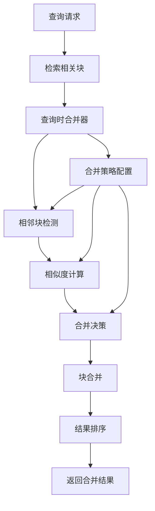

# 查询时自动合并相邻块的设计

## 概述

基于当前的分段策略，查询时自动合并相邻块是一个重要的优化功能，可以提高查询结果的完整性和上下文连续性。本文档分析了现有的合并机制，并提出了查询时自动合并的设计方案。

## 现有合并机制分析

### 1. UnifiedOverlapCalculator

`UnifiedOverlapCalculator` 类已经提供了多种重叠计算和合并策略：

#### 1.1 合并方法

```typescript
/**
 * 智能合并相似的块（SmartOverlapController 功能）
 */
mergeSimilarChunks(chunks: CodeChunk[]): CodeChunk[] {
  const merged: CodeChunk[] = [];
  const processed = new Set<number>();

  for (let i = 0; i < chunks.length; i++) {
    if (processed.has(i)) {
      continue;
    }

    let currentChunk = chunks[i];
    processed.add(i);

    // 查找可以合并的相似块
    for (let j = i + 1; j < chunks.length; j++) {
      if (processed.has(j)) {
        continue;
      }

      const otherChunk = chunks[j];

      // 检查是否相似且相邻或重叠
      if (this.canMergeChunks(currentChunk, otherChunk)) {
        currentChunk = this.mergeTwoChunks(currentChunk, otherChunk);
        processed.add(j);
      }
    }

    merged.push(currentChunk);
  }

  return merged;
}
```

#### 1.2 合并条件

```typescript
private canMergeChunks(chunk1: CodeChunk, chunk2: CodeChunk): boolean {
  // 使用 ChunkSimilarityUtils 检查相似度
  return ChunkSimilarityUtils.canMergeChunks(chunk1, chunk2, this.options.similarityThreshold);
}
```

### 2. ChunkMerger

`ChunkMerger` 类提供了更详细的合并决策逻辑：

#### 2.1 合并决策

```typescript
private decideMerge(chunk1: CodeChunk, chunk2: CodeChunk): MergeDecision {
  const similarity = this.calculateChunkSimilarity(chunk1, chunk2);

  // 高相似度：直接替换
  if (similarity.overall > 0.9) {
    return {
      shouldMerge: true,
      mergeStrategy: 'replace',
      confidence: similarity.overall,
      reason: 'Very high similarity'
    };
  }

  // 中等相似度：合并内容
  if (similarity.overall > 0.7) {
    return {
      shouldMerge: true,
      mergeStrategy: 'combine',
      confidence: similarity.overall,
      reason: 'High similarity'
    };
  }

  // 检查是否相邻且有部分重叠
  if (this.areAdjacentAndOverlapping(chunk1, chunk2) && similarity.overall > 0.5) {
    return {
      shouldMerge: true,
      mergeStrategy: 'combine',
      confidence: similarity.overall,
      reason: 'Adjacent and overlapping'
    };
  }

  return {
    shouldMerge: false,
    mergeStrategy: 'combine',
    confidence: similarity.overall,
    reason: 'Similarity too low'
  };
}
```

#### 2.2 相似度计算

```typescript
calculateChunkSimilarity(chunk1: CodeChunk, chunk2: CodeChunk): ChunkSimilarity {
  const contentSim = this.calculateContentSimilarity(chunk1, chunk2);
  const astSim = this.calculateASTSimilarity(chunk1, chunk2);
  const proximity = this.calculateProximity(chunk1.metadata, chunk2.metadata);

  const overall = (contentSim * 0.6) + (astSim * 0.3) + (proximity * 0.1);

  return {
    contentSimilarity: contentSim,
    astSimilarity: astSim,
    proximity: proximity,
    overall
  };
}
```

### 3. ChunkSimilarityUtils

`ChunkSimilarityUtils` 提供了基础的相似性检测和合并方法：

#### 3.1 合并条件检查

```typescript
static canMergeChunks(chunk1: CodeChunk, chunk2: CodeChunk, similarityThreshold: number): boolean {
  // 检查相似度
  if (!BaseSimilarityCalculator.isSimilar(chunk1.content, chunk2.content, similarityThreshold)) {
    return false;
  }

  // 检查位置关系（相邻或重叠）
  const start1 = chunk1.metadata.startLine;
  const end1 = chunk1.metadata.endLine;
  const start2 = chunk2.metadata.startLine;
  const end2 = chunk2.metadata.endLine;

  // 相邻：块2紧接在块1后面
  const isAdjacent = start2 === end1 + 1;

  // 重叠：两个块有重叠区域
  const isOverlapping = start2 <= end1 && start1 <= end2;

  return isAdjacent || isOverlapping;
}
```

---

## 查询时自动合并设计

### 1. 设计目标

1. **上下文连续性**：确保查询结果包含足够的上下文信息
2. **语义完整性**：保持语义边界的完整性
3. **性能优化**：在查询时动态合并，避免预处理开销
4. **可配置性**：支持不同查询场景的合并策略

### 2. 架构设计



### 3. 核心组件设计

#### 3.1 QueryTimeChunkMerger 类

```typescript
export interface QueryMergeOptions {
  maxContextSize: number;        // 最大上下文大小（字符数）
  maxChunkCount: number;         // 最大合并块数
  mergeStrategy: 'conservative' | 'aggressive' | 'semantic';
  similarityThreshold: number;   // 相似度阈值
  preserveSemanticBoundaries: boolean; // 是否保持语义边界
  enableCrossFileMerging: boolean; // 是否支持跨文件合并
}

export class QueryTimeChunkMerger {
  private options: QueryMergeOptions;
  private semanticAnalyzer: SemanticBoundaryAnalyzer;
  private similarityCalculator: BaseSimilarityCalculator;
  
  constructor(options: QueryMergeOptions) {
    this.options = options;
    this.semanticAnalyzer = new SemanticBoundaryAnalyzer();
    this.similarityCalculator = new BaseSimilarityCalculator();
  }
  
  /**
   * 查询时合并相邻块
   */
  mergeChunksForQuery(
    chunks: CodeChunk[], 
    queryContext: QueryContext
  ): CodeChunk[] {
    // 1. 预处理：按位置排序
    const sortedChunks = this.sortChunksByPosition(chunks);
    
    // 2. 分组：按文件和邻近性分组
    const chunkGroups = this.groupChunksByProximity(sortedChunks);
    
    // 3. 合并：对每个组进行合并
    const mergedGroups = chunkGroups.map(group => 
      this.mergeChunkGroup(group, queryContext)
    );
    
    // 4. 后处理：展平和排序
    return this.flattenAndSort(mergedGroups);
  }
}
```

#### 3.2 查询上下文

```typescript
export interface QueryContext {
  query: string;                 // 查询字符串
  queryType: 'semantic' | 'keyword' | 'hybrid';
  intent: 'definition' | 'usage' | 'explanation' | 'example';
  language: string;              // 编程语言
  filePath?: string;             // 特定文件路径
  maxResults: number;            // 最大结果数
  requireFullContext: boolean;   // 是否需要完整上下文
}
```

### 4. 合并策略

#### 4.1 保守策略 (Conservative)

```typescript
private conservativeMerge(chunks: CodeChunk[], queryContext: QueryContext): CodeChunk[] {
  const merged: CodeChunk[] = [];
  let currentGroup: CodeChunk[] = [];
  
  for (const chunk of chunks) {
    if (currentGroup.length === 0) {
      currentGroup.push(chunk);
    } else {
      const lastChunk = currentGroup[currentGroup.length - 1];
      
      // 检查是否相邻
      if (this.areAdjacent(lastChunk, chunk)) {
        // 检查语义边界
        if (this.canMergeAcrossBoundary(lastChunk, chunk)) {
          currentGroup.push(chunk);
        } else {
          // 不能跨越语义边界，合并当前组
          merged.push(this.mergeGroup(currentGroup));
          currentGroup = [chunk];
        }
      } else {
        // 不相邻，合并当前组
        merged.push(this.mergeGroup(currentGroup));
        currentGroup = [chunk];
      }
    }
  }
  
  // 处理最后一组
  if (currentGroup.length > 0) {
    merged.push(this.mergeGroup(currentGroup));
  }
  
  return merged;
}
```

#### 4.2 激进策略 (Aggressive)

```typescript
private aggressiveMerge(chunks: CodeChunk[], queryContext: QueryContext): CodeChunk[] {
  const merged: CodeChunk[] = [];
  let currentGroup: CodeChunk[] = [];
  let currentSize = 0;
  
  for (const chunk of chunks) {
    const chunkSize = chunk.content.length;
    
    // 检查大小限制
    if (currentSize + chunkSize > this.options.maxContextSize && currentGroup.length > 0) {
      merged.push(this.mergeGroup(currentGroup));
      currentGroup = [chunk];
      currentSize = chunkSize;
    } else {
      currentGroup.push(chunk);
      currentSize += chunkSize;
    }
  }
  
  // 处理最后一组
  if (currentGroup.length > 0) {
    merged.push(this.mergeGroup(currentGroup));
  }
  
  return merged;
}
```

#### 4.3 语义策略 (Semantic)

```typescript
private semanticMerge(chunks: CodeChunk[], queryContext: QueryContext): CodeChunk[] {
  const merged: CodeChunk[] = [];
  let currentGroup: CodeChunk[] = [];
  
  for (const chunk of chunks) {
    if (currentGroup.length === 0) {
      currentGroup.push(chunk);
    } else {
      const lastChunk = currentGroup[currentGroup.length - 1];
      
      // 计算语义相似度
      const semanticSimilarity = this.calculateSemanticSimilarity(lastChunk, chunk, queryContext);
      
      if (semanticSimilarity > this.options.similarityThreshold) {
        currentGroup.push(chunk);
      } else {
        merged.push(this.mergeGroup(currentGroup));
        currentGroup = [chunk];
      }
    }
  }
  
  // 处理最后一组
  if (currentGroup.length > 0) {
    merged.push(this.mergeGroup(currentGroup));
  }
  
  return merged;
}
```

### 5. 关键算法

#### 5.1 相邻性检测

```typescript
private areAdjacent(chunk1: CodeChunk, chunk2: CodeChunk): boolean {
  // 同一文件内的相邻性
  if (chunk1.metadata.filePath === chunk2.metadata.filePath) {
    const lineGap = chunk2.metadata.startLine - chunk1.metadata.endLine;
    return lineGap <= 5; // 允许最多5行的间隔
  }
  
  // 跨文件相邻性（如果启用）
  if (this.options.enableCrossFileMerging) {
    return this.areFilesRelated(chunk1.metadata.filePath, chunk2.metadata.filePath);
  }
  
  return false;
}
```

#### 5.2 语义边界检测

```typescript
private canMergeAcrossBoundary(chunk1: CodeChunk, chunk2: CodeChunk): boolean {
  if (!this.options.preserveSemanticBoundaries) {
    return true;
  }
  
  // 获取两个块之间的内容
  const gapContent = this.getGapContent(chunk1, chunk2);
  if (!gapContent) return true;
  
  // 分析边界评分
  const lines = gapContent.split('\n');
  for (const line of lines) {
    const boundaryScore = this.semanticAnalyzer.calculateBoundaryScore(
      line, 
      [], 
      chunk1.metadata.language
    );
    
    // 如果遇到强语义边界，不能合并
    if (boundaryScore.score > 0.8) {
      return false;
    }
  }
  
  return true;
}
```

#### 5.3 语义相似度计算

```typescript
private calculateSemanticSimilarity(
  chunk1: CodeChunk, 
  chunk2: CodeChunk, 
  queryContext: QueryContext
): number {
  // 基础内容相似度
  const contentSimilarity = this.similarityCalculator.calculateSimilarity(
    chunk1.content, 
    chunk2.content
  );
  
  // 查询相关性
  const queryRelevance1 = this.calculateQueryRelevance(chunk1, queryContext);
  const queryRelevance2 = this.calculateQueryRelevance(chunk2, queryContext);
  const querySimilarity = 1 - Math.abs(queryRelevance1 - queryRelevance2);
  
  // 结构相似度
  const structureSimilarity = this.calculateStructureSimilarity(chunk1, chunk2);
  
  // 综合相似度
  return (contentSimilarity * 0.4) + (querySimilarity * 0.4) + (structureSimilarity * 0.2);
}
```

### 6. 实现示例

#### 6.1 基本使用

```typescript
// 创建查询时合并器
const merger = new QueryTimeChunkMerger({
  maxContextSize: 5000,
  maxChunkCount: 3,
  mergeStrategy: 'semantic',
  similarityThreshold: 0.7,
  preserveSemanticBoundaries: true,
  enableCrossFileMerging: false
});

// 定义查询上下文
const queryContext: QueryContext = {
  query: 'function calculateSum',
  queryType: 'semantic',
  intent: 'definition',
  language: 'javascript',
  maxResults: 5,
  requireFullContext: true
};

// 执行查询时合并
const mergedChunks = merger.mergeChunksForQuery(retrievedChunks, queryContext);
```

#### 6.2 集成到查询系统

```typescript
export class EnhancedQueryEngine {
  private chunkMerger: QueryTimeChunkMerger;
  
  constructor() {
    this.chunkMerger = new QueryTimeChunkMerger(this.getDefaultMergeOptions());
  }
  
  async query(query: string, options: QueryOptions): Promise<QueryResult> {
    // 1. 检索相关块
    const retrievedChunks = await this.retrieveChunks(query, options);
    
    // 2. 构建查询上下文
    const queryContext = this.buildQueryContext(query, options);
    
    // 3. 查询时合并
    const mergedChunks = this.chunkMerger.mergeChunksForQuery(retrievedChunks, queryContext);
    
    // 4. 排序和限制结果
    const sortedChunks = this.sortByRelevance(mergedChunks, queryContext);
    const limitedChunks = sortedChunks.slice(0, options.maxResults);
    
    return {
      query,
      chunks: limitedChunks,
      totalCount: limitedChunks.length,
      mergeStrategy: queryContext.mergeStrategy
    };
  }
  
  private getDefaultMergeOptions(): QueryMergeOptions {
    return {
      maxContextSize: 4000,
      maxChunkCount: 3,
      mergeStrategy: 'semantic',
      similarityThreshold: 0.7,
      preserveSemanticBoundaries: true,
      enableCrossFileMerging: false
    };
  }
}
```

### 7. 性能优化

#### 7.1 缓存机制

```typescript
export class CachedQueryTimeChunkMerger extends QueryTimeChunkMerger {
  private mergeCache: Map<string, CodeChunk[]> = new Map();
  
  mergeChunksForQuery(
    chunks: CodeChunk[], 
    queryContext: QueryContext
  ): CodeChunk[] {
    // 生成缓存键
    const cacheKey = this.generateCacheKey(chunks, queryContext);
    
    // 检查缓存
    if (this.mergeCache.has(cacheKey)) {
      return this.mergeCache.get(cacheKey)!;
    }
    
    // 执行合并
    const mergedChunks = super.mergeChunksForQuery(chunks, queryContext);
    
    // 缓存结果
    this.mergeCache.set(cacheKey, mergedChunks);
    
    return mergedChunks;
  }
  
  private generateCacheKey(chunks: CodeChunk[], queryContext: QueryContext): string {
    const chunkIds = chunks.map(c => `${c.metadata.filePath}-${c.metadata.startLine}-${c.metadata.endLine}`).join('|');
    const contextStr = `${queryContext.query}-${queryContext.mergeStrategy}-${queryContext.maxContextSize}`;
    return `${chunkIds}:${contextStr}`;
  }
}
```

#### 7.2 增量合并

```typescript
export class IncrementalQueryMerger extends QueryTimeChunkMerger {
  mergeChunksIncrementally(
    baseChunks: CodeChunk[],
    newChunks: CodeChunk[],
    queryContext: QueryContext
  ): CodeChunk[] {
    // 只合并新增的块
    const mergedNewChunks = this.mergeChunksForQuery(newChunks, queryContext);
    
    // 检查是否需要与基础块重新合并
    const needsReMerge = this.shouldReMerge(baseChunks, mergedNewChunks, queryContext);
    
    if (needsReMerge) {
      return this.mergeChunksForQuery([...baseChunks, ...mergedNewChunks], queryContext);
    } else {
      return [...baseChunks, ...mergedNewChunks];
    }
  }
}
```

## 总结

查询时自动合并相邻块的设计基于现有的合并机制，通过引入查询上下文感知和多种合并策略，可以在保持语义完整性的同时提供更好的上下文连续性。关键特性包括：

1. **多策略合并**：支持保守、激进和语义三种合并策略
2. **查询上下文感知**：根据查询意图和类型调整合并行为
3. **语义边界保护**：确保不破坏重要的语义边界
4. **性能优化**：通过缓存和增量合并提高查询效率

这种设计可以显著提高查询结果的质量和用户体验，特别是在需要完整上下文的场景中。