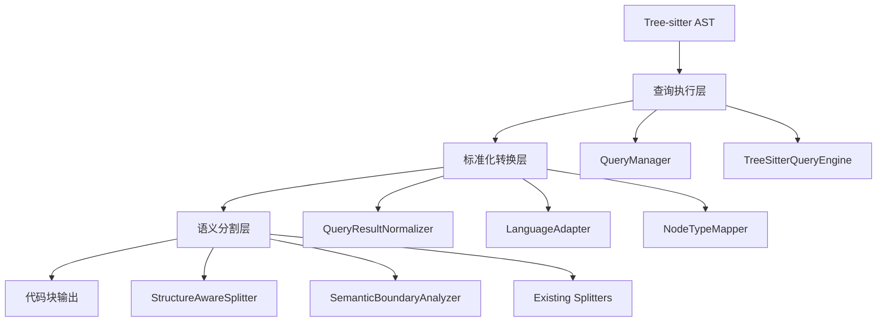
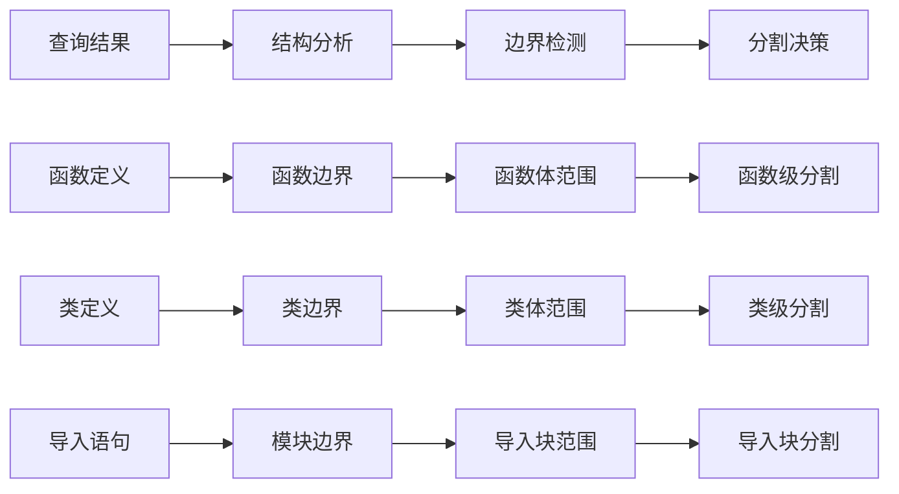

# 查询结果标准化转换方案

## 概述

本文档详细描述了解决当前查询规则类型常量与tree-sitter解析结果匹配问题的完整方案。该方案旨在将现有的tree-sitter解析结果充分转化为可以被分割模块正常处理的形式。

## 问题分析

### 1. 查询规则类型常量覆盖范围问题

**当前问题**：在 [`QueryLoader.ts`](../../src/service/parser/core/query/QueryLoader.ts:27-30) 中，硬编码的查询类型常量无法适应不同语言的文件结构：

```typescript
const queryTypes = ['functions', 'classes', 'control-flow', 'imports', 'exports', 'expressions',
  'methods', 'modern-features', 'namespace', 'interfaces', 'types', 'patterns', 'properties', 'variables'];
```

**具体问题**：
- 与实际的查询文件结构不完全匹配
- 不同语言的查询文件有不同的分类方式
- 缺少动态发现机制，无法适应新的查询类型

### 2. tree-sitter解析结果与分割模块的兼容性问题

**当前状态**：分割模块（如 [`IntelligentSplitter`](../../src/service/parser/splitting/strategies/IntelligentSplitter.ts)）主要依赖语法分析和语义边界分析，没有充分利用tree-sitter查询结果进行智能分割。

**影响**：
- 查询结果没有被标准化为分割模块可以使用的格式
- 无法充分利用tree-sitter的精确语法分析能力
- 分割质量受到限制

## 解决方案架构

### 三层架构设计



### 核心组件设计

#### 1. 查询结果标准化器 (QueryResultNormalizer)

**功能**：将不同语言的tree-sitter查询结果转换为统一格式

**接口定义**：
```typescript
interface IQueryResultNormalizer {
  normalize(
    ast: Parser.SyntaxNode, 
    language: string, 
    queryTypes?: string[]
  ): Promise<StandardizedQueryResult[]>;
  
  getSupportedQueryTypes(language: string): Promise<string[]>;
  mapNodeType(nodeType: string, language: string): string;
}
```

**标准化结果格式**：
```typescript
interface StandardizedQueryResult {
  type: 'function' | 'class' | 'method' | 'import' | 'variable' | 'interface' | 'type';
  name: string;
  startLine: number;
  endLine: number;
  content: string;
  metadata: {
    language: string;
    complexity: number;
    dependencies: string[];
    modifiers: string[];
  };
}
```

#### 2. 语言适配器 (LanguageAdapter)

**功能**：处理语言特定的查询类型映射

**实现示例**：
```typescript
class TypeScriptLanguageAdapter implements ILanguageAdapter {
  normalize(queryResults: any[], queryType: string, language: string): StandardizedQueryResult[] {
    return queryResults.map(result => ({
      type: this.mapQueryTypeToStandardType(queryType),
      name: this.extractName(result),
      startLine: result.captures[0]?.node.startPosition.row + 1,
      endLine: result.captures[0]?.node.endPosition.row + 1,
      content: this.extractContent(result),
      metadata: {
        language,
        complexity: this.calculateComplexity(result),
        dependencies: this.extractDependencies(result),
        modifiers: this.extractModifiers(result)
      }
    }));
  }
}
```

#### 3. 动态查询类型发现机制

**增强的QueryLoader方法**：
```typescript
static async discoverQueryTypes(language: string): Promise<string[]> {
  const queryDir = `../../constants/queries/${this.getQueryFileName(language)}`;
  
  try {
    // 动态读取目录结构
    const files = await fs.readdir(path.join(__dirname, queryDir));
    return files
      .filter(file => file.endsWith('.ts') && file !== 'index.ts')
      .map(file => path.basename(file, '.ts'));
  } catch (error) {
    this.logger.warn(`无法发现${language}的查询类型:`, error);
    return this.getDefaultQueryTypes();
  }
}
```

#### 4. 结构感知分割器 (StructureAwareSplitter)

**功能**：基于标准化查询结果进行智能分割

**集成方案**：
```typescript
class StructureAwareSplitter extends IntelligentSplitter {
  async split(content: string, language: string, ...args): Promise<CodeChunk[]> {
    // 1. 获取tree-sitter解析结果
    const ast = await this.treeSitterService.parseCode(content, language);
    
    // 2. 执行标准化查询
    const standardizedResults = await this.queryNormalizer.normalize(ast, language);
    
    // 3. 基于标准化结果进行智能分割
    return this.splitByStructure(standardizedResults, content, language);
  }
}
```

## 实施计划

### 阶段1: 核心组件实现 (2-3天)

#### 1.1 创建标准化转换器
- 实现 `QueryResultNormalizer` 类
- 创建基础 `LanguageAdapter` 接口和实现
- 实现 `NodeTypeMapper` 用于类型映射

#### 1.2 增强查询加载器
- 添加动态查询类型发现功能
- 更新 `QueryLoader` 以支持自动发现
- 实现向后兼容机制

#### 1.3 创建结构感知分割器
- 实现 `StructureAwareSplitter` 类
- 集成现有的分割策略
- 添加配置选项

### 阶段2: 测试和优化 (2天)

#### 2.1 单元测试
- 编写 `QueryResultNormalizer` 测试
- 测试语言适配器的类型映射
- 验证标准化结果的准确性

#### 2.2 集成测试
- 测试完整的分割流程
- 验证多语言支持
- 性能基准测试

#### 2.3 优化和调整
- 性能优化
- 内存使用优化
- 错误处理改进

### 阶段3: 集成部署 (1天)

#### 3.1 系统集成
- 更新分割策略提供者配置
- 配置新的分割策略优先级
- 验证整体系统稳定性

#### 3.2 文档更新
- 更新API文档
- 编写使用指南
- 创建故障排除文档

## 关键实现细节

### 1. 查询结果到分割决策的映射



### 2. 多语言支持策略

**TypeScript/JavaScript**：
- 支持函数、类、接口、类型等丰富结构
- 利用完整的语法树信息

**Python**：
- 支持函数、类、装饰器、导入等
- 处理缩进敏感的语法结构

**其他语言**：
- 根据语言特性动态调整查询类型
- 提供默认的回退机制

### 3. 性能优化策略

**缓存机制**：
- 查询结果缓存
- 标准化结果缓存
- 语言适配器实例缓存

**懒加载**：
- 按需加载查询类型
- 延迟初始化语言适配器
- 动态导入查询模块

## 测试策略

### 1. 单元测试覆盖

```typescript
// QueryResultNormalizer 测试
describe('QueryResultNormalizer', () => {
  test('should normalize TypeScript function query results', async () => {
    const results = await normalizer.normalize(mockAST, 'typescript', ['functions']);
    expect(results[0].type).toBe('function');
  });
});
```

### 2. 集成测试

```typescript
// StructureAwareSplitter 测试
describe('StructureAwareSplitter', () => {
  test('should split code at structural boundaries', async () => {
    const chunks = await splitter.split(code, 'typescript');
    expect(chunks).toHaveLength(3); // import, class, function
  });
});
```

### 3. 性能测试

```typescript
// 性能基准测试
describe('Performance', () => {
  test('should handle large files efficiently', async () => {
    const startTime = Date.now();
    const results = await normalizer.normalize(largeAST, 'typescript');
    expect(Date.now() - startTime).toBeLessThan(1000); // 1秒内完成
  });
});
```

## 预期收益

### 1. 代码分割质量提升
- **更准确的分割边界**：基于语法结构而非纯文本
- **更好的语义完整性**：保持逻辑单元的完整性
- **减少碎片化**：避免在函数或类中间分割

### 2. 系统可扩展性增强
- **动态查询类型发现**：支持新语言无需修改代码
- **标准化接口**：统一的处理流程
- **模块化设计**：易于维护和扩展

### 3. 性能改进
- **减少重复解析**：标准化格式可复用
- **智能缓存**：优化查询执行性能
- **并行处理**：支持并发查询执行

### 4. 维护性提升
- **清晰的职责分离**：各组件职责明确
- **类型安全**：完整的TypeScript类型定义
- **完善的测试覆盖**：确保代码质量

## 风险与缓解措施

### 1. 性能风险
- **风险**：标准化过程可能增加处理时间
- **缓解**：实现高效的缓存机制和懒加载策略

### 2. 兼容性风险
- **风险**：可能影响现有分割策略
- **缓解**：保持向后兼容，提供回退机制

### 3. 复杂性风险
- **风险**：新增组件增加系统复杂性
- **缓解**：清晰的架构设计和文档

## 总结

本方案通过引入查询结果标准化转换层，解决了当前查询规则类型常量与tree-sitter解析结果之间的匹配问题。通过动态查询类型发现、标准化结果格式和结构感知分割，系统能够更充分地利用tree-sitter的解析能力，提升代码分割的质量和效率。

该方案采用分阶段实施策略，确保平稳过渡和系统稳定性。通过完善的测试和优化，将为代码搜索和分析系统带来显著的改进。