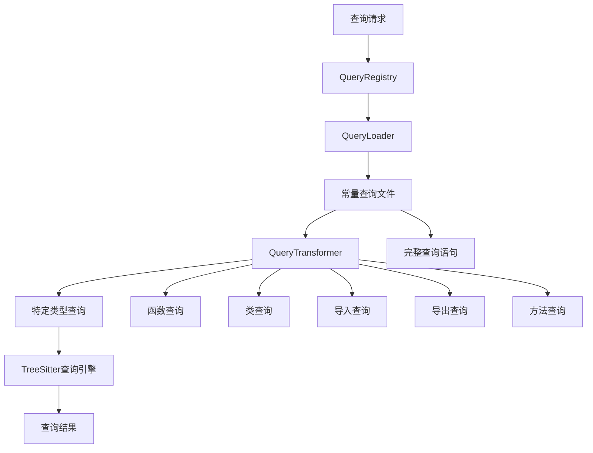

# 查询系统重构完整方案

## 📋 项目概述

本方案旨在重构代码库索引与检索MCP服务中的查询系统，将当前基于简化查询模式的系统迁移到基于完整查询语句的系统，统一查询源并提高查询能力。

## 🎯 重构目标

### 主要目标
1. **统一查询源**：所有查询从 [`constants/queries/`](src/service/parser/constants/queries/) 目录加载
2. **创建转换层**：将完整查询转换为特定类型的简化查询
3. **保持向后兼容**：现有API保持不变
4. **提高查询能力**：利用完整查询语句的丰富功能

### 预期收益
- **维护性提升**：单一查询源，避免重复定义
- **功能增强**：利用完整查询语句的丰富功能
- **性能优化**：更好的查询缓存和重用
- **扩展性**：更容易添加新的查询类型和语言支持

## 📁 文档结构

本重构方案包含以下详细文档：

1. **[查询系统重构方案](query-system-refactor-plan.md)** - 整体架构设计和实施计划
2. **[查询转换层实现方案](query-transformer-implementation.md)** - QueryTransformer详细设计
3. **[QueryRegistry重构方案](query-registry-refactor.md)** - QueryRegistry更新实现
4. **[测试文件更新策略](test-update-strategy.md)** - 测试迁移方案
5. **[服务模块更新方案](service-module-update.md)** - 相关服务适配方案

## 🏗️ 新架构设计

### 架构图



### 核心组件

1. **QueryRegistry** - 查询注册表
   - 统一查询入口
   - 管理查询缓存
   - 提供类型化查询接口

2. **QueryLoader** - 查询加载器
   - 动态加载查询文件
   - 查询语法验证
   - 查询缓存管理

3. **QueryTransformer** - 查询转换器（新增）
   - 从完整查询中提取特定类型
   - 支持模式类型映射
   - 提供查询优化

4. **TreeSitterQueryEngine** - 查询执行引擎
   - 执行查询并返回结果
   - 查询结果缓存
   - 性能监控

## 🔄 实施步骤

### 阶段一：基础架构（1-2周）

#### 任务清单
- [ ] 创建 [`QueryTransformer.ts`](src/service/parser/core/query/QueryTransformer.ts)
- [ ] 重构 [`QueryRegistry.ts`](src/service/parser/core/query/QueryRegistry.ts)
- [ ] 创建查询类型映射配置
- [ ] 实现查询缓存机制

#### 交付物
- 可工作的查询转换层
- 更新后的查询注册表
- 基础单元测试

### 阶段二：服务集成（2-3周）

#### 任务清单
- [ ] 更新 [`TreeSitterCoreService.ts`](src/service/parser/core/parse/TreeSitterCoreService.ts)
- [ ] 更新 [`QueryManager.ts`](src/service/parser/core/query/QueryManager.ts)
- [ ] 更新 [`TreeSitterQueryEngine.ts`](src/service/parser/core/query/TreeSitterQueryEngine.ts)
- [ ] 更新相关协调服务

#### 交付物
- 集成新查询系统的核心服务
- 错误处理和回退机制
- 集成测试套件

### 阶段三：测试迁移（1-2周）

#### 任务清单
- [ ] 更新 [`SimpleQueryTest.test.ts`](src/service/parser/core/__tests__/query/SimpleQueryTest.test.ts)
- [ ] 更新 [`QueryMigration.test.ts`](src/service/parser/core/__tests__/query/QueryMigration.test.ts)
- [ ] 创建新的单元测试
- [ ] 性能基准测试

#### 交付物
- 完整的测试覆盖
- 性能基准数据
- 回归测试通过

### 阶段四：清理优化（1周）

#### 任务清单
- [ ] 移除 [`SimpleQueryPatterns.ts`](src/service/parser/core/query/SimpleQueryPatterns.ts)
- [ ] 优化查询缓存策略
- [ ] 性能调优
- [ ] 文档更新

#### 交付物
- 清理后的代码库
- 优化后的性能
- 完整的文档

## 🛠️ 技术实现细节

### 查询转换算法

```typescript
// 查询提取核心逻辑
private static extractPatterns(fullQuery: string, patternType: string, language: string): string[] {
  const targetKeywords = this.patternTypeMappings.get(patternType) || [];
  const patterns: string[] = [];
  let currentPattern: string[] = [];
  let braceDepth = 0;

  for (const line of fullQuery.split('\n')) {
    const hasKeyword = targetKeywords.some(keyword => line.includes(keyword));
    
    if (hasKeyword || currentPattern.length > 0) {
      currentPattern.push(line);
      braceDepth += this.countParentheses(line);
      
      if (braceDepth === 0) {
        patterns.push(currentPattern.join('\n'));
        currentPattern = [];
      }
    }
  }
  
  return patterns;
}
```

### 模式类型映射

| 模式类型 | JavaScript | TypeScript | Python | Java |
|---------|------------|------------|---------|------|
| functions | function_declaration | function_signature | function_definition | method_declaration |
| classes | class_declaration | class_declaration | class_definition | class_declaration |
| imports | import_statement | import_statement | import_statement | import_declaration |
| exports | export_statement | export_statement | - | - |
| methods | method_definition | method_signature | function_definition | method_declaration |

### 缓存策略

1. **查询文件缓存**：加载的查询文件内容缓存
2. **转换结果缓存**：提取的模式类型缓存
3. **查询结果缓存**：执行结果缓存
4. **LRU淘汰**：避免内存泄漏

## 🧪 测试策略

### 测试覆盖目标

- **单元测试覆盖率**: 90%+
- **集成测试覆盖率**: 85%+
- **端到端测试**: 80%+

### 关键测试场景

1. **查询转换正确性**：验证提取的模式包含正确的语法节点
2. **性能基准测试**：确保新系统性能不退化
3. **向后兼容性**：现有API和测试继续工作
4. **错误处理**：各种异常情况的处理

### 测试数据

准备多语言代码样本：
- JavaScript/TypeScript 复杂代码结构
- Python 装饰器和生成器
- Java 接口和注解
- 其他支持语言的代表性代码

## 🔧 配置管理

### 环境配置

```typescript
// 查询系统配置
export const QUERY_SYSTEM_CONFIG = {
  // 缓存配置
  cache: {
    maxSize: 1000,
    ttl: 3600000, // 1小时
    cleanupInterval: 300000 // 5分钟
  },
  
  // 性能配置
  performance: {
    timeout: 5000,
    maxRetries: 3
  },
  
  // 语言配置
  languages: {
    preload: ['javascript', 'typescript', 'python', 'java'],
    lazyLoad: true
  }
};
```

### 功能开关

```typescript
// 功能开关配置
export const FEATURE_FLAGS = {
  USE_NEW_QUERY_SYSTEM: true,
  ENABLE_QUERY_CACHE: true,
  ENABLE_PERFORMANCE_MONITORING: true,
  FALLBACK_TO_LEGACY: true
};
```

## 📊 性能监控

### 关键指标

1. **查询加载时间**：从文件加载到可用的时间
2. **转换时间**：完整查询到特定模式的转换时间
3. **执行时间**：查询在AST上的执行时间
4. **缓存命中率**：各级缓存的效率
5. **内存使用**：缓存和查询对象的内存占用

### 监控仪表板

```typescript
// 性能监控接口
interface PerformanceMetrics {
  queryLoadTime: number;
  transformationTime: number;
  executionTime: number;
  cacheHitRate: number;
  memoryUsage: number;
  errorRate: number;
}
```

## 🚨 风险与缓解

### 技术风险

| 风险 | 影响 | 缓解措施 |
|------|------|----------|
| 性能下降 | 高 | 实现多级缓存，性能基准测试 |
| 兼容性破坏 | 高 | 保持API兼容，分阶段迁移 |
| 内存泄漏 | 中 | 实现LRU缓存，内存监控 |
| 查询语法错误 | 中 | 语法验证，错误恢复机制 |

### 项目风险

| 风险 | 影响 | 缓解措施 |
|------|------|----------|
| 时间超支 | 中 | 分阶段实施，优先级排序 |
| 测试覆盖不足 | 中 | 自动化测试，持续集成 |
| 团队技能差距 | 低 | 详细文档，代码审查 |

## 📈 成功标准

### 功能标准
- [ ] 所有现有测试通过
- [ ] 新查询系统功能完整
- [ ] 性能指标达标
- [ ] 错误处理健全

### 质量标准
- [ ] 代码覆盖率90%+
- [ ] 文档完整准确
- [ ] 性能基准达标
- [ ] 无回归问题

### 业务标准
- [ ] 开发效率提升
- [ ] 维护成本降低
- [ ] 系统稳定性提高
- [ ] 扩展性增强

## 👥 团队协作

### 角色职责

- **架构师**：方案设计，技术决策
- **开发工程师**：代码实现，单元测试
- **测试工程师**：集成测试，性能测试
- **文档工程师**：文档编写，用户指南

### 沟通计划

- **每日站会**：进度同步，问题讨论
- **周度评审**：代码审查，设计讨论
- **里程碑演示**：功能演示，反馈收集

## 📅 时间计划

### 总工期：6-8周

| 阶段 | 时间 | 主要里程碑 |
|------|------|------------|
| 阶段一 | 2周 | 基础架构完成 |
| 阶段二 | 2-3周 | 服务集成完成 |
| 阶段三 | 1-2周 | 测试迁移完成 |
| 阶段四 | 1周 | 清理优化完成 |

## 🔚 总结

本重构方案提供了一个完整的查询系统现代化路径，通过统一查询源、创建转换层、保持兼容性等策略，将显著提升系统的维护性、功能和性能。方案采用分阶段实施策略，确保平稳过渡和风险控制。

通过严格执行本方案，代码库索引与检索MCP服务将获得一个更加健壮、高效和可扩展的查询系统基础。