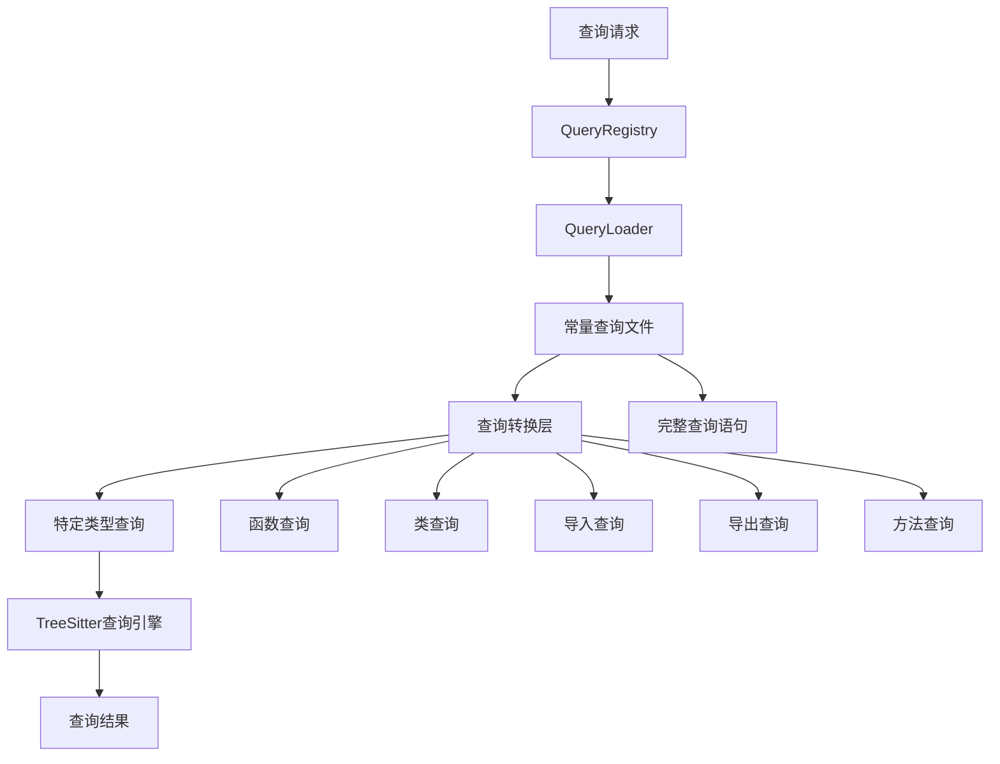

# 查询系统重构方案

## 当前架构分析

### 现有问题

1. **查询模式重复定义**：
   - [`SimpleQueryPatterns.ts`](src/service/parser/core/query/SimpleQueryPatterns.ts) 中定义了简化的查询模式
   - [`constants/queries/`](src/service/parser/constants/queries/) 目录中有完整的查询语句
   - 两套系统并行存在，维护困难

2. **查询模式不完整**：
   - 简化查询模式缺少复杂谓词和高级功能
   - 常量查询文件包含完整的查询语句但未被充分利用

3. **架构不统一**：
   - [`QueryRegistry`](src/service/parser/core/query/QueryRegistry.ts) 使用简化模式
   - [`QueryLoader`](src/service/parser/core/query/QueryLoader.ts) 可以加载常量查询但未集成
   - [`TreeSitterQueryEngine`](src/service/parser/core/query/TreeSitterQueryEngine.ts) 有独立的模式定义

4. **测试依赖简化模式**：
   - 测试文件如 [`SimpleQueryTest.test.ts`](src/service/parser/core/__tests__/query/SimpleQueryTest.test.ts) 使用简化查询
   - 未充分利用完整的查询能力

## 重构目标

1. **统一查询源**：所有查询都从 [`constants/queries/`](src/service/parser/constants/queries/) 目录加载
2. **创建转换层**：将完整查询转换为特定类型的简化查询
3. **保持向后兼容**：现有API保持不变
4. **提高查询能力**：利用完整查询语句的丰富功能

## 新架构设计



### 核心组件

1. **QueryRegistry** - 查询注册表
   - 统一查询入口
   - 管理查询缓存
   - 提供类型化查询接口

2. **QueryLoader** - 查询加载器
   - 动态加载查询文件
   - 查询语法验证
   - 查询缓存管理

3. **QueryTransformer** - 查询转换器（新增）
   - 从完整查询中提取特定类型
   - 支持模式类型映射
   - 提供查询优化

4. **TreeSitterQueryEngine** - 查询执行引擎
   - 执行查询并返回结果
   - 查询结果缓存
   - 性能监控

## 实现方案

### 1. 创建查询转换层

```typescript
// src/service/parser/core/query/QueryTransformer.ts
export class QueryTransformer {
  /**
   * 从完整查询中提取特定类型的模式
   */
  static extractPatternType(fullQuery: string, patternType: string): string {
    // 实现查询类型提取逻辑
  }

  /**
   * 获取所有支持的模式类型
   */
  static getSupportedPatternTypes(): string[] {
    return ['functions', 'classes', 'imports', 'exports', 'methods', 'interfaces', 'types'];
  }

  /**
   * 验证查询语法
   */
  static validateQuerySyntax(query: string): boolean {
    // 实现查询语法验证
  }
}
```

### 2. 重构QueryRegistry

```typescript
// 更新后的QueryRegistry
export class QueryRegistry {
  private static patterns: Map<string, Map<string, string>> = new Map();
  private static queryLoader = new QueryLoader();

  static async initialize(): Promise<void> {
    // 从常量查询文件加载，而不是SimpleQueryPatterns
    await this.loadFromConstants();
  }

  private static async loadFromConstants(): Promise<void> {
    const languages = ['javascript', 'typescript', 'python', 'java', 'go', 'rust', 'cpp', 'c', 'csharp', 'swift', 'kotlin', 'ruby', 'php', 'scala'];
    
    for (const language of languages) {
      try {
        await this.queryLoader.loadLanguageQueries(language);
        const fullQuery = this.queryLoader.getQuery(language);
        const patterns = this.extractPatternsFromFullQuery(fullQuery, language);
        this.patterns.set(language, new Map(Object.entries(patterns)));
      } catch (error) {
        console.warn(`Failed to load queries for ${language}:`, error);
      }
    }
  }
}
```

### 3. 模式类型映射

定义从完整查询到简化模式的映射关系：

| 模式类型 | 对应查询节点 | 示例语言 |
|---------|-------------|----------|
| functions | function_declaration, function_definition | JavaScript, TypeScript, Python |
| classes | class_declaration, class_definition | JavaScript, TypeScript, Python |
| imports | import_statement, import_declaration | JavaScript, TypeScript, Python |
| exports | export_statement, export_declaration | JavaScript, TypeScript |
| methods | method_definition, method_signature | JavaScript, TypeScript, Java |
| interfaces | interface_declaration | TypeScript, Java |
| types | type_alias_declaration | TypeScript |

### 4. 更新测试文件

重构测试文件以使用新的查询系统：

```typescript
// 更新 SimpleQueryTest.test.ts
test('should test JavaScript queries from constants', async () => {
  const jsCode = `...`;
  const parseResult = await treeSitterService.parseCode(jsCode, 'javascript');
  
  // 使用新的查询系统
  const functionQuery = await QueryRegistry.getPattern('javascript', 'functions');
  const classQuery = await QueryRegistry.getPattern('javascript', 'classes');
  
  // 执行查询...
});
```

## 实施步骤

### 阶段一：创建基础架构
1. 创建 [`QueryTransformer`](src/service/parser/core/query/QueryTransformer.ts)
2. 更新 [`QueryRegistry`](src/service/parser/core/query/QueryRegistry.ts) 以使用常量查询
3. 创建查询类型映射配置

### 阶段二：更新服务模块
1. 更新 [`TreeSitterQueryEngine`](src/service/parser/core/query/TreeSitterQueryEngine.ts)
2. 更新 [`QueryManager`](src/service/parser/core/query/QueryManager.ts)
3. 更新解析服务以使用新查询系统

### 阶段三：更新测试
1. 更新所有测试文件使用新查询系统
2. 添加转换层单元测试
3. 验证向后兼容性

### 阶段四：清理和优化
1. 移除 [`SimpleQueryPatterns.ts`](src/service/parser/core/query/SimpleQueryPatterns.ts)
2. 优化查询缓存策略
3. 性能测试和调优

## 预期收益

1. **维护性提升**：单一查询源，避免重复定义
2. **功能增强**：利用完整查询语句的丰富功能
3. **性能优化**：更好的查询缓存和重用
4. **扩展性**：更容易添加新的查询类型和语言支持

## 风险与缓解

1. **性能风险**：查询转换可能增加开销
   - 缓解：实现查询结果缓存
   - 缓解：预编译常用查询模式

2. **兼容性风险**：现有测试可能失败
   - 缓解：保持API向后兼容
   - 缓解：分阶段迁移测试

3. **复杂性风险**：转换逻辑可能复杂
   - 缓解：提供清晰的错误信息
   - 缓解：完善的单元测试覆盖