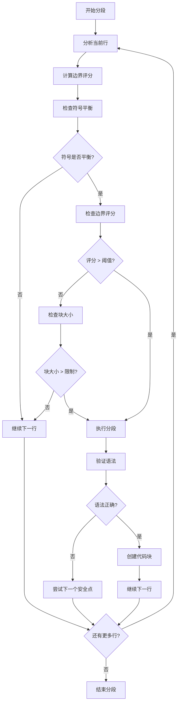
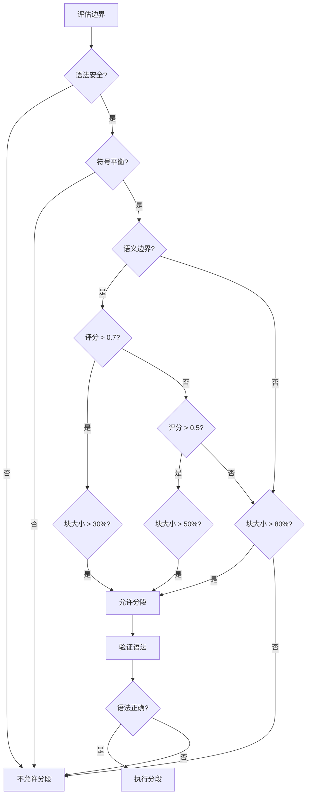

# 语义边界分析策略概述

本文档详细介绍了 `src\service\parser\` 模块中分段时寻找语义边界的所有策略及最终分段边界的确定逻辑。

## 目录

1. [语义边界分析器核心策略](#语义边界分析器核心策略)
2. [分段策略中的边界确定逻辑](#分段策略中的边界确定逻辑)
3. [权重配置系统](#权重配置系统)
4. [符号平衡检查](#符号平衡检查)
5. [语法验证](#语法验证)
6. [边界确定流程](#边界确定流程)

## 语义边界分析器核心策略

### 1. SemanticBoundaryAnalyzer 类

`SemanticBoundaryAnalyzer` 类是语义边界分析的核心，位于 `src/service/parser/splitting/utils/SemanticBoundaryAnalyzer.ts`。它通过多种策略评估代码行作为分段边界的适合度。

#### 1.1 边界评分系统

边界评分系统返回一个 `BoundaryScore` 对象，包含：

```typescript
interface BoundaryScore {
  score: number; // 0-1之间的分数，越高越适合作为边界
  components: {
    syntactic: boolean;   // 语法完整性
    semantic: boolean;    // 语义边界
    logical: boolean;     // 逻辑分组
    comment: boolean;     // 注释边界
  };
}
```

#### 1.2 边界评分计算方法

`calculateBoundaryScore` 方法综合考虑以下因素：

1. **基础语法完整性检查** (权重: 0.3)
   - 检查是否有完整的语法结构
   - 使用 `BalancedChunker` 验证符号平衡

2. **语义边界检查** (权重: 0.4)
   - 函数结束检测
   - 类结束检测
   - 方法结束检测
   - 导入结束检测

3. **逻辑分组检查** (权重: 0.5)
   - 空行检测
   - 逻辑分离检测

4. **注释边界检查** (权重: 0.1)
   - 注释块结束检测

### 2. 语义边界检测方法

#### 2.1 语法安全性检查

```typescript
private isSyntacticallySafe(line: string): boolean
```

- 检查是否有完整的语法结构
- 验证闭合的括号、花括号等
- 使用 `BalancedChunker` 进行符号平衡检查

#### 2.2 语义边界检测

- **函数结束检测**: `isFunctionEnd(line)`
- **类结束检测**: `isClassEnd(line)`
- **方法结束检测**: `isMethodEnd(line)`
- **导入结束检测**: `isImportEnd(line)`

#### 2.3 逻辑边界检测

```typescript
private hasLogicalSeparation(context: string[]): boolean
```

- 检查上下文中的逻辑分离
- 识别函数、类或语句之间的分隔
- 检测变量声明的分离

#### 2.4 注释边界检测

```typescript
private isCommentBlockEnd(line: string): boolean
```

- 识别注释块的结束
- 支持多种注释格式

## 分段策略中的边界确定逻辑

### 1. IntelligentSplitter 策略

`IntelligentSplitter` 类使用语义边界评分进行智能分段：

```typescript
private shouldSplitWithSemanticBoundary(
  line: string,
  currentChunk: string[],
  currentSize: number,
  lineSize: number,
  maxChunkSize: number,
  language: string,
  allLines: string[],
  currentIndex: number
): boolean
```

#### 1.1 分段决策逻辑

1. **大小限制检查** (优先)
   - 如果当前块大小加上新行超过最大限制，强制分段

2. **符号平衡检查**
   - 只有在符号平衡时才允许分段

3. **语义边界评分**
   - 如果边界评分 > 0.7，允许在块大小超过 30% 时分段
   - 如果边界评分 > 0.5，允许在块大小超过 50% 时分段
   - 否则，只在块大小超过 80% 时分段

### 2. SemanticSplitter 策略

`SemanticSplitter` 类使用语义分数进行分段：

```typescript
const lineScore = this.complexityCalculator.calculateSemanticScore(trimmedLine);
semanticScore += lineScore;

const shouldSplit = semanticScore > this.options.maxChunkSize * 0.8 ||
  (trimmedLine === '' && currentChunk.length > 3) ||
  i === maxLines - 1;
```

### 3. SyntaxAwareSplitter 策略

`SyntaxAwareSplitter` 类使用 AST 信息进行语法感知分段：

1. 提取函数和方法
2. 提取类和接口
3. 提取导入导出语句
4. 优化块大小

## 权重配置系统

### 1. LanguageWeights 类

`LanguageWeights` 类提供不同编程语言的权重配置：

```typescript
interface ILanguageWeights {
  syntactic: number;  // 语法权重
  function: number;   // 函数权重
  class: number;      // 类权重
  method: number;     // 方法权重
  import: number;     // 导入权重
  logical: number;    // 逻辑权重
  comment: number;    // 注释权重
}
```

### 2. 语言特定权重

系统为不同编程语言提供特定的权重配置：

- **TypeScript/JavaScript**: 语法和函数权重较高
- **Python**: 函数和类权重较高，导入权重中等
- **Java/C#**: 语法和函数权重较高，逻辑权重较低
- **Go/Rust**: 函数权重较高，类权重较低

### 3. 权重应用

权重在边界评分计算中应用：

```typescript
// 1. 基础语法完整性检查 (权重: 0.3)
if (this.isSyntacticallySafe(line)) {
  score += weights.syntactic * 0.3;
}

// 2. 语义边界检查 (权重: 0.4)
if (this.isFunctionEnd(line)) score += weights.function * 0.4;
if (this.isClassEnd(line)) score += weights.class * 0.4;
if (this.isMethodEnd(line)) score += weights.method * 0.35;
if (this.isImportEnd(line)) score += weights.import * 0.2;

// 3. 逻辑分组检查 (权重: 0.5)
if (this.isEmptyLine(line) && this.hasLogicalSeparation(context)) {
  score += weights.logical * 0.5;
}

// 4. 注释边界检查 (权重: 0.1)
if (this.isCommentBlockEnd(line)) score += weights.comment * 0.1;
```

## 符号平衡检查

### 1. BalancedChunker 类

`BalancedChunker` 类负责跟踪代码中的符号平衡状态：

```typescript
interface SymbolStack {
  brackets: number;    // 圆括号 ()
  braces: number;      // 花括号 {}
  squares: number;     // 方括号 []
  templates: number;   // 模板字符串 ``
}
```

### 2. 符号分析方法

#### 2.1 行符号分析

```typescript
analyzeLineSymbols(line: string, lineNumber?: number): void
```

- 跟括号、花括号、方括号的变化
- 处理字符串和注释内容
- 支持模板字符串中的表达式

#### 2.2 安全分段检查

```typescript
canSafelySplit(): boolean
```

- 检查所有符号是否平衡
- 确保分段不会破坏语法结构

### 3. 缓存优化

- 使用 LRU 缓存存储常见代码模式的符号变化
- 预缓存常见代码模式以提高性能

## 语法验证

### 1. SyntaxValidator 类

`SyntaxValidator` 类验证代码段的语法完整性：

```typescript
validate(content: string, language: string): boolean
```

### 2. 验证方法

#### 2.1 符号平衡验证

- 使用 `BalancedChunker` 验证符号平衡
- 对 JavaScript/TypeScript 进行额外的括号和花括号检查

#### 2.2 语言特定验证

- 针对不同编程语言提供特定的语法检查
- 确保分段后的代码片段语法正确

## 边界确定流程

### 1. 整体流程



### 2. 分段策略优先级

`ChunkingCoordinator` 类按以下优先级执行分段策略：

1. **ImportSplitter** - 处理导入语句（最高优先级）
2. **ClassSplitter** - 处理类和接口定义
3. **FunctionSplitter** - 处理函数和方法
4. **SyntaxAwareSplitter** - 语法感知分段
5. **IntelligentSplitter** - 智能分段（后备方案）
6. **SemanticSplitter** - 语义分段（最后后备）

### 3. 边界确定决策树



## 总结

语义边界分析系统通过多层次的策略和评分机制，确保代码分段在语法正确性和语义完整性方面达到最佳效果。系统结合了语法分析、符号平衡、语义边界检测和权重配置，为不同编程语言提供了灵活而精确的分段能力。