```mermaid
graph TD
    A[UnifiedGuardCoordinator] --> B[UnifiedDetectionService]
    A --> C[ProcessingStrategyFactory]
    A --> D[IntelligentFallbackEngine]
    
    B --> E[LanguageDetectionService]
    B --> F[FileFeatureDetector]
    B --> G[BackupFileProcessor]
    
    C --> H[TreeSitterService]
    C --> I[MarkdownTextStrategy]
    C --> J[XMLTextStrategy]
    
    D --> F
    
    K[UnifiedProcessingCoordinator] --> A
    K --> L[UnifiedStrategyManager]
    K --> M[UnifiedConfigManager]
    K --> N[PerformanceMonitoringCoordinator]
    K --> O[ConfigCoordinator]
    K --> P[SegmentationStrategyCoordinator]
    
    L --> Q[UnifiedStrategyFactory]
    L --> R[PriorityManager]
    L --> S[FallbackManager]
    
    Q --> H
    Q --> I
    Q --> J
    
    S --> R
    
    P --> R
    P --> T[IConfigurationManager]
    
    U[TreeSitterCoreService] --> V[DynamicParserManager]
    U --> W[TreeSitterQueryFacade]
    U --> X[LanguageDetector]
    
    V --> Y[QueryManager]
    V --> Z[QueryRegistry]
    
    W --> AA[QueryEngineFactory]
    
    X --> E
```

# Parser模块循环依赖分析与解决方案

## 📋 概述

本文档深入分析了parser模块中存在的循环依赖风险，并提出了具体的解决方案，包括移除不必要的依赖关系和重构建议。

## 🔍 循环依赖风险分析

### 1. 当前依赖关系图



### 2. 潜在循环依赖路径

#### 路径1: 保护协调器循环
```
UnifiedGuardCoordinator → UnifiedDetectionService → LanguageDetectionService
↑                                                                    ↓
UnifiedProcessingCoordinator ←───────────────────────────────────────
```

#### 路径2: 策略管理器循环
```
UnifiedStrategyManager → UnifiedStrategyFactory → TreeSitterService
↑                                                                    ↓
UnifiedProcessingCoordinator ←───────────────────────────────────────
```

#### 路径3: 查询系统循环
```
TreeSitterCoreService → DynamicParserManager → QueryManager
↑                                                                    ↓
UnifiedProcessingCoordinator ←───────────────────────────────────────
```

## 🚨 严重循环依赖问题

### 1. UnifiedGuardCoordinator 与 UnifiedProcessingCoordinator

#### 问题描述
```typescript
// UnifiedGuardCoordinator 依赖 UnifiedDetectionService
constructor(
  detectionService: UnifiedDetectionService,
  strategyFactory: ProcessingStrategyFactory,
  fallbackEngine: IntelligentFallbackEngine
)

// UnifiedProcessingCoordinator 依赖 UnifiedGuardCoordinator
constructor(
  @inject(TYPES.UnifiedGuardCoordinator) guardCoordinator: UnifiedGuardCoordinator
)

// UnifiedGuardCoordinator 在 processFileWithDetection 中被调用
async processFileWithDetection(filePath: string, content: string): Promise<ProcessingResult>
```

#### 风险评估
- **严重程度**: 高
- **影响范围**: 系统初始化和运行时稳定性
- **触发条件**: 依赖注入容器初始化时

### 2. 多个组件共享 FileFeatureDetector 单例

#### 问题描述
```typescript
// UnifiedDetectionService 中
this.fileFeatureDetector = FileFeatureDetector.getInstance(logger);

// UnifiedDetectionService 中
this.fileFeatureDetector = FileFeatureDetector.getInstance(logger);

// SegmentationStrategyCoordinator 中
this.fileFeatureDetector = FileFeatureDetector.getInstance(logger);
```

#### 风险评估
- **严重程度**: 中高
- **影响范围**: 状态污染和测试隔离
- **触发条件**: 并发访问或测试环境

## 🔧 解决方案

### 1. 重构 UnifiedGuardCoordinator 依赖关系

#### 当前问题
UnifiedGuardCoordinator 承担了过多职责，包括内存保护、错误处理和文件处理协调。

#### 解决方案A: 职责分离
```typescript
// 将 UnifiedGuardCoordinator 拆分为多个专门的协调器
interface IMemoryGuardCoordinator {
  checkMemoryUsage(): MemoryStatus;
  shouldUseFallback(): boolean;
  forceCleanup(): Promise<void>;
}

interface IErrorGuardCoordinator {
  recordError(error: Error, context?: string): void;
  shouldUseFallback(): boolean;
  getErrorThreshold(): number;
}

interface IProcessingGuardCoordinator {
  processFileWithDetection(filePath: string, content: string): Promise<ProcessingResult>;
}

// UnifiedProcessingCoordinator 只依赖需要的协调器
constructor(
  @inject(TYPES.MemoryGuardCoordinator) memoryGuard: IMemoryGuardCoordinator,
  @inject(TYPES.ErrorGuardCoordinator) errorGuard: IErrorGuardCoordinator,
  @inject(TYPES.ProcessingGuardCoordinator) processingGuard: IProcessingGuardCoordinator
)
```

#### 解决方案B: 依赖倒置
```typescript
// 定义抽象接口
interface IGuardCoordinator {
  checkSystemConstraints(): { shouldFallback: boolean; reason?: string };
  processFileWithDetection(filePath: string, content: string): Promise<ProcessingResult>;
}

// UnifiedGuardCoordinator 实现接口但不直接依赖其他服务
@injectable()
export class UnifiedGuardCoordinator implements IGuardCoordinator {
  constructor(
    @inject(TYPES.ServiceContainer) private container: IServiceContainer
  ) {}
  
  async processFileWithDetection(filePath: string, content: string): Promise<ProcessingResult> {
    // 延迟获取依赖，避免循环依赖
    const detectionService = this.container.get<UnifiedDetectionService>(TYPES.UnifiedDetectionService);
    const strategyFactory = this.container.get<ProcessingStrategyFactory>(TYPES.ProcessingStrategyFactory);
    // ... 处理逻辑
  }
}
```

### 2. 移除不必要的单例依赖

#### 当前问题
多个组件直接依赖 FileFeatureDetector 单例，造成紧耦合。

#### 解决方案: 依赖注入替代单例
```typescript
// 定义接口
interface IFileFeatureDetector {
  isCodeLanguage(language: string): boolean;
  isMarkdown(language: string): boolean;
  isXML(language: string): boolean;
  calculateComplexity(content: string): number;
}

// 移除单例模式
@injectable()
export class FileFeatureDetector implements IFileFeatureDetector {
  // 移除静态实例
  // private static instance: FileFeatureDetector;
  
  constructor(@inject(TYPES.LoggerService) logger?: LoggerService) {
    this.logger = logger;
  }
  
  // 移除 getInstance 方法
  // static getInstance(logger?: LoggerService): FileFeatureDetector {
  //   if (!FileFeatureDetector.instance) {
  //     FileFeatureDetector.instance = new FileFeatureDetector(logger);
  //   }
  //   return FileFeatureDetector.instance;
  // }
}

// 在依赖注入容器中注册
container.bind<IFileFeatureDetector>(TYPES.FileFeatureDetector).to(FileFeatureDetector).inSingletonScope();
```

### 3. 重构策略工厂依赖

#### 当前问题
ProcessingStrategyFactory 直接依赖多个策略实现，造成紧耦合。

#### 解决方案: 注册表模式
```typescript
// 定义策略注册表
interface IStrategyRegistry {
  registerStrategy(type: string, factory: () => IProcessingStrategy): void;
  createStrategy(type: string): IProcessingStrategy;
  getSupportedTypes(): string[];
}

@injectable()
export class StrategyRegistry implements IStrategyRegistry {
  private strategies = new Map<string, () => IProcessingStrategy>();
  
  registerStrategy(type: string, factory: () => IProcessingStrategy): void {
    this.strategies.set(type, factory);
  }
  
  createStrategy(type: string): IProcessingStrategy {
    const factory = this.strategies.get(type);
    if (!factory) {
      throw new Error(`Unknown strategy type: ${type}`);
    }
    return factory();
  }
}

// 重构后的 ProcessingStrategyFactory
@injectable()
export class ProcessingStrategyFactory {
  constructor(
    @inject(TYPES.StrategyRegistry) private registry: IStrategyRegistry,
    @inject(TYPES.LoggerService) logger?: LoggerService
  ) {}
  
  createStrategy(detection: DetectionResult): IProcessingStrategy {
    return this.registry.createStrategy(detection.processingStrategy);
  }
}
```

### 4. 引入事件驱动架构

#### 解决方案: 解耦组件通信
```typescript
// 定义事件接口
interface IEventBus {
  emit(event: string, data: any): void;
  on(event: string, handler: (data: any) => void): void;
  off(event: string, handler: (data: any) => void): void;
}

// 定义事件类型
enum ParserEvents {
  FILE_DETECTED = 'file:detected',
  STRATEGY_SELECTED = 'strategy:selected',
  PROCESSING_COMPLETED = 'processing:completed',
  ERROR_OCCURRED = 'error:occurred'
}

// 重构后的组件通信
@injectable()
export class UnifiedDetectionService {
  constructor(
    @inject(TYPES.EventBus) private eventBus: IEventBus,
    @inject(TYPES.LoggerService) logger?: LoggerService
  ) {}
  
  async detectFile(filePath: string, content: string): Promise<DetectionResult> {
    const result = await this.performDetection(filePath, content);
    
    // 发布事件而不是直接调用其他服务
    this.eventBus.emit(ParserEvents.FILE_DETECTED, {
      filePath,
      result
    });
    
    return result;
  }
}

@injectable()
export class UnifiedProcessingCoordinator {
  constructor(
    @inject(TYPES.EventBus) private eventBus: IEventBus
  ) {
    // 监听事件而不是直接依赖
    this.eventBus.on(ParserEvents.FILE_DETECTED, this.handleFileDetected.bind(this));
  }
  
  private handleFileDetected(data: { filePath: string; result: DetectionResult }): void {
    // 处理文件检测完成事件
  }
}
```

## 📊 依赖移除优先级

| 依赖关系 | 严重程度 | 移除难度 | 影响范围 | 优先级 |
|---------|---------|---------|---------|--------|
| UnifiedGuardCoordinator → UnifiedDetectionService | 高 | 中 | 系统稳定性 | P0 |
| FileFeatureDetector 单例依赖 | 中高 | 低 | 测试隔离 | P1 |
| ProcessingStrategyFactory → 具体策略 | 中 | 中 | 扩展性 | P1 |
| 组件间直接调用 | 中 | 高 | 可维护性 | P2 |

## 🎯 实施计划

### 阶段1: 紧急修复 (P0)
1. **重构 UnifiedGuardCoordinator**
   - 拆分为多个专门的协调器
   - 实现依赖倒置
   - 更新依赖注入配置

2. **移除 FileFeatureDetector 单例**
   - 转换为依赖注入模式
   - 更新所有依赖组件
   - 添加生命周期管理

### 阶段2: 结构优化 (P1)
1. **重构策略工厂**
   - 实现策略注册表模式
   - 移除具体策略依赖
   - 建立插件机制

2. **引入事件总线**
   - 实现轻量级事件系统
   - 重构组件间通信
   - 添加事件监控

### 阶段3: 长期优化 (P2)
1. **建立依赖图监控**
   - 实现依赖关系检测
   - 添加循环依赖警告
   - 建立依赖健康检查

2. **完善文档和测试**
   - 更新架构文档
   - 添加依赖测试
   - 建立最佳实践指南

## 🔍 依赖检查工具

### 1. 静态分析脚本
```typescript
// dependency-analyzer.ts
import * as ts from 'typescript';

interface DependencyNode {
  name: string;
  dependencies: string[];
  circular: boolean;
}

export class DependencyAnalyzer {
  analyze(filePath: string): DependencyNode[] {
    // 分析TypeScript文件的依赖关系
    // 检测循环依赖
    // 生成依赖图
  }
  
  checkCircularDependencies(nodes: DependencyNode[]): string[][] {
    // 检测循环依赖路径
    // 返回所有循环路径
  }
}
```

### 2. 运行时监控
```typescript
// dependency-monitor.ts
export class DependencyMonitor {
  private dependencyGraph = new Map<string, Set<string>>();
  
  recordDependency(from: string, to: string): void {
    if (!this.dependencyGraph.has(from)) {
      this.dependencyGraph.set(from, new Set());
    }
    this.dependencyGraph.get(from)!.add(to);
  }
  
  detectCircularDependencies(): string[][] {
    // 实时检测循环依赖
    // 提供警告和建议
  }
}
```

## 📈 预期收益

### 1. 系统稳定性提升
- 消除循环依赖导致的初始化失败
- 提高系统启动成功率
- 减少运行时错误

### 2. 可维护性改善
- 降低组件间耦合度
- 提高代码可测试性
- 简化依赖管理

### 3. 扩展性增强
- 支持插件化架构
- 便于新功能集成
- 提高系统灵活性

## 🎯 总结

循环依赖是parser模块中最严重的设计缺陷之一，需要优先解决。通过职责分离、依赖倒置、移除单例模式和引入事件驱动架构，可以有效消除循环依赖风险，提升系统的稳定性和可维护性。

建议按照实施计划逐步推进，优先解决P0级别的严重问题，确保系统在重构过程中保持稳定运行。同时，建立依赖检查和监控机制，防止引入新的循环依赖问题。