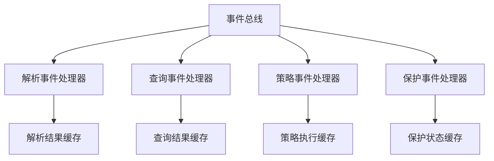
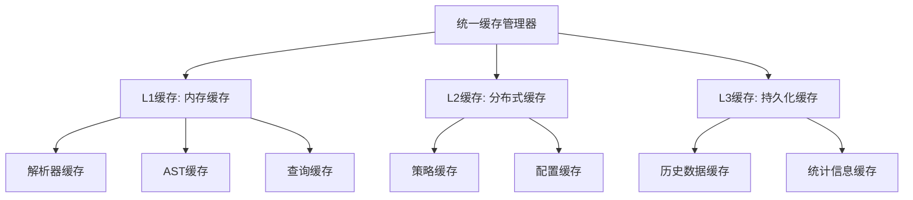

# Parser模块设计缺陷分析

## 📋 概述

本文档深入分析了当前parser模块工作流中存在的设计缺陷，这些问题可能影响系统的稳定性、性能和可维护性。

## 🚨 严重设计缺陷

### 1. 循环依赖风险

#### 问题描述
多个核心组件之间存在潜在的循环依赖关系，可能导致系统初始化失败或运行时错误。

#### 具体表现
```typescript
// UnifiedGuardCoordinator 依赖
- UnifiedDetectionService
- ProcessingStrategyFactory
- IntelligentFallbackEngine

// UnifiedDetectionService 依赖
- TreeSitterService (可能依赖 UnifiedGuardCoordinator)

// UnifiedStrategyManager 依赖
- UnifiedStrategyFactory
- PriorityManager
- FallbackManager

// FallbackManager 依赖
- PriorityManager
```

#### 风险评估
- **严重程度**: 高
- **影响范围**: 系统初始化和运行时稳定性
- **触发条件**: 组件初始化顺序不当或依赖注入配置错误

#### 建议解决方案
1. 引入依赖注入容器的延迟初始化机制
2. 重新设计组件依赖关系，减少耦合
3. 使用事件驱动架构替代直接依赖

### 2. 单例模式滥用

#### 问题描述
多个关键组件使用单例模式，但缺乏适当的生命周期管理，可能导致内存泄漏和状态污染。

#### 具体表现
```typescript
// UnifiedGuardCoordinator 中的单例实现
private static instance: UnifiedGuardCoordinator;

// QueryEngineFactory 中的单例实现
private static instance: TreeSitterQueryEngine;

// FileFeatureDetector 中的单例实现
private static instance: FileFeatureDetector;
```

#### 风险评估
- **严重程度**: 中高
- **影响范围**: 内存管理和测试隔离
- **触发条件**: 长时间运行或频繁测试

#### 建议解决方案
1. 实现适当的生命周期管理
2. 使用依赖注入容器管理单例生命周期
3. 为测试环境提供实例重置机制

### 3. 错误处理不一致

#### 问题描述
不同组件的错误处理策略不统一，可能导致错误信息丢失或处理不当。

#### 具体表现
```typescript
// UnifiedGuardCoordinator 中的错误处理
catch (error) {
  this.logger?.error(`Error in unified file processing: ${error}`);
  this.errorThresholdManager.recordError(error as Error, `processFile: ${filePath}`);
  // 继续处理，可能掩盖原始错误
}

// FallbackManager 中的错误处理
catch (error) {
  lastError = error instanceof Error ? error : new Error(String(error));
  this.logger?.error(`Strategy ${strategy.getName()} failed:`, lastError.message);
  // 记录错误但继续尝试其他策略
}
```

#### 风险评估
- **严重程度**: 中
- **影响范围**: 错误诊断和系统调试
- **触发条件**: 复杂错误场景

#### 建议解决方案
1. 建立统一的错误处理策略
2. 实现错误分类和标准化处理流程
3. 增强错误上下文信息收集

## ⚠️ 中等设计缺陷

### 4. 缓存策略不协调

#### 问题描述
多个组件实现独立的缓存机制，缺乏统一的缓存策略和协调机制。

#### 具体表现
```typescript
// DynamicParserManager 中的缓存
private parserCache: LRUCache<string, Parser> = new LRUCache(50);
private astCache: LRUCache<string, Parser.Tree> = new LRUCache(500);
private nodeCache: LRUCache<string, Parser.SyntaxNode[]> = new LRUCache(1000);

// QueryManager 中的缓存
private static queryCache = new LRUCache<string, Parser.Query>(100);
private static patternCache = new LRUCache<string, string>(50);

// SegmentationStrategyCoordinator 中的缓存
private strategyCache: Map<string, ISegmentationStrategy> = new Map();
```

#### 风险评估
- **严重程度**: 中
- **影响范围**: 内存使用效率和缓存一致性
- **触发条件**: 高并发或大量数据处理

#### 建议解决方案
1. 实现统一的缓存管理器
2. 建立缓存优先级和淘汰策略
3. 提供缓存统计和监控功能

### 5. 配置管理分散

#### 问题描述
配置信息分散在多个组件中，缺乏统一的配置管理和验证机制。

#### 具体表现
```typescript
// UnifiedGuardCoordinator 中的配置
private memoryLimitMB: number;
private memoryCheckIntervalMs: number;

// UnifiedStrategyManager 中的配置
private config: {
  enablePerformanceMonitoring: boolean;
  enableCaching: boolean;
  cacheSize: number;
  maxExecutionTime: number;
  enableParallel: boolean;
};

// SegmentationStrategyCoordinator 中的默认配置
private createDefaultConfigManager(): IConfigurationManager {
  return {
    getDefaultOptions: () => ({
      maxChunkSize: 2000,
      overlapSize: 200,
      // ... 硬编码配置
    })
  };
}
```

#### 风险评估
- **严重程度**: 中
- **影响范围**: 系统配置一致性和可维护性
- **触发条件**: 配置变更或环境切换

#### 建议解决方案
1. 实现统一的配置管理中心
2. 建立配置验证和类型检查机制
3. 提供配置热更新功能

### 6. 性能监控重复

#### 问题描述
多个组件实现独立的性能监控，缺乏统一的性能指标收集和分析。

#### 具体表现
```typescript
// UnifiedStrategyManager 中的性能统计
private performanceStats: Map<string, { count: number; totalTime: number; errors: number }> = new Map();

// SegmentationStrategyCoordinator 中的性能统计
getPerformanceStats(): Map<string, any> {
  return this.priorityManager.getPerformanceStats();
}

// UnifiedProcessingCoordinator 中的性能监控
private performanceMonitor: PerformanceMonitoringCoordinator;
```

#### 风险评估
- **严重程度**: 中低
- **影响范围**: 性能分析和系统优化
- **触发条件**: 性能问题诊断

#### 建议解决方案
1. 实现统一的性能监控服务
2. 建立标准化的性能指标定义
3. 提供性能报告和分析功能

## 💡 轻微设计缺陷

### 7. 接口设计不一致

#### 问题描述
相似功能的接口设计不一致，增加了学习和使用成本。

#### 具体表现
```typescript
// 不同的策略创建接口
createStrategyFromType(strategyType: string, options?: ChunkingOptions): ISplitStrategy
createStrategyFromDetection(detection: any): ISplitStrategy
createStrategyFromLanguage(language: string, options?: ChunkingOptions): ISplitStrategy

// 不同的错误处理接口
recordError(error: Error, context?: string): void
recordErrorPattern(filePath: string, error: Error): void
```

#### 建议解决方案
1. 统一接口设计规范
2. 提供接口适配器
3. 建立接口版本管理机制

### 8. 日志记录不统一

#### 问题描述
不同组件使用不同的日志记录方式和格式，影响日志分析和问题诊断。

#### 具体表现
```typescript
// 不同的日志级别和格式
this.logger?.info(`File processed successfully: ${filePath} (${result.chunks.length} chunks, ${duration}ms)`);
this.logger?.debug(`Using cached strategy: ${cachedStrategy.getName()}`);
this.logger?.warn('Memory limit exceeded, using fallback');
```

#### 建议解决方案
1. 建立统一的日志记录规范
2. 实现结构化日志格式
3. 提供日志聚合和分析工具

## 🔧 架构改进建议

### 1. 引入事件驱动架构



### 2. 实现分层缓存架构



### 3. 建立统一配置中心

```typescript
interface UnifiedConfig {
  // 缓存配置
  cache: {
    parserCacheSize: number;
    astCacheSize: number;
    queryCacheSize: number;
    strategyCacheSize: number;
  };
  
  // 性能配置
  performance: {
    maxExecutionTime: number;
    enableParallel: boolean;
    maxConcurrency: number;
  };
  
  // 保护配置
  protection: {
    memoryLimitMB: number;
    errorThreshold: number;
    checkIntervalMs: number;
  };
  
  // 策略配置
  strategy: {
    defaultStrategy: string;
    fallbackPath: string[];
    priorityConfig: Record<string, number>;
  };
}
```

### 4. 实现统一监控体系

```typescript
interface UnifiedMonitoring {
  // 性能监控
  performance: {
    executionTime: (operation: string, duration: number) => void;
    memoryUsage: (component: string, usage: number) => void;
    cacheHitRate: (cache: string, hitRate: number) => void;
  };
  
  // 错误监控
  errors: {
    recordError: (error: Error, context: any) => void;
    errorRate: (component: string, rate: number) => void;
    fallbackUsage: (strategy: string, reason: string) => void;
  };
  
  // 业务监控
  business: {
    fileProcessed: (language: string, chunks: number) => void;
    strategyUsed: (strategy: string, success: boolean) => void;
    languageDetected: (language: string, confidence: number) => void;
  };
}
```

## 📊 缺陷优先级评估

| 缺陷类型 | 严重程度 | 影响范围 | 修复难度 | 优先级 |
|---------|---------|---------|---------|--------|
| 循环依赖风险 | 高 | 系统稳定性 | 高 | P0 |
| 单例模式滥用 | 中高 | 内存管理 | 中 | P1 |
| 错误处理不一致 | 中 | 错误诊断 | 中 | P1 |
| 缓存策略不协调 | 中 | 性能效率 | 中 | P2 |
| 配置管理分散 | 中 | 维护性 | 中 | P2 |
| 性能监控重复 | 中低 | 性能分析 | 低 | P3 |
| 接口设计不一致 | 低 | 开发体验 | 低 | P3 |
| 日志记录不统一 | 低 | 运维调试 | 低 | P3 |

## 🎯 总结

当前parser模块虽然功能完整，但存在一些明显的设计缺陷，主要集中在：

1. **架构层面**: 循环依赖和单例模式滥用
2. **资源管理**: 缓存策略不协调和配置管理分散
3. **运维支持**: 错误处理不一致和监控重复

建议按照优先级逐步解决这些缺陷，优先处理P0和P1级别的严重问题，以提升系统的稳定性和可维护性。同时，在后续开发中应建立更严格的架构设计和代码审查流程，避免引入新的设计缺陷。