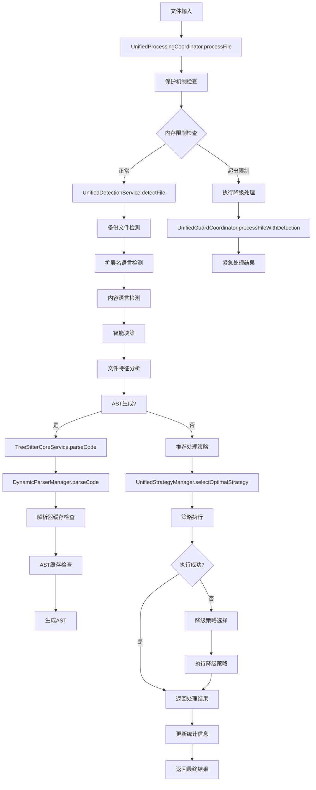
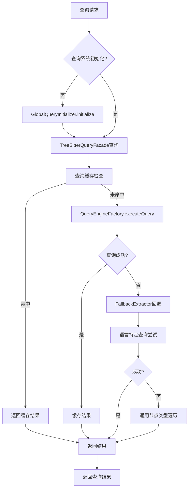

# Parser模块更新工作流分析

## 📋 概述

本文档梳理了src\service\parser目录中parser模块的整体工作流，更新了过时的分析内容，特别是简化后的回退机制处理。

## 🏗️ 核心组件架构

### 1. 核心解析层 (Core Parsing Layer)

#### TreeSitterCoreService
- **职责**: 统一入口，协调解析和查询功能
- **关键方法**:
  - `parseCode()`: 解析代码并返回AST
  - `parseFile()`: 解析文件并自动检测语言
  - `findNodeByType()`: 同步节点查找（使用FallbackExtractor）
  - `findNodeByTypeAsync()`: 异步节点查找（优先使用TreeSitterQueryFacade）

#### DynamicParserManager
- **职责**: 动态解析器管理，按需加载语言解析器
- **关键特性**:
  - 多级缓存：解析器缓存(LRU-50)、AST缓存(LRU-500)、节点缓存(LRU-1000)
  - 动态语言加载器机制
  - 性能统计和监控

### 2. 查询系统层 (Query System Layer)

#### TreeSitterQueryFacade
- **职责**: 简化查询引擎，提供易用的查询接口
- **关键方法**:
  - `findFunctions()`, `findClasses()`, `findImports()`, `findExports()`
  - `findMultiple()`: 批量查询优化
  - `findAllMainStructures()`: 查找所有主要结构

#### QueryManager & QueryRegistry
- **职责**: 查询模式管理和执行
- **关键特性**:
  - 查询缓存(LRU-100)和模式缓存(LRU-50)
  - 支持多种查询类型
  - 全局初始化管理

#### GlobalQueryInitializer
- **职责**: 确保查询系统只初始化一次
- **关键特性**:
  - 避免重复加载
  - 状态管理和同步

### 3. 回退机制层 (Fallback Layer)

#### FallbackExtractor
- **职责**: 智能回退提取器，当查询失败时提供回退机制
- **关键特性**:
  - 优先使用现有查询系统
  - 语言感知的节点提取
  - 特殊语言处理（跳过不支持的提取类型）

### 4. 处理协调层 (Processing Coordination Layer)

#### UnifiedProcessingCoordinator
- **职责**: 统一处理协调器，整合文件处理流程
- **关键特性**:
  - 保护机制检查（内存限制、错误阈值）
  - 策略选择和执行
  - 性能监控和统计

#### UnifiedDetectionService
- **职责**: 统一检测服务，智能文件检测和语言识别
- **关键特性**:
  - 多种检测方法：扩展名、内容、备份文件
  - 文件特征分析
  - 处理策略推荐

#### UnifiedStrategyManager
- **职责**: 统一策略管理器，管理各种分段策略
- **关键特性**:
  - 智能策略选择
  - 降级路径管理
  - 性能统计和缓存

## 🔄 整体工作流程

### 主要处理流程



### 查询执行流程



## 🛡️ 简化的回退机制

### 回退层次结构

1. **查询系统回退**
   - TreeSitterQueryFacade → FallbackExtractor
   - 优先使用语言特定查询
   - 失败时使用通用节点遍历

2. **策略执行回退**
   - 高级策略 → 中级策略 → 基础策略 → 紧急策略
   - 智能降级路径选择
   - 最大重试次数限制

3. **系统保护回退**
   - 内存限制检查
   - 错误阈值监控
   - 紧急单块处理

### 回退策略映射

| 当前策略 | 降级路径 |
|---------|---------|
| treesitter_ast | universal_semantic → universal_semantic_fine → universal_bracket → universal_line |
| universal_semantic | universal_semantic_fine → universal_bracket → universal_line |
| universal_semantic_fine | universal_bracket → universal_line |
| universal_bracket | universal_line |
| universal_line | minimal_fallback |

## 📊 关键变化和改进点

### 1. 架构简化
- **移除复杂的回退逻辑**: 简化了TreeSitterUtils的职责，专注于基础工具方法
- **统一回退处理**: FallbackExtractor作为统一的回退入口
- **减少重复代码**: 通过TreeSitterQueryFacade的通用查询方法减少重复

### 2. 性能优化
- **多级缓存系统**: 解析器、AST、节点、查询四级缓存
- **并行处理支持**: 批量查询和文件处理的并行执行
- **智能缓存策略**: 基于使用频率和内存限制的缓存管理

### 3. 错误处理增强
- **分层错误处理**: 从查询级到系统级的完整错误处理链
- **智能降级**: 基于错误类型和系统状态的智能降级选择
- **保护机制**: 内存限制和错误阈值保护

### 4. 扩展性改进
- **插件化策略**: 可插拔的分段策略实现
- **动态语言加载**: 按需加载语言解析器
- **配置驱动**: 统一配置管理系统

## 🔧 配置和调优

### 关键配置参数

```typescript
// 缓存配置
parserCacheSize: 50-100        // 解析器缓存大小
astCacheSize: 500-1000         // AST缓存大小  
queryCacheSize: 100-200        // 查询缓存大小
nodeCacheSize: 1000            // 节点缓存大小

// 性能配置
maxWaitTime: 10000             // 最大等待时间(ms)
maxRetries: 3                  // 最大重试次数
memoryLimitMB: 1024            // 内存限制(MB)
enableParallel: true           // 启用并行处理

// 分段配置
maxChunkSize: 2000             // 最大块大小(字符)
overlapSize: 200               // 重叠大小(字符)
maxLinesPerChunk: 100          // 每块最大行数
```

### 性能监控指标

- **缓存命中率**: 各级缓存的命中率统计
- **解析性能**: 平均解析时间和成功率
- **查询性能**: 查询执行时间和成功率
- **内存使用**: 实时内存使用监控
- **错误统计**: 错误类型和频率统计

## 📈 使用示例

### 基本解析流程

```typescript
// 1. 创建核心服务
const coreService = new TreeSitterCoreService();

// 2. 解析文件
const result = await coreService.parseFile(filePath, content);

// 3. 提取结构
const functions = await coreService.findNodeByTypeAsync(result.ast, 'function_declaration');
const classes = await coreService.findNodeByTypeAsync(result.ast, 'class_declaration');
```

### 批量查询优化

```typescript
// 使用TreeSitterQueryFacade进行批量查询
const structures = await TreeSitterQueryFacade.findAllMainStructures(ast, language);

// 或使用自定义批量查询
const customResults = await TreeSitterQueryFacade.findMultiple(
  ast, 
  language, 
  ['functions', 'classes', 'imports', 'exports', 'interfaces']
);
```

### 处理协调流程

```typescript
// 使用统一处理协调器
const coordinator = new UnifiedProcessingCoordinator(
  strategyManager,
  detectionService,
  configManager,
  guardCoordinator,
  performanceMonitor,
  configCoordinator,
  segmentationCoordinator
);

const result = await coordinator.processFile({
  filePath: 'example.ts',
  content: fileContent,
  options: {
    basic: {
      maxChunkSize: 2000,
      overlapSize: 200,
      maxLines: 100
    }
  }
});
```

## 🎯 总结

Parser模块经过重构后，形成了清晰的分层架构和简化的回退机制。主要改进包括：

1. **架构清晰化**: 明确的职责分离和模块化设计
2. **回退简化**: 统一的回退入口和智能降级策略
3. **性能优化**: 多级缓存和并行处理支持
4. **错误处理**: 完整的错误处理链和保护机制
5. **扩展性**: 插件化策略和动态语言支持

这些改进使得parser模块更加稳定、高效和易于维护，为代码库索引和检索提供了坚实的基础。